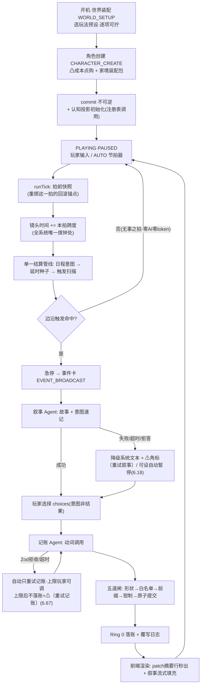

# 「AI 文游人生模拟器」V4.1 全架构蓝图：顶层设计 · 分模块详解 · 沙盒推演范例

<aside>
🧭

**本页性质**：V4.1 重构后的**全架构静态蓝图**（截至最新转正 6.74（增媒介渲染 6.70 / 迁移升版 6.71 / 酒馆角色卡迁移 6.72 / 宿主边界 6.73 / mod 防盗签名 6.74） · 含 P0 中途十八批补漏＋纪元·离场演化双构架裁定：机制九项 / 系统操作九缺口 / 元指令与作弊七缺口 / 周目体系四缺口 / mod 包生态七缺口 / 多人接口面七缺口 / 多域时钟七缺口 / 知情过滤七缺口 / 状态机并发七缺口 / 数值边界七缺口 / 动词表六缺口 / 开放串治理六缺口 / 受众选择器六缺口 / 级联触发六缺口 / 纪元更迭构架 / Resolver 签名前向兼容 / 切片预算六缺口 / 规模长跑六缺口 / 离场演化纠缠闭包 / 重试主权 / 记账语义保真 / 酒馆宿主借力 / 媒介渲染与多源消息流 / 迁移升版×快照树×指纹重放 / 酒馆角色卡迁移 / 宿主边界），逐条参照 `schema_new.js`（V3.1 实装）、[「AI 文游人生模拟器」V4重构整合清单：组织实体 / 地图 / 战斗与战争 / 秘密](https://app.notion.com/p/AI-V4-ce1c4870165e482790c29ca25c19b017?pvs=21)、[「AI 文游人生模拟器」V4.1 修订决议](https://app.notion.com/p/AI-V4-1-a9d51518f9f747a29d9880bcf1d902df?pvs=21) 与 [旧变量系统全量细查报告（V4.1 对照）](https://app.notion.com/p/V4-1-0870136aadec4002bb6d0d8509babb03?pvs=21) 综合而成。

**结构**：第一部分 = 顶层架构与全局数据流；第二部分 = 17 个模块逐一详解（框架 → 机制 → 变量 → 范例 → 联动）；第三部分 = 最通用的完整游玩沙盒推演范例；第四部分 = 重构后**全量变量结构总表**（V3.1 → V4.1 逐键对照·含简要提示）。

每个复杂概念都附「通俗解释」。后续转正轮次若修改决议，本页需同步更新。

</aside>

# 第一部分 · 顶层架构

## 1.0 一句话总纲

> **一个确定性数值引擎驱动的人生/世界沙盒：引擎管账，LLM 讲故事，玩法预设定题材。**
> 

通俗解释：把它想成「P 社游戏的数值底盘 + AI 小说家的嘴」。底盘（时间、经济、战争、关系、秘密）全部由不调用 AI 的纯代码推演，保证数值永远自洽、永远不卡死；AI 只负责把底盘算出来的事实讲成好看的故事。题材（古代宫斗 / 现代都市 / 修真 / 科幻）不靠改代码，靠换一套「世界玩法预设」参数。

## 1.1 设计第一性原理（为什么永远跑得通）

1. **单写者铁律**：全游戏只有引擎（Ring 0）一支笔能改存档。AI、前端、玩家的一切操作都只是「提案」，最终由引擎校验后落账。通俗：公司里只有财务部能动账本，其他人只能提交报销单。
2. **LLM 非阻塞**：任何 AI 调用失败/超时/拒答，最多让画面少一段文字，绝不让流程卡住——因为推进时间和改状态的权力根本不在 AI 手里。极端测试：让所有 AI 调用全部失败，游戏仍能从出生玩到死亡。
3. **能派生的不存储**：年龄、季节、家境等级、关系图、势力值……凡是能从别的变量算出来的，一律现算不存。通俗：不在两个本子上抄同一笔账——抄两遍迟早对不上（双写漂移）。
4. **能开放串的不枚举**：技能类别、资产类别、部队姿态、约定形式等用自由字符串，不用写死的选项列表——修真功法、星际公约这类新题材才装得进来。
5. **真相与认知分层**：引擎里存「真实世界」，玩家和 NPC 各自只看到「自己以为的世界」（认知档案 + 秘密知情过滤）。误判、中计、被蒙在鼓里由此涌现。
6. **接口冻结、字段演化**：P0 冻结的是接口契约（时间整型、单写者、动词表形状、前缀权限、状态机拓扑），不是字段全集；字段靠 `migration_version` + 派生化随时演化。

## 1.2 三环模型（谁干什么）

| 环 | 职责 | 调 LLM？ | 改状态？ | 通俗比喻 |
| --- | --- | --- | --- | --- |
| **Ring 0 引擎** | 时间泵 `tick()`、结算管线、触发扫描、检定、Patch 落账 | 否 | **是（唯一写者）** | 财务部 + 裁判 |
| **Ring 1 交互状态机** | 玩家面对的模态：事件卡、日程、RP、战斗、设置 | 否（只发起调用） | 否 | 前台接待 |
| **Ring 2 LLM 服务** | 叙事 Agent、记账 Agent、注册表专项调用，全部无状态 | 是 | 否（产出提案交 Ring 0） | 外包文案与速记员 |

## 1.3 数据分层（变量住在哪）

| 层 | 谁可见 / 谁可写 | 住什么 | 通俗比喻 |
| --- | --- | --- | --- |
| 无前缀层 | AI 可见；经五道闸可提案写 | 世界、角色、NPC、组织、地图、账户……一切「桌面上的事实」 | 明牌 |
| `_` 层 | AI 只读；引擎/前端/玩家可写 | `_tick`、`_本拍跨度`、`_粒度模板`、`_叙事设置{人称, 叙事偏好}`、`_触发扫描器` | 桌面上的规则牌 |
| `$` 层 | AI 永不可见；引擎专用 | `$运气`、`$谜底`、忠诚`$真实值`、`$隐藏记忆库`、`$战斗暂存`、`$流速`、`$玩家偏好`、`$预算控制台` | 扣着的底牌 |
| `$meta` 层 | 跨周目存档层 | 周目谱系（存档树）、峰值记录、继承包 | 赌场会员档案 |
| 世界玩法预设 | 配置层，不进存档 | 历法、种族模板、粒度、难度系数组、母题配额、战术包、制式库…… | 不同赌场的桌规 |
| 前端缓存 | 纯渲染，不进 stat_data | `$pos` 坐标、地形栅格、贴图、LOD | 桌子的装修 |

## 1.4 一拍的生命周期（核心数据流）



**先说清楚什么是「一拍」**：拍（tick）是世界推进的最小步子——即时档一拍 = 一回合，日常档 = 一天，发展档 = 一月，世代档 = 一年。**每一拍的作用 = 让世界整体「老」一格**：所有挂在时间上的量（利息、发育、情绪消退、秘密暴露度、NPC 幕后进度、伏笔倒计时、各类衰减）在这一格里各自按「速率 × 本拍跨度」结一次账。通俗：拍是世界这台钟的「咔哒」声——咔哒一响，所有账本同时翻一页；没有咔哒，世界纹丝不动。

**循环之前的开机段（S0→S2，整局只走一次）**：世界装配（选玩法预设，逐项可拧）→ 角色创建（凸成本点购 + 家境装配包）→ commit（不可逆）→ 引擎自动跑「认知投影初始化」生成「你以为的自己」面板 → 落入 PLAYING 的 PAUSED 子态，等第一声咔哒。这两个开机态在 PLAYING 枢纽之外，此时无游戏时间、无拍；commit 后一次性进入，永不返回。此后整局都在下面的循环里转，直到清栈终态（继承换代 / 人生总结）。

逐步通俗解说（对应上图每个框）：

1. **谁来踩油门（A）**：暂停时世界完全静止。玩家点「下一拍」、或开 AUTO 自动连拍（×1/×2/×3 只是现实里播放快慢，纯前端流速，不改任何数值），引擎才收到一声「咔哒」指令。
2. **拍前快照（B）**：动手前先给整个存档拍一张字节级备份。作用：这一拍内发生的一切都能整拍回滚（「重掷这一拍」就是回到这里重跑）。注意这是技术快照，玩家看的「人生快照」是另一回事（模块 16）。
3. **拨钟（C）**：镜头时间 += 本拍跨度。这是全系统唯一动时间的一行代码——AI、前端、玩家都没有拨钟的权力（墙钟三铁律）。
4. **结三类账，固定顺序（D）**：
    1. **玩家排的日程意图**：刷题/打工/拜访逐条过检定，结算收益与消耗；
    2. **到期种子**：三个月前埋的「开业口碑」「扩张收益」今天成熟，开箱结算；
    3. **触发扫描**：所有阈值穿线（民心跌破了吗）、绝对日期到期、概率掷骰（按跨度折算，防快进狂掉）、离散状态翻转，机械扫一遍。
    
    为什么固定顺序 + 串行：后一项读得到前一项的结果，杜绝「反水和战果同拍互踩」的竞态。
    
5. **岔路口（E）**：这一拍什么都没命中 → 直接回到第 1 步继续咔哒。**这就是快进便宜的原因：无事之拍 = 纯数学，零 AI 调用、零等待、零 token。**
6. **有事才叫 AI（F→G）**：命中触发 → 急停、弹事件卡 → 叙事 Agent 把引擎给的「事实包」写成故事和选项。AI 失败/超时/拒答？事件卡降级成系统文本照样弹出，数值结算一分不少（LLM 非阻塞）。
7. **玩家表态（H）**：选项是「意图」不是「结果」——选「贿赂考官」只代表想贿赂，成不成要过检定。
8. **翻译与落账（I→J→K）**：记账 Agent 把这段剧情翻译成结构化动词（修改/创建/追加/埋种子）→ 五道闸逐条验（形状 → 白名单 → 前缀 → 钳制 → 原子）→ 引擎落账并写覆写日志。被拒的只丢那一条，绝不污染存档。
9. **画面（L）**：前端先秒出记账摘要行（「账户 −2000 · 埋种子 ×1」），叙事文字再异步流式补上——体感零等待。然后回到第 1 步，等下一声咔哒。

**重 roll 两档挂在图上哪里**：「换个讲法」挂 G/G2 之后——数值已落账，只重调叙事，免费、不回滚、游戏时间零移动；「重掷这一拍」回滚到 B 的拍前快照重跑整拍——拍计数不前进，种子成熟日锚游戏绝对时间，所以预期召回时间不变；天命种子锚定拍号（重掷换叙事不换命运，命运重掷走限量券）。

**LLM 失败的前端兑现（6.18）**：任何 AI 失败/超时/拒答 → 事件卡照常弹出（系统文本兑底，数值一分不少），带 ⚠ 角标 + 〔重试叙事〕按钮；AUTO 快进可勾「失败卡自动暂停」（`$流速.自动暂停触发[]` 枚举项·停机类 = 最近内部拍边界生效·裁决六）。**🟡6.67 重试主权补全**：记账失败 ⚠ 未落账条目带〔重试记账〕按钮（同段叙事＋意图速记原样重喂、不换骰不混盐；跨拍补落账 = 当前拍补偿性新账、幂等防双落账）；自动重试上限/超时秒数/失败后行为（降级继续｜自动暂停弹重试面板）= 玩家旋钮——**自动重试有界、手动重试无界**；`自动暂停触发[]` 加「记账失败自动暂停」枚举项。

## 1.5 模块总表

| # | 模块 | 一句话职责 | 核心真相源变量 |
| --- | --- | --- | --- |
| 1 | 时间系统 | 唯一整型时间轴 + 粒度变焦 + 双时钟 + 历法皮肤 | `世界.纪元分钟`、`_本拍跨度`、粒度栈 |
| 2 | 状态机与运行管线 | Hub-and-Spoke 交互拓扑 + 触发扫描器 + 单一结算管线 | 状态机对象、模态栈、`_触发扫描器` |
| 3 | Agent 拓扑 | 叙事/记账双常驻 + 调用注册表 + 三层动词表 + 五道闸 | 动词表、调用类型注册表、`全局.覆写日志` |
| 4 | 焦点角色与角色组件 | 主角 = 组件齐全的 NPC 特例 + 镜头焦点指针 | `镜头焦点角色`、属性、性格五轴、特质、情绪栈 |
| 5 | NPC 与 LOD | 三档细节分级 + 作息纯函数 + 幕后演化 | `NPC{}`、作息模板、履历、登场契约 |
| 6 | 认知档案 | 「你以为的世界」：迷雾、误差、自我认知、谄媚度 | `认知档案[观察者][目标]` |
| 7 | 秘密与忠诚 | 顶层秘密池 + 暴露引擎 + 谜底隔离 + 忠诚双层 | `全局.秘密库`、`$谜底`、忠诚`$真实值` |
| 8 | 组织实体 | 万物皆组织：公司/政权/宗门同一套壳，可递归嵌套 | `组织实体{}`、派系登记、进展树、`全局.约定库` |
| 9 | 地图与空间 | 语义节点树归 AI、坐标归前端、渲染三镜头 | `地图.地点{}`（节点树）、空间ID、seed |
| 10 | 战斗与战争 | 三尺度五档抽象结算 + 可替换战斗接口 + 战线压力榜 | `战争状态{}`、压力榜、`$战斗暂存`、部队姿态 |
| 11 | 经济金融 | 单一账户 + 开放资产对象 + 市场派生定价 | `货币系统.账户`、资产[]、市场状态 |
| 12 | 记忆系统 | 工作记忆 / 长期蒸馏 / 隐藏伏笔种子 / 触景生情 | 工作记忆、长期归档、`$隐藏记忆库` |
| 13 | 事件系统 | choices 契约 + 事件包 + 母题配额 + 来源权重 | 事件包 manifest、`系统.事件来源权重`、母题滚动窗口 |
| 14 | 继承·死亡·周目 | 复活闸 → 任意 NPC 接管 → 周目谱系树 | 继承候选、继承包、`$meta.周目谱系` |
| 15 | 世界玩法预设与 mod | 题材 = 参数组合；mod = 数据不是代码 | 玩法预设容器、mod manifest |
| 16 | 玩家辅助与元层 | 内心层调用族、人生快照、作弊三档、覆写通道、预算控制台 | META_OVERLAY、`全局.作弊标记`、`$预算控制台` |
| 17 | 前端渲染层 | 单一游戏界面 + 延迟掩盖 + 地图三镜头 | `$pos`、时间线、渲染器注册表 |

## 1.6 模块间相互作用（大图）

- **时间 → 一切**：所有衰减、到期、利息、发育、暴露度增长都乘 `_本拍跨度`。时间是全系统的公共分母。
- **事件 ↔ 记忆**：事件结算的延时后果以「种子」存进隐藏记忆库；种子到期又变回事件。这是「伏笔 → 回收」的闭环。
- **秘密 ↔ 认知**：秘密库管「事件型隐瞒」的生命周期，认知档案管「状态型误解」；统一读取接口 `知道吗(观察者, 信息)` 内部分发两库；declassify（揭穿）时秘密回写认知。
- **性格 → 认知/谄媚/演化**（6.16）：五轴数值喂三个公式——人生事件改性格、观察者投影带偏差、NPC 顶嘴还是奉承由公式决定。
- **组织 ↔ 经济 ↔ 地图**：组织的网点开在地图节点上，营收按区域物价结算回账户；战争翻转地图控制方又改组织控制区。
- **战争 ↔ 组织 ↔ 秘密**：armyPower 由组织军事字段算出；政变阴谋（秘密）declassify 后直接砸组织治理数值，可能点燃战争状态。
- **玩法预设 → 各模块参数**：历法喂时间、种族模板喂寿命发育、难度系数喂检定、母题配额喂事件、战术包喂战斗、制式库喂学业职业。
- **NPC LOD ↔ 预算**：不在场 = 零 token；离场只跑统计学演化；这是 token 成本可控的根基。

## 1.7 主要能实现的游戏 / 推演功能

- **人生模拟**：出生 → 学业 → 职业 → 婚恋 → 子嗣 → 衰老 → 死亡 → 继承换代，全程数值自洽。
- **经营推演**：开店/办厂/集团化（组织嵌套），营收 = f(规模, 区域物价, 行业景气)，市场风波、泡沫、破产链。
- **政治权谋**：派系、政变（秘密 + 进展树）、政体和平演变 / 暴力变更、权力递归（庙小神大）。
- **战争推演**：多方混战、移动战线（压力榜）、反水跳反、部队姿态与战术 mod、补给与士气。
- **谍战 / 宫斗**：双向秘密牵制（恐怖平衡）、内鬼伪装、线索收敛、知情圈分层、猜忌阻尼。
- **情感叙事**：关系边、情绪栈、触景生情闪回、彩蛋记忆浮现、认知误差带来的误会戏。
- **跨题材**：同一引擎跑现代 / 古代 / 修真 / 科幻 / 末世，靠玩法预设不靠改代码。
- **多周目**：存档树 fork、带记忆回溯、穿越进 NPC（继承皮肤）。
- **多人与 AI 同席（6.11/6.22，P2+）**：异步回合制——服务器端引擎单写者，全员（人类或 AI 席位）提交意图后统一结算一拍；AI 同席 = 给席位绑「NPC 扮演调用」，喂其认知投影与目标，产出意图照常过检定五道闸，与人类玩家权力完全对等。**多人接口面对撞收口（6.53）**：一拍 = 全席位意图屏障 + 统一结算，席位间冲突走确定性随机仲裁（种子不含墙钟/提交序）；世界钟全局单写者整桌推进、不为单席位冻结（RP_FOCUS 多人降级席位本地慢镜头叙事窗口）；掉线/超时席位走 AI 托管降级（非阻塞铁律推广）；每席位世界视图 = 服务器侧认知投影快照（防客户端读屏）；五道闸第②闸加席位作用域（提案资格 per-seat）。详见 4.11。
- **玩家可制作玩法预设（6.23，P2+）**：「玩法预设」即原「皮肤包」正式更名——它打包的是母题词汇表、实体模板、数值参数、事件包、战术包等整套玩法内容，更名以免误解为前端美化功能。玩家可把世界装配向导里调好的参数组合「另存为预设」打包分享；P0 只冻结包格式，制作器与社区分享后置。
- **导出即 mod（6.24，钩子）**：一键导出整树存档即天然 mod；分模块导出（只导 NPC 库 / 组织实体 / 事件包等）= 顶层键切片 + 套 mod manifest，与导入管线完全对称；导出默认剥离 `$` 层防泄底；P0 仅预埋 manifest 字段。多人封存礼包（6.24 追加）：房主封存/解散房间时可一键把档导出分发给全体玩家（人手一份，各自可单机续玩），并给每个席位角色（含 AI 席位）自动发一张人生快照谢幕卡（复用 6.17 调用·元层只读调用非写类设置，不受裁决六组边界约束、保持拍边界执行）。
- **规则补丁（6.28）**：玩家 mod 侧的第五种包形态——纯数据的机制约束覆盖（「绝对禁止伴侣出轨」「属下永不谋反」「年龄无限」），引擎闸口机械执行、AI 提案同样被拒；开局装 = 桌规，中途装走便利层。详见模块 15。

## 1.7b 非目标（Non-Goals·6.45 明文）

- **实时多单位微操不做**：引擎是单镜头焦点设计（`镜头焦点角色` 唯一指针），RimWorld/DF 式「同时微操多个单位」天然不适配；该约束是**架构性**的，不接受按需豁免。
- 群像戏的正规姿势 = 焦点切换（6.45 自愿换角入口）+ 组织实体代理 + 离场演化契约（模块 8）；体验是「轮流过每个人的日子」，不是俯视图拖框选。

## 1.8 前端渲染出的游戏效果

- **单一游戏主界面**（非聊天楼层）：时间控制台（暂停/×1/×2/快进 + 粒度档）+ 状态栏 + 地图常驻；事件以卡片流弹出。
- **延迟掩盖**：提交 → 时间推进动画立刻播 → 引擎瞬时结算 → 事件卡标题 + 记账摘要行（如「账户 −50万 · 埋种子×1」）先出 → 叙事文字异步流式填充。体感零等待。
- **地图**：疆域 Voronoi 着色、战线推进箭头、网点营收热力、阴谋热点标记、点击下钻态势卡。
- **RP 对话模态**：变焦进对话子界面，退出折叠为时间线节点。
- **人生轨迹时间线**：与分享快照页一物两用，L2 蒸馏摘要控制体积。
- **认知面板**：「你以为的自己」「你以为的他」——照镜子不照真值。
- **母题分布图**：本周目题材占比可视，玩家可用偏好反压。

## 1.9 玩法预设 × 游戏类型矩阵（题材 = 参数空间的一个点）

| 参数 | 现代都市生活 | 古代宫斗 | 策略战争 | 修真奇幻 | 科幻星际 |
| --- | --- | --- | --- | --- | --- |
| 历法皮肤 | 公历恒等 | 年号表（康熙三十年） | 公历/自定义 | 第三纪元·灵月 | 星历 47631.2 |
| 默认粒度 | 日常（天） | 日常（天） | 发展/世代（月/年） | 世代（年，闭关百年） | 发展（月） |
| 行动点上限 | 紧额（日程是核心资源） | 紧额 | ∞（日程容量无限） | 中 | 中 |
| 母题配额 | 日常高、战争低 | 阴谋高、恋爱中 | 战争高、日常低 | 奇遇高 | 探索高 |
| 事件来源权重（包:AI） | 40:60 | 60:40 | 80:20（正史铁轨） | 50:50 | 50:50 |
| 媒体渠道表 | 社交媒体/新闻 | 朝堂奏报/市井流言 | 战报/外交照会 | 仙门传讯 | 星际广播 |
| 种族模板 | 人类 | 人类 | 人类 | 人/妖/仙（长寿种） | 人类/机械/外星 |
| 学业制式/职级体系 | 义务教育+公司职级 | 科举+官品 | 军衔 | 境界阶梯 | 学院+舰队衔 |
| 战术包 | 无 | 宫变战术 | 经典战术包（维基编入） | 法阵战术 | 舰队战术 |

通俗解释：**不存在「游戏类型」这个枚举**——任何预设都只是上表参数的一种出厂组合，全部逐项可改、可导出 manifest 分享、可用自然语言让 AI 生成（AI 只产数据不产规则，过 Zod 校验才能导入）。

## 1.10 游戏大流程沙盒推进范例（鸟瞰版 · 策略向）

> 场景：明末走私商人（详细的通用生活向范例见第三部分）。
> 
1. **世界装配**：选「明末」玩法预设（年号历法 + 紧额行动点 + 阴谋配额高）→ 角色创建：属性凸成本点购，财富走家境装配包 → commit，引擎自动跑「认知投影初始化」生成「你以为的自己」面板。
2. **AUTO 快进**（发展档·月拍）：引擎逐拍跑经济月结、阴谋暴露度、NPC 幕后演化，全程零 AI 调用。第 3 拍「合伙人信誉」**穿越阈值**（边沿触发）→ 急停弹事件卡「合伙人提议扩张」。
3. **变焦深谈**：玩家点「进入对话」→ RP_FOCUS（1小时档），**世界时钟冻结**，逐句谈判每轮过检定。谈崩拔刀 → 战斗（五档判「惨胜」，AI 拒写也只降级为系统文本，HP 照扣）。
4. **退出变焦**：引擎按流逝的半天对世界**一次性补结** → 回事件卡选「接受扩张」→ 记账：`修改(账户, −50万)` + `埋种子(扩张收益, +6游戏月, 中)`。
5. **半年后**种子成熟，与「瘟疫」触发同拍 → 进单一结算管线按固定序串行结算。瘟疫致死 → 复活闸不过 → 清栈进继承模式 → 选长子接管 → 新周目继续。

---

# 第二部分 · 分模块详解

<aside>
📐

每模块五段式：**大框架 → 核心运行机制 → 变量架构 → 应用范例（附变量同步变化）→ 跨模块联动**。变量架构以 V3.1 实装为底、按细查报告处置改写后的目标形态呈现。

</aside>

## 模块 1 · 时间系统

**大框架**：时间拆成四个互不混淆的概念——①**纪元分钟**（唯一整型真相，全部数学在它上面跑）②**粒度**（一拍代表多少游戏时间：即时/日常/发展/世代四模板 × 任意跨度）③**流速**（现实里播多快，纯前端，绝不碰数值）④**历法皮肤**（怎么显示：公历/年号/星历）。

通俗解释：纪元分钟是**手表机芯**，粒度是**你看表的频率**，流速是**录像的倍速播放**，历法是**表盘的刻字**。机芯只有一个，其他全是外观。

**核心运行机制**：

- 双时钟（防卡死关键）：`RP_FOCUS` 显微镜档期间**世界时钟冻结**，只有镜头时钟走；变焦期间一切「现在」判定与记账写时刻**统一读镜头钟**（醉酒标签按对话中的钟正常到期、到期后检定不再吃修正）；退出时世界钟对齐镜头钟，窗口内到期点按时刻升序**分段补结**——复用截断拍同一台变长跨度机器（computeTickSpan），不另写第二套（配衰减累积器，结果与逐拍推进完全一致）。（P0-4 开工验收条款）
- 衰减/到期全部锚游戏绝对时间：每个可衰减量挂「速率/游戏月」，结算 = 速率 × `_本拍跨度`。快进一年（1 拍）与逐日过一年（365 拍）数值**完全一致**。
- 墙钟三铁律：游戏时间只由拍计数推进；AI 唤醒按游戏时间配额；`Date.now()` 禁止出现在 Ring 0（CI 静态检查）。

**变量架构**：

```jsx
世界: {
  纪元分钟: 整数,              // ★唯一真相，年月日时全派生
  历法: { 纪年法, 纪元锚点, 年号表[], 月制, 显示模板 },   // 玩法预设注入
  当前日期(显示串): 派生渲染,   季节: 派生 f(月, 气候带),
  当前粒度(模板键), 粒度栈[],   周期数: 只读统计,
  _本拍跨度: 只读,             _粒度模板: { 即时/日常/发展/世代 }
}
$流速: { 模式[自动/回合制], 速度档, 自动暂停触发[] }   // 前端层
```

**应用范例**（变量同步变化）：

> 修真皮肤下玩家「闭关三年」（世代档 1 拍）：
> 

```jsx
纪元分钟 += 3年                    // 一拍走完
主角.技能[吐纳].熟练 += 速率×36月    // 衰减累积器一次套用
情绪栈: 过期条目全部清退            // 到期=绝对时间比较
NPC[师妹].履历[] += "下山历练归来"   // 幕后演化照常跑
```

**联动**：一切模块的分母；粒度模板带行动点上限/精力激活/HP 模型三资源换义（回合=血条、日常=体力、世代=寿元）。

## 模块 2 · 状态机与运行管线

**大框架**：交互层是 **Hub-and-Spoke（轮毂辐条）拓扑**——`PLAYING` 是唯一枢纽，事件卡/日程/RP/战斗/继承全是辐条，每条辐条都有无条件回家的边。开机段 `WORLD_SETUP → CHARACTER_CREATE` 在枢纽之外（无游戏时间、无拍），commit 后一次性进入 `PLAYING`，永不返回。运行层是**一条时间流 + 触发扫描器 + 单一结算管线**，没有预生成事件队列。

通俗解释：像地铁环线只有一个换乘大站，去任何支线都得回大站再走，所以**永远不存在把玩家困死的回路**。「预生成队列」被删是因为它等于先把明天的报纸印好——玩家今天的行为一变，明天的报纸全成废纸（因果塌陷）。

**核心运行机制**：

- 触发扫描器（每拍跑，纯机械）扫四类：阈值穿线（边沿触发 + 冷却去抖）、绝对日期到期、概率掷骰（`1−(1−月几率)^跨度月` 防快进狂掉）、离散状态翻转。
- 单一结算管线固定序：日程意图 → 延时种子 → 触发，串行、后项读前项结果（防三源竞态）；同拍多个成熟种子按**成熟日升序**结算、平局按 id 字典序——防因果倒置（9 月的进账先于 11 月的查账）、保跨机重放一致（P0-7 开工验收条款）。**级联结算轮（6.61）**：触发段后追加有限级联轮——每轮全量重扫、命中按重要等级降序+id 字典序结算、同一触发器轮内不重入、深度上限 N 住预设引擎硬顶且进指纹；第 N 轮末再扫一次、新检出穿线入挂起命中队列（下拍拍首优先结算）——**检出不吞、结算可延**；边沿检测以阶段边界观测点序列为准（日程段末/种子段末/每级联轮末，txn 组内永不观测），上次观测值表 = 观测史落账、随拍前快照版本化。
- 自动连拍（历法对齐拍配套·P0-7）：本拍被事件性到期点**确定性截断**后，若截断点结算未弹急停事件，引擎自动续拍直至原历法边界——一次玩家指令可含多次内部拍；拍前快照与「重掷这一拍」回滚锚点锚定**玩家指令开始处**（整组回滚重跑）；截断点结算后落已结算标记并移出到期点集合（防同点反复截断死循环）；UI 将多段内部拍合并为一张摘要。
- 月结挂自然月边界（P0-7）：拨钟后比较新旧时刻跨过的自然月边界数，跨 N 个边界按时间顺序结 N 次月账（世代拍一次顺序结 12 次，复利口径才正确），不再挂「每月拍」。
- 被动到期（情绪/状态/物品/居留）不参与截断、拍末清退——P0 明文接受其积分误差；P1 可选「分段积分」：结算累积量时按拍内到期点把跨度切段、每段用各自在场速率计算，默认关闭。
- 叠加结算：事件拆「即时分量 + 延时分量」，每分量独立已结算标记——一笔可拆多次结，每分量只结一次。
- 栈纪律：模态栈深 ≤ 4；META_OVERLAY 不入栈；死亡/总结是清栈转移（统一清 `$战斗暂存`、粒度栈）。
- 播报出队门规（6.40）：播报队列只在栈顶为安全模态（PLAYING 及白名单）时出队，`COMBAT` 等非白名单模态期间冻结，模态 pop 回安全态时集中清算；条目带 `打断级别`（挂起默认 / 闪念 / 硬闯）决定融入方式，绝不以系统弹框打断关键模态。打断级别 AI 仅可提案，硬闯由引擎第④闸按白名单终裁；条目可带 `最迟期限`——「怎么织入」归叙事 Agent，超期未织入由引擎降级系统文本强制出队；重 roll 时已出队素材原样重喂、送达标记绑定最终采纳的叙事，播报不得因重 roll 被吞。
- 六不变量在引擎启动与每次转移时断言，CI 用「全 LLM 调用必失败」故障注入证明可通关。

**变量架构**：

```jsx
StateMachine: { 当前态(WORLD_SETUP→CHARACTER_CREATE→PLAYING→清栈终态), 模态栈[](≤4), timeMode[PAUSED/TURN/AUTO], 双时钟 }
_触发扫描器(纯函数): 阈值/到期/概率/状态 → 命中急停
延时种子: { 载荷, 成熟日(绝对), 重要等级, 已结算标记 }
系统: { tick_log(轮转封顶), migration_version, 功能开关表 }
```

**应用范例**：

> 嵌套栈完整走一遭：AUTO 快进 → 事件卡(push) → 进对话 RP(push) → 遭遇战(push, 栈深4) → 战死 → **flush 清栈** → 继承模式。全程无残留临时态。
> 

```jsx
模态栈: [PLAYING] → [P,EVENT] → [P,EVENT,RP] → [P,EVENT,RP,COMBAT] → flush → [PLAYING(新主角)]
$战斗暂存: {...} → 清空     粒度栈: [发展,即时] → [发展]
```

**联动**：自动暂停触发列表由玩家在 `$流速` 勾选（遇敌/没钱/秘密暴露/抵达/HP 阈值）；看门狗超时 → 降级系统文本强制 pop。

## 模块 3 · Agent 拓扑与记账五道闸

**大框架**：常驻 AI 角色只有两个——**叙事 Agent**（讲故事，零变量规则）和**记账 Agent**（翻译成动词，每次全新上下文）。其余能力（谜底校准/播报批量/玩法预设生成/认知投影初始化）都是**调用类型注册表**的条目：新增能力 = 注册表加一行，永不加 agent。

通俗解释：不养一屋子员工，养两个正式工 + 一摞外包工单模板。NPC 各配一个 AI、多 AI 互聊都明确不做——那是 token 黑洞 + 幻觉互相放大。

**核心运行机制**：

- 三层动词表：通用动词 ×4（创建实体/修改/追加/埋种子，约 80% 流量）+ 语义动词 ×约15（战果档、线索浮现、declassify、阵营变更、切换作息模式…）+ 兜底动词 ×1（自由写入，高频模式遥测自动提名晋升新动词）。**指令信封与值槽（6.58）**：信封可空 `txn_id?` 组级全有全无（任一条拒收整组回退+整组重试记账，组不嵌套）；目标槽 = 单实体引用｜受众选择器串（展开按实体真键字典序）；值槽 = 定值｜开放串表达式（Ring 0 拍首快照确定性求值）；同拍指令全序 = 到达序；持续性规则（周期/条件生效物）禁走动词直写未来账，一律经约定库条目。
- 记账五道闸（每条动词依次过）：① Zod 形状校验 → ② 路径白名单（从实体 schema 自动派生）→ ③ 前缀权限（`$` 层管制）→ ④ 数值钳制（按重要等级设单次 Δ 上限）→ ⑤ 原子提交 + 覆写日志。任一道拒绝只丢该条；只重试记账不重生成叙事。**开放串归一（6.59）**：第②闸同点做开放串统一规范化与同义查表归一（NFC+去零宽/控制符+全半角折叠+trim+归并表），落账即归一、账内只存真键；未注册串合法落账打「未注册」标记、不享串匹配特权。
- 召回路由：感性记忆（关联/触景生情/彩蛋）全部流向叙事侧；变量切片（在场 NPC + 地点 + 战争 + 秘密，经知情过滤）流向记账侧；谜底校准走第三路隔离调用。
- 模型容错：拒答检测 → 供应商回退链；叙事被拒 ≠ 卡死（记账独立结算，降级系统文本播报）。**🟡6.67 重试主权**：注册表「超时重试策略」降级为出厂值，玩家覆盖层（预算控制台侧 `重试策略?{ [调用类型]: { 自动重试上限, 超时秒数, 失败后行为 } }`）优先；手动〔重试叙事〕/〔重试记账〕无次数上限、可临时换模型档位（复用分调用类型选模型档位）、自负预算计量不阻止。
- **叙事分发（6.41·6.44 拆分后口径）**：prompt 组装按当前拍锚点查 `玩法预设.叙事分发表` 取媒介键、再查 `媒介登记表` 拿「版式+文风+禁词+渠道」整包注入（优先序：行动名 > 据点设施 > 事件标签，同级平局按键字典序），命中则把格式模板注入输出契约段——**确定性分发，AI 只管填格**（让 AI 自判"该不该用格式" = 求自觉必忘）；日期/地点/署名等引擎槽位由引擎预填，AI 不得自造；输出过机械校验（必填槽位 + 禁词扫描 + 密度阈值）→ 失败快模型定点重写一次 → 再失败降级普通叙事（接拒答回退链，绝不阻塞）；开场白具名调用模态期间分发挂起（硬边优先）。防冲突铁律与风险见 4.11。

**变量架构**：

```jsx
调用类型注册表: { [类型]: { 模型档位, 温度, 上下文组装器, 输出schema, 超时重试策略 } }
$模型画像: { [provider]: { 风格补正提示词, 采样参数, 禁词表[](6.41·反八股校验用·按provider分表) } }   // 玩家/社区填，引擎只拼接
全局.覆写日志[]: { 时间, 授权源, 级别, 目标, 理由, 是否作弊 }
```

**应用范例**：

> 叙事「你重金贿赂了考官」→ 意图速记「贿赂考官 −2000两，留下把柄」→ 记账 Agent 产出：
> 

```jsx
修改(账户.持有, −2000, "贿赂")          // 过五道闸 ✅
创建实体(秘密, {类型:罪行, 涉事方:[主角,考官]})  // ✅ 自动开知情圈
修改(主角.智慧, +30, "开窍")            // ❌ 第④闸钳制到+5，patch摘要标注
```

**联动**：五道闸的白名单与 mod 导入校验、继承生成共用同一派生源（ATTR_WHITELIST 退役）；母题遥测挂在动词流量上。

## 模块 4 · 焦点角色与角色组件

**大框架**：「主角」不再是特权容器——**主角 = 组件齐全的 NPC 特例 + `镜头焦点角色` 指针**。换角/穿越/多人，只是把镜头指针指向另一个人。**镜头焦点角色 = 会话本地视角（6.53 多人接口面收口）**：该键重定性为席位本地视角（多人泛化为 `席位表{[席位id]:{焦点角色键,控制者,连接状态}}`），归会话层不归世界真相层——引擎结算从不读它、只决定「这一帧渲染给谁、喂谁的认知投影」，单机为席位数=1 的退化；6.45 自愿换角「只动镜头指针」在多人下收紧为「只动本席位镜头指针」。角色由可插拔组件构成：属性、性格五轴、特质、情绪栈、状态标签、技能、物品、信念、学业、职业、体征、目标、居留身份、头衔。

通俗解释：摄制组不围着某个演员造摄影棚，而是摄影机对谁谁就是主角。

**核心运行机制**：

- **属性五轴（6.26 冻结）**：体质（身）/ 智慧（思）/ 感知（察）/ 魅力（言）/ 心理（志）——能力慢变量，进检定公式（属性/2）。**检定配方表**（主属性 + 副属性×权重，数据进玩法预设）在消费点做多轴联动，轴间禁止直接互喂；智慧钳制单次 Δ=0（特殊语义动词通道由预设开），体质允许年龄曲线衰减；幸运不设轴（`$运气` 暗层已有）；轴表预设化，战斗向预设可扩力量/敏捷。感知=雷达（看见），心理=装甲（扛住），与神经质（怎么反应）三者互不重叠。
- **性格五轴（6.16 冻结）**：唯一真相源 = OCEAN 五条 0–100 数轴。三个下游公式：性格演化（事件给轴打增量，引擎机械）、认知投影（投影 = 真值 + 偏差项）、谄媚度公式（喂反谄媚机械闸）。MBTI 降为阈值映射的派生叙事标签；单向派生纪律：数值 → 标签可以，标签 → 数值禁止。
- 特质 = 结构化修饰通道 `{属性修正, 成长率/上限修正, 检定修正, 事件钩子}`，引擎可执行（自由字符串「社交−15」改为结构化条目）。
- 情绪 = 栈：多条情绪带剩余时效共存叠加，「情绪基调」只是栈顶的派生显示。
- 状态标签半结构化 `{效果: 修饰通道引用}`：被俘/中毒/醉酒都是标签实例，约束 = 标签的一种。
- 声誉归并 `声誉{人望, 知名度, 极性, 标签}`；财富踢出属性走账户；年龄/人生阶段/家境全派生。

**变量架构**：

```jsx
NPC[焦点角色]: {
  属性{体质,智慧,感知,魅力,心理}(轴表预设化·6.26), 派生{HP,精力,颜值}(检定配方表),
  性格五轴{开放,尽责,外向,宜人,神经质}(0-100),   // ★6.16 唯一真相源
  性格标签: 派生显示,  特质{}, 情绪栈[], 状态标签{}, 技能{}(类别开放串),
  物品{}(可携意象[]·6.29统一制式), 衣物, 信念{}, 学业(制式库已迁玩法预设), 职业.任职[], 体征,
  目标{长期,短期[]}, 居留身份[](国籍=政权组织键), 头衔[], 声誉{}
}
镜头焦点角色: NPC键指针        主角位置/轨迹 → 挂焦点角色
```

**应用范例**（战争创伤，变量同步变化）：

```jsx
性格五轴.神经质: 55 → 60 (+5)      // 事件结算增量，AI只产意图
性格五轴.开放性: 70 → 68
情绪栈.push({恐惧, 强度高, 时效+3月})
状态标签 += { 战争创伤: {检定修正: 社交−10, 事件钩子: 夜惊} }
性格标签(派生): "开朗" → "沉郁警觉"   // 越阈值自然翻转，无人手写
```

**联动**：五轴喂模块 6 谄媚度与投影；情绪栈喂触景生情召回；状态标签接战斗/秘密（被俘=标签）；体征发育读种族模板（玩法预设）。

## 模块 5 · NPC 与 LOD 分级

**大框架**：NPC 按镜头距离分三档细节度（LOD）：**L0 在场**（进叙事上下文）、**L1 重要离场**（纯引擎统计演化，零 token）、**L2 其余**（冻结，入镜惰性实例化）。镜头外永不做个体级模拟。

通俗解释：电影只给镜头里的人打光；远处群演是纸板，但纸板上记着他的简历，镜头扫过去时立刻能演。

**核心运行机制**：

- 作息 = 按需采样的纯函数 `f(模板, 当前纪元分钟, 种子) → 此刻在干嘛`，不随拍推进、与粒度零耦合、同一时刻查询结果恒一致。采样结果作为硬事实喂叙事（「将领熟睡，哨兵×2」），检定同步吃修正（熟睡 → 暗杀 DC 大降）；作息可被侦察检定写进已知情报。
- 幕后演化：`f(目标, 权力, 关系边, 种子) → 进度`，跨阈值才产幕后种子；同拍成熟批量打包一次调用产短播报；播报卡带「介入」按钮可升格为正式事件。
- 履历[]：滚动 N 条短句，引擎在幕后结算时追加；入场切片带上 → 离场经历反映在言行。
- 登场契约：日期/条件/地点，入场前零 token。
- **创建实体统一纪律（6.33）**：提及即占位（轻量占位条目 `{名称, 实体类型, 硬约束, 来源拍号, 模板引用?}`，零 token）→ 登场契约 → 入镜实例化，三段式对 NPC/组织/地点通用；物品/秘密/事件豁免；幽灵节点（6.30）= 血缘侧特例。

**变量架构**：

```jsx
NPC{}: { 重要等级(路人/次要/重要/核心), 召回权重, 种族(开放串),
  性格五轴(惰性实例化), 关系[]{对象键,类型开放串,强度,极性},
  目标{长期, 短期[]}(开放串·与主角同构; 叙事惯称「野心」·6.20), 作息{模式键:{时段:{状态:概率}}}, 当前作息模式,
  履历[](滚动), 登场契约, 能力档(惰性), 所属组织[], 忠诚{}, 秘密索引(派生), 意象[](6.29统一制式·公共印象) }
全局.家族树: 全体NPC共用双亲边DAG(+领养/过继边) · 名义边明面 · 生物真值=秘密库「身世」条目 (6.27)
已故NPC归档: L2冻结层
```

**应用范例**（离场密谋者）：

> 玩家在外地经商 6 个月（AUTO 快进），政敌李大人 L1 演化：
> 

```jsx
NPC[李].幕后进度(结党): 40 → 75    // 纯引擎，零token
跨阈值70 → 产幕后种子{李结成同盟, 成熟+1月, 重要:高}
种子成熟 → 批量播报卡: "听闻李大人近来宾客盈门" [介入]
NPC[李].履历[] += "与吏部侍郎结盟"
```

**联动**：作息喂战斗偷袭检定；履历喂叙事切片；幕后种子复用模块 12 延时种子结构；五轴惰性实例化接模块 4。

## 模块 6 · 认知档案系统

**大框架**：`认知档案[观察者][目标] = {了解度, 误差表{字段:认知值}, 时效}` 稀疏双向——每个人（包括主角自己）看到的世界都是「真值 + 自己的误差」。UI 与叙事只展示**主角的认知投影**，决策 AI 读**各自的投影**。

通俗解释：游戏里没有上帝视角的玩家面板，只有一面**哈哈镜**；镜子多正取决于你跟对方多熟、情报投入多少、对方伪装多深。

**核心运行机制**：

- 统一读取面：`知道吗(观察者, 信息)` 单接口内部分发秘密库（事件型隐瞒）与认知档案（状态型误解），切片过滤、UI 渲染、播报触达、检定修正全走它。
- 自我认知（三条件版）：`认知档案[主角][主角]` 同一结构——自恋者误差表 `{自身能力: 夸大}`；误差来源 = 性格轴 + 环境谄媚度 + 媒体回音室；开局由「认知投影初始化」调用按出身性格生成（不随机），渲染「你以为的自己」面板。
- 环境谄媚度 = f(周围关系边按权力差×依附度加权, 信息渠道回音室程度)——帝王朝堂与「爹妈夸朋友捧」同一公式不同数值；破产后谄媚源消失 → 自我认知被现实修正，本身就是剧情。
- 认知迷雾总开关进 `系统.功能开关表`：关 = 上帝视角游玩（便利层免标记）；谜底隔离不随开关旁路（防剧透底线）。
- 决策输入认知化：NPC/组织的反制决策读自己的投影而非真值——误判、中计、将错就错由此涌现。
- **印象条目与涟漪引擎（6.37）**：`认知档案[观察者][目标].印象[]{标签, 极性, 强度, 来源, 获知时间, 衰减速率}`——原 `NPC.印象标签[]` 废除「隐含对主角」的扁平语义迁入此处，条目制式对齐 6.29 意象。涟漪 = 纯机械管线（零 token）：事件结算产印象事件 → 一手在场目击写满强度；二手沿 `NPC.关系[]` 边逐跳传播（强度×关系系数×每跳衰减，低于阈值停传，一般两跳即止）；广域走媒体渠道表落区域级印象（带渠道偏色 = 假新闻通道）。`$涟漪候选` 为暂存缓冲。covert 行动不产印象事件，秘密暴露后才补发涟漪（事发多年名声才臭）。`声誉{}` = 全体印象的聚合派生（公共层），印象条目 = 个体观察者层——张三恨你、全城敬你两层各自成立。

**应用范例**（独裁者误判，变量同步变化）：

```jsx
组织[王朝].属性轴.民心(真值): 32   // 6.45收编出厂轴         // 引擎真相
认知档案[皇帝][王朝].误差表{民心: +45} // 谄媚朝堂喂出来的
→ 皇帝决策读 32+45=77 → 加税          // 决策输入认知化
→ 民心真值 32→24 → 起义触发器边沿命中
→ 起义爆发后 误差表{民心} 被现实修正 +45→+10  // "如梦初醒"
```

**联动**：谄媚度公式吃模块 4 五轴；假新闻（模块 17 渠道）= 往认知档案写错误条目；战术欺骗（模块 10 认知差族）全靠它；穿越换角的「玩家知道但新主角不知道」信息分割靠它。

## 模块 7 · 秘密系统与忠诚双层

**大框架**：秘密升**顶层池** `全局.秘密库`，实体侧只留派生索引。每条秘密 = 涉事方 + 进展 + 暴露度 + 已暴露线索 + 知情名单（受众选择器）+ `$谜底`（AI 平时物理不可见）。忠诚拆双层：`$真实值`（AI/玩家都看不见）+ 伪装度 → 面板只显示模糊化的「观感忠诚」。

通俗解释：秘密像**保险柜**——柜里的真相（谜底）连叙事 AI 都打不开，只有暴露度爬过阈值时，引擎才开柜让一个「即焚」专线调用照着真相写一条新线索，写完立刻锁柜。所以线索永远朝真相收敛，不会越编越偏。

**核心运行机制**：

- 暴露引擎：引擎确定性推涨暴露度（×本拍跨度）；跨阈值才点燃谜底校准调用（JSON 锁死、用完即焚）；多条秘密可打包一次调用。
- 线索知情 = 派生：知情程度 ≥ 线索暴露程度 → 自动掌握（不给每条线索存名单，防组合爆炸）。
- 猜忌阻尼：NPC 反应按知情分档 0 无知 / 1 隐约不安 / 2 怀疑 / 3 确信；单条线索最多推到档 2；升档需多线索或调查检定；怀疑随时间衰减。
- 双向牵制：互握对方秘密 → 引擎派生牵制态（单向压制 / 双向僵持 / 可同归于尽）；一方 declassify → 触发对方反制。
- declassify 按类型回写下游：暗杀 → 战斗结算、政变 → 治理、窃密 → 进展树、构陷 → 受制于。
- 防作弊三道墙：伪装层（数字是假的）、情报迷雾（越不熟越糊）、不上架（不知情连条目都看不见）。

**变量架构**：

```jsx
全局.秘密库{ [键]: { 母题(开放串), 涉事方[]{实体键,角色}, 进展, 严重度,
  暴露度(0-100), $谜底, 已暴露线索[]{线索,暴露程度,状态,关联地点键},
  知情名单[]{ 对象:受众选择器(实体/派系/关系/标签), 知情程度, 立场, 掩护基调 } } }
NPC.忠诚{ [对象]: { $真实值(派生·不可见), 伪装度 } }  // 观感=模糊化(真值,伪装,了解度,噪声)
受制于: 双向图派生
```

**应用范例**（配偶外遇，变量同步变化）：

```jsx
秘密库[外遇X]: 知情名单=[配偶,情人]  // 主角不在 → 面板连"忠诚"异常都不显示
每拍: 暴露度 += 严重度系数×本拍跨度   // 18→31→47...
跨阈值45 → 谜底校准(即焚) → 线索[]: +{陌生香水味, 暴露40}
主角知情程度0 → 未掌握; 起疑投入调查 → 知情程度0→50 → 掌握线索①
暴露度≥90 → declassify → 婚姻[].状态→破裂事件, 认知档案[主角][配偶]误差清零
```

**联动**：知情过滤接模块 3 切片（未知秘密代码级不进上下文）；covert 行动（玩家隐蔽行动）自动开秘密条目；泡沫 = 秘密的金融皮（模块 11）。

## 模块 8 · 组织实体

**大框架**：**万物皆组织**——公司、店铺、政权、军队、宗门、教派、黑客组织同一套壳；`父组织` 指针支持递归嵌套（集团>子公司>部门、国>省>县、宗门>分舵）。组织间显性承诺进 `全局.约定库`（与秘密库对称：秘密 = 隐性把柄，约定 = 显性承诺）。**个人项目容器（6.34）**：写书/科研/拍电影等个人项目 = 微型组织实体——进展树管研发、财务管投入回报、传播管影响力、用工管雇佣；成品 = 开放资产对象 + 可携意象条目（6.29）；轻重两档，轻档只挂一条进展树。**占位形态（6.33）**：任何被提及的组织先以占位条目登记，首次实际交互才完整实例化——这是 6.33 在 schema 上的唯一实改点。

**核心运行机制**：

- 五大子系统〔6.45/6.48 收编后口径〕：财务（营收回主角账户明细）、治理（追随者规模/控制区等结构件——掌控度/合法性/民心/凝聚力已收编出厂轴）、军事（兵力/战力/装备/补给/兵种/主将——士气已收编出厂轴）、信念（官方体系/思潮派系——强制度/异端容忍已删收编为信念域出厂轴）、进展树（制度/科技/信仰/文化/学派 DAG + 当前节点指针）。
- **组织级属性轴与出厂轴收编（6.45）**：治理{掌控度,合法性,民心,凝聚力}/军事{士气}/信念{强制度,异端容忍} 连续数值收编为组织**出厂轴**（`属性轴?`，同名禁与固定字段双写，预设可扩新轴，可派生的不开轴——狂热度=成员虔诚聚合×强制度走派生）；轴表与检定配方属性源加 `宿主类型: 角色|组织|世界域`，组织检定走同一 `_统一检定` 出口；涟漪可推组织轴（听说才掉、covert 不掉）、衰减走统一衰减累积器；派系势力/激进度派生公式可读轴（轴喂派生、事件喂轴）。
- **出厂轴键名契约（6.48·对称 6.26 角色轴三件套）**：组织出厂七轴（掌控度/合法性/民心/凝聚力/士气/强制度/异端容忍）**键名冻结**——预设可扩新轴、可休眠出厂轴（`停用?`）、不可改名删除，引擎内建公式按键名硬引用、零新寻址；换皮走轴条目 `显示名?`（修真「香火」=民心轴表盘刻字，与历法皮肤/6.16 OCEAN→MBTI 同构，显示名永不参与寻址）；换公式走配方数据化——armyPower/派系势力/激进度等引擎内建派生量的属性源声明做成检定配方表**出厂派生配方**条目（随引擎带、自动进指纹，与 6.45「拦截概率参数住配方表」同款）；停用轴取数用配方声明的中性缺省值（不崩不报错），导入闸校验「启用战争模块但士气轴停用」给作者警示；记账归一化铁律：变量切片喂 AI 带「显示名(真键)」对照，五道闸第②闸做显示名→真键确定性归一，归一失败才拒收；`域?`（治理/军事/信念）纯展示分栏标签、无机制含义。
- **离场演化契约（6.45）**：组织加可空 `离场演化契约?`（演化速率/随机事件表/晋升倾轧规则），玩家离场时段惰性补结——**生成可 AI、执行必机械**：三来路 = 作者手写 / 出厂模板兜底 / 自然语言→注册表专项调用过 Zod 导入；执行 = 确定性 RNG 锚离场区间、同档恒等；契约参数可被事件动词过五道闸改写；补结事实包过涟漪/知情过滤喂叙事。**🟡6.66 执行形态定稿 = 纠缠闭包＋补结三段契约**：补结单元 = 纠缠闭包非单组织（沿交战 / 约定 / 父子强边扩展、弱边阈值截断），共同未结区间按外部注入点切段（远程动词落账 / 全局事件 / 纪元锚点），三段纯函数 `初始化/推进/收束`（6.63 同构）＋段间最小载荷注入（K7 同款·永不回查世界）；支持部分补结（急停种子只结到成熟拍）；区间事实按拍点落账、穿线回场拍按 J 批观测点检出；RNG 锚区间段、不混回滚盐。
- 政体 = 进展树「制度」领域当前节点 + 治理皮肤：和平演变 = 条件 + 斡旋检定平滑切节点；暴力变更 = 强跳节点 + 合法性骤降。
- 派系精简：`{诉求(开放串), 领袖, 成员(受众选择器), 势力(派生=f(成员财富+人数+军权)), 激进度(派生)}`。
- 权力递归：`实际影响力 = 叶节点局部权力值 × Π(路径上各节点势力份额)`——通俗：帮派二把手在帮里一呼百应（局部 90），但帮派在朝廷只占 10% 势力，所以他指挥不动国家机器（全局 9）。「庙小神大 / 庙大神小」张力由此保住。
- 网点[] 为主存储（地点侧 `据点设施` 只是派生镜像），传播 = `{区域: 渗透度}` 软影响力热力。

**变量架构**：

```jsx
组织实体{ [键]: { 父组织?, 类型, 状态, 用工, 财务,
  属性轴?{ [轴键]: { 数值, 显示名?, 停用?, 域?(纯展示), 衰减速率? } }(6.45收编·6.48键名契约: 出厂七轴键名冻结=掌控度/合法性/民心/凝聚力/士气/强制度/异端容忍·可扩可休眠不可改名删除),
  治理{追随者规模,控制区[]},
  军事{兵力,战力档,装备,补给,兵种,主将,驻地},
  信念{官方体系,思潮派系},  离场演化契约?{演化速率,随机事件表,晋升倾轧规则}(6.45),
  进展树{领域: DAG + 当前节点指针},
  派系登记[]{诉求,领袖,成员选择器},  // 势力/激进度=派生
  网点[]{地点键,营收,规模,生产方式(开放串)}, 传播{区域:渗透度} } }
全局.约定库{ [键]: { 缔约方[], 形式(开放串), 条款[], 约束力, 维系手段, 状态 } }
```

**应用范例**（开分店 → 政变两连，变量同步变化）：

```jsx
// 经营线
组织[商号].网点[] += {地点:C城, 状态:筹建}    // 地点[C城].据点设施=派生镜像
月结: 营收 = f(规模, 区域物价[C城], 行业景气) → 账户.本期收入.明细[网点id] += 8000
// 政治线
秘密库[政变]: 进展40→100, declassify
→ 组织[王朝].属性轴{合法性 70→35, 掌控度 60→30}   // 6.45收编出厂轴
→ 进展树.制度: 绝对君主 →(强跳)→ 军政府, 凝聚力崩 → 内战(战争状态)
```

**联动**：网点营收喂模块 11 账户与地图热力；军事字段喂模块 10 armyPower；派系做秘密知情圈；约定违约触发战争或信誉崩塌。

## 模块 9 · 地图与空间

**大框架**：三层分工——**语义层**（stat_data 节点树，AI 只碰这层拓扑）/ **空间层**（前端 `$pos{x,y,z}` 坐标，AI 永不碰）/ **渲染层**（世界/区域/局部三镜头）。`空间ID` 开放串支持现实、赛博、任意新造平面，跨空间用「门户」相对方位连接。

通俗解释：AI 是**说书人**只讲「苏州在杭州北边、城里有座赌坊」；**制图员**（前端）负责把这话画成带坐标的地图。说书人永远不用记经纬度。

**核心运行机制**：

- 节点键 = 稳定 id 永不改；树由 `父节点 + 相对方位` 表达拓扑；`seed` 程序生成节点内地形栅格（hash 可现算）。
- 探索度统一管「去过没/摸多熟」（吞并是否已解锁）；**意象条目化（6.29 统一制式）**：`意象[]{标签, 情绪色彩, 强度, 来源, 衰减速率}`——标签与色彩绑定成对、可多条叠加；固有意象不衰减，事件烙印按衰减铁律随时间回落；实体只存公共意象，私人情感联结住记忆侧；NPC / 物品共用同一制式，喂触景生情多条目加权召回。
- 产出三层：L1 产业氛围（叙事）/ L2 可获取物产（互动）/ L3 战略资源（战争）。产出等一切地图字段对主角的显示走认知投影（6.12）——面板显示的是认知档案里的旧情报（带时效），真值变动不自动刷新，到场实地观察才强制对账。
- 区域物价单源存地图侧，市场状态只留引用。

**变量架构**：

```jsx
地图.地点{ [稳定节点键]: { 空间ID(开放串), 父节点, 相对方位, 地形, 控制方(组织键),
  相邻[]{目标,方式?,距离?}(大地图连通唯一权威), 显示坐标?{x,y}, 边界?{x,y}[](纯展示),
  探索度, 危险度, 可达性, 社交开放度, 意象[]{标签,情绪色彩,强度,来源,衰减速率}(6.29),
  产出{L1,L2,L3}, 据点设施[](派生镜像), 控制度, 情报度, 人口规模, seed } }
地图.区域物价{ [区域]: {品类:{基准价,供需}} }
[前端] $pos{x,y,z} / Voronoi疆域 / 地形栅格 / LOD
```

**应用范例**（探索，变量同步变化）：

```jsx
主角位置: 杭州 → 苏州·废宅(新节点, 探索度0)
探索检定成功 → 探索度 0→35, 发现 产出L2[古玩]
意象[]: [{荒凉,哀,来源:固有}, {旧宅,怀旧,来源:固有}] × 主角.情绪栈[思乡]  // 多条目加权(6.29)
→ 触景生情召回: 长期归档中"祖宅大火"闪回 → 叙事Agent收到素材
```

> 认知投影覆盖产出（地图情报时效范例）：主角三年前听闻「古墓产出玉衣」，决意去摸金：
> 

```jsx
认知档案[主角][古墓].误差表{产出L2: 玉衣} (时效:3年前)  // 面板与叙事显示的是这个
幕后: 摸金校尉乙先到一步 → 真值 产出L2 −玉衣 → 主角认知不自动刷新
主角到场 → 实地观察强制对账 → 误差清除 → "空棺"落空事件 + 新线索{盗洞是新的 → 追凶}
```

**联动**：控制方接战争翻转；据点设施镜像组织网点；危险度喂概率触发；意象×情绪栈喂模块 12 召回；秘密线索的关联地点键上情报图层。

## 模块 10 · 战斗与战争

**大框架**：**三尺度同构**（个人/团队/军团共用检定壳）+ **可替换战斗接口** `CombatResolver` 三段契约（🟡6.63·原一次性 `resolve(我方, 敌方, 环境)` 签名替换）：`init(参与方[], 环境, seed) → 战局状态` / `step(战局状态, 意图[], 外部事件[]) → {战局状态′, 回合事件[]}` / `settle(战局状态) → {五档, 伤害, 状态变更[]}`——冻结三段签名 + settle 输出契约；五档抽象结算是默认实现（init→step×1→settle 单回合跑完），未来完整战旗规则（距离/AoE/掩体）是另一个实现，引擎其余部分零感知；交互归 COMBAT 模态（回合循环收意图喂 step），结算归插座。战争层：`战争状态` 顶层容器 + 参战方[]（多方混战）+ 每争夺区域**压力榜**（移动战线）。

通俗解释：战斗结果先问「裁判」（检定公式），AI 只负责把裁判的判词写成武侠场面。战线像拔河——每个阵营在每块争夺地上各有一列压力分，谁的分爬过线谁插旗。

**核心运行机制**：

- `armyPower = 规模 × 质量 × 补给 × 士气 × 将领`；战果档 → 战线增量（大胜+25 / 胜+12 / 惨胜+3 / 败−12 / 溃−25），只加自家列、对手列衰减；越阈值翻转控制方 + 治理.控制区转移。
- 部队姿态（开放串，6.15）：强攻/死守/阻滞/佯攻/伏击…由意图动词切换进拍级结算。
- 战术库 = 数据不是代码：`{名称, 前置(地形/兵种/情报), 修正包, 风险, 母题标签}` 随玩法预设/mod 扩展；四机制族——修正包族（工事强攻）、认知差族（一切欺骗 = 认知档案+covert）、拓扑时序族（包围咽喉点 = 图结构）、粒度下沉族（单兵演练折算训练度）。
- 反水 = 阵营变更事务：向背（派生）触底 → 改阵营键 + 压力整列迁移 + 信誉惩罚。
- 裁定壳覆写三级（数值/结果/终结）接「奇招」与天命事件。

**应用范例**（会战，变量同步变化）：

```jsx
我方姿态:佯攻 + 战术[诱敌深入](前置:地形=山谷✓, 敌情报度<40✓)
→ 认知差族: 敌决策读其投影(中计) → 检定修正+15
CombatResolver → 五档:大胜
压力榜[争夺区域:潼关]: 我+25, 敌列衰减 → 我方62>阈值60
→ 当前控制方: 敌→我; 组织[敌国].治理.控制区 −潼关
敌军事: 兵力−1.2万, 士气55→38; 战争状态._战线(派生)刷新 → 前端推进箭头
```

**联动**：军事数值来自组织；欺骗战术读认知档案；被俘 = 状态标签；战死触发模块 14 复活闸；`$战斗暂存` 退场即清（栈纪律）。

## 模块 11 · 经济金融

**大框架**：钱只有一个家——`货币系统.账户`（持有/储蓄/收支明细/负债/被动收入/资产）。资产是**开放对象**（类别开放串 + 杠杆/保证金/到期日可选字段），股票期货地契灵石同一结构。市场给骨架定价：`成交价 = 基准价 × (1+通胀) × 供需系数 × 风波修正`；贸易流是派生（区域价差现算，不存变量）。

通俗解释：旧版「持仓只有七种类型」像银行只准你买七种理财；新版改成自由开户——只要写得出「类别 + 数量 + 成本价」就能持有，强平爆仓由引擎查保证金现算。泡沫不单做系统，**泡沫 = 一条「庄家局」秘密**：知情扩散（暴露度）就是崩盘倒计时。

**核心运行机制**：利率/通胀年化（×本拍跨度折算）；币种 `时代适用` 用 era 锚定不绑公历；AI 财富映射表（寒门→豪庶阈值）降为玩法预设参数，「家境等级」由净资产现算；经济依附记录「谁养着谁」。欠债两档（6.25）：`账户.持有` 允许为负（透支档，负值跨阈值挂追债触发，边沿 + 冷却去抖）；大额借贷 = 约定库条目（债主/本金/利率/期限/抵押），到期日程锚定触发，违约 → 抵押执行 / 声誉受损 / 债主开秘密库把柄；分界阈值与利息周期进玩法预设。金钱永远是资源消耗不是骰子修正。**赌局与迷你游戏 Resolver（6.31）**：赌局 = 检定配方表按赌种配置（麻将=智慧主+感知副 / 梭哈=心理主+感知副 / 老虎机=纯掷骰）+ `$运气` 暗层 + 账户转移；`赌局Resolver.resolve(参与者[], 赌注, 玩法)` 与 CombatResolver 同构可替换，对弈/钓鱼/斗蛐蛐等迷你游戏共用同一接口；赌场=组织网点（抽水=营收）、出千=covert+秘密、赌瘾=状态标签、赌债接 6.25 两档。

**应用范例**（变量同步变化）：

```jsx
买空头期货: 资产[] += {标的:米价, 类别:期货空单, 杠杆5, 保证金2万, 到期+3月}
秘密库[米市庄家局].暴露度 60→85 → 线索流出 → 市场恐慌
市场状态.供需[米]: 1.4→0.6 → 成交价暴跌
到期结算: 账户.持有 +9万; 庄家declassify → 时代风波[米市崩盘] → 行业景气↓
```

> 赌局范例（6.31）：玩家进赌坊打麻将，押注 2000：
> 

```jsx
赌局Resolver(参与者:[主角,赌客×3], 赌注:2000, 玩法:麻将)
→ 检定(智慧主+感知副×0.5) + $运气暗层 → 档:胜 → 账户.持有 +3400 (抽水600→赌坊网点营收)
对手出千(covert) → 秘密库[千术]开条目; 主角感知检定成功 → 掌握线索 → 可选对质事件
连输线: 状态标签 += {赌瘾(轻): 事件钩子-路过赌坊过心理检定}; 欠注 → 账户透支档追债(6.25)
```

**联动**：网点营收（模块 8）入账户明细；区域物价住地图侧；财富分档喂叙事描述；负债触发讨债事件（归零 = 状态转换）。

## 模块 12 · 记忆系统

**大框架**：三大记忆体——**工作记忆**（滚动窗口，近期剧情）、**长期归档 L2**（蒸馏摘要，永不删但压缩）、**`$隐藏记忆库`**（AI 不可见：延时种子 = 伏笔，彩蛋池 = 可浮现的旧回忆）。

通俗解释：工作记忆是**桌面便签**，L2 是**装订成册的日记摘要**，隐藏记忆库是**埋进土里的时间胶囊**——到日子自己破土（种子成熟），或被场景钩出来（触景生情、彩蛋）。

**核心运行机制**：

- 延时种子 `{载荷, 成熟日(绝对), 重要等级, 已结算标记, 幂等锚点, 冲突组, 冷却键, 因果深度}`：一切「后果发酵」的载体，事件/幕后/彩蛋三方共用。
- 触景生情四维：实体公共意象[]（地点/物品/NPC 统一制式 6.29）多条目加权 × 主角情绪栈 × 私人记忆模糊钥匙 × 关联 NPC → 闪回素材路由给叙事 Agent。
- 防爆：重要等级门槛（小事不留种子）、同源折叠（同对象同母题合并）、L2 轮转 + 两段式蒸馏。

**应用范例**：

```jsx
童年: 彩蛋池 += {摘要:"与青梅在槐树下埋酒", 模糊钥匙:[槐树,酒], 关联NPC:青梅, 可浮现}
二十年后路过故里: 地点.意象[槐树] × 情绪栈[怀旧] 命中模糊钥匙
→ 彩蛋浮现 → 叙事闪回 + 已浮现=true, 上次浮现时间记录(冷却)
```

**联动**：种子是模块 2 结算管线第二级输入；召回权重排序播报；记忆摘要随继承包跨周目（模块 14）。

## 模块 13 · 事件系统

**大框架**：事件 = **当下生成、绝不预写未来**。两个来源：事件包（mod 数据，触发契约四类：日期锚定/条件/概率/手动）与 AI 自发；`系统.事件来源权重` 是配比总闸（策略皮肤 80:20 正史铁轨，生活皮肤 40:60）。

**核心运行机制**：

- choices[] 四条契约：选项 = 意图不是结果（必过检定）；每选项带结构化意图标签；「自定义」= 一条 RP 输入走同一管线；恒含安全默认项（挂机/看门狗兜底）。
- 抗偏置三层：`$模型画像` 软补正（提示词）→ 母题遥测可视 + `$玩家偏好{母题权重}` 反压 → **母题配额硬闸**（6.14：滚动游戏时间窗口统计分布，超配额母题触发降权 + 新种子打折；只约束 AI 自发事件，玩家主动行为永久豁免）。
- 播报合并：重要度门槛 + 同源合并 + 摘要折叠，防刷屏。
- **赛事结构模板（6.35）**：科举/锦标赛/选秀/海选共用一张数据模板 `{参与者选择器, 赛制(淘汰/积分/循环), 轮次, 检定配方引用, 排名表, 奖励钩子}`，住玩法预设/事件包侧，引擎只跑赛制结算。

**应用范例**：

```jsx
近6游戏月母题分布: 战争38%(配额20%) → 超额
→ 触发扫描器: 战争类候选事件权重×0.4; 新埋战争种子权重×0.5
→ 玩家主动"御驾亲征" → 豁免，照常结算
$玩家偏好{恋爱:1.5} 与配额相乘作用 → 恋爱事件概率上调
```

**联动**：触发契约即触发扫描器的 mod 化暴露；母题配额数值住玩法预设；事件结算产种子（模块 12）。

## 模块 14 · 继承 · 死亡 · 周目

**大框架**：死亡结算收口为**一条管线三段式**（6.45）：致命结算（天命重掷券改骰，死亡未成立）→ **复活闸**（否决死亡：复活点 + 死亡豁免）→ **死亡拦截扫描**（承认死亡、改道去处：按优先级轮询事件包/预设注册的「死亡拦截器」数据条目，命中则执行拦截动词——如穿越冥界域，复用 6.36 穿越契约全套，周目**不结束**；条件走触发契约四类，概率条件强制天命通道；纯确定性不调 LLM，一次死亡至多被拦截一次，次数/冷却由预设限定；严禁实装成第二套并行系统）→ 全部未命中才谢幕进**继承模式**：候选泛化到任意 NPC（子嗣只是「白名单 = 全权限」的特例），按候选类型限定可抓取变量（门徒可继承职位组织、不可继承私产；路人只带自身背景）。

通俗解释：换角不是读档重来，是**摄影机换人**——比尔博把戒指（和镜头）交给弗罗多，原主角降级为普通 NPC 留在世界里继续演化，还能换回来。

**核心运行机制**：玩家在候选面板按白名单勾选抓取 → AI 据「抓取 + 候选已有变量」重填新视角背景 → 无缝接管。**自愿换角入口（6.45）**：不以死亡为前置的换角通道——复用同一继承管线、零抓取：玩法预设 `换角许可?{候选选择器, 冷却(游戏时长), 次数上限?, 谢幕卡开关}`（缺省 = 单人单角）；入口住 META_OVERLAY（不入栈不推时间）、落**指令组边界**执行（F1/裁决六收紧·原「拍边界」废）、不抛「死亡待结算」故永不触发拦截扫描；执行序 = 候选面板 → 可选谢幕卡 → 镜头指针改向 → 新角色组件齐全化 → 认知投影重建 → 旧主角转 L1 幕后演化；状态机复用 INHERIT_DECISION 加「自愿」进入边。同档同线同世界，只动镜头指针、不写周目节点。**跨周目世界遗产白名单（6.45）**：继承包加 `世界遗产白名单?[]`（路径列表，复用五道闸路径语义）声明哪些实体/状态跨周目原样搬运（NPC 完整状态含认知档案 / 组织格局 / 地图改动 / 秘密暴露度）；出厂值住玩法预设侧（mod 作者可改、随规则补丁覆盖），继承结算时拷贝为运行实例、玩家可在继承面板微调；默认空 = 完全重开，全量 = Hades 模式；回溯 fork 后再重开周目从当前时间线 parent 链就近末态搬运、不跨枝。确认换角后、镜头转移前，自动附带生成旧角色的「人生快照」谢幕卡（6.17，复用元层同一调用，红线同款）——换角瞬间正是玩家最想回望的时刻。`$meta.周目谱系` = 带 parent 指针的存档树：人生分支 / 带记忆回溯 = 从历史拍级快照 fork 新档（记忆摘要 + 已知秘密注入）。穿越进 NPC = 继承机制的皮肤。**家族树双层血缘（6.27）**：`全局.家族树` = 全体 NPC 共用的双亲边 DAG（+领养/过继边，边类型开放串），世代树前端 = 派生视图；明面只存**名义边**，生物真值藏秘密库「身世」条目（验亲 = 调查检定推暴露度 → declassify，揭穿后名义边改不改是社会选择）；继承候选默认读名义血缘 + 边类型权限，预设可调；NPC 世袭/诛九族选择器/遗传通道（子女初始值 = f(父母值, 种族遗传参数, 噪声)）/跨代血仇全部复用现成零件；L2 路人不预生成谱系，入镜惰性补双亲。**谱系填写机制（6.30）**：出生 = 唯一强制即时写边（`创建实体(NPC)` 时引擎自动写双亲边）；包导入可声明亲缘边；其余一律惰性——家族树的边可指向「幽灵节点」占位条目 `{称谓, 姓氏, 生卒约束, 模板引用}`（不进 NPC 库、零 token），剧情需要登场时才升格为完整 NPC（登场契约 + 占位约束喂生成防穿帮），已故祖先可永驻占位形态；第④闸新增世代一致性校验（父母须早于子女至少种族最小生育年龄）。**怀孕管线（6.32）**：怀孕 = 状态标签（时效=孕期）+ 出生种子，成熟 → 创建实体 + 写边 + 遗传通道结算，全复用现成零件。

**应用范例**（变量同步变化）：

```jsx
HP=0 → 复活闸: 复活点0, 豁免掷骰失败 → flush栈 → INHERIT_DECISION
继承候选(现场派生): [长子(全权限), 大掌柜(仅商权+共事记忆)]
选长子, 抓取: 遗产{现金80%, 资产, 债务}, 商号组织, 人脉, 记忆摘要
→ 镜头焦点角色: 父→子; 父转入 已故NPC归档(L2)
→ $meta.周目谱系 += {节点:第2代, parent:第1代}
→ 认知档案[新主角]: 按其了解度重建(父亲的秘密他未必知道)
```

**联动**：清栈钩子（模块 2）；认知分割（模块 6）；继承包扩技能/特质/回忆/遗产；[继承][重开]保留天赋接开局装配。

## 模块 15 · 世界玩法预设与 mod 体系

**大框架**：玩法预设 = **不进存档的配置容器**：历法、种族模板（寿命/发育表）、粒度模板覆盖、难度系数组、行动点上限、母题配额、媒体渠道表、战术包、学业制式库、职级体系库、财富分档。mod 三规矩：①只准声明式配置 + 静态资源、禁止可执行 JS；②manifest 第一天起版本化自描述（依赖[]/冲突[]）；③版权条款先行。

通俗解释：引擎是**游戏机**，玩法预设是**卡带**。卡带里只有数据（数值表、名词表、事件卡、立绘），没有电路——所以坏卡带最多不好玩，永远烧不坏机器。（命名说明：「玩法预设」即原「皮肤包」，6.23 正式更名——卡带装的是整套玩法内容而非界面美化，旧名易让玩家误以为是前端美术功能。）

**核心运行机制**：NPC 包 / 事件包 / 战术包共用同一导入管线（Zod 校验 → schema 派生白名单过滤 → 命名空间隔离 → 落库）；自然语言 → LLM 生成玩法预设 JSON → 校验导入（AI 只产数据不产规则）；预设全部逐项可拧、可导出分享。玩家可把调好的装配项「另存为预设」打包分享（6.23，P0 只冻结包格式，制作器与社区分享 P2+）；「导出即 mod」（6.24）：整树存档一键导出即天然 mod，分模块导出 = 顶层键切片 + mod manifest，与导入管线完全对称，导出默认剥离 `$` 层防泄底。**规则补丁包（6.28，mod 的第五种形态）**：玩家 mod 侧除内容包（前端美化/NPC 包/事件包/战术包/玩法预设）外还可装「规则补丁」——纯数据的机制约束覆盖（秘密类型黑名单 / 触发器条目禁用 / 钳制表覆盖 / 母题配额置 0 / 种族模板覆盖），如「绝对禁止伴侣出轨」「属下永不谋反」「年龄无限」；闸口由引擎机械执行，AI 提案同样被拒，比修改器更硬；仍无可执行 JS，走同一 manifest 管线；开局装 = 桌规免标记，中途加装走便利层；玩家豁免位本身也是补丁参数。**预设内容待办提示（6.32）**：法律/通缉线（通缉 = 状态标签 + 官府组织目标 + 悬赏事件包，承接罪行秘密 declassify 后的官府反应）与赌坊内容包（事件包 + 检定配方 + 场所模板）均为纯内容包、零新机制，后置到对应题材预设。**六类包的加载链路（第十三轮口径）**：总装配序 = 引擎核心 → 玩法预设（WORLD_SETUP 时装载、世界生成前注册、规则补丁打参数面，**不可整包热换**）→ mod 按声明顺序叠加（后载覆盖先载，manifest 依赖/冲突拦截）→ 存档分模块装配（顶层命名空间分块 + migration_version，缺块按默认值初始化；导出对称 = 导出即 mod）→ 前端皮肤（渲染器注册表热插拔、单向只读不进存档）。玩家事件包可增量热加载（注册进事件池，不回溯已结算历史）；NPC 包以占位/模板形态进注册表（6.33），命中登场契约才实例化过五道闸；机制 mod 两档 = 规则补丁（白名单参数面）+ Resolver 替换（确定性纯函数、签名锁死）。**导入期仲裁与落档脱包（6.52）**：跨包冲突一律导入期一次性仲裁——两段式加载（依赖图 SCC 缩点，循环依赖整环作单一合并单元、全集合并后才派生白名单）、版本 semver 区间求交（交空显式拒收、不静默选）、约束类补丁取严 / 内容类后载覆盖、补丁集哈希进指纹、单一权威 pack_id（废 fallback）+ 命名空间正则白名单；实体一旦实例化进存档即**脱包**（存自身完整数据 + 只读血统元数据），包启停/卸载/改版不回改已落档实体，跨包悬空引用走禁用闸 + 墓碑化存根兜底。

**世界域与穿越契约（6.36）**：中途穿越异世界 ≠ 热换预设，而是把第二个玩法预设装进新「世界域」命名空间（开局单域零感知）；三种穿越形态——肉身迁移 / 转生（复用 6.3 继承皮肤）/ 双向往返（多域时钟）——全复用现成零件；唯一新零件 = 穿越契约 `{属性映射, 货币处理, 技能等价表, 携带白名单, 时间比率, 随附规则补丁?}`，金手指 = 随穿越事件加载的规则补丁（6.28）；原世界 = 封存的分模块存档，随时解封补结。**多域时间两律（6.54）**：律 X 全局拍轴唯一真相——整局一条单调全局拍轴为一切到期/天命锚/排序/重放的唯一主键，各域纪元分钟=派生展示量；律 Y 域比率离散换算——比率只在埋点（种子/契约声明）/兑换（穿越/搬运）/展示三离散时刻结账；资金/负债有域籍按所在域钟生息、封存域块按时间线版本化（G4 扩到所有域）、种子成熟日埋点换算后锚全局拍号。

**应用范例**：

> 玩家描述「赛博修仙：修真者在数据空间斗法」→ 生成向导产出：历法 = 灵网纪元、种族 = 数据修士（寿命 800 年）、空间ID 含「灵网」平面、战术包 = 法阵+黑客双修、职级 = 境界阶梯、母题配额奇遇高 → Zod 校验 → 开局。
> 

**联动**：每个模块的参数旋钮几乎都住在这里；事件来源权重、难度系数、母题配额与玩法预设同进同出。

## 模块 16 · 玩家辅助与元层（META_OVERLAY）

**大框架**：一切「不属于游戏世界内」的操作住在悬浮层（不入栈、不推时间、不写剧情记忆）：内心层调用族（聆听心声/日记/自由聊天）、人生快照、设置、作弊面板、预算控制台。

**核心运行机制**：

- **内心层调用族（6.21，聆听心声泛化）**：此刻内心独白 / 角色日记 / 近期牢骚感想 / 问 TA 对某事怎么想 / 自由聊天，全部 = **同一上下文组装器**（情绪栈 + 信念 + 性格五轴 + 已知秘密 + 近期记忆切片）**× 不同提示词模板**（注册表各加一行）。模板开玩家自定槽（过注入清洗），可独立窗口呈现。**NPC 也可用**：组装器换成该 NPC 的认知投影 + 知情过滤切片，默认档以「该 NPC 已知信息」为限（防免费读心）；无限制畅聊归沙盒档或上帝视角局。**不可旁路红线**：对未成熟伏笔只给**模糊预感**——「照见此刻的心，照不见还没发生的命」。
- **人生快照（6.17）**：随时给焦点角色「活到现在的人生」做一次叙事总结，与聆听心声并列为元层第二个只读调用。素材全部现成：L2 蒸馏摘要 + 峰值记录（`$meta`）+ 关系网现状 + 声誉/头衔/成就 + 性格五轴「开局 → 现在」轨迹对比 + 认知档案「你以为的自己 vs 真实的你」对照。双触发口、同一调用：①换视角时自动附带（旧角色「谢幕卡」，见模块 14）；②META_OVERLAY 随时手动拍。红线同款：未成熟伏笔不剧透、只消费已结算历史、`$隐藏记忆库` 不进上下文——「照见走过的路，照不见还没发生的命」。产物可选存 `$meta`（随周目谱系积成「家族列传」，分享快照页升级「人生册页」）或看完即焚。LIFE_SUMMARY（死亡人生总结）= 它的终态特例：复用同一上下文组装器，只换盖棺定论语气 + 清栈转移，不做两套。
- **作弊三档**：纯净 / 助手（白名单内免标记：纠错层重 roll·回滚·改称呼，表现层人称·立绘，便利层流速·难度）/ 沙盒（任意改 → `全局.作弊标记` 本周目不可逆 → 成就锁 + 轨迹水印）。
- **覆写通道**：三级（L1 大额数值 / L2 改判定档 / L3 归零·秒杀·凭空生成）× 授权源三类（天命事件过轻检定 = 正史；玩家元指令绕检定 = 打标记；世界规则 = 开局设定合理）。「我冲进金库抢一亿」是角色行动必过检定；「系统：给主角 +100 万」是元指令直接落账但标记。归零永远是状态转换不是报错（HP=0 → 死亡闸，民心=0 → 政权崩溃）。
- **预算控制台**：叙事密度档（每游戏月配额，超额降级系统文本，结算照走不降智）、快进前 token 预告、软/硬上限、分调用类型选模型档位、用量计量表。
- **重 roll 两档**：「换个讲法」（免费，数值不动）/「重掷这一拍」（回滚快照，天命种子锚定拍号——重 roll 换叙事不换命运，命运重掷走限量券）。**难度切换边界（AA8）**：难度切换走指令组边界、与「重掷这一组」同一边界，难度指纹分段点＝组锚点（与 U3 版本分段共用分段机器·不下沉内部拍边界·6.50 M6 同口径）。**重掷序号盐（P0-5 开工验收条款·6.45 升级为全局回滚计数器）**：盐源改读存档头「全局回滚计数器」（住任何快照之外，每次回滚/重掷 +1，永不被载入还原——整包载入旧快照也滚不回），单拍重掷为其特例；每拍把本拍实际所用盐值记进 tick_log（计数器是随时间变化的隐藏输入，不登记则历史拍骰子不可重放/审计，重放器以记录值为准）；普通检定通道混盐——骰子整体换新；天命通道不混盐——重掷换运不换命。**通道命名规范（6.45）**：影响生死/周目走向的概率判定一律走天命通道（锚拍号、不混盐）——死亡拦截器概率条件强制天命，导入闸校验，mod 用普通通道拒收。**SL 三档分层（6.45）**：①纠错 = 回上一拍免标记（现状）；②玩法 = 回任意里程碑快照走「带记忆回溯」正规通道——fork 新时间线、旧线封存进谱系、可选注入记忆摘要，天命锚拍号（改得了过程改不了命）；③裸 SL = 载入覆盖不留谱系 → 沙盒档 + 作弊标记（预设可放开）。**存档三层与 fork 执行序（6.45）**：存档头（计数器/当前时间线/谱系索引）+ 时间线分块（根快照引用 + 近 N 拍环形缓冲 + 里程碑快照[]；快照稀疏化 = 近 N 拍全保 + 里程碑长期保留）+ 叙事流冷区按线分块（回想沿 parent 链拼接）；里程碑机械打标三来源 = 历法/章节锚点、重要等级≥高急停事件、玩家手动立碑（配额住预设）；fork 执行序 = 选里程碑 → 谱系写节点{parent, fork点拍号, 分支原因} → 可选注入记忆摘要 → 计数器+1 → 新线环带起算、旧线只读封存。**单树定稿（6.47）**：不开第二棵「时间线谱系」——`$meta.周目谱系` 节点加可空 `父快照拍号?` `分支原因?`，回溯 fork 与死亡换代是同一棵树上的两种节点（边注「150拍·回溯」vs「死亡继承」）；叙事流分块、世界遗产白名单取数、回想拼接同走这一棵树的 parent 链，一套遍历代码；「本周目内的时间线」= 按节点类型过滤查询。

**应用范例**：

```jsx
聆听心声("我对这门婚事到底怎么想?")
→ 读: 情绪栈[抗拒+愧疚], 信念[家族至上], 已知秘密[对方家道中落]
→ 独白输出; $隐藏记忆库[婚后横祸种子] → 只给"心头莫名一紧"模糊预感
→ 不写任何变量, 不进对话历史, 时间未动
```

**联动**：白名单与五道闸共享校验；预算控制台与模块 13 播报合并双闸正交（密度档管次数、预算表管单次体积·🟡6.64 正式化为双闸正交硬闸：切片预算=体积闸住注册表条目声明、超预算=机械降级非失败）。

## 模块 17 · 前端渲染层

**大框架**：调试前端随引擎同步写（状态树查看器 + 按钮面板）；美术级正式前端（地图/站位/皮肤）放引擎稳定后。渲染器走注册表，mod 可携带渠道样式（报纸排版 / 手机壳 UI）。

**核心运行机制**：单一游戏界面（1.8 节）；地图三镜头（世界 Voronoi 疆域 → 区域下钻态势卡 → 局部战斗站位 `$战斗暂存` 网格 token）；播报渠道标签决定渲染形式（朝堂奏报卷轴 vs 社交媒体信息流）；人生轨迹时间线 = 分享快照页。

**联动**：`$pos` 由相对方位推导缓存；渲染层只读不碰 stat_data；酒馆宿主模式下退化为文本渲染（`core/` 编译打包回灌）；酒馆宿主借力四档与楼层操作三律见 6.69。

---

# 第三部分 · 最通用玩家沙盒推演范例

<aside>
🎮

**场景**：「现代都市·普通人的一生」——公历恒等皮肤、人类模板、日常粒度默认、紧额行动点、事件来源 40:60、母题配额均衡。这是参数最「素」的一局，所有机制都以原味出场。每一幕标注 `[变量同步变化]`。

</aside>

### 第 0 幕 · 开局装配

玩家在向导里选「现代都市」预设（没改任何参数）→ 角色创建：属性凸成本点购（体质 60 / 智慧 70 / 感知 55 / 魅力 50 / 心理 55，高段越买越贵防 minmax）；家境选「小康」装配包（不是属性，是开局资源）；commit 后引擎自动跑「认知投影初始化」。

```jsx
世界.纪元分钟 = 锚定(2000-03-01); 历法=公历恒等
性格五轴: {开放62, 尽责48, 外向55, 宜人70, 神经质58}   // 点购+问卷派生
账户: {持有 1.2万, 储蓄 5万}; 家境等级(派生)=小康       // 装配包注入
认知档案[主角][主角].误差表: {自身能力:+8, 颜值:+5}      // 宜人高+父母夸 → 轻度自我美化
→ 前端渲染"你以为的自己"面板（显示的是 78 分的智商观感，真值 70）
```

### 第 1 幕 · 童年快进（世代档 · 年拍）

玩家拉到世代粒度 ×快进。引擎逐拍跑发育、学业、家庭经济，零 AI 调用；只有两次边沿触发急停。

```jsx
每拍: 体征.身高 += 发育速率×12月(种族模板发育表); 学业._累计 更新
第7拍 边沿触发[转学事件] → 事件卡: choices[适应/反抗/讨好]
玩家选"讨好" → 检定(魅力)成功 → NPC[小芸]创建(路人,惰性), 关系[]+={小芸,玩伴,+40}
彩蛋池 += {摘要:"和小芸在槐树下埋了汽水瓶", 模糊钥匙:[槐树,汽水], 关联NPC:小芸}
```

### 第 2 幕 · 高中（日常档 · 周拍）：日程与检定

粒度自动落到日常档（紧额行动点 = 每周 4 格日程容量）。玩家暂停排日程：刷题×2、社团×1、打工×1 → 提交意图列。

```jsx
日程意图列: [刷题,刷题,社团,打工] → 逐条结算
刷题: 检定(智慧+尽责修正)→ 学业.各科最近分 数学72→81; 精力 −80
打工: 账户.持有 +600; 状态标签 += {疲惫(轻): 检定−3, 时效2周}
模考触发(日期锚定·事件包) → 检定惨败 → 情绪栈.push({沮丧,中,+3周})
性格五轴.尽责性 48→50  // "挫折后发奋"事件结算给轴打增量
```

通俗解读：行动点在生活皮肤里就是「一周只有这么多格子」的平衡资源；考试是日期锚定的包事件（正史铁轨），考几分是检定（你的数值说话）。

### 第 3 幕 · RP 变焦：表白（即时档 · 双时钟）

模考后小芸来安慰，玩家点「进入对话」→ RP_FOCUS push，粒度栈进 1 小时档，**世界时钟冻结**。逐句对话不扣行动点（微行为由精力约束），每个实质行动过检定。

```jsx
玩家: "其实我一直喜欢你" → 检定(魅力+关系强度修正40) → 档:成功(非大成功)
谄媚闸: 小芸 宜人65/利害低 → 引擎注入"允许保留态度" → 答应交往但提出"先专注高考"
NPC[小芸].关系[主角]: {玩伴→恋人, 强度40→65}; 重要等级: 路人→重要(升档,五轴实例化)
退出RP → pop, 世界补结(elapsed 2小时); $RP暂存聚合: 本日行动="与小芸长谈" 向日程层记1笔
```

通俗解读：双时钟保证「显微镜下聊一下午」不会让全世界跟着空转；谄媚闸保证 NPC 不会无脑顺着玩家。

### 第 4 幕 · 大学与入职（发展档 · 月拍）

快进四年。毕业事件 → 职业系统接管。

```jsx
学业.学历档案 += {本科·计算机}; 职业.任职[] += {公司A, 程序员, 性质:主业}
月结: 账户.本期收入.明细[工资] +9000; 被动收入[余额宝] +120(年化×本拍跨度)
组织实体[公司A]: 主角所属 → 享L0切片待遇; 职级体系库(玩法预设)挂晋升模式:考核制
```

### 第 5 幕 · 创业（组织 + 种子 + 市场）

第 5 年玩家辞职开奶茶店——意图动词 `创建实体(组织实体)`。

```jsx
组织实体[茶语] = {类型:餐饮, 投入本金:储蓄−15万, 网点[]:{地点:大学城, 筹建}}
埋种子{载荷:开业口碑发酵, 成熟+3游戏月, 重要:中, 已结算标记:本金已扣}
3月后种子成熟 → 检定(经营+地段) 档:胜 → 网点.营收=2.1万/月 → 账户明细入账
市场状态.时代风波[奶茶内卷] 触发(概率类) → 行业景气 1.1→0.85 → 营收派生下修
```

### 第 6 幕 · 婚姻、子嗣与一条秘密

与小芸结婚（约定库登记婚约 → 婚姻[] 追加）；生子（子嗣 = NPC 特例直接入库）。同年，合伙人阿强开始在账上动手脚——**一条秘密在玩家看不见的地方诞生了**。

```jsx
家庭.婚姻[] += {配偶:小芸, 状态:存续, 缔结:纪元分钟}
NPC[儿子] 创建{种族:人类, 白名单:全权限}; 全局.家族树 += 双亲边{主角,小芸}→儿子  // 子嗣=NPC特例·引擎写边(6.27)
秘密库[挪用公款] = {涉事方:[阿强(主谋),茶语(目标)], 严重度60, 暴露度5,
  知情名单:[阿强], $谜底:"每月虚报原料采购套现"}
忠诚[阿强→主角]: {$真实值:35(不可见), 伪装度:80} → 面板观感:"可靠"
```

### 第 7 幕 · 线索、怀疑与揭穿（秘密管线全流程）

两年快进中暴露度悄悄爬升；玩家某天看月报觉得不对（阈值触发事件卡）。

```jsx
每拍: 暴露度 += 0.6×本拍跨度 → 5→38→52(跨阈值)
→ 谜底校准(即焚调用): 已暴露线索[] += {账目与流水差额, 暴露45}
事件卡[月报异常] → 玩家选"暗中查账"(covert) → 自动开反侦察秘密条目
调查检定成功×2 → 主角知情程度 0→55 → 掌握线索①②; 认知档案[主角][阿强].了解度 30→60
→ 观感忠诚 "可靠"→"存疑"(真值开始透出来)
暴露度≥90 → declassify → 对质事件: 阿强 宜人35+被抓现行 → 猜忌阻尼解除(档3确信)
结算: 组织[茶语].账面追回+7万; NPC[阿强] 关系[主角]:{合伙人→死敌,−80}; 阿强离场→L1演化(野心:报复)
```

通俗解读：玩家全程没看过任何「忠诚真值」数字——是线索一条条浮出来、观感一点点偏移，玩法就是这个**发现过程**本身。

### 第 8 幕 · 中年：自我认知被现实修正

奶茶店扩张失败 + 行业寒冬 → 净资产缩水 → 谄媚源（吹捧的供应商、奉承的店长）随生意萎缩消失。

```jsx
环境谄媚度(派生): 38→12   // 关系边权力差×依附度加权骤降
认知档案[主角][主角].误差表{经营才能}: +20 → +4   // 现实修正
→ "你以为的自己"面板悄悄变化; 聆听心声基调从自信转自省
性格五轴: 神经质58→63, 开放性62→59   // 中年挫折事件链增量
母题配额: 近6月"破产"母题超额 → 同类AI自发事件降权(不许引擎落井下石刷惨)
```

### 第 9 幕 · 暮年、死亡与换代

世代档快进。寿元 HP 模型接管（衰老速率 × 本拍跨度）；82 岁那年触发死亡判定。

```jsx
年龄(派生)=82; $寿命预期=84±掷骰 → 死亡触发 → 复活闸: 复活点0, 豁免未中
→ flush栈 → INHERIT_DECISION
继承候选: [儿子(全权限), 儿媳(部分私产+家族), 老店长(仅商号经营权)]
玩家选儿子, 抓取: 遗产{房产,储蓄,茶语股份,债务}, 人脉, 记忆摘要
→ 镜头焦点角色 → 儿子; 原主角入已故NPC归档; 家族树.世代数+1
→ $meta.周目谱系 += {第2代, parent:第1代, 里程碑快照}
→ 第2代开局: 认知档案按儿子的了解度重建——父亲当年那条"埋汽水瓶"的彩蛋,
   儿子不知情, 但若某天他带孙辈路过那棵槐树… 彩蛋池仍在, 故事还能破土。
```

<aside>
✅

**这一局用到了全部 17 个模块，而 AI 调用只发生在**：事件卡叙事、RP 对话、记账翻译、两次谜底校准、一次认知初始化——其余几十年的快进全是免费的引擎机械。这正是顶层架构的兑现：**引擎管账，LLM 讲故事，玩法预设定题材；AI 可以写得不好，但世界永远算得对。**

</aside>

# 第四部分 · V4.1 重构后全量变量结构（V3.1 → V4.1 逐键对照）

<aside>
🗂️

**生成基线**：旧侧 = `schema_new.js`（V3.1 实装 Zod schema，1481 行）逐键重读；处置依据 = 细查报告 §一～§四、整合清单附录 A–H、修订决议 6.1–6.36。**图例**：✅保留｜🟡重构｜🔴新增｜🧮派生（不再存储）｜🗑️已删除。本部分即「会写进下一版 schema 的全部变量」总表；通用纪律：所有计时一律游戏绝对时间、能派生的不存、能开放串的不枚举、`$` 层 AI 永不可见。

</aside>

## 4.0 顶层键一览（新档案骨架）

- **系统层**：`_系统版本`✅ · `_tick`🟡 · `系统`🟡 · `_叙事设置`✅ · `状态机`🟡（取代 `流程状态`）
- **世界层**：`世界`🟡 · `世界域{}`🔴（6.36，开局单域）
- **角色层**：`镜头焦点角色`🔴（指针）· `NPC{}`🟡（主角 = 组件齐全特例）· `已故NPC归档`✅ · `认知档案`🔴（6.12）
- **组织层**：`组织实体{}`🟡 · `组织关系网`🟡
- **地图战争层**：`地图`🟡（地点/战役/区域物价）· `战争状态{}`🔴
- **经济层**：`货币系统`🟡
- **记忆调度层**：`工作记忆`✅ · `长期归档`✅ · `日程`🟡 · `行动卡库`🟡 · `仲裁器`🟡 · `mod注册表`🟡（原事件库注册表）
- **全局层**：`全局{ 继承包✅, 家族树🟡, 秘密库🔴, 约定库🔴, 覆写日志🔴, 作弊标记🔴, 编年史[]🔴(6.43) }`
- **存档冷区（不进热状态树）**：`叙事流`🔴（6.43·行级演出日志·append-only·按周目谱系分块·热区只存高水位序号）
- **`$` 层**：`$运气` `$寿命预期` `$聆听心声触发` `$浮现记忆ID` `$涟漪候选` `$天命重掷券`🔴 `$RP暂存`🟡 `$隐藏记忆库`🟡 `$流速`🔴 `$战斗暂存`🔴 `$玩家偏好`🔴 `$会话状态`🔴 `$预算控制台`🔴 `$模型画像`🔴 `$沉浸模式`🔴 · **`$meta`**🟡
- **🗑️ 整键删除**：`主角`（拆解入 NPC）· `家庭`（婚姻[] 迁角色侧，其余派生）· `关系网`（迁 `NPC.关系[]`）· `约束状态`（并入状态标签）· `待结算事件[]` · `事件队列指针` · `记忆库`（废容器）· `行动卡片池`（双轨）· `主角位置`/`主角轨迹`（挂焦点角色）· `流程状态`

## 4.1 系统与元数据层

```jsx
_系统版本: '4.1'
_tick: { id, 拍计数, 难度系数组指纹 }        // 🟡 period→拍计数; difficulty枚举→系数组快照(6.10)
系统: {
  schema_version, migration_version, last_migration(绝对时间),
  tick_log[](轮转封顶): { tick_id, 拍计数, 结果摘要, 系数组指纹, 盐值?(本拍实际所用全局回滚计数器读数·6.45·重放器以记录值为准不读现头值) },     // 🟡 T2-16
  已结算标记{ [事件id]: { 即时分量, 延时分量{种子id:0/1} } },          // 🟡 分量级·防双重计账(附录B′)
  功能开关表{ 认知迷雾, 上帝视角, … },                                // 🔴 6.1
  事件来源权重{ 事件包:AI自发 }                                       // 🔴 6.6 总闸
}
_叙事设置: { 人称, 叙事偏好(自由串·玩家自然语言·AI可见·进prompt组装), 启用文风键[](6.42/6.44·指向文风库(原叙事风格预设库)·全局基底层·多选可叠加·玩家手动开关·缺包回退默认·切换落指令组边界(F1/裁决六)·媒介场景命中时被媒介登记表.文风键引用临时覆盖) }     // 🟡 第十四轮拍板定稿
// 🗑️ 叙事风格(并入叙事偏好·同为AI可见自由文本) / 写实度(并入$玩家偏好.写实程度) / 事件倾向{流派:权重}(并入$玩家偏好.母题权重)
状态机: { 当前态, 模态栈[](≤4), timeMode[PAUSED/TURN/AUTO], 双时钟{世界钟,镜头钟} }
// 🗑️ 流程状态.游戏模式六态 / RP暂停点 / 当前地点(双轨①) / 难度枚举 / 旧叙事风格·事件倾向枚举(双轨②) / 空日程兜底
```

## 4.2 时间与世界层

```jsx
世界: {
  纪元分钟: 整数,                       // 🟡 T0-1 唯一真相·当前日期字符串退役·锚点1970-01-01·允许负值(史前/古代)·0保留为哨兵
  历法{ 纪年法, 纪元锚点, 年号表[], 月制, 显示模板 },   // 🔴 附录C·玩法预设注入
  当前日期(显示串): 派生渲染,  季节: 派生 f(月, 气候带),  // 🧮 天气细化=P1可选(未拍板)·★已知限制(P0-3审计指正): 当前季节推导仅以地球为锚(北温带/南温带/热带=地球月份映射), 未泛化; 非地球背景(修真/科幻/异世界)的季节体系应由玩法预设注入(自定义季节名/周期/可无季节), 归P2世界设定包
  年代背景, 气候带,
  当前粒度(模板键), 粒度栈[], 周期数(只读统计·拍计数≠时间·禁止用拍数折算时长),
  _本拍跨度(只读·变长·引擎按历法现算), _粒度模板{ 即时/日常/发展/世代: {对齐模式(固定跨度|历法对齐)🔴, 现实档,行动点上限,精力激活,HP模型,自动结算[]} }
}
世界域{ [域ID]: { 玩法预设引用, 域时钟(纪元分钟·派生展示缓存非真相), 累计活跃区间表[]🔴(6.54 D5/G-1·域钟唯一派生输入·随时间线分块版本化·随fork/SL分叉回滚·绝不游离快照外), 封存状态 } }   // 🔴 6.36·开局单域·实体键预埋域ID前缀(与mod命名空间同机制)·🟡6.54 域时钟=派生/版本化展示量(全局拍号为唯一时间真相主键·域钟读数随域块进G4版本化·绝非游离可变状态)
// 🗑️ 世界.国家地区/城市(沿节点树回溯派生·出生地改存节点键) / 气候补充手写串
```

## 4.3 角色层（主角 = 组件齐全的 NPC 特例）

```jsx
席位表{ [席位id]: { 焦点角色键(NPC键指针), 控制者(人类｜AI｜空), 连接状态 } }(🟡6.53 C1·从注释升格真结构·单机=单一席位「本机」·引擎结算不读席位表只决渲染与认知投影推送·多人=表内多席位纯数据扩展零迁移·6.45自愿换角只动本席位指针·裸读法「单席位.焦点角色键」兼容旧引用·🟡G-5 老档迁移: 镜头焦点角色:指针 → 席位表{本机:{焦点角色键:旧值}} 需一条迁移映射·非纯零迁移·P0-2)                  // 🟡 6.11·§三-4 主角容器拆解(工作量最大一条)·🟡6.53 多人重定性为会话本地视角键(单机=席位表退化单元素·引擎结算不读·只决渲染与认知投影推送)
NPC{ [键]: {
  // —— 身份骨架 ——
  姓名/称呼, 性别, 种族(开放串·默认人类), 角色ID, 世代,
  出生日期(绝对时间), 出生地(节点键), 外貌, 背景, 备注,
  存活状态, 死亡时间(绝对), 死因,
  位置(节点键), 轨迹[], 虚拟位置?(赛博化身),        // 🟡 原顶层键挂角色
  // —— 数值面 ——
  属性{ 体质, 智慧, 感知, 魅力, 心理 },              // 🟡 6.26 默认五轴·轴表预设化·消费点走检定配方表·轴间禁互喂
  派生{ HP, HP上限, 精力, 精力上限, 颜值 },          // 🧮 智商不再单独存储(并入智慧轴口径·智慧钳制单次Δ=0)
  行动点{ 当前, 上限(读粒度模板) },
  性格五轴{ 开放, 尽责, 外向, 宜人, 神经质 }(0-100),  // ✅ 6.16 唯一真相源·NPC惰性实例化
  性格标签: 派生显示,                                // 🧮 MBTI=阈值映射·标签→数值禁止
  特质{ [名]: { 类别, 来源, 强度, 稀有度, 已觉醒,
    效果{ 属性修正{}, 成长率或上限修正{通道,op,强度}, 检定修正{通道,op,强度}, 事件钩子 } } },  // 🟡 §三-8 字符串效果全结构化
  情绪栈[]{ 情绪名, 极性, 数值, 影响[], 到期(绝对), 来源, 可叠加 },   // 🟡 双轨③ 情绪基调=栈顶派生
  状态标签{ [名]: { 效果: 修饰通道引用[], 到期(绝对), 来源 } },       // 🟡 6.1 半结构化·约束/被俘/中毒/怀孕(6.32)/通缉 全是标签实例
  技能{ [名]: { 熟练度, 等级, 类别(开放串·§三-16), 来源,
    施放{ 精力消耗, 检定属性, 成本, 冷却(游戏时长), 失败后果[] } } },
  疾病{}, 体征{ 身高, 体重, _BMI, 体型标签, 体型效果[] },   // 发育阶段=派生(种族模板发育表·三套阶段枚举全退役)
  // —— 资产与社会面 ——
  物品{ [名]: { 数量, 重要级别, 类别, 效果(修饰通道), 到期(绝对), 遗失保护,
    可携意象[]{ 标签, 情绪色彩, 强度, 来源, 衰减速率 } } },   // 🟡 6.29 统一制式
  衣物{槽位}, 爱好{},
  信念{ [体系]: { 类型, 虔诚或认同, 核心主张[], 戒律[], 立场轴, 动摇度 } },
  学业{ 学籍, 在修科目, 考试记录, 升学记录, 学历档案, 资质证书,
        学业概况(可写派生项全改引擎只读) },              // 🟡 _制式库迁玩法预设(§三-14)·计时全重标定·V3.1 学籍.学校画像🗑️(学校自身信息归组织实体/地点侧)·学业概况.在校表现🧮(派生自考试记录)
  职业{ 任职[]{ 体系ID, 级序, 职位, 雇主(组织键), 性质, 工时档, 在职状态, 报酬, 绩效 },
        职业履历{} },                                    // 🟡 _职级体系库迁预设·当前职业=派生(双轨⑥)
  目标{ 长期[], 短期[] }(开放串·全员同构·叙事惯称「野心」6.20),   // 🗑️ 心愿单剖除(双轨⑤)
  居留身份[]{ 国籍(政权组织实体键), 签证类型, 到期(绝对) },
  头衔[], 称号, 成就{}, 里程碑{}, 业力,
  声誉{ 人望, 知名度, 极性, 标签 },                    // 🟡 五散件归并·面板值派生
  婚姻[]{ 配偶, 状态, 缔结/终止(绝对) },               // ✅ 好件迁入·婚姻状态/配偶姓名/家族树.配偶=派生(双轨⑦)
  // —— 关系与组织 ——
  关系[]{ 对象键, 类型(开放串), 强度, 极性, 信任, 深度 },  // 🟡 §三-9 顶层关系网迁入·跨门槛稀疏存·🟡6.65 W4 强度跌破门槛转 L2 归档摘要、活跃边集有界
  所属组织[]{ 组织键, 职务, 派系 },                    // 对组织立场→派生
  职务[]{ 组织节点键, 职务名, 局部权力值 },             // 🔴 G5 实际影响力=局部值×Π势力份额
  忠诚{ [对象]: { $真实值(派生·AI不可见), 伪装度 } },   // 🟡 F3 向背退役(§三-11)
  受制于: 双向图派生视图,  秘密索引: 派生(filter 全局.秘密库),
  // —— LOD 与生成 ——
  重要等级, 召回权重, 意象[](公共印象·6.29),
  作息{ [模式]: 时段表 }, 当前作息模式,                 // 🔴 6.5 纯函数采样
  履历[](滚动短句), 登场契约{ 日期/条件/地点 }, 占位形态?{ 名称, 实体类型, 硬约束[], 来源拍号, 模板引用?, 模板快照?🔴 }(K4/6.52·补NPC占位缺口·实例化存模板快照·来源包卸载走墓碑/快照兜底·与登场契约正交),          // 🔴 6.5 / 6.33 三段式
  关系声明?[]🔴(三十·卡格式·复用 Z2 五类方向槽·导入建关系边+双向认知档案·随 P0-1 补丁 PR), 既往记忆种子?[]🔴(三十·有界·来源「导入预设」·塞记忆层), 开场白?[]🔴(三十之二·开场白素材包数组·升格替换原 固定开场白?{}·禁双轨), 占位解析槽?🔴(三十·user/char→实体键·渲染拍现取显示名),
  记忆[](MemoryEntry·计时重标定), 上次互动(绝对),
  // —— 焦点/子嗣型扩展位 ——
  复活点, 死亡豁免前置,                                 // 🔴 附录D
  养育{}, 亲子{}, 继承预案{}                            // 🟡 双轨⑩ 子嗣容器剖除→NPC特例扩展字段(白名单=全权限)
}}
已故NPC归档: ✅ L2冻结层(可入幽灵节点形态永驻)
认知档案[观察者][目标]: { 了解度, 误差表{字段:认知值},
  印象[]{ 标签(开放串), 极性, 强度0-100, 来源(事件id/听闻自/媒体渠道/导入预设·三十), 获知时间, 衰减速率 },  // 🟡 6.37 原NPC.印象标签[]迁入·涟漪引擎沿关系边传播·声誉=聚合派生·🟡6.65 涟漪写入分级: 个体条目三条件(一跳内/涉事方/超强度阈值)·广域落区域/组织级聚合条目·个体读取=聚合×个体修正现算派生·个性化交互才升格(惰性实例化)·稀疏化阈值住预设
  时效 }   // 🔴 6.12 稀疏双向·含自我认知[主角][主角]
// 🗑️ 主角容器/子嗣{}/心愿单/旧四天赋字段(双轨④)/性格三重存储(6.16)/心理.情绪基调/向背/本轮同步行动/
//    年龄·人生阶段·身份阶段(派生)/家境等级·描述(净资产映射)/是否有家庭账户/声望散件/属性.财富·声望/当前职业/能力档(并入五轴惰性)/印象标签[](迁认知档案·6.37)
```

## 4.4 组织与约定层

```jsx
组织实体{ [键]: {
  父组织?(递归嵌套), 类型(开放串), 行业, 状态, 占股, 经营范围[], 风险, 币种,
  财务{ 投入本金, 估值, 本期营收/成本/净利, 累计盈亏 },   // 营收回账户.明细[网点id]
  用工{ 员工数, 岗位{}, 人力成本, 产能系数, 士气, 关键员工[] },
  属性轴?{ [轴键]: { 数值, 显示名?(🟡6.48·表盘刻字·永不参与寻址), 停用?(🟡6.48·休眠出厂轴·取数走配方中性缺省), 域?(🟡6.48·治理/军事/信念·纯展示分栏), 衰减速率? } }🔴(6.45·组织级轴表·出厂轴=治理{掌控度,合法性,民心,凝聚力}/军事{士气}/信念{强制度,异端容忍}收编·🟡6.48键名契约: 出厂七轴键名冻结·可扩可休眠不可改名删除·同名禁与固定字段双写·可派生的不开轴),
  治理{ 追随者规模, 控制区[], 关联职级体系ID }(🟡6.45·连续数值已收编出厂轴),
  军事{ 兵力, 战力档, 装备, 补给🔴, 兵种🔴, 主将(NPC键)🔴, 驻地,
        部队[]{ 编制, 姿态(开放串·6.15), 战术引用(战术库mod条目) } }(🟡6.45·士气已收编出厂轴),
  信念{ 官方体系, 思潮派系 }(🟡6.45 瘦身·强制度/异端容忍收编为信念域出厂轴·容器只留结构化内容·3-8B 迁移与 grep 限组织层·勿碰角色信念 NPC.信念〔4.3〕),
  离场演化契约?{ 演化速率, 随机事件表, 晋升倾轧规则, 关联声明?[]🔴(6.66·依赖外部信号声明·供闭包计算与注入点筛选) }🔴(6.45·惰性补结·生成可AI执行必机械·🟡6.66 执行形态=纠缠闭包＋三段契约·实装P2),
  进展树{ [领域]: 节点DAG{前置,进度,投入,解锁效果} + 当前节点指针🔴 },   // 政体=制度领域当前节点(G4)
  派系登记[]{ 诉求(开放串), 领袖, 成员(受众选择器) },     // 🟡 G3 势力/激进度=派生
  网点[]{ 地点键, 营收, 规模, 风险, 状态, 生产方式(开放串) },  // 🔴 主存储·地点侧据点设施=派生镜像
  传播{ [区域]: 渗透度 },                                 // 🔴 软影响力热力
  项目档?{ 进展树, 财务, 传播, 用工 },                     // 🔴 6.34 个人项目=微型组织·轻重两档
  占位形态?{ 名称, 实体类型, 硬约束[], 来源拍号, 模板引用?, 模板快照?🔴(6.52·实例化时存·来源包卸载后脱包兜底重建) }  // 🔴 6.33 提及即占位(唯一实改点)·6.52血统元数据只读
}}
组织关系网{ [边]: { A组织, B组织, 关系, 关系值, 约定引用键 } }   // 🟡 条约自由串→约定库引用(E5)
```

## 4.5 秘密·约定·家族·全局层

```jsx
全局: {
  秘密库{ [键]: {                                        // 🟡 E2 顶层池·实体侧=派生索引·组织级阴谋挂主谋NPC
    母题(开放串·原9类枚举开放化), 涉事方[]{实体键, 角色[主谋/共犯/受害者/目标/见证]},
    进展, 严重度, 暴露度(0-100)🔴,                       // F1 引擎确定性推涨·跨阈值才点燃谜底校准(即焚)
    $谜底(AI平时物理不可见),
    已暴露线索[]{ 线索, 暴露程度, 状态, 关联地点键🔴, 发现者?(跳级特例) },
    知情名单[]{ 对象:受众选择器(实体/派系/关系/标签)·🟡6.60: 写入瞬间展开为实体真键集落账(字典序)·原选择器串留审计血统可空字段`来源选择器?`·入圈唯一通道=事件(涟漪/告知/declassify/E1读取落账)·知情棘轮: 退派/叛逃不动名单, 知情程度, 立场, 掩护基调 } } },
  约定库{ [键]: { 缔约方[]{实体键,角色}, 形式(开放串), 条款[]{内容,标的?,履行状态},
    约束力, 维系手段, 期限?, 状态,
    子类型?(一次性缺省|循环承诺|条件挂起·6.58), 周期?(游戏时长), 终止条件?(开放串谓词),
    失败策略?(跳过/欠账/作废·缺省=跳过+落未履约事件), 挂靠时钟域?(缺省母域·D1域籍同款),
    触发条件?(开放串谓词·条件挂起用), 目标失效回退?(作废/法定序列·可后补) } },   // 🔴 E5 含大额借贷(6.25)/婚约/盟约/条约·🟡6.58 一等公民化: 遗嘱/赌约=条件挂起·寄钱/租约/俸禄=循环承诺·动词只管创建/修改/撤销条目(可寻址)·生效由触发扫描器按全局拍轴执行·条款标的允许待求值表达式(结算时点现算)
  继承包{}: 通用接管载荷(候选泛化·白名单按候选类型·附录D) + 世界遗产白名单?[]🔴(6.45·跨周目原样搬运路径列表·复用五道闸路径语义·出厂值住玩法预设·默认空=完全重开·全量=Hades模式),
  家族树: 双亲边DAG{ [角色ID]: { 双亲边[]{边类型:开放串·血亲/领养/过继…}, 生卒, 总评, 关键成就, 传家宝 } }
    + 幽灵节点{ 称谓, 姓氏, 生卒约束, 模板引用 },          // 🟡 6.27/6.30 名义边明面·生物真值=秘密库「身世」·配偶/子女=派生
  覆写日志[]{ 时间, 授权源, 级别, 目标, 理由, 是否作弊, 提案单引用?🔴(6.68·Z3·审计血统·随 P0-1 补丁 PR) },  // 🔴 附录H·另：动词信封 提案血统?(6.68·模块3 瞬时非存档) + ⚠失败工单结构(6.68·Z5·原拍快照预求值定值+叙事段引用+提案单)
  作弊标记,                                               // 🔴 本周目不可逆
  编年史[]{ 序号(单调递增·主键), 时间(纪元分钟·绝对时刻·允许负值), 标题, 地点键?, 母题?(开放串), 结果摘要行,
    关联实体键[], 事件id?, 重要等级,
    媒介附件?{ 格式模板键, 渠道标签, 渲染缓存全文(只读展示件·引擎判定永不读·导出可剥离) } }   // 🔴 6.43 玩家可见事件史·引擎结算落账时机械追加·append-only·知情过滤后才入册
}
叙事流(存档冷区·不进RootSchema热树): { 序号(单调主键·排序唯一依据·禁按时间排), 拍号, 重掷序号(🟡6.70 X5·=swipe 草稿计数·演出层·永不进盐·AA10·血统水印防幽灵台词),
  时刻{ 读数:纪元分钟, 钟源:世界钟|镜头钟 }(仅展示), 来源[AI叙事/玩家输入/引擎系统行/降级文本],
  类型标签(开放串·写入点机械记号), 说话者?(🟡6.70 X2·收紧为 typed 实体键·多声部文风派生硬前提), 渠道标签?🔴(6.70 X1·多源消息线程分组), 线程键?🔴(6.70 X1), 修正目标序号?🔴(6.70 X4·撤回/更正事件指原条目), 正文(AI行/玩家行冻结原文), 结构化附注?(开放record·系统行只存附注由渲染器确定性重排) }   // 🔴 6.43 行级演出日志·引擎渲染提交点机械抄录·零AI写入·热区只存高水位序号(系统层)
```

## 4.6 地图与战争层

```jsx
地图.地点{ [稳定节点键·永不改]: {
  名称, 类别, 空间ID(开放串), 父节点, 相对方位, 地形, 大小, 结构, 状态,
  控制方(组织键), 社交开放度, 危险度, 可达性,
  探索度(吞并是否已解锁), 意象[]{标签,情绪色彩,强度,来源,衰减速率}(6.29),
  相邻[]{ 目标节点键, 方式?, 距离? }🔴(第十四轮拍板保留·默认[]·大地图连通唯一权威·门户仅建筑/室内与跨空间),
  显示坐标?{x,y}🔴, 边界?{x,y}[]🔴(闭合多边形·纯展示·引擎不依赖·政治疆域染色=组织归属×边界),
  产出{ L1产业氛围[], L2可获取物产[], L3战略资源[] }(对主角显示走认知投影·到场强制对账),
  据点设施[](派生镜像), 控制度, 情报度, 人口规模, seed🔴, 占位形态?{ 名称, 父节点, 相对方位, seed, 模板引用?, 模板快照?🔴(6.52) }🔴(6.33地点同纳占位), 分区键?🔴(6.42·所属加载分区·进区才展开下级占位)
}}   // 🗑️ 坐标(→前端$pos) / 是否已解锁 / 意象标签·情绪色彩分立; 河流/地形=P1美术素材不进存档
地图.战役{ [键]: { 交战方[], 所属战争键🔴, 态势, 起拍(审计痕迹), 起始时刻(绝对)🔴(拍计数≠时间·战役时长统计用此字段),
  争夺区域[]{ 区域id, 当前控制方🔴, 压力榜[]{阵营键,压力值}🔴 } } }   // 🟡 G1 压力榜取代单一战线值·2阵营退化兼容
地图.区域物价{ [区域]: {品类:{基准价,供需}} }     // ✅ 单源(双轨⑧)·市场状态只留引用
战争状态{ [战争键]: { 战争名, 参战方[]{ 实体键, 阵营键, 战争姿态[主攻/助攻/防守/观望/调停], 参战目标(开放串) },
  战争目标, 状态[交战/停战/和谈/结束], _战线(派生·压力榜汇总) } }   // 🔴 E3/G2·向背=派生·反水=阵营变更事务
赛事实例{ [赛事键]: { 模板引用(6.35), 模板快照?🔴(S-3·脱包兜底·同K4·赛制结算依赖模板时用·包卸载不致办不下去), 当前轮次, 排名表, 状态 } }      // 🔴 模板住预设/事件包·实例进存档
```

## 4.7 经济层

```jsx
货币系统: {
  币种定义{ [币种]: { 名称, 类型, 量词, 单位, 符号, 时代适用(era锚定·§三-15), 地域适用[], 对基准汇率 } },
  基准币种, 汇率{ [币种]: 对基准 }(受政策/事件冲击), 换汇登记[],
  经济依附{ 状态, 对象, 每期模式 },
  账户: {
    持有{}(允许为负=透支档·负值跨阈值挂追债触发·6.25), 储蓄{},
    本期收入/支出{ 总额, 明细{ [网点id/来源]: 金额 } },
    负债{ [债]: 约定库引用 }(大额借贷=约定条目: 债主/本金/年化利率/期限/抵押·6.25),
    被动收入来源{},
    资产[]{ 标的, 类别(开放串), 数量, 成本价, 现价, 杠杆?, 保证金?, 到期日?, 衍生品参数?, 域籍?🔴(6.54·D1·缺省母域·钱在哪只域钟下生息·负债域籍跟随约定库合约不随肉身跨域消失·随 P0-1 补丁 PR) }  // 🟡 E1 取代持仓七枚举·强平=引擎派生
  },
  市场状态{ 激活, 大盘景气, 通胀率(年化), 基准利率(年化), 行业景气{}, 时代风波, 区域物价: 引用地图侧 }
}
// 🗑️ 账户.经营实体兼容槽(双轨⑨) / AI财富映射表(→预设「财富分档参数」) / 本期储蓄建议(派生) / 利率·通胀按拍计
// 🟡 月结口径(历法对齐拍拍板配套): 月结挂「跨过自然月边界」事件而非「每月拍」——日常档逐日推进时, 月结在跨月那一拍的拍末结算
// 泡沫不另设变量 = 秘密库「庄家局」条目; 赌局/迷你游戏 = 赌局Resolver(6.31·与CombatResolver同构)
```

## 4.8 记忆·事件·调度层

```jsx
工作记忆 / 长期归档: ✅ 触景生情四维已齐(关联地点/物品/意象/NPC)·计时全重标定为绝对时间
$隐藏记忆库: {
  延时种子{ [id]: { 载荷, 类型, 成熟日(绝对)🟡, 权重, 重要等级, 已结算标记🔴,
    幂等锚点, 冲突组, 冷却键, 可合并标签, 后果层级, era锚定(原possible_years), 因果链id, 因果深度,
    来源{ 命名空间, 包id, 事件id, 模块 } } },          // 「延后」队列语义收敛·到期=触发扫描器到期源
  彩蛋池{ [id]: { 摘要, 模糊钥匙, 关联地点/物品/意象/NPC, 情绪基调, 冷却(绝对), 可浮现, 已浮现 } }  // ✅
}
仲裁器{ 冷却表(窗口=游戏时长), 本轮种子包 }            // 🗑️ 延后队列(附录B′)
触发扫描器状态{ 上次观测值表{[实体.字段]:观测值}🔴(6.61 J3/G-4·观测史落账·随拍前快照回滚·随线分叉·只迁形状不重算·非派生双写), 挂起命中队列[]🔴(6.61 J6/G-4·穿线事实已落账·下拍拍首优先结算·可重建) }   // 🔴 G-4 schema落点补全(原仅散文+迁移面)
日程{ [槽]: 意图列[]{ 行动, 地点, 同行NPC[], 行动点消耗, 指令类型, 关联实体/资产,
  调度对象[], 目标, 使用物品/技能, 指令参数{} } }      // ✅ 指挥台好件·🗑️ 顿号拼接兼容字段
行动卡库: 单源 + 派生筛选视图                          // 🗑️ 行动卡片池(双轨)
播报条目: { …, 渠道标签?(可空·6.9), 打断级别?(挂起默认/闪念/硬闯·6.40·AI仅提案·硬闯受第④闸白名单终裁·非安全模态冻结·回安全态集中清算), 最迟期限?(可空·6.40·超期引擎降级系统文本强制出队), 遮蔽样式?(明牌默认/暗骰/全暗·6.45·可遮蔽样式不可伪造结果不可不归档·归档与重放重喂不受遮蔽影响·谢幕/回放揭牌·表现层P1实装) }
调用类型注册表{ [类型]: { 模型档位, 温度, 上下文组装器, 输出schema, 超时重试策略, 渲染模式?🔴(6.69·直读流|占位整达|静默) } }＋玩家覆盖层 重试策略?🔴(6.67·{[调用类型]:{自动重试上限,超时秒数,失败后行为}}·住$预算控制台/设置侧)＋Ring2 在途调用信封 调用世代?🔴(AA1·全局回滚计数器读数+拍锚·过期丢弃·与演出层世代正交 AA10)   // 🔴 模块3 编排表登记进 4.x·全部随 P0-1 补丁 PR
mod注册表{ [pack]: { pack_id(🔴6.52·单一权威·废三级fallback·缺失即拒收), 版本(🟡6.52·semver区间·单实例求交·交空拒收), 启用, 优先级, 依赖[]🔴(6.52·加载器先SCC缩点·环作单一合并单元·再拓扑序·自环A→A拒收), 冲突[]🔴, 命名空间(🟡6.52·正则白名单·禁前缀/路径逃逸), 作者, 生效锚点?🔴(6.62·{日期锚定|条件锚定}·纪元包生效锚·随 P0-1 补丁 PR), 基底契约?🔴(6.62·对官方基底包 semver 依赖·硬拒绝唯一判据·K2 求交), 内容哈希?🔴(B1c·进「生效中包集哈希」指纹成员·事件包/战术包档外判定内容·随 P0-1 补丁 PR), 作者公钥?🔴(6.74·防伪对照卡·公开·随包带或登记平台·谁都能验·键名冻结同pack_id·入指纹排除名单), 签名?🔴(6.74·作者私钥对该包「内容哈希」盖的火漆封印·改内容/改作者名/去水印即失效·导入闸验签), 签名算法?🔴(6.74·可选·缺省Ed25519·前向兼容只增不改·同S-1) } }  // 🟡 6.6·ATTR_WHITELIST退役(白名单从schema自动派生)
// 🗑️ 待结算事件[] / 事件队列指针 / check_profile / 因果链(→埋种子动词入参) / 记忆库废容器
```

## 4.9 `$` 层与 `$meta` 层（AI 永不可见）

```jsx
$运气(开局走注册表调用写入·此后前缀闸零特例 §三-17), $寿命预期, $聆听心声触发, $浮现记忆ID, $涟漪候选(涟漪引擎暂存缓冲·6.37),
$RP暂存: 微行为聚合缓冲(暂停点索引/影响草稿随旧RP机制退役),
$流速{ 模式[自动/回合制], 速度档, 自动暂停触发[] },
$天命重掷券{ 剩余张数(整型≥0·默认0), 已用记录[]{拍号, 事由} }(命运重掷限量券·复活闸软救济·出厂张数与补充规则住玩法预设·每周目重置·P0-1 审计收口拍板新增),
$战斗暂存{ 局部网格, 单位[]{q,r,朝向,临时HP}, 回合order }(schema版本化·预留terrain/cover/zoc·退场即清·🟡6.63 三段契约战局状态外置落点·回合order=结算工件非时间轴),
$玩家偏好{ 母题权重: Record<流派(开放串),权重>(事件包可带新母题·与母题配额6.14相乘), 写实程度: 0–1默认0.5(全局残酷度拨盘·检定DC偏置/结果严酷度/涟漪负面度·前端难度档位仅映射) }(第十四轮拍板·$层暗轨定稿),
$会话状态, $预算控制台, $模型画像, $沉浸模式
$meta: { 总回合数, 上帝之手次数, 聆听心声次数, 历代角色数,
  周目谱系(parent指针存档树·🟡6.47单树定稿: 节点加可空 父快照拍号?/分支原因?——回溯fork与死亡换代同树异种节点·「回到过去」=谱系事件非删除历史·废弃线留档可回放·叙事流分块/遗产白名单取数/回想拼接同走一棵树的parent链)🔴, 峰值记录(迁入)🟡 }
// 🗑️ 时间线谱系?(6.45原案·6.47并入周目谱系·不开第二棵树)
存档头(任何快照之外·独立key): { 全局回滚计数器(每次回滚/重掷+1·永不被载入还原·普通通道盐源·单拍重掷为其特例), 当前时间线id(指向周目谱系节点·6.47), 谱系索引(单树·6.47), 引擎版本谱?🔴(6.71 U3a)+迁移戳[]🔴(6.71 U3a·{源版本,目标版本,迁移映射哈希,墙钟纯展示}·迁移留痕审计链不断·随 P0-1 补丁 PR·S-2 分工: 系统.migration_version=单档当前schema版本号、本迁移戳[]=整树跨版本迁移血统链、二者非双写), 系统事件镜像?🔴(6.51 N2·只读白名单{全局回滚次数/周目数/换角数/裸SL次数}·引擎写内容侧只读·meta 玩法合法取数·随 P0-1 补丁 PR) }   // 🔴 6.45·SL回溯·时间线分块另加「写入版本」标记(6.71 U3a)
```

## 4.10 玩法预设 / 引擎配置层（不进存档）

```jsx
玩法预设: {
  历法皮肤, 种族模板{ 寿命基准, 衰老系数, 发育阶段表, 遗传参数, 最小生育年龄(6.30世代钳制) },
  粒度模板覆盖, 难度系数组, 行动点上限, 属性轴表(宿主类型: 角色|组织|世界域·6.45·🟡6.48: 组织出厂七轴键名冻结·条目可带显示名?/停用?/域?·导入闸校验停用轴与启用模块配套警示) + 检定配方表(6.26·主属性+副属性×权重·属性源声明带宿主类型·拓扑: 即掷|骰池·6.45·骰池=拍首掷N骰入$骰池供行动分配·天命骰不进池·P0只实现即掷·拦截概率参数必须住本表进指纹·🔴6.48: 含出厂派生配方——armyPower/派系势力/激进度等引擎内建派生量的属性源声明数据化条目·随引擎带·自动进指纹·遇停用轴取声明的中性缺省值),
  检定骰面{ 判定骰型(枚举 100|20·开局锁定), 显骰(纯前端·随时切), 暒击映射(顶格升一档/底格降一档·默认关) }(骰面量化层·默认=隐骰百分制恒等·零迁移),
  母题配额(6.14), 媒体渠道表(🔴6.70 X11·频道加 节律类型?{通信|周期|流}+周期参数·频道集挂纪元包随生效锚点切换·随 P0-1c), 战术包, 学业制式库(§三-14迁入), 职级体系库(迁入), 财富分档参数,
  欠债分界阈值与利息周期(6.25), 事件来源权重出厂值, 天命重掷券出厂张数与补充规则,
  死亡拦截器条目?[]{ 注册者, 优先级, 条件引用(触发契约四类·概率条件强制天命通道), 目标动词(穿越契约引用) }🔴(缺口1/6.45·事件包/预设侧·一次死亡至多拦截一次·概率参数住检定配方表进指纹·随 P0-1 补丁 PR),
  赛事结构模板{ 参与者选择器, 赛制, 轮次, 检定配方引用, 排名表, 奖励钩子 }(6.35),
  媒介登记表{ [媒介键(报纸/个人日记/告示板/论坛/书信…)]: { 模板正文, 必填槽位[], 引擎槽位[](日期/地点/署名·引擎预填), 文风键引用?(指向文风库·命中时仅此媒介块覆盖全局文风·出块恢复), 禁词表引用?, 渠道标签?(对接媒体渠道表/编年史.媒介附件/渲染器注册表·渠道归属单源), 配图意图?(生图调用挂点·P1接线), 渲染缓存上限?(对接6.43体积闸), 视角宿主?(角色键或动态选择器·6.46·命中时叙事事实切片改组装为该宿主认知投影+知情过滤·复用6.21内心层组装器·缺省=主角全局切片恒等) } }(6.44·原6.41叙事格式表拆分·媒介=版式×腔调×禁词×渠道一站打包),
  叙事分发表{ [场景锚点(行动名/设施类型/事件标签)]: { 媒介键引用, 优先级? } }(6.44·只管路由·多锚点可指同一媒介=模板单源改一处全生效·优先序与平局字典序同6.41②·确定性分发与机械校验挂P0-8),
  穿越契约{ 属性映射, 货币处理, 技能等价表, 携带白名单, 时间比率, 随附规则补丁? }(6.36),
  换角许可?{ 候选选择器, 冷却(游戏时长), 次数上限?, 谢幕卡开关 }(6.45·自愿换角·缺省=单人单角),
  世界遗产白名单出厂值?[](6.45·继承结算时拷贝为继承包运行实例·mod可改可覆盖),
  离场演化契约出厂模板?{ [组织类型]: 模板 }(6.45·契约来路②兜底),
  母题词汇表{ [母题键(开放串)]: { 词条[], 调味提示词? } }(6.42·与母题配额6.14及$玩家偏好.母题权重共享键空间·🟡6.59语义修正: 未注册母题=合法落账+未注册标记·并入单一保守「未注册」桶非各享独立配额·写入口归一命中归并表才并入真键配额·高频遥测提名晋升),
  实体模板库{ NPC模板[], 组织模板[], 物品模板[] }(6.42·6.33占位实例化出厂蓝本·NPC包/角色卡导入落点·MBTI/文字性格开局一次性正向化为OCEAN),
  开局装配数据{ 家境装配包[](开局记账动词脚本·过五道闸落账), 凸成本点购曲线(按当前属性轴表动态·不进难度系数组指纹), 出厂行动卡集(注册进行动卡库来源池), 序章模板{ 模式[固定文本|锚点引导|AI自由], 正文?, 锚点契约?, 引擎槽位[](日期/地点/署名预填) } }(6.42),
  文风库[]{ 键, 名称, 风格提示词, 禁词表引用?, 默认开? }(6.44·原6.42叙事风格预设库更名·删除适用场景?=场景归属唯一住叙事分发表→媒介登记表防双轨·文风包=本库导出切片·一包多条目·玩家手动开关·当前启用键集存_叙事设置.启用文风键[]·多条启用按库序拼接+禁词表并集·复用6.41⑦注入面安检),
  规则补丁(6.28·白名单参数面)
}
前端缓存(不进stat_data): $pos{x,y,z}, 节点内地形栅格(hash节点键/seed), Voronoi疆域, LOD, 贴图($art_id)
```

## 4.11 修订文件随附的简要提示（备忘汇总）

- **制作合成 = 检定配方表数据**（6.35 提示一）：炼丹/锻造/烹饪不另立系统，配方 = 数据条目。
- **不做清单**（6.35 提示二）：实时操作类（音游/格斗帧判定）不做统一抽象，一律折为检定/Resolver；Roguelike 已被周目谱系 + seed + 继承包天然覆盖，无需新增。
- **怀孕 = 状态标签 + 出生种子**；**法律/通缉 = 状态标签 + 官府组织目标 + 悬赏事件包**（承接罪行秘密 declassify），均为纯内容包后置对应题材预设（6.32）。
- **组织补占位形态 = 6.33 唯一 schema 实改点**，其余生成纪律为流程约定；幽灵父母在「子女入镜 / 玩家查家世 / 剧情需要」三时机由 AI 惰性补边（6.30）。
- **天气**：季节/气候带派生细化为 P1 可选，未拍板。**季节泛化（P0-3 审计指正）**：当前季节推导仅以地球为锚（北温带/南温带/热带 = 地球月份映射），未泛化；非地球背景的季节体系（自定义季节名/周期/可无季节）应由玩法预设注入，归 P2 世界设定包；P0 阶段地球锚定为已知限制，不阻塞验收。
- **多人钩子守则**（6.11，入 schema 注释）：受众/认知/播报一律以观察者为键，禁全局单例。
- **相对论与多域时间（P2 备忘·随 6.36）**：相对论效应不做物理模拟，一律折为「每域一只钟 + 穿越契约.时间比率」的离散换算（与货币汇率同构）：天上一日地上一年 / 秘境洞天 / 近光速航行 / 冷冻休眠 = 临时或常设世界域，比率只在穿越/往返时刻结一次账；双生子佯谬天然支持（留守者在母域老 20 年、旅行者在慢域只老 2 年，返回即体现年龄差）。跨域年龄口径：肉身迁移时按比率把出生时刻换算为目标域钟上的「等效出生时刻」（保持当下年龄连续），getAge 仍为域内历法比生日。明文边界：同一域内全体实体共享一只钟，**不做个体级连续时间膨胀**（单写者与确定性结算的根基）；时间比率的负轴换算（古代域↔未来域）随 P2 实装补测试。**（本备忘已由 6.54 严格化为多域时间两律：律 X 全局拍轴唯一真相 / 律 Y 域比率离散换算，见下 6.54 收口条）**
- **已拍板（第十四轮收口）**：`地图.相邻[]` 保留为大地图连通唯一权威，另增 `显示坐标?`/`边界?` 纯展示字段；偏好归属层定稿 = `$玩家偏好{母题权重, 写实程度}` 暗轨，`_叙事设置` 收口为 `{人称, 叙事偏好}`（事件倾向/写实度/叙事风格退役）。
- **已拍板（P0-1 审计收口）**：绝对时刻字段统一 `.default(0)`，**0 = 哨兵**（永久 / 健在 / 未记录 / 未发生），引擎一切到期/时刻比较必须先做 `=== 0` 等值哨兵判定（P0-3 审计修订：不再用 `>0`——纪元锚点 = 1970-01-01，史前/古代背景的真实时刻为负数且完全合法；绝对时刻字段一律不得加 `.min(0)`；纪元分钟 0 这一刻保留给哨兵、不作真实时刻使用，引擎写真实时刻遇 0 应偏移 1 分钟）；蓝图明文带 `?` 的时刻字段（约定库.期限?、登场契约.日期?）保持 `.optional()`。migration 对旧档 `-1` 哨兵一律显式写 `0`，不依赖 Zod 默认值回填。RootSchema 全树为 strip 模式（未知键静默剥除，仅 功能开关表 passthrough 供 mod 注入），🗑️ 键防回归由显式测试断言兜底。
- **已拍板（P0-3 审计补充·负轴工程规范）**：①字段两分法——「绝对时刻」字段（出生/死亡/到期/缔结/成熟日/获知时间等）一律允许负值、禁 `.min(0)`、0=哨兵；「时长/跨度」字段（冷却时长、孕期、寿命预期、本拍跨度、衰减速率等）保持非负约束、不得在去 min(0) 排查中误删。②负数取模：从纪元分钟派生 日内时刻/月份/天数（作息采样、季节月份推导、{daysSinceAnchor}）必须用地板除法/地板取模——JS 原生 `%` 对负数返回负余数是已知陷阱。③哨兵居中：0 哨兵位于数轴中间（负值更早、正值更晚），一切 排序/min/max/「最近到期」逻辑必须先剔除哨兵再比较。④「距上次」计算（冷却去抖、怀疑衰减、彩蛋冷却、上次互动）必须先判哨兵 0=从未，再做减法，禁止对哨兵直接 now−last。⑤0→1 偏移规则统一封装在唯一写入口，不得散落手写。⑥超出约 ±27 万年的极端史前时刻不得依赖 JS Date 换算（自写历法换算兜底）。⑦记账类时间（last_migration、覆写日志.时间）口径 = 纪元分钟，允许负值，0=未记录哨兵。
- **已拍板（P0-3 复盘·历法对齐拍与确定性截断）**：①拍长口径=历法对齐——即时/日常保持固定跨度（5/1440 分钟），发展拍=推进到下月 1 日，世代拍=推进到明年同日（目标年无 2 月 29 日则落当月最后一天）；`_本拍跨度` 为变长、引擎按历法现算，开局/中途对齐的首拍可为短拍（对齐代价，UI 提示）；月 43200/年 518400 常数降级为「旧档迁移回推 + 概率折算标准月分母」专用，引擎运行时拍长不再使用。②确定性截断——本拍跨度 = min(历法目标边界, 最近事件性到期点)；事件性到期点 = 延时种子.成熟日 / 日期锚定触发 / 约定库.期限 / 登场契约.日期 / 播报.最迟期限 / 资产.到期日（收集时先剔 0 哨兵、只取严格大于当前时刻的点）；被动到期（情绪/状态/物品/居留）不截断、拍末清退（P0 明文接受其积分误差，分段积分列 P1 可选）；截断后引擎自动连拍直至原目标边界，除非截断点产生急停事件——一次玩家指令可含多次内部拍。③配套工程规范：拍计数≠时间，全仓禁止用拍数折算时长（窗口/冷却一律游戏时长）；概率折算跨度用浮点（跨度月=跨度分钟/43200），禁整型截断归零；getAge=历法比生日（年差−未过生日），禁除常数（除 518400 七十岁差一岁、除 525600 生日边界漂移）；同拍多种子按成熟日升序结算、平局按 id 字典序（防因果倒置、保重放确定性）；rngFor 增加重掷序号盐（普通检定重掷换骰，天命通道锚拍号不加盐）；双时钟下一切「现在」判定与记账写时刻统一读镜头钟，退出变焦世界钟对齐镜头钟、补结窗口内到期点按序结算；历法换算时区无关（UTC 语义）+ 双时区一致性测试；内部历法=现行公历规则外推 + 天文纪年，不追求儒略历日级精度；阈值边沿触发分辨率=拍粒度（一致性承诺仅限数值积分），明文接受。
- **已拍板（骰面量化层·检定显骰）**：玩法预设新增 `检定骰面{判定骰型, 显骰, 暒击映射}`（见 4.10）。**内核不换**：统一检定公式恒为百分制，rngFor 的随机数 u 双用途——既是判定输入，也派生显示点数（floor(u/格宽)+1），屏幕上的骰子与判定结果永不打架；d20 仅引入「档界吸附」——DC 与修正合成后判定线四舍五入到格边界，为唯一数值行为变化。与 Resolver 替换正交：量化层挂在总裁判（统一检定）身上管全局手感与显示，Resolver 插座继续管整套规则替换，两者互不依赖。归属 P1（前端骰子动画同期）；P0-5 仅预留一行：检定函数返回原始 u、吸附口径参数化。
    
    **防冲突铁律（全模块排查记录）**：①判定骰型开局锁定、随档快照（与 `_tick.难度系数组指纹` 同机制），中途只许切显骰、不许切判定口径——否则同档重放/重掷/回滚重跑的吸附结果漂移（🟡B1b：暑击映射「只动结果档」=判定口径，随判定骰型同机制入指纹取材集·开局锁定随档快照；显骰确认进指纹排除名单·纯前端随时切）；②吸附后的判定线是唯一口径，下游一切边际派生（伤害缩放等）同用吸附后边际，禁「判档用吸附线、算伤用原始线」双口径；③量化层只挂玩家可见检定消费点：触发扫描的概率掷骰、暴露度推涨、幕后演化不显骰不吸附；Resolver 内部检定是否显骰由各 Resolver 自决（赌局有自己的牌面表现）；④暒击映射只动结果档且按线性序封顶封底（溃<败<惨胜<胜<大胜），不碰天命通道与谜底，升降档入第④闸钳制白名单（防 AI 提案借暒击跳档、防与 $运气 暗调叠加越界）；⑤UI 不显示零碎修正（+3 在 d20 下非整格），只显示合成吸附后的整格判定线。
    
    **已知风险提示**：a) 临界检定（边际 |Δ|≤2.5）在 d20 与 d100 预设下结果不同——属预期颗粒感，但跨骰型分享存档需 UI 提示；b) 暒击映射在战争结算被放大（胜+12→大胜+25 直接改战线增量），平衡责任在预设作者，故默认关闭；c) 顶/底格概率 = 1/骰面（d20 为每侧 5%），开暒击映射会系统性增加极端档频率，与写实程度拨盘的联动调平归 P1。
    
- **实现细节备忘（随上条拍板·P0-4/5/7 开工指令必带素材）**：①自动连拍：拍前快照与「重掷这一拍」的回滚锚点锚定在**玩家指令开始处**（一次指令含多次内部拍时整组回滚重跑）；截断点结算后必须落已结算标记并从到期点集合移除，防同一点反复截断的死循环；UI 将多段内部拍合并为一张摘要。②补结复用截断机器：退出变焦的一次性补结 = 按窗口内到期点分段的多次内部拍，与 computeTickSpan 同一套变长跨度逻辑，不另写第二套。③〔A1 修订·已被 6.45/X5/AA10 覆盖〕盐 = 存档头**全局回滚计数器**（住任何快照之外、每次回滚/重掷 +1、永不被载入还原——整包载入旧快照也滚不回，白掷结构性堵死）；普通检定通道混计数器盐、天命通道不混；**重掷序号 = 演出层草稿计数**（X5/AA10·叙事流血统水印用，永不进盐、永不进判定）。④月结：拨钟后比较新旧时刻所跨自然月边界数，跨 N 个边界按时间顺序结 N 次月账（世代拍一次顺序结 12 次，复利口径才正确）。
- **已拍板（P0-5 实装定稿 · 2026-06-13）**：① **检定结果档 = 余量制**——`M = 公式值 − u`（`u ∈ [0,99]` 为 rngFor/rngForFate 整数输出），档位按 `检定档切分表`（数据·住玩法预设·属「从不快照」预设字段·进预设整包指纹）切分，默认 `{大胜 M≥40 / 胜 15–39 / 惨胜 1–14 / 败 −24–0 / 溃 ≤−25}`；② **子种子合成禁 XOR 折叠**（`seed XOR tick`、`tick XOR salt` 等会令不同输入撞同一子种子）——统一把 `(存档种子, 拍号, 通道名, 盐)` 四分量以 null 字节分隔拼串后做 FNV-1a 32-bit 哈希，指纹输出 8 位十六进制（与确定性六禁同族·P0-5 实装纪律）。**实装须遵守的接缝（勿按 P0-5 早期草稿）**：指纹取材按发现A两分——从不快照预设字段（检定配方表/检定档切分表…）作预设整包哈希 / 难度系数组·判定骰型·暴击映射·钳制表 从档内快照单独取哈希、互斥不重叠；**暴击映射必进指纹**（B1b·判定口径·改胜→大胜·不可列入排除名单）；盐源 = 存档头全局回滚计数器（P0-5 调用方传入·P0-9 落存档头），`演出层草稿计数`（原「本拍重掷序号」·发现D 改名）= 纯叙事水印·永不进盐、永不进判定。
- **已拍板（6.41·叙事格式表与反八股校验闸）**：玩法预设新增 `叙事格式表`（见 4.10）——**媒介类输出契约**：场景锚点（行动名/据点设施/事件标签）→ 格式模板（告示板/论坛/书信/新闻/聊天记录/任务简报…）。机制与检定配方表完全同构：机制归引擎、内容归预设的一张声明式表；格式包随玩法预设/事件包/规则补丁走同一 mod 管线分享。**反八股校验闸（随附口径）**：禁词表 = **校验规则而非替换规则**——校验作用域仅限 AI 本拍新生成的叙事区，结构上碰不到玩家输入/世界观 mod 内容/存档真值（社区"一键全文替换"插件误伤授权内容、连玩家自己都打不出被映射词的故障在此结构性消除）；命中禁词或密度超标（破折号/重复词每百字上限，可数可验）→ 快模型**只定点重写命中句**，不盲替换、不整篇重生成；禁词表分层 = `$模型画像` 按 provider 全局表（Gemini 表/Claude 表分开维护）+ 模板局部 `禁词表引用`；该"机械校验 → 定点重写 → 降级"管线对自由叙事拍同样运行（只查禁词与密度、不查槽位）= 全局反八股执行点；定位为缓解层——八股的"增值/复利"由上下文重组根治、"误伤"由作用域隔离根治，模型单轮基线倾向只能压不能除。落点：字段冻结 + 查表分发 + 校验回退挂 **P0-8（prompt 组装）**，示范模板（告示板/论坛/书信）与前端专门渲染（渲染器注册表配对）归 P1。
    
    **防冲突铁律（全模块排查记录）**：①**开场白硬边优先**——开场白具名调用模态期间格式表分发挂起，同拍不得并存两份输出契约；②多锚点同拍命中按固定优先序（行动名 > 据点设施 > 事件标签），同级平局按键字典序——防同档重放/重掷的契约选择漂移（与种子结算平局口径同构）；③校验失败重试上限 1 次，**降级产物不再过格式校验**——防"降级路径被自己拦死"的死循环（与记账只重试记账同构）；④格式化叙事仍是 Ring 2 产物、只读不回写——**严禁把 AI 写出的告示/帖子内容当真相回存**；告示板/论坛的二次到访内容一致性由引擎事实包/种子/seed 派生条目供给，模板只是渲染契约（否则"同一块告示每次看内容都变"必现，且等于把 AI 旧输出喂回真相 = 回声室复发 + 单写者违规）；⑤**媒介格式 = 信息泄漏新通道（本次排查最高危项）**——喂给论坛/告示/新闻模板的事实包必须先过知情过滤 + 媒体渠道表、只装公开层信息，否则 covert 密谋直接上论坛 = "主角一密谋全城皆知"换皮复发，模块 6/7 的认知投影与秘密隔离被整条旁路；⑥日期/地点/署名等引擎槽位按纪元分钟 + 历法皮肤由引擎预填，禁止 AI 自造日期（墙钟三铁律口径；哨兵/负轴规范同 P0-3）；⑦**模板正文是 mod 文本进 prompt 的最直接注入面**——导入管线在 Zod 形状校验外加：模板长度上限（导入时拒收超长）、模板以数据身份置于隔离契约段、引擎不解析模板内任何指令（模板里写"忽略以上规则/直接输出谜底"一律无效）；⑧模板 token 计入 prompt 组装预算与 `$预算控制台` 计量；⑨多个格式包同键（都叫"告示板"）走 mod 命名空间隔离 + 后载覆盖先载（与六类包加载链路同口径），查表键解析含命名空间消歧；⑩校验只查结构槽位存在性，全角/半角与 CJK 标点变体宽容匹配——过严校验 = 失败率高企、永远走降级、功能名存实亡；⑪模板文本优先：酒馆等纯文本宿主退化可读，渲染器注册表的专门 UI（告示板/论坛串界面）是增强不是依赖；⑫「换个讲法」重 roll 时格式契约与已注入素材原样重喂，不得被 roll 掉（与 6.40 播报重喂同构）。
    
    **已知风险提示**：a) 过度格式化会把游戏变成办公软件——格式只给信息媒介物场景，普通叙事拍一律自由 prose；b) 禁词表本质是打地鼠（模型会发明新八股），有效性须配合事实包供给与上下文重组两层；c) 槽位校验失败率应进遥测，持续高失败的模板在导入侧给作者警示；d) 格式拍输出更长（模板+内容），与叙事密度档/预算控制台的联动调平归 P1。
    
- **已拍板（6.42·玩家预设内容扩充与地图分区惰性·生态集挡位）**：玩法预设新增五项内容容器（母题词汇表 / 实体模板库 / 开局装配数据 / 序章模板 / 叙事风格预设库，见 4.10）+ 两类外挂工具（角色卡 importer、文风包分享），全部走现有 mod 导入管线（Zod→白名单→命名空间→落库），零新管线；字段进 P0 预设层冻结，出厂内容填充与 importer/分区流式归 P1/P2。**「包」与「容器」之分**：社区叫法（地图包/事件包/NPC包/角色卡/文风包）= 分发单位（manifest+一组条目）；引擎读取落点 = 容器字段。两种性质：**实体型包（地图/NPC）**内容最终经「占位→实例化→五道闸」变成存档真实体，**绝不直接塞存档树**；**规则型包（事件）**只注册成触发源、本身不进存档真值。**角色卡→NPC库** = importer 把角色卡（PNG内嵌JSON+世界书）映射成 实体模板库.NPC模板：客观设定（外貌/背景/关系）进真值、开场白只进序章模板层不回存真相、「user」实例化时解绑为当前镜头焦点角色键；丢弃酒馆绿灯/蓝灯召回逻辑（只取文本+结构化属性）；MBTI/文字性格→OCEAN 为开局一次性正向化（非运行时标签→数值，6.16 单向纪律的开局摄取特例）。**文风包** = 叙事风格预设库的导出切片，一包可含多条目、玩家手动开关、当前启用键集存 `_叙事设置.启用文风键[]`，多条启用按库序拼接风格提示词、禁词表取并集。**自由文本意图**：行动卡与玩家自由打字共用「意图→检定→五道闸」同一管线（卡=预制意图皮肤、自由文本=永远可用的兜底入口）；开局亦可自由输入，欲设定既成事实走开局装配「自定义」通道过五道闸并打标记。**地图大包分区惰性**：超还原 IP 大地图三轴皆不全量——占位轮廓（可声明分区、进入某区才展开下级占位）+ seed 现算地形（不存死数据）+ 认知投影切片（每拍只喂当前节点+邻居+情报，绝不全图）；"进存档"的是轻量占位条目、可分区流式，"注入 AI"的永远只是脚下切片。
    
    **防冲突铁律（全模块排查记录）**：①家境装配包 = 一组开局记账动词，必过创建管线+五道闸+6.30 世代一致性，**绝不把字典直接塞存档树**（否则父母 NPC 不进家族树 DAG、出生地节点未注册 = 脏档）；②角色卡 relationships 指向「user」实例化时必绑当前镜头焦点角色键，裸落会被五道闸②白名单拒收为悬空引用；③母题词汇表新增母题必与母题配额/$玩家偏好键空间统一，未登记母题按默认配额兜底（防"新母题逃逸配额硬闸"无限刷）；④文风/序章/角色卡正文 = mod 文本进 prompt 的注入面，全部套 6.41⑦同款防护（长度上限+隔离契约段+引擎不解析其中指令），PNG 角色卡解析加大小上限防图片马；⑤分享存档遇缺失文风键 → 回退默认文风 + UI 提示缺包（与 mod 缺块按默认初始化同口径）；⑥三层文风叠加定优先级：叙事风格预设库=基底、`_叙事设置.叙事偏好`=玩家覆盖层、`$玩家偏好.写实程度`=正交残酷度拨盘（不碰文风）；多条启用相互矛盾时按库序后载覆盖关键冲突项；⑦文风切换、启用键集变更落**指令组边界**（F1/裁决六收紧·停机类例外 = 最近内部拍边界；与判定骰型同口径，防组内重放污染与拍中途切致校验漂移）；⑧凸成本曲线按当前属性轴表动态生成（预设扩力量/敏捷轴时同步覆盖）、且不进 `_tick.难度系数组指纹`（开局一次性消费，防无谓重放漂移）；⑨出厂行动卡集注册进行动卡库来源池、命名空间隔离防与运行时解锁卡撞键；⑩序章固定文本提到的 NPC/地点/日期必为引擎槽位预填或开局装配已落账占位，否则开场即穿帮+后续引用悬空；⑪自由文本必过「角色行动 vs 元指令」判别（"抢一亿"过检定 / "系统+100万"打标记），引用不存在实体触发 6.33 占位、解析失败降级为纯 RP 不落数值账（LLM 非阻塞）；⑫地图相邻边/NPC 关系边导入时必指向同包内已声明实体（白名单②），大包内部自洽。
    
    **已知风险提示**：a) 导入角色卡当主角会绕过凸成本平衡——作者写死属性可能 OP，建议打"非标准开局"水印或限定角色卡只进 NPC 库；b) 超大地图包（数千节点）即便占位也有体积，分区惰性是必需而非可选；c) 文风包"打地鼠"同 6.41——多包叠加易自相矛盾，UI 需显示当前生效文风组合；d) 角色卡 PNG/世界书格式杂、版本多，importer 映射表需持续维护并对解析失败给作者警示。
    
- **寻路与岛索引备忘（随 6.39/6.42 研讨）**：NPC 大地图寻路只在 `相邻[]` 图上跑（连通唯一权威不动）。P0 仅冻结接口 `findRoute(图, 起, 终, NPC过滤器) → 节点序列 | 不可达`——Ring 0 确定性纯函数，平局按节点键字典序（重放一致口径与种子结算同构）；P1 实装朴素 A*；粗图分层（HPA* 思路）仅超大地图包（6.42，数千节点级）才值得引入，且做成 Resolver 式可替换实现。**岛索引（连通分量）= 可空派生缓存**：由 `相邻[]` 一次 union-find 派生每节点 `岛ID`，用于寻路前 O(1) 不可达预检（不同岛 ⇒ 必不可达；同岛 ≠ 必可达——运行时 `方式?`/危险度/宵禁等过滤仍可能搜败）；**不进存档、不动 6.39 冻结面**——地图包导入时（第④闸）计算，可写入包侧 `$meta` 预计算（静态资产派生物、导入闸复算验证，不违反「能派生的不存储」）；与 `分区键?`（6.42）正交——分区管加载粒度、岛管连通性，一岛可跨多分区，互不蕴含；第④闸连通分量分析顺带报告「无门户入口的孤岛」死区（mod 作者最常见错误）。
- **地图口径四项备忘（随寻路研讨·P1 开工指令必带）**：①`相邻[].距离?` 单位待统一，「方式×速度」换算表住玩法预设（机制归引擎、数值归预设，与检定配方表同构），旅行时长 = Σ(距离÷方式速度)；②在途 NPC 零新字段——在途 = 状态标签 `{在途: 目的地键, 途经序列}` + 到达种子（成熟→改位置+清标签；途中截停按时间插值落最近途经节点），全复用现成零件；③运行时封路/宵禁/毁桥**禁改 `相邻[]` 边集**（6.39 冻结面），一律走 findRoute 过滤器（读控制方/危险度/作息采样/约定库）——边永远在，只是「此刻对此人不可通行」，否则重放一致性崩；④「区域」键定义待拍板：建议 = 节点树中标记为区域层级的祖先节点键（沿父链回溯取最近区域级），区域物价/传播/压力榜三处共用同一键空间，防各自发明键长出双轨。
- **已拍板（6.43·三层历史记录：编年史 × 媒介附件 × 叙事流）**：玩家可见历史分三层金字塔——**叙事流**（行级·全文·GAL回想）→ **编年史**（事件级·结构化·时间线/手机收件箱/报纸合订本=同一数据按渠道标签的三种皮）→ **人生快照 6.17**（一生级·蒸馏），互相引用、互不双写。①编年史 = `全局.编年史[]` append-only 既成事实记录（非状态、无第二真相源，故不违反「能派生的不存储」），引擎在事件卡结算落账时机械追加，零 AI 零 token；只记急停事件级 + 主角已知（知情过滤同款），covert 事不入册、declassify 后补「真相大白」新条；超长局由 L2 蒸馏期把低重要旧条折叠为年度行。②媒介附件 = 事实与排版分离：条目真相（引擎槽位级硬事实 + 发布时刻知情过滤快照 + seed）进真值；渲染缓存（AI 填好的成品全文）为只读展示件——引擎判定永不读、导出 mod 可剥离、丢失走「同事实包+模板+seed 重生成」回退（槽位事实因引擎预填一字不差）；**旧报纸按发布时刻固化、永不回改**（之后 declassify 不改旧报道 = 假新闻通道天然玩法）；玩家造物（亲笔信/帖子）存原文，豁免「AI 回存」禁令。③叙事流 = 存档冷区 append-only 行级演出日志：排序唯一主键 = 单调序号（负轴/世界钟冻结/一次指令多内部拍下按时间排必乱，时刻字段纯展示）；（拍号,重掷序号）血统水印防幽灵台词——〔A1/裁决一修订〕重掷序号 = **演出层草稿计数**（X5/AA10·与存档头回滚计数器盐两层正交、永不进盐），采纳血统 = **玩家显式固化标记**（裁决一·废「每拍最高序号 = 采纳」启发式：正常退出 = 自动固化当前显示候选、异常退出未固化草稿合法丢失，恢复按 E2「事实不漂、措辞可漂」重生成），回想默认只显采纳血统、废稿软隐藏不物理删；按周目谱系节点分块、回想沿 parent 链拼接，防跨 fork 串台；落账点钉死**渲染提交边界**（知情过滤之后、玩家实际看到那一刻），`$ 层内容从未演出即从未入流；AI 行/玩家行存冻结原文，引擎系统行只存结构化附注（「受到12点伤害」由 {伤害:12} 确定性重排，永不漂移）；热状态树只存高水位序号，拍前快照不复制日志。④写入权属：每一行都由引擎（Ring 0）机械落账，与覆写日志/tick_log 同族管线副产品，不过动词表与五道闸；**记账 AI 无日志动词**（职权越界开回声室 / AI 必然偶发失败致缺行 / 血统水印来自 $ 层 AI 物理填不出 / 纯机械活白烧 token，四禁）；类型标签 = 写入点上下文的机械映射（结算管线分支 / 调用类型注册表条目 / 6.41 格式表模板键 / 前端提交类型），引擎永不读文字内容做分类；GAL 对话 vs 旁白由叙事输出契约的说话者槽位决定，AI 未按契约给结构则整段落通用「叙事」型兜底——宁可粗分不瞎猜。⑤存数据不存像素：样式由渲染器注册表按(类型标签,渠道标签,模板键)现场重画，皮肤可换可缺历史不坏（缺皮肤/纯文本宿主降级纯文本行，与缺文风包回退同口径），严禁把 HTML/像素存档（皮肤更新打架 + 贴图悬空 + 体积爆炸三坑）。**落点**：schema 冻结（编年史 + 叙事流条目契约 + 系统.叙事流高水位序号）= P0-1c 增补；写入接线 = P0-7（系统行/编年史追加）+ P0-8（AI 行抄录 + 渲染缓存落账，随 6.41 格式表分发）；冷区储存与分块惰性加载 = P0-9 存档层；回想 UI/收件箱/报纸合订本/GAL 文字框皮肤/瘦身折叠策略 = P1。**已知风险**：a) 行级日志体积是长线压力——重要门槛 + 折叠 + 玩家收藏豁免三闸的调平归 P1；b) 渲染缓存长度上限需与长文媒介物（长篇报道/长信）平衡，超限截断为展示层无害截断；c) 废稿若被 UI 误显即穿帮，回想视图必须默认过滤非采纳血统。
- **已拍板（落点增补·随寻路研讨收口·P0-3 不回滚）**：依 1.1.6「接口冻结、字段演化」与 RootSchema strip 模式（可加可选字段），下列各项全部走增量落点、复用 6.43「P0-1c 增补」同款模式，**无一需要回滚 P0**：①`findRoute` = 引擎接口文件一行签名声明 `findRoute(图, 起, 终, NPC过滤器) → 节点序列 | 不可达` + 「平局按节点键字典序」注释（P0-1x 增补；A* 实装归 P1）；②岛索引 = 纯派生缓存，零存档变量（引擎内存 + 地图包侧 `$meta` 预计算 + 第④闸清单项，P1）；③「方式×速度」换算表 = 4.10 预设新字段，P1 开工前补齐，预设层不进存档故零迁移；④在途 NPC = 零新字段（状态标签 + 到达种子，纯用法约定，见地图口径四项备忘②）；⑤运行时边屏蔽 = 纯纪律零变量（见地图口径四项备忘③）；⑥**「区域」键本轮拍板 = 类别取值约定**：不新增字段——凡 `地点.类别` 取值为「区域级」的节点即区域；「所属区域」= 沿父链回溯最近的区域级祖先节点键；区域物价/传播/压力榜三处共用此键空间；落地动作仅为在 schema 的 `类别` 字段旁写一行取值约定注释；⑦预设数值面指纹泛化 = 零 schema 改动：`_tick.难度系数组指纹` 字段原样不动，仅指纹写入点的**哈希取材范围**在 P0-5/P0-7 实装时扩大到「影响判定的预设字段子集」（检定配方表/难度系数组/钳制表/判定骰型等）；重放/分享档指纹不符 → 显式警示，数值面不可静默回退；⑧旋钮可变性表（开局锁定·进指纹 / 拍边界可切 / 随时可切 三档）= 设计侧数据表，零变量，P0-5 前定稿；⑨经济出厂表（币种定义出厂 / 物价品类基准 / 行业列表）= 4.10 预设新字段，世界装配时与家境装配包同点注入，零迁移。**P0-3 顺手三件（代码侧待办·下次代码会话原样带上）**：a) 引擎接口文件补 ① 的签名行（函数体暂抛「未实装」）与平局字典序注释；b) 指纹写入那行代码旁留注释「P0-5 把哈希取材扩到预设数值面」；c) schema `类别` 字段旁写 ⑥ 的一行取值约定注释。
- **已拍板（6.43 随附口径·历史档案四项约定：喂AI / 保存 / 删除 / 折叠）**：①**历史档案默认不喂 AI**——AI 上下文只吃工作记忆 + L2 蒸馏摘要 + 变量切片（知情过滤后），叙事流全文与媒介附件成品（旧报纸/旧书信）**永不回喂**（回声室 + token 黑洞双禁）；唯一间接通道 = 定期报刊出新刊时，引擎把本期窗口的**公开层编年史事实**（结构化事实，非 AI 旧文章）喂给 6.41 格式模板。②**永久保存是默认，删除是可选**——编年史 append-only、旧报纸按发布时刻固化永不回改；玩家删除分两层：展示件（渲染缓存）可物理删（事实底座留存、可重生成），事实条目只**软隐藏**（隐藏清单存玩家侧 `$` 层，回想 UI 归 P1 拍板）；导出 HTML/美化文件 = 渲染器现场排版的**只读导出件**，与「严禁存 HTML」不冲突（禁令只管存档内部）。③**折叠 = 软折叠**——L2 蒸馏期只折「低重要等级 + 年代久远」的编年史目录行为年度行，原行收冷区**不物理删**（与废稿软隐藏同口径）；折叠**不碰**媒介附件正文、玩家造物原文、高重要条目；**玩家收藏豁免**为体积三闸之一（收藏条目连折叠都不碰、原文一字不动永久保留）。④**体积口径 = 线性增长非指数**——五道闸：无事之拍零记录 + 重要门槛 + 折叠 + 冷热分区（叙事流住冷区按周目分块、热区只存高水位序号、拍前快照不复制日志，存档再厚不拖慢运行）+ 存数据不存像素（单条成品受渲染缓存上限约束）；具体阈值数值调平归 P1。**P0 落点：零回滚、零新字段**——以上全部为用法约定与 P1 工单素材；P1 实装回想 UI 时可能新增一个玩家侧 `$` 层小字段（回想隐藏/收藏清单），届时走增补模式可选字段，照常无需回滚。
- **已拍板（6.44·叙事呈现三件套：媒介登记表 × 叙事分发表 × 文风库）**：把「什么时候触发」与「长什么样」拆开——原 6.41 `叙事格式表` 拆分为 **媒介登记表**（媒介 = 版式×腔调×禁词×渠道一站打包，新增可选字段 `文风键引用?` / `渠道标签?` / `配图意图?` / `渲染缓存上限?`）+ **叙事分发表**（只管「场景锚点 → 媒介键」路由；多锚点可指同一媒介 = 模板单源、改一处全生效）；原 6.42 `叙事风格预设库` 更名 **文风库** 并删除 `适用场景?`（场景归属唯一住分发表→媒介条目，双轨根除）。**四层文风叠加定稿**（6.42⑥三层升级）：全局 `启用文风键[]`（基底）→ `_叙事设置.叙事偏好`（玩家覆盖）→ 媒介登记表.`文风键引用`（场景覆盖·仅命中媒介块内生效·出块恢复）→ `$玩家偏好.写实程度`（正交残酷度·不碰文风）。**机制零变动**：6.41 防冲突铁律①–⑫与已知风险按新名继续适用——优先序（行动名＞设施＞事件标签）与同级平局字典序住分发表；⑦注入面安检对媒介模板正文与文风提示词同款；切换落指令组边界（F1/裁决六收紧）；知情过滤最高危项、引擎槽位预填、只读不回写、重 roll 原样重喂全部不变；禁词三层照旧（`$模型画像` provider 表 → 文风条目 → 媒介条目，取并集）。**兼容与成本**：预设层不进存档，零迁移零回滚；`编年史.媒介附件.格式模板键` 字段名与形状不变，取值口径改为媒介键（注释级）；渲染器注册表按（类型标签, 渠道标签, 媒介键）选皮，渠道标签归属单源化到媒介条目；P0 落点照旧挂 P0-8（查表分发+校验回退），代码侧若已实装旧两容器字段则走 P0-1d 微增补改名。
- **已拍板（6.45·P0 中途补漏九项收口：死亡拦截 × 骰池拓扑 × 组织轴 × 世界遗产 × 离场契约 × 播报遮蔽 × Non-Goals × SL 回溯 × 自愿换角）**：玩法压力测试与两批外窗审计的全部拍板，逐项规格与任务清单见「P0 中途补漏清单」页。要点：①死亡结算一条管线三段式（致命结算→复活闸→拦截扫描→谢幕），拦截器=数据条目、概率条件强制天命通道（导入闸校验）、概率参数必须住检定配方表（进指纹，`拦截?` 结构只放配方引用）；②检定配方表加 `拓扑: 即掷|骰池`，池存 `$` 层仅引擎可写、盐照常混入、天命骰不进池；③轴表与配方属性源加 `宿主类型: 角色|组织|世界域`，治理/军事/信念连续数值收编出厂轴、信念容器瘦身、同名禁双写、可派生的不开轴；④继承包 `世界遗产白名单?[]`，出厂值住预设侧 mod 可改；⑤组织 `离场演化契约?`：生成可 AI（注册表专项调用）执行必机械，契约可被动词过五道闸改写；⑥播报 `遮蔽样式?`：可遮蔽样式、不可伪造结果、不可不归档；⑦非目标小节（1.7b）；⑧SL 三档 + 快照稀疏化 + 存档头全局回滚计数器 + tick_log 盐值登记 + `$meta.时间线谱系?`；⑨自愿换角入口（预设 `换角许可?` + META_OVERLAY + INHERIT_DECISION 自愿边）。**指纹口径**：`拓扑`/`宿主类型` 随配方表自动进指纹并补「字段变→指纹变」断言；`遮蔽样式` `拦截?` `时间线谱系?` 入指纹排除名单。**复查边界五条**：自愿换角不抛死亡待结算；骰池重掷换整池属预期；遗产白名单沿当前线 parent 链取数不跨枝；换角冷却长跳瞬间冷却用次数上限兜底；玩家 meta 知识不设防（严格模式留预设后置）。落点：P0-1 零迁移补丁（含信念容器瘦身与出厂轴收编迁移）、P0-4 两条边、P0-5 直接做进、P0-7/P0-9 写进规格。
- **已拍板（6.46·媒介视角宿主：上下文随媒介换人）**：媒介登记表加可空 `视角宿主?`（角色键或动态选择器，如「当前日记作者」）——命中带宿主的媒介（个人日记/私信/手记）时，prompt 组装的**事实切片改用该宿主的认知投影 + 知情过滤**（复用 6.21 内心层调用族同一上下文组装器 × 6.44 媒介版式，零新管线）；解决「安妮日记问题」：日记只装宿主已知——大世界剧变不直接进日记，经涟漪传播/媒体渠道落到宿主认知档案后，才以「她听说的样子」入文（密室里的安妮写得出广播里的战局，写不出柏林机密）；缺省空 = 主角全局切片恒等（零迁移）；红线照旧：未成熟伏笔不剧透、`$` 层不进上下文、covert 未知情不入文；引擎槽位（日期/地点/署名）仍引擎预填，署名槽可读宿主键；落点挂 P0-8 查表分发同点。**（6.46 只管「写」侧；「读」侧落账管线由 6.55 补全，见下 6.55 收口条。）**
- **已拍板（6.47·谱系单树：时间线谱系并入周目谱系）**：不开第二棵树——`$meta.周目谱系` 节点加两个可空字段 `父快照拍号?` `分支原因?`，回溯 fork 与死亡换代为同树异种节点（按节点类型/分支原因区分）；6.45 原 `$meta.时间线谱系?` 取消，存档头「当前时间线id/谱系索引」改指向周目谱系节点；指纹排除名单成员同步改名为 `周目谱系.父快照拍号?/分支原因?`；好处 = 一棵树一套遍历代码（叙事流分块/遗产白名单取数/回想拼接同走 parent 链）、根除双轨；代价 = 「本周目内的线」需按节点类型过滤查询；可空字段零迁移。
- **已拍板（6.48·组织出厂轴键名契约：对称 6.26 角色轴三件套）**：①键名即契约——组织出厂七轴（掌控度/合法性/民心/凝聚力/士气/强制度/异端容忍）键名冻结，预设可扩新轴、可休眠出厂轴、不可改名删除，引擎内建公式按键名硬引用、零新寻址（否决「语义槽」备选案：键+槽=一值双址双轨）；②换皮走 `显示名?`——纯表盘刻字（修真「香火」=民心轴），与历法皮肤/6.16 OCEAN→MBTI 同构，显示名永不参与寻址；③换公式走配方数据化——armyPower/派系势力/激进度等内建派生量的属性源声明做成检定配方表**出厂派生配方**条目（随引擎带、自动进指纹，与 6.45「拦截概率参数住配方表」同款逻辑），换公式改配方不动轴；④缺轴走 `停用?` + 导入闸——停用轴取数用配方声明的中性缺省值（如士气缺省系数 1.0，不崩不报错；declassify 回写停用轴落空为 no-op + 日志），导入闸校验「启用战争模块但士气轴停用」给作者警示（与孤岛死区报告同款）；`域?`（治理/军事/信念）降级为纯展示分栏标签、无机制含义，衰减速率直接写轴条目。**防冲突铁律（随条目）**：显示名×记账动词真键归一化——变量切片喂 AI 带「显示名(真键)」对照，五道闸第②闸做显示名→真键确定性查表归一，归一失败才拒收。深度总转换 mod 合法路线 = 停用出厂轴+自建轴+自写配方+自带事件包（Resolver/规则补丁路线）。落点：P0-1 轴表条目字段（可空零迁移）、P0-5 出厂派生配方与取数缺省分支、导入闸警示随 P0-6 白名单派生。
- **已拍板（6.49·系统操作对撞收口：存储工程与状态机九缺口）**：来源 = 第二批沙盒对撞（正常流基准链 + 祖父悖论/世界线横跳 + 模态中立碑/指令组锚点/封存域污染/换角洗白/裸SL幽灵行/空候选/断电撕裂/作弊章时序八探针），逐条规格与任务归位见「P0 中途补漏清单」第三部分。①**INHERIT_DECISION 空候选兜底边**（死档级）：候选为空 → 显式转移（回溯里程碑 fork｜人生总结终局），禁无出边滞留（P0-4）；②**fork/继承/裸SL 多步写入单事务原子提交**（Dexie 事务或存档头 WAL 恢复标记+幂等恢复）+ **存档头双写校验和**——存档头是全档唯一不可降级单点，「单模块坏档不拖垮整档」口径显式扩展覆盖它（P0-9）；③**活动指令组锚点快照 pin**：豁免环形缓冲淘汰、组提交后解除——防一次指令多内部拍时锚点被逐出致重掷失锚（P0-7/P0-9）；④**封存世界域分块纳入快照版本化/copy-on-write**：禁止跨时间线共享可变块，解封补结只写当前线的块；里程碑「只存diff」优化不得把封存域块排除在版本化外（6.36 实装规格·P0-9）；⑤**读档/立碑时机门规**：手动立碑与一切读档/fork 入口限定「栈顶安全模态+拍边界+指令组已提交」，进非法迁移表（与 6.40 出队门规同款白名单·P0-4）；⑥**裸SL 代际水印**：载入时向叙事流写代际水印行（或强制切新分块），回想过滤=拍号≤当前拍 且 代际=当前——根除幽灵未来行（6.43 配套·P0-9）；⑦**死亡拦截引擎级硬顶**：同一周目同一拦截器触发次数硬上限（预设可下调不可上调）+ 导入闸对「冷却0/无上限」拦截器警示（P0-6）；⑧**回想 parent 链截断**：拼接在每个祖先块按子节点 `父快照拍号?` 截断，禁拼入 fork 点之后的祖先行（6.43 注释级）；⑨低危三件：fork 配额/修剪策略归 P1；换角次数计数器默认住树内按线重计（明文「每条时间线是一条新人生」为预期语义，跨线硬限走存档头扩展位留 P1）；裸SL 执行序明文 = 载入完成 → 重盖作弊章 → 移交控制。**对撞确认扛住（记录防重复排查）**：计数器盐+天命锚拍号对整包载入/单拍重掷/fork 横跳三姿势全堵死；祖父悖论结构性免疫（快照下界=周目根，回不到出生前；家族树为历史边非因果机）；世界线横跳语义自洽（单树+只读封存+fork-only 续命）；遗产不跨枝/换角不触发死亡管线/播报重喂零新洞。
- **已拍板（6.50·元指令/作弊对撞收口：七缺口 M1–M7）**：来源 = 第三批沙盒对撞（元指令走私/心声照妖镜/快照差分/助手档蠕变/mod自封天命/预算饿死/开关横跳/补丁打不变量/社工绕闸），任务归位见「P0 中途补漏清单」第四部分。①**M1（高危）NPC 心声输出端知情过滤**：默认档组装范围 = 主角已知 ∩ 该NPC已知；NPC 私有秘密只以「模糊情绪外溢」出现；无限制读心归沙盒档/上帝视角局并打沙盒标记——现行「以该NPC已知为限」未防泄露主角不知的秘密，等价免费照妖镜（P0-8）；②**M2 覆写授权源认证**：天命资格必须为引擎侧天命通道判定产物（锚拍号可验），mod 自声明覆写授权一律降级玩家面板级打标记；导入闸扫描越权声明告警（P0-6/P0-7）；③**M3 规则补丁负面清单**：「补丁可覆盖」子集显式标注，结构不变量（栈深4/单写者/整型时间轴）与符号约束（非负/范围）硬排除、导入闸校验；中途装补丁 forward-only：只约束未来生成、不回溯清洗既存条目（P0-6）；④**M6 难度归档裁决（已拍板 ✅·AA8 修正）**：取「指令组边界可切＋指纹分段」——难度切换在指令组边界（组锚点）生效、难度指纹分段点＝组锚点，与 U3 引擎/schema 版本分段共用同一台分段机器；不下沉内部拍边界（否则自动连拍「重掷整组重跑」跨难度段＝F1 组内重放隔离复发）；助手档随时切难度免标记口径保留（切换仍落组边界生效、不追溯在途组·裁决六同款）；⑤**M4 元指令判别默认拒向**：疑似元指令但解析失败 → 降级纯 RP 零落账 + 提示走面板，禁默认放行（堵混合句走私·P0-8）；⑥**M5 元层写操作落组边界**〔F1/裁决六收紧·原「拍边界」废〕：功能开关表变更/沙盒面板改数等一切元层写类操作 FIFO 排队至**指令组边界**统一生效＋UI 回执（停机类例外 = 最近内部拍边界；新参数不追溯在途调用；与换角入口/文风切换同款·P0-4）；⑦**M7 模糊预感确定性采样**：同种子同拍恒同（与重掷不混盐同源口径），防重 roll 心声二分钓伏笔种子成熟窗口（P0-7）。**对撞确认扛住（记录防重复排查）**：$谜底/未成熟伏笔物理不进上下文，对 prompt injection 与快照差分攻击结构性免疫；五道闸权限在闸不在 AI（社工/走私/叙事通胀全被第④闸兜住）；预算饿死/坏模型回退链死不了档；上帝视角不旁路谜底隔离。
- **已拍板（6.51·周目体系对撞收口：多周目经典案例四缺口 N1–N4）**：来源 = 第四批沙盒对撞（魔法少女小圆「晓美焰协议」同节点百次 fork / 传说之下「世界记得你」与删档 meta / 尼尔自动人形视角接力与 E 结局献祭 / 星际拓荒知识驱动循环 / 王朝百代 CK 式子嗣链），任务归位见「P0 中途补漏清单」第五部分。①**N1（中危·本轮唯一真健壮性缺口）跨周目记忆摘要有界性**：记忆摘要必须是「从 L2 现蒸的有界产物」（条数/字数硬上限写进继承规格），**禁止链式拼接上一周目摘要**——否则百循环套娃膨胀 + 信息漂移两病齐发（P0-8/P0-9）；②**N2 「世界记得你」能力边界二选一（拍板项）**：存档头开「系统事件镜像」只读白名单（全局回滚次数/周目数/换角数/裸SL次数——引擎写、内容侧只读，复用 G9b 存档头扩展位先例）供 meta 玩法合法取数，或明文写进 1.7b Non-Goals；二者必拍其一，不拍板最坏——mod 会用脏手段绕（扫叙事流血统水印数回滚次数）（P0-1 存档头/1.7b）；③**N4 「遗产不跨枝」定级（已拍板 ✅ = 预设可开＋钳制）**：默认绝对禁止跨枝；**预设可开口子**，开口注入过第④闸钳制 ＋ **默认排除可累积数值资源（钱/装备）**、只许带知识/称号/血脉类（否决「绝对引擎律」全禁备选——那样 NG+ 装备继承不可表达）。本轮对撞确认「不跨枝」正堵着 fork 复制套利（攒钱→死→带遗产 fork→资产翻倍），开口必须带钳制（P0-6/文档）；④**N3 存档管理零动词注释（低）**：动词表负面清单明文——存档管理（fork/载入/删档/立碑）永远零记账动词，兜底动词高频晋升机制对此域同禁（堵「叙事 AI 伪造存档操作」远期口子）。**对撞确认扛住（记录防重复排查）**：同节点出度 100+ fork 正确性无恙（配额治理归 G9a）；不跨枝堵死复制套利；视角接力（自愿换角链 + 认知投影重建）= 设计红利零新机制；知识驱动循环原生支持零配置（fork 回周目根 + 零遗产 + meta 知识不设防，确定性锚两口味齐备）；王朝同线百节点链全机制覆盖（世代校验写边/L2 归档/幽灵节点/离场契约/体积五闸）；删档自由与 mod 边界干净（删档只能引导玩家 UI 亲手删、mod 碰不到存档 API、改档检测 = 作弊章 + 指纹）。
- **已拍板（6.52·mod 包生态与导入管线对撞收口：七缺口 K1–K7 + 两条统一律）**：来源 = 第五批沙盒对撞（循环/菱形依赖版本冲突 / 两包后载覆盖横跳 / 跨包悬空关系边〔真洞〕/ 规则补丁叠加冲突 / 包身份别名命名空间逃逸 / 跨包延时种子孤儿成熟），逐条任务归位见「P0 中途补漏清单」第六部分；与 M2/M3 同级时效（P0-6 开工前最后窗口）。**抽象为两条统一律**：**律A 落档脱包律**——任何实体一旦实例化进存档即与来源包解耦，存自身完整数据 + 只读血统元数据（模板引用=lineage），包启停/卸载/改版**不回改已落档实体**（覆盖 K3/K4/K7）；**律B 导入期仲裁律**——一切跨包冲突在导入期一次性仲裁定型（覆盖 K1/K2/K5/K6）。①**K1 循环依赖（中危）两段式加载**：manifest 加载器先对依赖图求强连通分量（SCC）缩点——循环依赖整环作**单一合并单元**一次性加载（组内无序、同键冲突后载覆盖+告警），再拓扑序加载 DAG，**全集合并注册后才统一派生白名单**，最后校验+实例化（解「按依赖序派生白名单」在环上无起点的死锁·P0-6）；②**K2 菱形版本冲突（高危）semver 单实例区间仲裁**：依赖声明用 semver 区间，同包单实例 + 各依赖方区间**求交**，交集空 → **显式拒绝加载**（绝不静默选一个致另一方按错 schema 跑）；6.48 键名冻结**从出厂轴扩到「任何被存档引用的 mod 键」**——mod 自定义轴键一旦实例化进存档即冻结、改名走显示名（P0-1/P0-6）；③**K3 同键包后载覆盖横跳（中危）**：包覆盖只作用于**配置/注册表层**（模板/配方/参数），永不回改已实例化实体；实例化瞬间快照定型（snapshot-on-instantiate），玩家反复启停同键包不改已落档实体归属（律A·P0-6/P0-9）；④**K4 跨包悬空关系边（高危·真洞）**：引用分级（硬边/软边）；新增**禁用闸**——禁用/卸载包前扫描跨包入边；**墓碑化**——被依赖实体降级为最小存根（键+类型+名称占位）而非物理删除，解引用兜底；占位形态加可空 `模板快照?`（实例化时存，包没了也能兜底重建）；「缺块按默认初始化」只管存档分块、不管跨包引用，此为独立口径（P0-6 禁用闸 + P0-9 存根·真·高危优先拍板）；⑤**K5 规则补丁叠加（高危）取严优先**：约束类补丁**取严**（min/max/区间交/集合并，绝不放松）、内容配置类**后载覆盖**（last-write-wins）；补丁集哈希进指纹（6.49 指纹取材扩展·补丁集变→指纹变→重放/分享档警示）〔🟠B1c 泛化：进指纹的应为**生效中包集哈希**=全部已启用包内容哈希集合，事件包/战术包等规则型包的档外内容（触发概率/战术修正）亦为判定输入·热加载点同步更新包集哈希·叙事面包除外〕；作弊标记跟随**实际生效源**而非声明序；forward-only 只约束未来生成不回溯既存（沿用 M3·P0-5/P0-6）；⑥**K6 包身份别名 + 命名空间逃逸（高危·M2/M3 同级安全）**：单一权威 `pack_id`（**废除 pack_id‖id‖namespace 三级 fallback**，缺失即拒收）；命名空间**正则白名单**（禁 `_`/`$`/`$meta` 前缀与路径分隔符逃逸，防击穿前缀权限闸）；依赖**自环**（A 依赖 A）拒收（P0-6）；⑦**K7 跨包延时种子孤儿成熟（中危）**：种子埋下时把载荷**快照为引擎可解析形态**（snapshot seed payload at planting time），自携成熟所需最小数据、不运行时回查包；成熟时引用已不存在实体走 K4 墓碑兜底（P0-6/P0-7）。**结构洞定性**：旧事件包是纯**规则型**（注册进事件池、从不写实体进存档 → 禁用即净），新 NPC/地图包是**实体型**（实例化进存档）——残留/悬空洞正诞生在实体型包边界，故 K3/K4/K7 必须靠律A 落档脱包根治。**对撞确认扛住**：批量导入原子性（旧 validatePack 全过才落库）口径正确可沿用；数值/命运/指纹层跨包冲突零新洞——裂缝只在「导入期仲裁」与「落档脱包」两处，两律一收即闭。落点：P0-1（键名冻结扩展·模板快照?可空·零迁移）、P0-5（补丁集进指纹）、P0-6（两段式加载+semver仲裁+禁用闸+包身份命名空间认证）、P0-7（种子载荷快照）、P0-9（墓碑存根+实例快照）。
- **已拍板（6.53·多人/AI 同席接口面对撞收口：七缺口 C1–C7 + 两条接口守则）**：来源 = 第六批沙盒对撞（核心疑点 `镜头焦点角色` 全局单例 vs 6.11 禁全局单例 + 同拍多席位竞争结算序 / RP_FOCUS 世界钟冻结挂起全员 / 席位掉线×看门狗 + 跨席位读屏/per-seat 授权/节拍公平三料），实装 P2 但接口守则 P0 进 schema 注释（接口错了推倒重来），逐条任务归位见「P0 中途补漏清单」第七部分。**核心疑点裁定**：成立——`镜头焦点角色` 按现类型（世界真相层顶层单例）潜伏违反 6.11，但修复 = **定性迁移非数据结构改动**。抽象两条接口守则：**守则甲·视角席位化**（谁在看/谁知道/谁被播报/谁有权提案一律以席位为键、世界真相层零单例，单机=席位数1退化，收口 C1/C3/C5/C6）；**守则乙·拍内民主仲裁**（一拍=全席位意图屏障+统一结算，冲突走确定性随机仲裁〔种子不含墙钟/提交序〕，单点失败走 AI 托管不阻塞全桌，收口 C2/C4/C7）。①**C1（推倒重来级）镜头焦点角色重定性**：从世界真相层顶层单例重归类为**会话本地视角键**——多人泛化 `席位表{[席位id]:{焦点角色键,控制者,连接状态}}`，引擎结算从不读它、只决渲染与认知投影推送，单机=退化单元素零迁移；6.45 自愿换角「只动镜头指针」收紧为「只动本席位镜头指针」（P0 schema 注释·6.11 守则旁）；②**C3（推倒重来级）双时钟多人语义**：世界钟全局共享单写者钟、不为单席位冻结（整桌统一节拍），RP_FOCUS 多人降级席位本地慢镜头叙事窗口（镜头钟退化为纯叙事呈现层），多人记账写时刻一律读全局世界钟（反转单人读镜头钟口径·P0-1 双时钟注释/P0-4）；③**C2 同拍多席位竞争意图仲裁**：竞争阶段——可分资源比例配给/滑点出清、不可分资源确定性 rngFor 抽签（种子=拍号+标的键+竞争席位角色键集合，不含席位id/墙钟/提交序·可重放·P0-7/P0-5）；④**C4 席位掉线×看门狗**：掉线/超时席位走 AI 托管降级（复用 AI 同席、喂认知投影+目标产兜底意图），角色不消失仅临时移交控制；两层超时正交（单席位提交超时→AI 托管按游戏时长配额 / 全桌结算看门狗）；LLM 非阻塞铁律推广=任何席位输入失败最多走兜底绝不卡死全桌（P0-4）；⑤**C5（安全级）跨席位读屏防护**：每席位世界视图=服务器侧按该席位认知投影+知情过滤生成的投影快照，客户端拿不到全量真相树/`$`层；单人「`$`层不进prompt」（防AI）升级为多人「`$谜底`/别席位私有秘密物理不出服务器进程+每席位推送过知情过滤」（防客户端），反序列化边界=信任边界（P0-8）；⑥**C6（安全级）五道闸第②闸席位作用域**：多人每席位意图只能落「该席位角色+有权限组织/资产」白名单（权限从职务/所属组织派生+席位维度过滤），跨席位影响走交互动词经被动方检定、不得直接写对方真值；单机席位数=1=全权限零副作用（P0-3）；⑦**C7 节拍公平**：一拍=全席位意图屏障后统一结算，AI 秒交意图进队列等本拍边界不抢跑，意图对等≠节拍对等、差别只在 `席位表.控制者` 类型（P0-7）。**对撞确认扛住**：单写者铁律多人推广（提案1→N 不破铁律、落账权未下放，只第②闸加 per-seat 提案资格）；掉线托管/多席位投影全复用既有 AI 同席机制零新管线；竞争仲裁与单人 rngFor 同源（只换取材集）；6.11/6.12 认知档案以观察者为键正是 per-seat 投影天然落点（C1 重定性后零额外架构）。落点：P0 schema 注释（席位表接口冻结 + 6.11 守则旁 C1/C3 标注）、P0-3（第②闸席位作用域）、P0-4（掉线 AI 托管 + 元层落拍边界）、P0-7（竞争仲裁阶段 + 拍屏障）、P0-8（per-seat 投影快照）。
- **已拍板（6.54·多域时钟 × SL × 种子三方复合对撞收口：七缺口 D1–D7 + 多域时间两律·T0 级）**：来源 = 第七批沙盒对撞（慢域存钱回母域吃利息套利 / 穿越中死亡拦截器归哪域钟〔含三域套娃〕/ 跨域 fork 封存域版本化〔G4 只拍单域〕/ 种子成熟日比率锚定 + 往返漂移×SL、跨域同拍结算序、负轴×哨兵三料），逐条任务归位见「P0 中途补漏清单」第八部分。**T0 级定性（本批根）**：整局只有**一条单调全局拍轴**——一切到期/天命锚/排序/重放的唯一主键；各域纪元分钟 = 派生/版本化展示量，绝不另立第二条真相时间轴。抽象两条律：**律 X·全局拍轴唯一真相**（收口 D2/D4/D5/D7）；**律 Y·域比率离散换算**——比率只在埋点/兑换/展示三离散时刻结账、域内绝不连续膨胀（与货币汇率同构、P2 备忘严格化，收口 D1/D3/D6）。①**D1 跨域利息套利**：资金/负债加域籍（可空·缺省母域）、利息/通胀按所在域钟×该域经济参数结算；跨域搬钱走穿越契约货币处理一次性结账、禁双重计息；负债域籍跟随约定库合约不随肉身消失；套利=合法涌现玩法（P0-1/P0-7）；②**D2（推倒重来级）穿越中死亡归哪钟**：拍=全局单写者节拍器与域无关，天命锚全局拍号；死亡时刻登记全局拍号（权威）+当前域钟读数（展示）；拦截穿越比率链式复合（A→B×B→C）每步只在穿越时刻离散结一次账（P0-1/6.36 注释+P0-4）；③**D3 跨域 fork 封存域版本化**：G4 扩到**所有域**——fork 时活跃域+全部封存域可变块一起 copy-on-write，封存≠不可变、禁跨线共享；解封补结锚「封存→解封全局拍号区间×域比率」，两线各自独立补结合法分叉（P0-9/P0-7）；④**D4（推倒重来级）种子成熟日比率锚定**：埋点时按埋种子域比率把域内时长换算成全局拍号增量、**成熟日统一存全局拍号**，成熟扫描只看全局拍轴、域内表现展示时再换算；埋种子动词加「声明域」入参——统一利息/衰减/离场契约/种子/解封补结全部时间挂账量（P0-7/P0-1）；⑤**D5 往返漂移×SL**：域钟读数=从全局拍号+域累计活跃区间表派生、随时间线分块版本化随 fork/SL 分叉回滚，绝不游离于快照之外（唯一合法游离量=存档头全局回滚计数器，游离名单封口·P0-9）；⑥**D6 跨域同拍结算序**：序键=（全局拍号,域ID,种子id）字典序；跨域共享资源同拍竞争复用 C2 确定性仲裁锤（P0-7）；⑦**D7 负轴两分**：全局拍号（单调、因果主键、永不倒流、不吃哨兵 0）与域内历法时刻（可负、纯展示、复用 P0-3 负轴/哨兵规范）彻底两分——穿越过去域只改显示年份不改拍轴方向（P0-1 衔接 P0-3）。**对撞确认扛住**：6.36 汇率同构离散换算方向正确只需严格化；全局回滚计数器游离设计正确（域钟为反例对照）；P0-3 负轴规范原样覆盖域历法负时刻零新洞；C2 仲裁锤跨批复用零新机制。落点：P0-1（T0 定性注释+域籍字段）、P0-4（拦截穿越链式）、P0-7（种子全局锚+序键+解封区间+跨域结算）、P0-9（封存域全域版本化+域钟随块）。
- **已拍板（6.55·知情过滤三层串联一致性对撞收口：七缺口 E1–E7 + 两条媒介一致性律）**：来源 = 第八批沙盒对撞（6.46 媒介视角宿主 × 6.37 涟漪 × 秘密库串联新路径：主角「翻看 NPC 日记」是否旁路读心〔与 M1 同病不同窗〕/ 旧日记固化永不回改 × 主角后来知情的重生成快照时点 + 失真传闻回声室、同拍取材竞态、两窗分野、书信双宿主、揭牌范围三料），逐条任务归位见「P0 中途补漏清单」第九部分。**核心裁定**：翻看日记**不构成 M1 同病**——M1 病根是元层调用免费零落账，日记是世界内情报载体、偷看本是谍战正当姿势；旁路判据 = **获取成本与落账，不是窗口宽窄**；真洞 = 6.46 只管「写」（宿主投影组装）没管「读」（现状翻看 = 直接拿渲染缓存全文、引擎账本纹丝不动 → 叙事与引擎精神分裂 + 一次读取白拿宿主全部已知、旁路暴露度渐进管线）。抽象两条律：**律甲·落笔时点律**——媒介成品的事实包知情快照恒 = 落笔时刻、永不回改不补写（宿主后来知情走新条目、在途书信不因作者死亡/declassify 回改）、重生成一律读真值内 frozen 快照（与律 A 落档脱包同构：成文脱笔，收口 E2/E6）；**律乙·读取落账律**——世界内媒介的阅读 = 行动（有获取成本、过检定、引擎按知情载荷元数据先落账、叙事后呈现），免费元层只读调用一律窄窗 ∩（收口 E1/E3/E5）。①**E1（高危）翻看读取落账管线**：covert 行动过完整检定管线（失败 = 被发现开反侦察秘密条目）；媒介成品按条目挂知情载荷元数据（引擎槽位级事实包引用 + 涉及秘密键，复用 6.43 真值底座零新字段）；成功 → 对每个涉及秘密键先走知情程度/线索掌握管线落账、再渲染给玩家；长媒介按篇分级（P0-8）；②**E2 重生成时点快照**：渲染缓存丢失重生成的组装源明文 = 发布时刻 frozen 知情快照、禁读当前知情状态——防旧日记穿越式泄密与重放漂移（P0-8 注释级，不写必错）；③**E3（高危）落账分流防回声室换皮**：读媒介落账 = 宿主视角条目、非真值直通——真秘密线索归秘密管线、宿主误解/传闻归误差表/印象条目（来源 = 该媒介、带宿主失真）；落账只走元数据层、永不解析成文，6.43「格式化叙事只读不回写」铁律原样压住（P0-8）；④**E4 涟漪先落账、媒介拍末取材**：媒介生成读本拍结算管线全部完成后的宿主认知快照、写进固定结算序——防同拍重掷取材时点漂移（P0-7）；⑤**E5 两窗分野明文**：元层只读 = 免费 → 窄窗 ∩（M1）/ 世界内载体 = 有偿 + 落账 → 宽窗（宿主已知）——并存不矛盾、必须明文防单窗化（统一 ∩ 谍战死 / 统一宽窗 M1 复发）；谜底红线两窗皆不破（文档）；⑥**E6 书信双宿主零新机制**：写 = 宿主窗 + 落笔定型、送达 = 定向信息传递机械落账（知情名单/定向涟漪一跳）、截获 = E1 口径、在途死亡/declassify 不回改——亡者来信 = 天然涌现玩法（P0-8 同点）；⑦**E7 揭牌≠揭知情**：谢幕/回放揭牌只解遮蔽样式（暗骰亮数值）、不解知情过滤——回放显示主角已知线，$谜底/未成熟伏笔照旧不揭；他人未知情秘密的终局揭示 = 待拍板小项（建议预设开关、默认关）（6.45 注释）。**导入闸增补**：「零获取成本宿主视角媒介」= 把 M1 的 ∩ 旁路成免费读心，导入闸给作者警示（与冷却 0 拦截器同款·P0-6）。**对撞确认扛住**：谜底红线两窗皆不破（宿主不知谜底、偷看偷不到引擎底牌）；6.43 真值底座（发布时刻快照 + seed）方向正确零新字段；回声室三道闸完整（成文不回存 + 元数据落账 + 历史不回喂）；书信全流程复用现成零件。落点：P0-8（读取落账管线 + 分流 + 重生成注释·主战场）、P0-7（取材时点）、P0-6（导入闸警示）、6.45 注释（揭牌口径）。
- **已拍板（6.56·状态机并发/重入对撞收口：七缺口 F1–F7 + 两条运行时守则）**：来源 = 第九批沙盒对撞（④，随 P0-4 补丁批同窗处理），逐条任务归位见「P0 中途补漏清单」第十部分。**总定性**：引擎内核=单线程确定性纯函数，并发裂缝全长在「异步世界（玩家点击/LLM 等待/看门狗墙钟）往同步内核塞输入」的边界；G2 管断电（持久化撕裂），本批管「没断电但被打断」（运行时撕裂）。**守则丙·结算临界区律**：Ring 0 结算一旦开始即不可中断、不可重入的原子临界区——tick 单飞、看门狗只管 Ring 2 等待区、元层写不插队（单写者铁律的时间维度镜像：不仅只有一支笔，且同一时刻只写一行；根治 F1/F2/F4）。**守则丁·显式边律**：一切强制转移（看门狗 pop／栈满拒推／崩溃恢复／提前截断）必须是状态机显式边＋确定性清理序，禁 setState 式异常跳转；运行时内存态只许装可丢弃/可重建内容（根治 F3/F5/F6/F7）。①**F1（高危·确定性级·M5 收紧）**元层写类操作 FIFO 排队至指令组边界统一生效＋UI 回执；生效在组锚点后→不进组内重放集（墙钟输入隔离出确定性区间，重掷整组重跑不受污染）；停机类例外=最近内部拍边界=合法提前截断（复用截断拍机器零新机制）。②**F2（高危·重入真洞）**管线 F→G/I 有 await，第二个 runTick 可挤入=拍中开拍；runTick 不可重入：拍生命周期显式状态（空闲→结算中→等待呈现/选择→关账）＋引擎入口全局单飞锁，同一时刻全引擎至多一个未关账的拍＋CI 连点轰炸测试。③**F3（高危）**看门狗 pop=状态机显式超时边，与正常退出共用清理序：已落账保留（账本永不回滚）→在途意图丢弃＋⚠播报→战斗类走 CombatResolver 机械收束（确定性判五档不调 LLM，禁半场战斗凭空蒸发）→清 $暂存＋粒度栈同步 pop；进非法迁移表全覆盖单测。④**F4（口径）**看门狗作用域明文：D 段=零 await 同步临界区不可中断（CI 静态查禁 await，与 [Date.now](http://Date.now)() 禁令同款），F→G/I=Ring 2 等待区=唯一超时作用域——Ring 0 半结算结构性不存在，悬空的只是 Ring 1/2 未提交意图。⑤**F5（中）**急停永不强行 push：栈满进待弹队列（事实已落账只欠呈现≠预生成，复用 6.40 出队门规），出队序=重要等级降序＋事件 id 字典序；清栈转移（flush 非 push）豁免；第 5 层需求一律非法走模态内子状态。⑥**F6（中·接口级）**同类型模态禁二次 push（RP→RP、COMBAT→COMBAT 入非法迁移表）；换对话对象=模态内切换同钟连续、回忆/戏中戏=纯叙事呈现层零记账零时间零新钟（明文堵第三只钟——律 X 会话层镜像）、对话遇袭=RP→COMBAT 本就合法。⑦**F7（中）**运行时内存态三档盘点表进 P0-4 规格（可丢弃/可重建/必须持久化，第三档必须为空）：元层写队列丢失合法、看门狗重启重计、AUTO 组进度回组锚点重跑；待弹队列必须可重建——恢复时重扫「已结算未呈现」补弹零幽灵零吞卡。**对撞确认扛住**：Ring 0 无半账（第⑤闸原子）、清栈转移永远有路、待弹队列不违「不预写未来」、双时钟仅两只。落点：P0-4（主战场）＋P0-7 口径＋P0-9 恢复序一行，零结构改动。
- **已拍板（6.57·数值边界与浮点安全对撞收口：七缺口 H1–H7 + 两条数值律）**：来源 = 第十批沙盒对撞（⑥ 数值边界，时效最低·P0-5 写检定函数时顺手），逐条任务归位见「P0 中途补漏清单」第十一部分。**总定性**：多数住预设参数面不值开重轮，但溢出/NaN 防护是引擎律级（必在检定与结算函数加断言）。**律丙·入账有限律**（引擎律级）：任何写进账本的数值必须有限且在声明域内——`assertFinite`（拒 NaN/±Infinity）＋schema 域 clamp，卡在检定函数入口与第⑤闸入账前两口（根治 H1/H2/H6）。**律丁·单锚换算律**（与律 Y 同构）：一切跨币/跨域换算恒过基准锚、两跳定向取整（方向恒不利于发起者）——环路乘积结构性≤1，无套利靠拓扑不靠数值（根治 H3）。①**H1（高危·引擎律级）**百年复利整型溢出：正常参数炸不了（年化 5% 百年×131），炸点在 mod 高年化参数；账面量 schema 声明上下界（进 4.10 预设数值面·进指纹·搭 P0-3 指纹泛化车），第⑤闸越软顶=clamp＋⚠播报（「达世界上限」=叙事事件非报错），导入闸对年化>100% 警示。②**H2（高危·引擎律级·本批最毒）**NaN 派生链传播：一染全染、`NaN > DC` 恒假致检定静默失败不报错、潜伏期长（armyPower 连乘混 NaN→压力榜 NaN→世界卡住）；律丙双卡口 assertFinite＋NaN=fail-fast（开发态招错带链路、生产态回退拍前锚点＋⚠播报）；源头盘点（0/0、Inf−Inf、log(负)、对 undefined 算术）与 P0-3 哨兵规范并轨。③**H5（中·确定性级暗雷）**浮点跨机重放：IEEE754 四则确定但 Math.pow/exp/log 因平台而异（ulp 漂移），一位过阈=指纹分叉；账面量与判定线全程整数/定点（货币用最小单位整数），超越函数只许在「折算→立即取整入判定」一瞬且用 P0-5 自带 pow/expm1 固定实现（不依赖平台 Math）——与 [Date.now](http://Date.now)() 禁、D 段禁 await 并列为 CI 静态检查（**「确定性三禁」已扩展为六禁**，另见审计 #3 ＋ AA5：禁④ `no-locale-compare`·字典序=Unicode 码点序 / 禁⑤ `canonical-serialize-only`·指纹取材强制 canonical 序列化禁裸 JSON.stringify〔覆盖 U3a 迁移哈希/迁移戳/跨版本哈希链〕 / 禁⑥ `no-platform-normalize`·NFC 归一钉版），加跨平台双机重放用例。④**H3（中·拓扑）**汇率环套利：三跳环路乘积≠1 则脚本无限刷钱（笔笔合法）；币种表对基准汇率单源为唯一换算路径、禁直连对（mod 声明直连对拒收），取整方向恒不利于发起者→环路必≤1 结构性无套利，多域汇率（6.36）同口径。⑤**H4（中·一行级）**概率折算浮点下溢：`1−(1−p)^跨度月` 两端下溢（0→极小变不可能、p≈1→几乎必然变绝对）；概率域夹逼 clamp 进 [P_min,P_max]（绝对成败只能规则补丁显式声明），小概率用 -expm1(·log1p) 稳定式，概率只在折算瞬间是浮点入判定即整数。⑥**H6（低）**除零/Infinity 前哨：分母可 0 的派生公式显式分支返回配方中性缺省值（复用 6.48 停用轴缺省机制），禁 Infinity 进派生链。⑦**H7（文档）**4.10 预设数值面每字段声明三件套（单位/域/取整规则）——H1 clamp、H3 取整方向、越域校验全从此表机械派生（与检定配方表同构），附「百年人生数值预算表」调平归 P1。落点：P0-5（检定与结算断言·主战场）＋第⑤闸＋4.10 预设 schema 声明＋导入闸警示＋CI 确定性三禁第三条，轻量批·P0-5 顺手窗不单开对撞轮，零结构改动。
- **已拍板（6.58·动词表表达力对撞收口：六缺口 V1–V6 + 三项收敛拍板）**：来源 = 第十一批沙盒对撞（⑪ 动词表表达力完备性，P0-6 开工前最高时效窗：毒发人质交换 / 每月寄钱持续承诺 / 劫掠全城批量写 / 三改遗嘱 / 退婚索聘 / 同拍对赌互转全部现金），逐条任务归位见「P0 中途补漏清单」第十二部分。**总定性**：动词表冻结形状（通用×4+语义×15+兜底×1）槽位不增不删——六探针收敛为三项拍板，全部以可空字段+联合类型走 1.1.6 字段演化路径，零结构改动。**拍板一·指令事务组（V1）**：指令信封加可空 `txn_id?`，同组指令 Ring 0 组级全有全无（任一条被闸拒收 → 整组不落账+整组打回记账重试，沿用「只重试记账」口径）；缺省 = 现行逐条独立语义零迁移；组不嵌套、组内连锁走下拍——防「人质交了一半对方毒发身亡」式半交换状态落账成既成事实（编年史不可改写下只能补偿不能回滚）。**拍板二·约定库一等公民（V2/V4 存在性）**：约定库加 `子类型?`（一次性〔缺省〕｜循环承诺｜条件挂起）统一承载周期生效物（寄钱/租约/俸禄/利息）与条件生效物（遗嘱/赌约/对赌条款）——配套字段 = 周期?/终止条件?(开放串谓词)/失败策略?(跳过/欠账/作废·缺省跳过+落未履约事件)/挂靠时钟域?(D1 域籍同款)/触发条件?/目标失效回退?；动词只管创建/修改/撤销条目（可寻址），生效由触发扫描器按全局拍轴执行（成熟日 D4 锚定、机械零 LLM）；动词表负面清单补「持续性规则禁走动词直写未来账」（与 N3 存档零动词同表）。**拍板三·表达式值槽+拍首快照求值（V4 值槽/V6）**：指令值槽与约定条款标的 = `定值｜开放串表达式` 联合类型（「家产1/3」「全部现金」），Ring 0 结算时点确定性求值；求值时点统一 = 拍首快照（LLM 生成指令所见即拍首状态，与受众选择器快照倾向同一条原则）；同拍指令全序 = 到达序（txn 组为连续段）——「同拍互转全部现金」按执行序/求值时点漂移出三种结果的确定性杀手由此钉死，配重放一致性单测（P0-7 规格）。**V3 目标槽联合类型**：动词目标槽 = 「单实体引用｜受众选择器串」（开放串原则自然延伸），引擎展开选择器按实体真键字典序排序（重放确定性）；「劫掠全城」类群体事件按烈度分级决定逐实体落账 vs 群体单账+个体派生（分级表后补·P0-6）。**V5 缔结/解除对称性审计**（枚举级）：15 个语义动词逐一过「缔结必有解除路径」（退婚/褫夺/逐出师门/解除结义），缺边 P0-6 内补不动接口；附带红线复核：动词确无「派生量落实值」违例——撤销族玩法的地基正是「能派生的不存储」（婚姻派系加成随状态翻转自然消失、零回撤代码）。**对撞确认扛住**：撤销 = 补偿事务非回滚（编年史不可改写原样压住）；知情涟漪不可撤销（退婚叠新涟漪不清旧涟漪）自洽；动词表冻结形状无恙。落点：P0-1（txn_id?+约定库子类型字段·零迁移）、P0-6（目标槽联合类型+对称性审计+负面清单）、P0-7（到达序+拍首快照求值+组级提交+约定扫描）。
- **已拍板（6.59·开放串键空间治理对撞收口：六缺口 S1–S6 + 串治理三律）**：来源 = 第十二批沙盒对撞（⑫ 第一性原理 4「能开放串的不枚举」首次被对撞：三串一义「友人/朋友/好友」互不命中×跨包映射冲突 / 母题串换雅称逃逸配额 / NFD·零宽字符字节级换皮 / 归并表更新回溯幽灵 / 规则引用串改名级联 / 未注册串法律地位），逐条任务归位见「P0 中途补漏清单」第十三部分；与 M2/M3/K 批同级时效（P0-6 白名单派生前最后窗口，归一化挂第②闸、错过即回头改闸）。**总定性**：技能类别/关系类型/母题/姿态/缔约形式全是自由串，而母题配额(6.14)/受众选择器/战术前置/检定配方/涟漪系数全靠逐字节串匹配生效——几乎所有失效都是**静默的**（不崩不报错，机制悄悄变摆设）。**律一·写入口归一律**：唯一规范化函数 = NFC 码位规范化+去零宽/控制符+全半角折叠+首尾 trim+同义映射查表，双卡口 = 五道闸第②闸（与 6.48 显示名→真键归一同口同构）+导入闸（assertFinite 双卡口同款手法）；繁简转换不做（语义改写非码位规范化）、导入闸只警示（收口 S1/S3——零宽同形逃逸 = K6 前缀逃逸的姊妹漏洞：视觉同形过人工审核、字节不同绕禁词表与配额）。**律二·真键不可变律**：落账即归一、账内只存真键，历史条目永不再归一；归并表 forward-only 只追加「新串→真键」映射（M3 同款）、永不静默改写已落账真键；已各自成真键的事后合并 = 显式迁移动词过五道闸落账（可审计可重放）、严禁改表静默生效；跨包映射冲突（甲「道友→朋友」×乙「道友→同门」）= 导入期显式拒收或要求作者消歧——映射无严格序、K5 取严不适用、禁静默选边；归并传递闭包导入期一次性求定型、映射环检测同 K6 自环口径（收口 S1/S4——若归一在读取点：装新词汇包瞬间知情圈无事件静默扩大=引擎自己泄密旁路暴露度渐进管线；fork 重放用新表=选择器求值漂移撞指纹，与 D5 域钟游离同族病）。**律三·注册非拒收律**：未注册串合法落账+「未注册」标记、不享任何串匹配特权（选择器不命中、涟漪系数走缺省、母题并入单一保守「未注册」桶而非各享独立配额——6.42③「未登记母题按默认配额兜底」语义修正为并桶，逃逸无利可图）；高频遥测提名注册/归并（与兜底动词高频晋升同一台机器零新管线，注册总量与提名阈值住预设）；**注册闸绝不拒收**——拒收即违宪（第一性原理 4 存在意义就是装得进修真功法/星际公约），实装者严禁写成白名单（收口 S2/S6）。**配套**：归并表运行实例随档、随时间线分块版本化、进指纹取材集（判定输入不得游离快照外，游离名单仍只有存档头计数器一员；表变→指纹变→重放/分享档警示，K5 同款）；S5 规则引用完整性扫描扩维——导入闸对检定配方副属性/战术前置/受众选择器/登场契约条件/补丁作用域声明的串做可解析性校验（悬空=警示），被规则引用串即冻结（K2 从「被存档引用」扩到「被规则引用」）、改名走显示名；受治理键空间枚举明文：关系类型/母题/技能类别/部队姿态/缔约形式/印象·意象标签，新增键空间须显式入册。**对撞确认扛住**：6.48 归一机器方向正确（本批只是推广到全部开放串键空间）；K6/K5/M3 手法三件套原样扩列；高频晋升管线双收未注册串零新机制。落点：P0-6（注册+归并表+双闸规范化+映射仲裁+引用扫描·主战场）、P0-5（归并表进指纹）、P0-7（落账即归一时点）、文档（S6 一句话+键空间清单）。
- **已拍板（6.60·受众选择器求值时点对撞收口：六缺口 Q1–Q6 + 裁定原则与三项拍板）**：来源 = 第十三批沙盒对撞（⑬ intensional vs extensional：三年后新人入派自动知情？/ 叛逃者被引擎没收机密 / 遗嘱×赛事的资格时点反向 / 入圈连锁自爆〔现算人数无落账轨迹〕/ fork 后选择器定义漂移 / 选择器互引环），逐条任务归位见「P0 中途补漏清单」第十四部分；与 E 批正交（E 管媒介通路、本批管「一群人」寻址根基），第②闸实装前必拍。**核心裁定·「知道的归落账，属于的归现算」**：知道 = 历史事实（不可撤销、必须落账·extensional），属于 = 当前状态（随时间变、应该现算·intensional）——选择器串只是谓词，**语义由消费点类别决定**。**拍板一·消费点两类枚举表**：知情/认知/涟漪类（知情名单/播报受众/印象传播目标）= 写入口展开为实体真键集落账（真键字典序·V3 同款；原选择器串留审计血统可空字段·零迁移）；资格/派生类（派系成员/继承候选/赛事资格/补丁作用域/换角候选）= 读取现算+拍首快照求值（6.58 V6 同一条原则——该处预留的「受众选择器快照倾向」由本批兑现），落账型消费（开赛/继承结算）在消费瞬间**定格落账**（此后退赛/变动走显式事件改落账表、不再读选择器）；两类表必须明文防实装者统一成单语义（统一现算→泄密+失忆+连锁自爆；统一快照→遗嘱分给死人——遗嘱条款标的照旧结算时点现算，6.58 原样）。**拍板二·入圈唯一通道律+知情棘轮律**：进知情名单只能经事件（涟漪传播/定向告知/declassify/E1 读取落账），引擎永不静默扩圈——6.37「知情扩散必经管线」从隐含假设升级为结构保证（堵「入派即知密」直达旁路）；知道了就不能不知道（退派/叛逃不动名单——双向牵制与勒索戏的地基），遗忘只能是显式动词+落账事件（P2 占位）。**拍板三·选择器定义进指纹+谓词引用规则**：谓词定义及补丁覆盖进指纹取材集（搭 P0-3 指纹泛化车·K5 补丁集/S4b 归并表同款——判定输入绝不游离快照外，fork 重放用新定义现算=指纹分叉，D5 同族病第三现）；谓词引用规则 = 可引 extensional 落账集（账内有限集·无环风险）、引 intensional 选择器限深 1 层、超深/环导入闸拒收（K6 自环/栈深≤4 同款拓扑纪律）。**对撞确认扛住**：6.37 涟漪管线零新洞；6.58 资格类口径完全同侧零冲突；G1 空候选兜底边正好接住定格瞬间空集（无嗣/全员退赛）；Q4 类「知情人数≥N」触发器在 extensional 下每次 +1 天然有落账轨迹可审计。**待二阶小项**：万人级选择器 extensional 展开的体积膨胀——建议群体知情走「组织级条目+个体派生」分级（V3 烈度分级同款），P1 调平收口。落点：P0-6（两类枚举表+展开落账+引用规则·主战场）、P0-7（定格落账+入圈通道接线）、P0-5（谓词定义进指纹）、P0-1（`来源选择器?` 审计血统可空字段·零迁移）。
- **已拍板（6.61·级联触发与同拍连锁对撞收口：六缺口 J1–J6 + 三项拍板）**：来源 = 第十四批沙盒对撞（⑭ 触发结算本身改状态、再推别的量越阈的环：丑闻→民心→起义本拍/下拍 / 镇压↔让步互推永动机 / 派生量边沿检测「上拍值」存哪 / 拍内 V 形穿线 / 级联轮×重掷跨机重放 / 深度上限截断吞穿线），逐条任务归位见「P0 中途补漏清单」第十五部分；P0-7 规格定稿前必拍（固定结算序形状要加一段——本批唯一动「段结构」处，仍是规格级非代码返工级）。**核心裁定**：变长拍轴下「下拍才见」不是一个语义是四个（即时档 5 分钟、世代档一年），「明文接受一拍延迟」先天残废；裸不动点迭代无上界——收敛为有限级联轮+挂起命中队列，**「检出不吞、结算可延」**；本批所有病共同面相 = 静默。**拍板一·有限级联轮契约（J1/J6）**：固定序「日程→种子→触发」后追加级联结算轮段——每轮全量重扫、命中按确定性序结算（重要等级降序+id 字典序·F5 出队序同款）、同一触发器级联轮内不重入（一拍至多命中一次·F2/F6 同款）、深度上限 N 住预设引擎硬顶（栈深≤4 同款拓扑纪律）且 **N 进指纹**（判定输入·K5/S4b/Q5 同族第四现）；第 N 轮末**再扫一次**（检出免费、结算才贵），新检出穿线入**挂起命中队列**——穿线事实已记录、结算延到下拍拍首优先执行（F5 待弹队列同构：事实已发生只欠处理、不违「不预写未来」；可重建 = F7 恢复时从观测值表重扫补队、确定性出队序、随档随线分叉）——堵「下拍重扫时值已持续阈下、严格边沿永不触发 = 截断静默吞起义」。**拍板二·观测点边沿语义（J3/J4）**：边沿检测定义在**阶段边界观测点序列**上（日程段末/种子段末/每级联轮末），相邻观测点对比、任意一次穿线即命中（拍内 V 形不漏：民心 50→38→58 起义与镇压粉饰同拍各自成立、按命中序入编年史因果完整）、txn 组内部永不观测（V1 组级原子同侧）；触发扫描器持有**上次观测值表**——定性 = **观测史（落账族非派生族）**：「上次扫描观测到 1023」是历史事实不是当前状态，「能派生的不存储」零特例（禁的是当前值双写、不禁观测记录，tick_log/已结算标记/冷却表同族先例）；该表**随拍前快照回滚、随时间线分块分叉、绝不游离快照外**（D5/S4b/Q5 同族病预防，游离名单仍只有存档头计数器一员）；观测值在触发扫描时点由出厂派生配方现算后记录（6.48 同款、assertFinite 同口拦 NaN）。**拍板三·振荡治理三件套（J2/J5）**：触发器自带冷却明文为防自激第一道闸；振荡对遥测（滚动窗口交替命中画像）→ 标记+播报同源折叠+导入闸作者警示（互推环等价停机问题、导入闸原理上检不出、只能运行时画像——冷却 0 拦截器同款警示族）；级联轮内概率触发 rngFor 取材加**级联轮序号**（含轮号、不含遍历序——C2 种子纪律同款），命中遍历按确定性序防跨机分叉。**对撞确认扛住**：固定序三段方向正确（级联轮 = 第四段扩列非重构）；边沿触发+冷却去抖既有机制原样复用为第一道闸；6.58「txn 组内连锁走下拍」原口径不动、与级联轮无缝咬合；F5/F7 队列机制直接接住挂起命中队列零新数据结构。落点：P0-7（级联轮段+观测点定义+挂起队列·主战场）、P0-5（N 进指纹+轮号进种子）、P0-9（观测值表随快照版本化）、P0-6（振荡警示）。
- **已拍板（6.62·纪元更迭构架裁定：跨纪元世界观语义 + 真相与语义分层律）**：来源 = 两份外窗提案（基底+纪元 override / 纪元切换=migration 类比 / 日期·条件锚定触发 / 策展 vs 歌单两形态 / 基底契约+边界校验）经本窗对撞审定，逐条任务归位见「P0 中途补漏清单」第十六部分；纪元系统整体归 P2 内容层，P0 只钉三颗螺丝。**总定性**：提案骨架正确（底层数值跨纪元连续 = 基底、变的只是语义解释层 = override，换纪元不割裂真相源、守住 6.16）——三处换刀：①**「纪元切换 = migration」类比废除（真相与语义分层律·设计原则级）**：schema migration 是设计期/档外/forward-only，纪元切换是运行期/档内/可重放/可 fork 回去——「世界重映射」若档外批量直写 = 破单写者+审计断链+重放分叉；劈两半 = **语义层切换**（一条落账薄切换事件：纪元 A→B+override 集版本，零真相批量写入）+ **真相层剧变**（贝烈瑞安德沉没/地点下线/NPC 迁亡 = 普通事件链经动词表过五道闸，txn 组/级联轮，6.61 挂起队列接住连锁越阈 = 级联契约天然最大验收用例）；存量等价映射（旧检定→新检定）复用 6.36 穿越契约——**纪元切换 = 时间轴上的穿越**，同一张契约原样复用；**「当前纪元」永不存储** = 从账上切换事件派生（能派生的不存储·fork 回旧线自动正确·D5 游离族病结构性免疫）；「真相与语义分层」为「真相与认知分层」的姊妹律，写进设计原则。②**纪元 ≠ 新 override 容器**：纪元 = 带**生效锚点**的官方内容包+规则补丁集——manifest 加可空 `生效锚点?{日期锚定|条件锚定}`（1.1.6 零迁移）；粒度需求（粗到整图替换细到单检定项）、导入仲裁（K 批）、串治理（S 批）、**生效中纪元包集版本进指纹**（K5/S4b/Q5/J5 同族第五现·搭 P0-3 泛化车）全部免费继承；下线「枪械」≠ 删条目（S 批 forward-only·仅当前可用集收缩，老 NPC 履历与编年史照旧可渲染），可用行动/检定集 = 资格类 intensional 现算（基底 ∪ 当前 override·6.60 拍板一管辖）；**引擎自动启停补丁集明文定性为确定性结算行为**（由落账切换事件驱动、重放按账内同版本重演、非玩家元操作不打作弊标记）；切换触发 = 触发扫描器既有四类原样（历法锚定 1840 / 双圣树被毁条件锚定）。③**编排层两形态同构 + 装配期校验前移**：纪元轴 = 有序锚定包表，策展模式（作者预填发行）与歌单模式（玩家自填·P2+ 产品层）同一数据结构同一装配器引擎零分叉；歌单硬前提「序列共享基底契约」成立但闸位修正——**全轴衔接静态校验一次性在装配期完成**（含条件锚定可达图每条边·改歌单 = 重装配重校验 = 元层操作），结算管线内零可失败校验路径、边界拍只执行已验讫切换事件（「每个纪元边界校验一次」方向反了）；**硬拒绝唯一判据 = 基底契约版本不兼容**（包对官方基底包的 semver 依赖·K2 区间求交同机制），其余衔接问题一律作者警示+降级可玩（S 批注册非拒收延伸）——「孤儿引用断裂」恐惧结构性免疫（forward-only 注册表+落档脱包+墓碑化），真正要防的是确定性断裂（进指纹已管）与语义荒谬（只能警示）。**回放口径**：回放历史拍用**当时**的 override 集（E 批律甲「历史用历史语义」同构推广），从落账切换事件+版本化纪元包重建，渲染侧懒加载零确定性风险（接 6.43 冷区·与惰性实例化确定性宪令同窗收口）。**残项**：数百纪元补丁长链仲裁性能（P1）；切换瞬间在场模态时机门规（落拍边界+安全模态·G5/M5 同款）；万人级整图替换事件落账体积（V3 烈度分级先例·P1 体积闸）。落点：P0-1（manifest `生效锚点?` 可空字段+基底 semver 依赖·零迁移）、P0-5（指纹取材集留位·一行注释）、P0-7（自动启停定性注释）、文档（分层律+派生量定性进决议）。
- **已拍板（6.63·Resolver 签名前向兼容对撞收口：六缺口 R1–R6 + 三项拍板）**：来源 = 第十五批沙盒对撞（⑮ 用 P2 倒灌 P0：多回合战斗玩家中途输入——签名里没有「暂停等输入」的位置 / 战斗回合消耗哪只钟〔F6 两只钟铁律〕/ 战斗中外部状态变化进场〔增援抵达/种子成熟〕/ 中途强制收束 / 回合级确定性与重放 / 谈判·追逐·攻城·海战插座泛化），逐条任务归位见「P0 中途补漏清单」第十七部分；本批纯接口级、时效全榜最高之一——**三段签名必须在 P0-7 写调用点之前定稿**。**总定性**：现案**冻结错了对象**——冻结的是「一次性同步调用」这个调用形状，真正该冻结的是**输出契约**；裁定刀 = **交互永不进 Resolver，结算永不出模态**（「暂停等输入」归 Ring 1 模态职责，塞进纯函数签名 = 状态机进 D 段、破 F4 零 await 纪律）。**拍板一·三段契约（冻结面替换）**：`init(参与方[], 环境, seed) → 战局状态`；`step(战局状态, 意图[], 外部事件[]) → {战局状态′, 回合事件[]}`；`settle(战局状态) → {五档, 伤害, 状态变更[]}`——三段全是确定性纯函数（D 段纪律：零 await、禁平台 Math、禁墙钟）；战局状态 = 纯数据外置住 `$战斗暂存`（其 schema 版本化预留的局部网格/terrain/cover/zoc 正是落点）；冻结三段签名 + settle 输出契约、不冻结调用次数；P0 默认实现 = init→step(自动意图)×1→settle 单回合跑完、与现行一次性调用行为恒等成本不变。**拍板二·交互归模态、结算归插座**：COMBAT 模态（Ring 1）持有回合循环（收意图→喂 step→渲染回合事件→循环或 settle）；意图来源三路 = 玩家 / AI 托管（C4 掉线同款）/ 看门狗默认意图（F3 同款）；战斗中急停照旧 F5 待弹队列、战斗永不被弹框打断。**拍板三·钟、外部事件与重放口径**：①**R2 战斗回合钟**：COMBAT = RP_FOCUS 的**离散孪生**——世界钟冻结、镜头钟以即时档离散步进（一回合 = 镜头钟一格），回合序号住 `$战斗暂存.回合order` = 结算工件非时间轴（F6「双时钟只有两只、镜头钟轴不嵌套」原样守住、零第三只钟）；退出按镜头钟流逝补结（复用截断拍机器、RP 同款）；②**R3 外部事件注入**：引擎在每回合边界检查镜头钟窗口内的事件性到期点（与 RP 变焦到期同口径），命中者快照成最小载荷（K7 种子载荷快照同款）喂 step、Resolver 永不回查世界（回查 = 纯函数破功 + 单写者违例）——堵「援军永远迟到一整场」=「围点打援/拖到天黑」整族玩法死刑；③**R4 中途强制收束**：settle(战局状态) 任意回合可调 = F3「CombatResolver 机械收束」的签名正式化（HP 归零/看门狗超时/席位掉线，前提 = 战局状态外置为纯数据——one-shot 下「当前战局」全在函数体内部栈上无物可传）；④**R5 确定性三件**：意图序列 + 外部事件注入序落账随档（6.43 玩家行冻结同族）、rngFor 取材加回合序号（含回合号、不含墙钟/玩家思考时长·C2/J5 同款纪律）、拍前快照锚 pin 整场（G3 指令组锚点同款：整场战斗 = 一次玩家指令的多内部拍、「重掷这一拍」= 整场重跑，回合级重掷归 P2 便利层）；⑤**R6 签名泛化三处**：`参与方[]`（多方混战·C2 多席位先例）/ 意图槽开放串（V3 联合类型同款）/ `回合事件[]` 输出（喂叙事），五档输出契约不动（谈判五档 = 大成/成/僵/败/裂同构映射）——谈判/追逐/攻城/海战/**赌局 Resolver（6.31 同病同医：`resolve(参与者[], 赌注, 玩法)` 同为一次性）**全走同一三段契约，对弈/钓鱼/斗蛐蛐自动受益。**对撞确认扛住**：五档输出下游（战线增量/状态变更/伤害）只消费 settle 输出、签名泛化后 P0-7 零感知；F3 机械收束 = settle 先行发明，F5/C4/G3 原样接住交互与容错零新机制；`$战斗暂存` 版本化预留先见之明、战局状态外置零新数据结构。落点：P0-1x 接口文件（三段签名冻结·findRoute 同款手法：签名行 + 未实装抛错、五档默认实现按三段壳重摆半天级）、P0-4（R2 钟口径 + 模态回合循环注释）、P0-7（R3 注入 + 调用点按三段契约写死）、P0-5（R5 确定性三件随指纹窗）。
- **已拍板（6.64·切片预算与完备性对撞收口：六缺口 B1–B6 + 三项拍板）**：来源 = 第十六批沙盒对撞（⑯ P0-8 切片双向失败：E/M 批管安全闸〔不该给的不给〕、本批管预算闸〔该给的给不给得起＋该给的没给〕——八人宴席爆窗 / 裁剪确定性与重放 / 叙事失忆 / 分级供给 / 预算控制台联动 / 多注入面让位序），逐条任务归位见「P0 中途补漏清单」第十八部分；P0-8 规格定稿前同窗必钉。**总定性**：裁剪权归引擎组装器（Ring 0 侧确定性纯函数）、LLM 永不自裁（求自觉必忘第三次复发·6.41/6.43 同族）；**先知情过滤、后预算裁剪**、顺序冻结（反序 = 裁掉过滤标记泄密复发）。**拍板一·组装确定性律**：切片组装 = 确定性纯函数（拍首快照+落账预算参数+固定优先序+实体真键字典序平局·C2/V3/F5 同款）；重掷/重 roll 重喂同切片（裁剪输入零墙钟）；预算档变更 = 元层写落**指令组边界**（F1/裁决六·原「拍边界（M5/F1 原样）」字样自相矛盾已废）、不进组内重放集；**切片不进指纹**（只喂 Ring 2 提案层、非判定输入——防实装者塞切片哈希致换预算档即指纹分叉）；跨模型分享档承诺喂入素材集可审计、不承诺叙事逐字一致。**拍板二·降级不删除**：四级供给阶梯（完整投影→摘要行→名字占位→群体计数），「在场」事实永不裁；不可裁三件 = 契约段（裁了机械校验死循环·6.41③ 同族）/引擎槽位/工作记忆底座（最近 K 拍演出摘要·预算再紧不归零）；让位序：风格层→背景 NPC 降档→旧事实；**连续性归工作记忆、事实归变量切片**（混池裁 = 叙事失忆「AI 痴呆」病根）；供给优先序 = 本拍涉事方＞焦点关系强度＞重要等级＞字典序，知情敏感项先过 M1 ∩ 窗再按涉本拍事件过滤；与 S 批未注册降级/6.48 中性缺省同族。**拍板三·双闸正交硬闸**：`$预算控制台` = 次数闸、切片预算 = 体积闸（注册表条目声明各调用类型上下文预算）——6.17 双闸口径直接推广；超预算 = 机械降级非失败（LLM 非阻塞铁律推广到组装期，最坏 = 全摘要行+底座）。**对撞确认扛住**：M1/E 知情过滤与本批正交闭合（先安全后预算）；6.41⑫ 重喂/6.41⑧ 模板 token 计预算由本批接上裁剪闭环；零新机制零结构改动。落点：P0-8（组装器规格+阶梯表+让位序·主战场）＋注册表/4.10 注释级。
- **已拍板（6.65·规模长跑对撞收口：六缺口 W1–W6 + 三项拍板 + 离场演化两残项）**：来源 = 第十七批沙盒对撞（⑰ 500 NPC × 百年：H 批撞数值溢出、本批撞**结构规模**——名人涟漪 vs 认知档案 O(N²) 稀疏承诺 / 万级触发逐拍扫描 / 编年史·叙事流体积实测曲线 / 关系边百年累积 / 性能基准 fixture 键控 / 快照内存），逐条任务归位见「P0 中途补漏清单」第十九部分。**总定性**：本批不出新机制，出**键控方案锁定 + 稀疏化阈值 schema 注释 + 性能基准 fixture 进 P0-10**——键控错了 DoD 后改 = 重录全部基准、现在改免费。**拍板一·涟漪聚合分级律（W1）**：个体印象条目只写三条件命中（一跳内/涉事方/超强度阈值）；广域知情落区域/组织级聚合条目（媒体渠道表既有通道·区域键复用类别取值约定）；个体读取 = 聚合×个体修正现算派生（能派生的不存储 = O(N²)→O(N) 钥匙）；个性化交互才升格个体条目（惰性实例化同族）——「全城皆知」= 1 条区域条目非 500 条账；阈值住预设+schema 注释；6.60 万人级选择器分级小项由本批兑现。**拍板二·扫描成本结构律（W2）**：到期类走全局拍号有序索引（档外纯派生缓存·岛索引同族·不进存档）；阈值类走单写者写集脏标记（O(写入量) 非 O(全量)——单写者铁律免费红利）；L1/L2 不挂个体级触发器；铁条 = 一切性能结构确定性等价、优化开关双跑同档断言进 P0-10。**拍板三·规模基准进 P0-10（W3/W5/W6）**：五件 fixture（500 NPC 确定性装配/百年快进计时+体积/名人涟漪稠密图压力/万触发扫描计时/优化等价双跑）；键控三处锁定 = 认知档案二级稀疏键不动/聚合条目挂区域·组织键/到期索引 = 派生缓存；W3 体积曲线断言超界回调闸参数（重要门槛/折叠年限）、W4 关系边跌破门槛转 L2 归档摘要不留活跃边（活跃边集有界）、W6 环形缓冲 N 住预设+快照结构共享（实现层与确定性无关）。**离场演化两残项（P2 实装前必拍）**：①多组织联合补结一致性——相关组织（战争/约定/父子边相连）同区间按组织键字典序串行补结、后读前，交战强关联对联合补结（一次调用裁定双方）；②补结区间内触发语义——补结事实按区间拍点落账、阈值穿线回场拍按 J 批观测点统一检出（粒度损失明文）、急停级折叠回场摘要卡；细节两件 = 出厂离场契约随预设进指纹（K5 同族第六现）、补结 RNG 锚离场区间不混回滚计数器盐（第三种取材纪律·补通道规范一行）。**对撞确认扛住**：H 批数值断言规模下零新洞（每写 O(1)）；6.43 五闸/惰性实例化/占位/L2 冻结 = 规模先见地基；单写者白送脏标记。落点：P0-10（基准 fixture·主战场）＋schema 注释（稀疏阈值/关系边归档/环带 N）＋实现口径（索引/脏标记确定性等价）。
- **已拍板（6.66·离场演化构架裁定：纠缠闭包 ＋ 补结三段契约）**：来源 = 第十七批两残项深查（多组织联合补结一致性 / 补结区间内触发语义），任务归位见「P0 中途补漏清单」第二十部分。**总定性**：6.45 契约数据 / 惰性原则 / 确定性锚 / 知情过滤全保留，执行形态替换——补结单元从「单组织一次性整区间」换成**纠缠闭包＋分段三段契约**（6.63 三段契约同构红利第二现），残项一 / 残项二 / 父子嵌套 / 部分补结四洞同收，零新积木（6.63/K7/J/W1 已拍零件重接线）。①**调度层（唯一新增件·实装 P2）**：补结触发三时机（回场触达 / 延时种子成熟进急停 / 被他家闭包牵连）；纠缠闭包 = 以目标组织为根沿强边（交战 / 约定 / 父子嵌套边·账内数据确定性）在未结区间扩展、弱边按强度阈值截断（W1 分级同款）——交战双离场强制同闭包一次 `推进` 内同一事件表互掷胜负，矛盾历史结构性不可能（残项一死刑·无需事后调解器）；区间按外部注入点切段（玩家远程动词落账 / 全局事件 / 纪元锚点 / 先前已结快照边界），段间注入 = K7/R3 同款最小载荷快照、补结函数永不回查世界（回查 = 破纯函数＋单写者违例）。②**执行层三段契约**：`初始化(组织群快照, 契约集, seed) → 演化状态` / `推进(演化状态, 区间段, 注入事件[]) → {演化状态′, 区间事实[]}` / `收束(演化状态) → {事实包, 各组织升格快照}`——D 段纪律全套；RNG 取材 = 存档 seed＋闭包键集＋区间段锚（起止全局拍号）＋事件序号、不混回滚计数器盐（第三种取材纪律原样·锚区间非回场时刻）；**部分补结** = `推进` 分步白送能力（离场种子急停级成熟 → 只结到成熟拍弹急停、余段回场再结——一次性形态结构性写不出）。③**落账与触发**：补结事实按区间内拍点写编年史（折叠回场摘要卡）、阈值穿线回场拍按 J 批观测点统一检出（残项二兑现·粒度损失明文）、事实包过涟漪 / 知情过滤（回来只能「听说」可失真）；重掷回场拍 = 重新补结恒同。④**埋种三源明文**：进度跨阈值边沿 / 事件表按速率×段跨度概率折算（H4 稳定式）/ 倾轧规则确定性翻转——产出统一为带全局拍号成熟日的种子 / 事实包。⑤**契约层零迁移**：三字段三来路原样，新增可空 `关联声明?[]`（依赖外部信号声明·供闭包计算与注入点筛选）。**备选否决记录**：全程低频 tick（弃惰性·token 算力双爆·W2 索引白做）/ 先各结再修复（冲突修复器 = 第二真相源违单写者）。落点：P0-1x 接口文件三段签名占位（findRoute/6.63 同款手法·半天级·P0-7 写调用点前钉死）＋ P0-1 契约 `关联声明?[]` 可空字段（零迁移）＋ 调度器实装 P2（闭包雪球风险靠弱边截断阈值＋强边才强制联合压住）。
- **已拍板（6.67·重试主权与 LLM 失败救济收口：叙事重讲 × 记账重译 × 上限管机器不管人律）**：来源 = 玩家酒馆实测（模型 PVP 失败/延迟/出不了字高频）＋蓝图复查（记账失败无玩家手动重试入口）。**总定性·失败救济三分**：**叙事失败重讲、记账失败重译、判定失败才谈骰**——三入口互不旁路；记账失败 = 翻译失败非判定失败（检定在 Ring 0 早已结算），记账重试**不换骰、不混盐、不动检定结果**，不存在任何换骰语义的「重 Roll」（否则开「故意等记账超时刷骰」作弊口·与重掷序号盐同族威胁）。**律·上限管机器不管人**：自动重试有界（三理由 = 非阻塞铁律〔AUTO 下供应商宕机无上限重试 = 世界冻结〕/ 预算失控 / 确定终态可审计——上限把无限等待换成「不落账＋⚠」可补救终态）、**手动重试无界**（玩家主权·自负预算·计量不阻止）、失败条目永久可重试。①**玩家旋钮**：注册表「超时重试策略」降级为出厂值，玩家覆盖层 `重试策略?{ [调用类型]: { 自动重试上限(0–N), 超时秒数, 失败后行为(降级继续｜自动暂停弹重试面板) } }`（住预算控制台/设置侧·可空零迁移）；「暂停等我」与非阻塞铁律不冲突——铁律管引擎流程不依赖 AI 成功、不禁玩家自愿在 PAUSED 等，AUTO 态强制有界超时；②**双按钮对称**：〔重试叙事〕（6.18 已有）＋新增〔重试记账〕——⚠ 未落账条目在事件卡/patch 摘要行带按钮，同段叙事＋意图速记原样重喂（新调用新翻译），成功补落账撤 ⚠；重试面板可临时换模型/供应商（复用预算控制台分调用类型选模型档位·零新机制）；③**⚠ 条目持久性**：失败条目可寻址、跨拍存活；跨拍补落账 = 当前拍**补偿性新账**（编年史 append-only 永不回写历史拍、条目带原事件 id 血统），tick_log 原拍失败记录保留、重放器照账重演（先失败后补记）审计链完整；幂等纪律 = 已结算标记兜底、同条目重试永不双重落账；④**归位**：手动重试归纠错层（助手档免作弊标记——修引擎外包工故障非改命）；严禁沙盒面板改数冒充补账通道（那才打标记）；⑤**AUTO 联动**：`$流速.自动暂停触发[]` 加「记账失败自动暂停」枚举项（与失败卡自动暂停同款）防快进中 ⚠ 静默堆积；⑥兜底仍是「重掷这一拍」（整拍重跑自然重记账——副作用非正规救济）。落点：P0-7（记账容错规格＋补偿性新账口径）＋P0-8（注册表玩家覆盖层）＋前端按钮 P1；全部可空字段走 1.1.6 字段演化、零结构改动。
- **已拍板（6.68·记账语义保真对撞收口：六缺口 Z1–Z6 + 两条律）**：来源 = 第十八批沙盒对撞（⑱ 叙事说 300、账记 200、五道闸全绿——十七批管了记账的形状/权限/失败，未管**错译**：三级传话数字漂移 / 债权方向反转 / 漏记·幻觉多记 / 错译滚雪球×工作记忆 / 重试非确定×表达式时点接缝 / 事后申诉缺位），逐条任务归位见「P0 中途补漏清单」第二十二部分。**核心裁定**：错译 = 「合法但不忠」的提案——修法不加第六道闸，而是**结构性压缩翻译自由度**；散文永不进引擎（6.41⑦/6.43④/E3 三红线零让步——「让引擎读叙事来对账」一律违宪）。**律戊·数源单一律**：入账数值只有两个出生地——引擎已结算值（6.41⑥ 槽位预填、本就不经翻译）与提案值（首次出生在意图速记结构槽、玩家选择即签单、落账后以账为准）；叙事散文数字永不构成第三真相源——**叙事是初稿、账本是定稿、重讲按账**（「真相与认知分层」的记账侧推论）。**律己·结构对账律**：意图速记升格**半结构化提案单**（Zod：条目[]{动作类别,目标引用,数值槽?,方向槽?,关联实体[]}），记账动词与提案单逐槽机械 diff（确定性纯函数、零 LLM）——对账闸挂记账输出与五道闸之间（6.67 容错回路的核对步、**非第六道闸**），不匹配 = 拒收打回记账重试（计入自动上限、手动无界照旧）；choices 显示的结构化代价即提案单条目（玩家选择 = 签单）；提案单校验失败 = **无单不落账**＋⚠（宁可不记不可乱记·M4 默认拒向同族）。①**Z2 方向敏感槽五类枚举**（转账收支/缔约方角色/关系极性/主被动方/秘密涉事方角色）必填硬比对——第④闸钳得住数额、钳不住「借给」写成「借自」；②**Z3 条目级双向核销**：动词信封加可空 `提案血统?`——无血统 = 幻觉多记拒收、条目未消耗 = 漏记打回；提案单即 txn 组（V1 红利）、随覆写日志落账（lineage 同性质·顺手收口 6.67 速记住址悬案）；③**Z5 失败工单冻结（本批最毒·6.67×6.58 接缝）**：「跨拍补偿性新账」×「表达式拍首快照求值」字面冲突且原拍快照可被环带淘汰——⚠ 失败条目落账瞬间把表达式按**原拍拍首快照预求值为定值**、连同叙事段引用＋提案单冻结成失败工单（K7 同款自携载荷、不回查历史快照），重试/重放只消费工单；对账闸比对表达式槽 = 归一后逐字节同串；④**Z4 散文残跳明文接受**（机械保它 = 违宪）＋三兜底：摘要行对账单 / 重讲按账不回喂旧散文 / B 批让位序补「数字类事实冲突时变量切片＞工作记忆演出摘要」；⑤**Z6 救济边界（拍板项）**：对账闸保「账 = 提案单」、保不了「提案单 = 散文本意」——「质账」按钮（按原工单重译对冲＋补偿性新账、助手档免标记）归 P1，改值救济不开新口、一律元层覆写按授权源打标（M 批原样）；⑥导入闸对缺数值/方向槽的事件包选项给作者警示（警示族）。**对撞确认扛住**：第④闸钳制 = 既有伤害天花板（方向/漏记不受钳处即本批补位）；patch 摘要行先见之明升格救济入口；引擎已结算值不经翻译——攻击面只剩提案值一族；散文三红线零冲突，对账闸 = Zod 形状校验的语义级孪生。落点：P0-8（提案单 schema＋对账闸＋choices 签单·主战场）、P0-7（双向核销＋失败工单冻结）、P0-1（`提案血统?`/失败条目结构/覆写日志 `提案单引用?` 可空零迁移）、P0-6（缺槽警示）。
- **已拍板（6.69·酒馆宿主借力裁定：ST 功能融入四档 + 楼层操作三律）**：来源 = 玩家酒馆实测体验盘点（MVU 变量框架 / 正则美化 / 快速回复 / 酒馆助手 / 世界书 / swipe·删楼·代回复 / 衣柜插件）逐件对撞审定，任务归位见「P0 中途补漏清单」第二十三部分。**总定性**：不是「把酒馆功能融进引擎」，而是**引擎长在酒馆三件套上**——状态层（MVU）/ 渲染层（正则＋酒馆助手 Tavern Helper）/ 编排层（快速回复＋STScript）皆为现成宿主设施；引擎自建仅三件 = **Ring 0 确定性结算算法**（结果写入 MVU）/ **调用类型注册表分流编排**（酒馆助手 JS 实装·preset 只管主叙事，记账/判定/谜底校准/离场演化全走后台静默调用）/ **幂等血统账本**（MVU 存储＋正则/Zod 校验夹层）。改造红线十六字：**swipe 不换骰、MVU 不计算、删楼必回账、记账不可 swipe**。**四档**：🟢直接借力 = 正则「仅格式显示」（渲染层·只动显示不动持久化文本·兼职校验夹层）、酒馆助手（交互 HTML / 事件监听 / 后台调用 =「薄扩展」本体）、快速回复＋STScript（〔重试叙事〕〔重试记账〕双按钮 / 预算控制台 / AUTO 自动暂停）、世界书（只装「设定」不装「状态」——状态归 MVU）、swipe（= 6.18〔重试叙事〕原生载体）、代玩家回复（玩家主权便利）、流式传输（仅主叙事直读流）；🟡有条件采用 = **MVU 红线**——只当「存储＋展示总线」不当计算者：硬数值（HP / 资源 / 检定结果）由 Ring 0 算完写入、**写入权归引擎**，软状态（好感度 / 剧情旗标）可经 LLM 更新，更新前过校验夹层（硬字段被擅改 = 拒收回退 Ring 0 值·复用 6.67 容错回路与 6.68 对账闸同族）；**保存检查点**——必须账本与楼层**同拍快照**（否则回滚即 desync）；**删楼层**——GM/debug 级救济，优先走检查点，append-only 下删 = 追加「撤销/补偿」事件并连带回账、禁裸删（6.66/6.67 同口径）；🔵可选挂件 = 衣柜插件（persona 资产 UI·正交挂载）、向量记忆 / 记忆增强（P1 按需）、打字指示器 / 占位动画（渲染模式三分配套）。**楼层操作三律**：①swipe 只重渲「讲法」、复用已结算数值——不重骰、不重记账、MVU 状态变更幂等不重放（防刷骰 save-scum）；②删楼必回账——楼层层与结算层解耦，删 = 补偿事件非物理抹史；③代玩家回复照常进 Ring 0 判定管线——不跳检定、不预设结果。**记账侧边界（接 6.67/6.68）**：叙事可 swipe（讲法多版并存、玩家挑口味）、**记账不可 swipe**（合法输出唯一 = 与提案单/失败工单一致，可挑选 = 挑账作弊）——记账调用走静默后台不渲染楼层、物理上无可 swipe 对象，玩家入口只有〔重试记账〕＋patch 摘要行。**渲染模式三分**：调用类型注册表加可空 `渲染模式?(直读流｜占位整达｜静默)`（1.1.6 零迁移）——主叙事直读流、特定格式/生成媒体占位整达（跳动占位渲染器 = mod 界面美化资产位·超时封顶走 6.67 超时旋钮）、记账/判定/谜底校准静默后台。落点：P0-8 注册表 `渲染模式?` 可空字段＋MVU 绑定规格（硬数值白名单 = 引擎写入权）；宿主适配层接线（swipe 绑重试叙事 / 双按钮 / 删楼门控 / 代回复管线）归 P1 前端；引擎核心零结构改动。
- **已拍板（6.70·媒介渲染与多源消息流 X1–X15）**：三条口径——**口径一 Lazy＋Freeze 渲染律**（媒介成品按需首次生成→可 swipe 仅措辞〔事实已编年史落账不可重抽·与 6.69 律一同侧〕→保存固化进渲染缓存从此不可变；LLM 同 prompt 不可复现 ⇒ 必须缓存·E2 重生成兜底降级为「事实/知情面不漂、措辞可漂」）；**口径二 单源/多源两分律**（单源整篇报纸/告示/日记/信件=编年史媒介附件单 blob·文风随格式模板键；多源逐条短信/群聊/论坛=叙事流条目序列·每条带说话者实体键＋渠道分组·文风随发信实体派生）；**口径三 撤回=追加事件律**（原消息永不删·撤回=追加修正事件指原条目·配 Lazy＋Freeze「来得及看到才知道内容」自动正确）。媒体节律三调度（X11–X15·十六字「通信落账、期刊函数、流即采样、积压折叠」）：指向性通信=真事件逐条落账 / 周期刊物=纯函数容器〔第 X 期=(查询日−创刊日)÷周期·零存储·跳百年不生成一期〕 / 无限流=按需采样视图〔feed(拍号,刷新序号)·seed 确定性〕；频道集挂纪元包（6.62）随生效锚点切换。**新变量（落 4.5/4.8·随 P0-1c）**：叙事流条目 `渠道标签?`/`线程键?`、`说话者?` 收紧为 typed 实体键、`修正目标序号?`、`重掷序号`=swipe 草稿计数（X5·演出层·永不进盐·AA10）、媒体频道 `节律类型(通信｜周期｜流)`。落点 P0-1c/P0-7/P0-8/P0-9（4.x 字段入 P0-1 补丁 PR）。
- **已拍板（6.71·migration × 快照树 × 指纹重放 U1–U7）**：核心裁定 = **迁移 = 给整棵历史树换底片、不换照片**——形状可迁、语义封存、重算违宪。**律庚 全树形状迁移律**：迁移单元 = 整棵可达树（全部时间线分块/里程碑快照/封存域块/环形缓冲/观测值表/挂起队列/各线 tick_log/随档注册表运行实例/冻结载荷族/叙事流冷区·编年史分块——只迁形状成文不迁内容）；迁移 = 确定性纯数据映射（确定性禁全套·双机逐字节恒等）＋整树单事务（G2）＋存档头版本戳双写（G2b）；**严禁「重放事件流再生成快照」代替数据映射**（重模拟=第二真相源）。**律辛 结算线分界律**：forward-only 边界 = **结算线非版本线**——已结算事实（编年史/tick_log/观测史/冻结载荷）受保护只迁形状、未结算懒账（未成熟种子/未补结离场区间/挂起队列）由 v2 规则合法接管不打标记；fork 回旧里程碑 = 受保护前缀上长出 v2 新枝、零张力。**指纹版本分段（U3）**：引擎版本＋schema 版本进指纹取材集；历史拍指纹=观测史·永不重算；重放校验按版本段选规则——同段重跑比对、跨段降级为完整性校验（哈希链/迁移戳血统）＋分享档警示。**新变量**：存档头加「引擎版本谱＋迁移戳[]{源版本,目标版本,迁移映射哈希,墙钟纯展示}」、时间线分块加「写入版本」标记（落 4.9·随 P0-1）。落点 P0-9 主战场/P0-2 迁移映射/P0-5 指纹窗/P0-10 迁移 CI 三件。
- **已拍板（6.72·酒馆角色卡迁移总案 v2·覆盖原出厂格式七项裁决）**：总纲十六字「转义归机械、翻译归 LLM、定稿归玩家、原文永冻结」。**摄取三层**：L0 机械解析器（解包/版本归一/宏词法/HTML 两分剥离·零 LLM 可重放）→ L1 LLM 语义升格（坏 YAML→实体字段抽取式·性格→OCEAN·关系声明→Z2 方向槽·产摄取提案单不落账）→ L2 玩家签单面板＋五道闸（原文↔译文对照＋场景×条目绑定矩阵·确认=签单·过五道闸落账）；原文整卡冻结随档（K4 模板快照同族）。**一键替换=两段解析**：宏白名单只认 `user`/`char`（分段结构存储·其余冻结字面＋警示）；「谁」在兑现拍定格成实体键、「叫什么」在渲染拍现取显示名（6.48 两分）。**卡形态三分**：单人锚卡（char→锁定 NPC）/群像场景卡（char→叙事 Agent 不建实体·卡真身=世界包）/多变体合集卡（人物基底＋世界变体包数组）。**三层菜单**：变体(AU·基底＋diff override)→开局场景(开场白升格为场景包)→modifier(可叠加正交开关)；敏感变体带 `内容标签[]` 默认折叠不激活·不装即物理不进上下文。**开场白同构（6.72 之二·⑨⑩⑪⑮）**：玩家/NPC 开场白同构于素材制式、不同构于数据流向——统一「开场白素材包」制式（`开场白?[]` 升格替换原 `固定开场白?{}`·禁双轨）；玩家版=装配期写入口（L2 签单·必达）、NPC 版=登场期读出口（只演已落账事实·零装配权·尽力而为可跳过）；原生卡包导入通道=跳 L1 不跳 L0/L2（manifest 原生声明＋Zod 全过=机械级零幻觉·混合包合法）。**新变量**：NPC/角色 schema 加可空 `关系声明?[]`（Z2 五类方向槽）/`既往记忆种子?[]`/`开场白?[]`/占位解析槽；来源枚举加「导入预设」值（落 4.3/4.10·随 P0-1）。落点 P0-1/P0-6 导入闸/P0-8 组装/P1 导入器。
- **已拍板（6.73·宿主边界对撞收口：Y1–Y13）**：来源＝第二十一批沙盒对撞（宿主作为并发输入源与旁路注入源·前二十批盲区）；裂缝两面——并发输入面（Y1/Y2/Y4/Y8）＋旁路注入面（Y6/Y7/Y11/Y12/Y13）。①🔴 Y1 跨标签单写者选举：Web Locks 引擎写锁＋写者租约/心跳，第二标签＝只读观战＋显式「接管」按钮（F2 单飞锁为进程内、G2 WAL 管断电不管双活写者）；②🔴 Y2 接管协议三步（夺锁→弃本地内存态→从库当前态重载）＋假死标签解冻后无条件只读化永不重抢、租约过期才许接管；③🟠 Y6 酒馆无历史模式：LLM 调用上下文唯一来源＝引擎组装器、宿主楼层只展示永不自动注入历史（否则编辑楼层＝直接注入，B/Z/M4 防线整条旁路·AA2 同款）；④🟠 Y7 账本/已结算标记住不随楼层回滚的全局变量域、楼层域只放展示镜像（删楼后从账本重建·U6 宿主侧落点）；⑤🟠 Y4 世代号：swipe/重试＋1、宿主事件全带号、过期事件丢弃、固化只认当前世代（与引擎层世代 AA1 两层正交·AA10）；⑥🟡 Y5/Y8/Y9/Y10：楼层编辑不回写／整流原子性（整段提交或整段作废＋⚠新世代）／渲染缓存先过校验后写／F7 恢复扫描含「该拍无采纳行」＋选项激活＝整流提交后；⑦🟡 Y11/Y12：世界书预算闸（token 上限＋确定性截断＋递归限深 1·B5 扩列）／世界书入 6.41⑦ 注入安检；⑧🟠 Y13 世界书设定/状态分界硬化：世界书只装不随存档演化的设定，实体现状与秘密禁入（静态注入＝第二真相源宿主版＋旁路知情过滤），实体现状唯一来源＝引擎切片，导入闸对含实体名＋状态断言条目作者警示。落点：P0-11（Y1/Y2/Y6/Y7）＋P0-8（Y8–Y12）＋P0-6 导入闸（Y13）＋P0-9（Y3/Y7）；配套：模块17 补「宿主边界四面见 6.73」、1.3 数据分层补 Y7「账本=全局域、楼层=展示镜像」。
- **已拍板（6.74·mod 防倒卖作者签名 ＋ P0-5 增生审计发现 A/B/D 收口）**：①【签·防倒卖】mod 注册表（4.8）加可空 `作者公钥?`/`签名?`/`签名算法?` 三字段（零迁移）——作者私钥对「该包内容哈希」（＝B1c 生效中包集哈希里该包单包内容哈希）盖火漆封印、公钥＝防伪对照卡随包带或登记平台谁都能验；**验签挂导入闸**（与 K6 pack_id 同道安检·验不过拒收或「未验证/疑似篡改」警示·并入警示族）；三字段**入指纹排除名单**（真实性/血统元数据·不影响判定算法·与 lineage/审计血统同性质），但被签的内容哈希本身已在指纹（B1c）——改内容→哈希变→签名失效，双保险；验签在导入期档外、不进 Ring 0 结算、不碰确定性六禁（椭圆曲线验签给定公钥/签名/消息结果确定·验签库版本比照数学函数库只增不改）；键名冻结（K2/K6 同款·改名走显示名）；**诚实边界（防当万能 DRM）**：签名只证「此包确由该作者发布＋内容未篡改」，防去水印/改作者名/篡改内容后分发，**防不了原样整包转发**（封印仍有效）——真·防倒卖需平台侧绑定授权/许可证、引擎只管「身份＋完整性」、平台倒卖检测＝公钥注册库比对（写进 docs 防当 DRM）；与原生卡包通道（⑮）咬合＝原生包跳 L1 但不跳导入闸、验签零豁免。②【发现A·指纹粒度裁定·真 bug】预设判定面整包 canonical 哈希 ＝ **仅含从不快照的预设字段**；难度系数组/判定骰型/暴击映射/钳制表为「开局锁定·随档快照」字段，**指纹从档内快照取、不入预设整包**——防中途预设漂移致整包与快照不一致（双重计入或留缺口）；冻结清单 M·4/M·2 同步去重。③【发现B·真缺口】个人派生量配方表（HP=f(体质)/精力恢复=f(体质,心理)）确认归检定配方表派生子表（随整包入指纹）；若为独立容器则冻结清单 M·4 判定面补一行。④【发现D·改名+澄清】`$会话状态.本拍重掷序号` → **`演出层草稿计数`**（演出层·永不进盐·永不进判定·X5/AA10）；盐源＝存档头全局回滚计数器（P0-9 落地），P0-5 阶段 rngFor 盐由调用方传入、**不去读尚不存在的存档头**。落点：P0-1（三字段＋改名·零迁移）＋ P0-6（导入闸验签）＋ 冻结清单 M·2/M·4/I 区同步；详尽分阶段任务见 P0-5 现阶段全量任务清单页。
- **已拍板（6.75·叙事写法双桶 + 二审维度库 + 小剧场 + 舞台状态 + 写权/观战）**：“怎么写”与“机械结构”两分。**A 桶（写法·纯自由文本·引擎只拼接不解析不枚举）**：文风内容全进 `文风库[].风格提示词`（语言含自创语/文笔/对话占比/性别描写/腔调/NSFW 全在此·引擎不解析语言）；默认写法并入 `_叙事设置.叙事偏好`；“何时用某文风”唯一住 `叙事分发表（锦点→媒介）→媒介登记表（媒介→文风键）`·确定性锦点匹配非 LLM 扫描。**B 桶（机械结构·只许 开关/权限/路由/几何/隔离 五类）**：① 路由 = `调用类型注册表` +3〔叙事质量二审（档快·输出{判定,命中维度键[],建议}·静默·继承 6.41 铁律③ 退回≤1 降级不再审）/ 玩家代理回复（候选→确认→入账）/ 小剧场（输出 html|md·整段渲染·旁路正文文风键与二审）〕；② 权限 = `_叙事设置.叙事权限.玩家角色写权限（玩家独占|模型可代写）` + `落账记录.actor_source（玩家|玩家确认|模型代写）`；③ 开关 = `系统.功能开关表` 加 观战模式 / 舞台追踪（自动按场景|强制开|关·即场景路由）/ 二审严格度(0–100) / 二审维度开关{按维度库键引用·非硬编码}；④ 几何 = `$会话状态.舞台状态?{[实体键]:{[属性键]:值}}`（开放属性映射·opt-in 默认不存在·单写者=引擎·派生/瞬态·场景重置·入指纹排除·与 $战斗暂存(6.63)边界清） + `舞台可比较属性[]`（极小声明，仅这些参与机械几何，其余纯提示）；⑤ 隔离 = `小剧场收藏[]`（AI 不可见 + 指纹排除 + 永不回喂 + html 走 iframe 沙箱+CSP+净化）。**作者内容层（玩法预设·与文风库/检定配方表平级·两个开放库）**：`二审维度库[]{键,名称,检测方式(机械|审稿提示词),规则或提示词,阈值?,默认开?}`（**开放·不枚举**——反玛丽苏/反油腻/单拍物理矛盾等都是它的条目；**原“反油腻七闸”已并入此库·不单列**：动作密度/关系跳步/受体主体性/流派距离/句式骨架/物理矛盾各为一条维度）；`小剧场剧本库[]{键,名称,图标,分类,描述,提示词,读历史默认?,输出格式}`。**人称改二元组**：`_叙事设置.人称{视角宿主(实体引用·含上帝/全知旁白),人称(一|二|三)}`。**红线**：文风库禁加 `适用场景?`（场景唯一住分发表→媒介·违 6.44）；语言/二审维度禁枚举（语言无穷含自创语·引擎不解析）；禁建独立“审稿口味库”（口味派生自生效文风键+维度库）；抢话/复述/人称禁塞文风库（面板写穿各单源）；小剧场收藏永不回喂；舞台状态单写者=引擎+指纹排除+场景重置（防双写漂移）；写权移交带 provenance；代回复默认候选→确认·禁直接入账；观战/快播×二审性能 → 二审降级只跑机械层或抽样；二审须读当前生效文风键（含语言/排版）防误杀外文段；玩家拨动只落偏好层·不回写作者条目。**已确定口径**：小剧场内容尺度 = 作者预设上限 + 玩家在上限内自调；小剧场知情过滤防剧透层 = Meta/上帝视角板块·**默认关**。**落点**：可空/改动 schema（4.1 `_叙事设置` 人称二元组+叙事权限+功能开关表新开关 / 4.8 注册表+3+`落账.actor_source` / 4.9 `$会话状态.舞台状态?`+`舞台可比较属性[]` / 4.10 二审维度库[]+小剧场剧本库[] / 小剧场收藏[]隔离）→ **P0-1 黄金窗口批**（零迁移）；二审/小剧场/观战/写权/舞台行为 + 前端三面板 → **P1**；**闸D 流派语义指纹（embedding 中心+反例集）+ 闸C 受体主体性多代理（复用 6.55/6.22/6.16）→ P1**。
- **已拍板（术语裁定·审计#1·三悬案）**：时间双词分义、全文分开——「全局时刻」＝全局单调时间真相主键（主域纪元分钟·看日历），一切到期/成熟/排序/重放锚用之；「拍号」＝步数序号，仅重掷/悔棋回到第几步（天命锚拍号）专用。6.54 律 X「全局拍轴」正名「全局时刻轴」；D4 种子成熟日存全局时刻（非拍序数——变长拍下拍序数无法预知未来时长、确定性截断本就按绝对时刻收集到期点）；docs/spec 全仓 grep「拍号 vs 时刻」逐处改。
- **已拍板（级联轮实现等价·审计#7·6.61×W2 并轨）**：级联结算轮「每轮全量重扫」＝实现层「只重扫本拍写集脏标记命中的对象」（O(写入量) 非 O(全量)·单写者免费红利），两者确定性等价（结果逐位一致）；纳入 W2「优化前后双跑断言」覆盖面（P0-10）。
- **已拍板（表达式/谓词 DSL v1·6.58 文法冻结·裁决四五落地）**：①运算白名单＝加减乘、整数除、分数(1/3)、百分比(30%)、min/max/clamp、路径取值(账户.持有)；禁任意函数/循环/条件嵌套/随机（随机仅 rngFor·不进表达式·D 段纪律）。②路径必须解析到五道闸 schema 派生白名单内真相变量；引不存在路径＝解析失败走失败策略（不落账＋⚠·M4 同族）；引集合走 6.60 两类语义（extensional 落账集 O(1)/intensional 限深 1·环拒收）。③取整（接 H7·H3 同向）：每数值带单位，除不尽时取整方向恒不利于发起者（成本向上/收益向下/分配向下·少分不超分），环路结构性无套利；「发起者」身份由提案单方向槽(Z2)确定（增生核对补明）。④求值时点＝拍首快照（V6），同拍多指令按到达序。⑤文法版本进指纹（裁决五·B1 同族），随 U3 版本分段、跨段降级完整性校验。⑥谓词引用：可引 extensional 落账集、引 intensional 谓词限深 1 层，超深/自环/互环导入期拒收（Q6/K6）。⑦注入安检（6.41⑦/S3）：长度上限＋隔离契约段＋引擎不解析其中指令＋开放串归一（NFC＋去零宽＋全半角折叠＋trim·第②闸同点）。⑧**版本演化律（S-1 拍板 ✅·向后兼容）**＝文法只许加（新运算符/函数/字段）、永不重定义或删除既有语义（`/` 等永久冻结）；新引擎永远读得懂旧存档表达式、求值逐位一致，存量未结算便条（遗嘱/租约/触发条件）由新版直接接管、绝不迁移重写（重写=改语义违律庚）；迁移重写仅作大版本破坏性变更逃生口；配 fixture gate「v1 表达式当前文法下 parse 过且求值逐位一致」；引用被删路径=失败策略兜底（M4·非文法问题），存档只升不降故只需「新读旧」。⑨**`/` 单运算符＋数学函数库分层（④ 拍板 ✅）**＝`/` 唯一除号=精确有理除（拍板 ✅）；复杂数学三层处置——确定性定点数学函数库（v1 函数集冻结={min,max,clamp,pow,sqrt}·exp/ln/sin/cos 等后续向后兼容增列·全走 P0-5 固定实现不碰平台 Math·定点量化·函数库版本进指纹）/ 累积·对时间积分走衰减累积器+派生（非 DSL）/ 真·符号微积分走 Resolver 代码插件（非 DSL）；函数集只增不改不阻碍文法冻结。落点：P0-6/P0-7 写求值器前定稿（EBNF＋版本号）、fuzzer 跨机用例进 P0-10、预设/mod 侧同适用（6.72/模块15·不另开第二套求值器·导入闸对超文法/越白名单/环引用拒收）。
- **已拍板（知情聚合分治·审计#8·6.55 E5×W1×6.60 Q 接缝）**：W1 聚合条目按语义两分——①知情类聚合（谁知道某秘密/事实）＝append-only 不衰减（知情棘轮·Q），落「知道」永不因时间/区域退回「不知道」，个体读取＝查永久记录；②印象类聚合（好感/恶感/名声·6.37）＝可衰减（情绪族），个体读取＝聚合×个体修正现算；③两窗分野（E5）：元层只读（心声/读心）＝窄窗 ∩（主角已知∩该NPC已知·M1），世界内媒介（日记/书信）＝宽窗（宿主已知）＋读取落账（covert 检定→引擎先记「主角现知」后呈现·E1）；④谜底红线两窗皆不破。增生核对补明：知情棘轮（二元「知道」永不退回）≠ 模块7 猜忌阻尼（怀疑度仍随时间衰减），两者不同量、不冲突。落点：W1 schema 注释（聚合分知情类/印象类·知情类标 append-only）＋P0-8 切片组装。
- **已拍板（区域键入受治理键空间·审计#13·6.59 扩列）**：`地图.地点.类别`（区域级取值）纳入 6.59 受治理键空间清单——进第②闸＋导入闸归一（NFC＋归并表）；未注册「区域级」取值合法落账＋未注册标记、不享区域寻址特权（区域物价/传播/压力榜/W1 聚合四处共用此键空间）；mod 写繁体「區域」由归并表映射或导入闸警示。
- **已拍板（AA9·L2 蒸馏失败机械兜底·评估 E 归位）**：L2 长期记忆蒸馏属 LLM 调用、纳入非阻塞铁律——失败/超时/拒答走机械兜底（按重要等级降序取高重要条目原文头部、截断式拼接、零 LLM），体积闸照常（超额砍低重要）、绝不卡死；与 N1 跨周目摘要有界性共用同一上下文组装器约束（条数/字数硬上限）。落点：P0-8（与 N1 同点）。
- **已拍板（3-8B 信念瘦身执行·独立迁移 PR·缺口3补充）**：组织实体.信念 删 强制度/异端容忍、收编为信念域出厂轴（设计层 4.4/6.45/6.48 已就位），本条记执行口径——破坏性迁移须单独 PR：①schema 删字段＋加两条信念域轴＋migration_version bump；②迁移函数把老档 信念.强制度/异端容忍 数值搬到 属性轴对应轴、清旧字段、幂等保护；③全局 grep 旧路径（重点改「读取」侧派生：狂热度=成员虔诚×强制度 等）；④一致性脚本 diff 归零；⑤真老档 fixture 重录；⑥三测（迁移后 parse 过／二次迁移幂等／引用两轴的检定与派生正确）。增生核对：schema 有两个「信念」——角色（NPC.信念·含动摇度·4.3）与组织（组织实体.信念·4.4），3-8B 只动组织层、迁移与 grep 严禁波及角色信念；强制度/异端容忍 收编后只作轴不再作固定字段（6.48 同名禁双写正解）；无新增结构性 bug。落点：P0-1（schema）＋P0-2（迁移）·不并入零迁移补丁批。
- **已拍板（migration 全树面反向核查·G-1~G-5/S-1~S-3 收口·P0-6 丙档核查产物）**：拿 4.x 每个进存档顶层键反查「升版怎么迁形状」，挖 5 gap+3 seam，趁 P0-6 前补——①🔴 G-1 域「累计活跃区间表」缺字段(域钟派生输入)→ 4.2 已补、域钟标派生缓存；②🔴 G-2 占位 `模板快照?`(K4) 漏进 U5 冻结载荷迁移覆盖清单 → U5 显式补「占位模板快照(NPC/组织/地点)」(补漏清单 §三十六)；③🟠 G-3 `系统.已结算标记`(律辛已结算/未结算分界依据本身)未显式列入 U1 迁移面清单 → U1 显式补；④🟠 G-4 观测值表(J3)/挂起命中队列(J6) 4.x 无字段落点 → 4.8 已补 `触发扫描器状态{上次观测值表,挂起命中队列}`(观测史落账·随快照回滚随线分叉·只迁形状)；⑤🟡 G-5 席位表升格本身需一条迁移(镜头焦点角色:指针→席位表)非纯零迁移 → 4.3 已注、P0-2 补映射；⑥✅ S-1 已拍板 = 向后兼容（v2 只增不改不删语义·新读旧·绝不迁移重写·迁移重写仅作大版本逃生口·详见 DSL v1 条目⑧版本演化律）；⑦🟡 S-2 `系统.migration_version`(单档schema版) vs 存档头`迁移戳[]`(整树血统) 分工非双写 → 4.9 已注；⑧🟡 S-3 赛事实例.模板引用 脱包兜底需 `模板快照?`(同K4) → 4.6 已补。落点：G-1/G-4/G-5/S-2/S-3 已就地改 4.x；G-2/G-3 补 U5/U1 清单；S-1 挂 P0-6 DSL；全部入排程 P0-1/P0-2/P0-6/P0-9。
- **已拍板（审计#14·工作记忆底座 vs 叙事流不回喂边界·一行明文收口）**：工作记忆底座（最近 K 拍**演出摘要**·6.64 不可裁三件之一）＝ 上下文连续性例外——**仅作 prompt 上下文喂叙事、永不落真值、永不作为历史档案回喂**；与 6.43「叙事流全文/历史档案永不回喂」不冲突（前者禁回写真相与回喂历史档案，后者是连续性底座，两条正交）；防实装者把底座一并禁掉（叙事失忆复发）或反向把全文喂回（回声室复发）。
- **P0-6 开工前最终校验 gate（⑩ 项·防推倒重来·机械可验证＋接口冻结完整性）**：接口冻结三件套 / 派生器原型预演 / 指纹双向完备＋六禁 CI / DSL 文法冻结 / 跨批接缝一行明文 / 重放输入集闭合 / migration 反向核查 / 双写 re-grep / C2 混沌猴 / 文档同步——总纲与分类型清单见 [P0 补漏执行排程 · 蓝图二次增生审计 · 剩余对撞面评估](https://app.notion.com/p/P0-b744cb81941841ceb334dd6d9f461a50?pvs=21) §八–§十，接口冻结配套 gate 见 [P0-6 冻结接口清单 · 逐项无 TBD 核验](https://app.notion.com/p/P0-6-TBD-e5b643ebdc674b228ed31cfc7ec576e6?pvs=21) §O。migration 反向核查已收口（G-1~G-5/S-1~S-3·见上文 6.71 收口条与 4.11 反向核查条目）；重放输入集十类枚举证明确定性边界闭合（唯一快照外可变量＝存档头全局回滚计数器、已按 tick_log 记录值固化）。
- **待拍板残项**：细查报告 §二/§三 未勾选项随后续轮次收口；**S-1 已拍板 ✅ = 向后兼容**（见上 DSL v1 条目⑧版本演化律；DSL 文法可正式冻结）。
- **migration 优先级**（细查报告结论）：十对双轨收口 > 主角指针化（§三-4）> 计时重标定（§三-3），其余按 §五落地顺序。