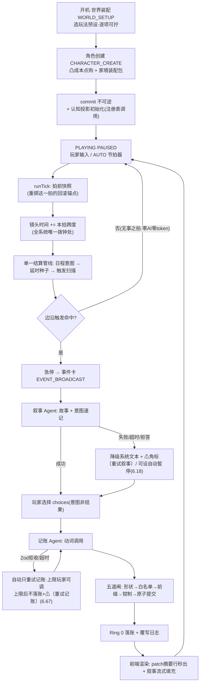

# 「AI 文游人生模拟器」V4.1 全架构蓝图：顶层设计 · 分模块详解 · 沙盒推演范例

<aside>
🚦

**全局工作守则（最高优先 · 换窗口必读 · 2026-06-17 钉入）**

① **不自作主张定 UX**：一切涉及用户体验舒适度的决策（提示 / 弹窗 / 标签 / 快捷键 / 默认值 / 交互节奏 等）一律先找怡家佳拍板，不自行拍定——理由：用户在酒馆社区约一年、清楚玩家要什么。此项与「确定性红线」同级，换窗口/换账号重开必须延续。

② **UX 提示形态铁律**：能用文字标记就不弹窗——纯展示 / 便利类提示，玩家勾选「不再提示」后永久静默（不再打断）；仅「诚实标记」（如沙盒模式标签）与「主权闸确认」（IM2/IM3）的痕迹不可省。一句话：提示可省，标签 / 痕迹不可省。

</aside>

<aside>
🧭

**本页性质**：V4.1 重构后的**全架构静态蓝图**（截至最新转正 6.76（增媒介渲染 6.70 / 迁移升版 6.71 / 酒馆角色卡迁移 6.72 / 宿主边界 6.73 / mod 防盗签名 6.74 / 叙事写法双桶·二审·小剧场·舞台 6.75 / 玩家代理·叙事控制·观战磕CP 6.76 / 半天会新功能整合 6.77 / QoL便利双轨 6.78 / 预设重构v2 6.79） · 含 P0 中途二十一批补漏＋纪元·离场演化双构架裁定：机制九项 / 系统操作九缺口 / 元指令与作弊七缺口 / 周目体系四缺口 / mod 包生态七缺口 / 多人接口面七缺口 / 多域时钟七缺口 / 知情过滤七缺口 / 状态机并发七缺口 / 数值边界七缺口 / 动词表六缺口 / 开放串治理六缺口 / 受众选择器六缺口 / 级联触发六缺口 / 纪元更迭构架 / Resolver 签名六缺口 / 切片预算六缺口 / 规模长跑六缺口 / 离场演化纠缠闭包 / 重试主权 / 记账语义保真六缺口 / 酒馆宿主借力四档 / 媒介渲染与多源消息流十五缺口 / 迁移升版×快照树×指纹重放七缺口 / 酒馆角色卡迁移 / 宿主边界十三缺口），逐条参照 `schema_new.js`（V3.1 实装）、[「AI 文游人生模拟器」V4重构整合清单：组织实体 / 地图 / 战斗与战争 / 秘密](https://app.notion.com/p/AI-V4-ce1c4870165e482790c29ca25c19b017?pvs=21)、[「AI 文游人生模拟器」V4.1 修订决议](https://app.notion.com/p/AI-V4-1-a9d51518f9f747a29d9880bcf1d902df?pvs=21) 与 [旧变量系统全量细查报告（V4.1 对照）](https://app.notion.com/p/V4-1-0870136aadec4002bb6d0d8509babb03?pvs=21) 综合而成。

**结构**：第一部分 = 顶层架构与全局数据流；第二部分 = 17 个模块逐一详解（框架 → 机制 → 变量 → 范例 → 联动）；第三部分 = 最通用的完整游玩沙盒推演范例；第四部分 = 重构后**全量变量结构总表**（V3.1 → V4.1 逐键对照·含简要提示）。

每个复杂概念都附「通俗解释」。后续转正轮次若修改决议，本页需同步更新。

</aside>

# 第一部分 · 顶层架构

## 1.0 一句话总纲

> **一个确定性数值引擎驱动的人生/世界沙盒：引擎管账，LLM 讲故事，玩法预设定题材。**
> 

通俗解释：把它想成「P 社游戏的数值底盘 + AI 小说家的嘴」。底盘（时间、经济、战争、关系、秘密）全部由不调用 AI 的纯代码推演，保证数值永远自洽、永远不卡死；AI 只负责把底盘算出来的事实讲成好看的故事。题材（古代宫斗 / 现代都市 / 修真 / 科幻）不靠改代码，靠换一套「世界玩法预设」参数。

## 1.1 设计第一性原理（为什么永远跑得通）

1. **单写者铁律**：全游戏只有引擎（Ring 0）一支笔能改存档。AI、前端、玩家的一切操作都只是「提案」，最终由引擎校验后落账。通俗：公司里只有财务部能动账本，其他人只能提交报销单。
2. **LLM 非阻塞**：任何 AI 调用失败/超时/拒答，最多让画面少一段文字，绝不让流程卡住——因为推进时间和改状态的权力根本不在 AI 手里。极端测试：让所有 AI 调用全部失败，游戏仍能从出生玩到死亡。
3. **能派生的不存储**：年龄、季节、家境等级、关系图、势力值……凡是能从别的变量算出来的，一律现算不存。通俗：不在两个本子上抄同一笔账——抄两遍迟早对不上（双写漂移）。
4. **能开放串的不枚举**：技能类别、资产类别、部队姿态、约定形式等用自由字符串，不用写死的选项列表——修真功法、星际公约这类新题材才装得进来。
5. **真相与认知分层**：引擎里存「真实世界」，玩家和 NPC 各自只看到「自己以为的世界」（认知档案 + 秘密知情过滤）。误判、中计、被蒙在鼓里由此涌现。（🟡v2 深化为**真相实体层 + 认知投影层**双层：引擎只存中立 factFragment 真相集 + offstage 粗节点正典态，LLM 只做唯一投影函数 `投影(观察者)=渲染(真相 ∩ 该观察者 access, 先验认知档案, lore)` 按 access 渲染；宣传/谣言/表里不一全从「真相 + 局部 access + 投影」涌现、引擎零扭曲类别枚举——是把本原理操作化为可执行机制，非返工。）
6. **接口冻结、字段演化**：P0 冻结的是接口契约（时间整型、单写者、动词表形状、前缀权限、状态机拓扑），不是字段全集；字段靠 `migration_version` + 派生化随时演化。

## 1.2 三环模型（谁干什么）

| 环 | 职责 | 调 LLM？ | 改状态？ | 通俗比喻 |
| --- | --- | --- | --- | --- |
| **Ring 0 引擎** | 时间泵 `tick()`、结算管线、触发扫描、检定、Patch 落账 | 否 | **是（唯一写者）** | 财务部 + 裁判 |
| **Ring 1 交互状态机** | 玩家面对的模态：事件卡、日程、RP、战斗、设置 | 否（只发起调用） | 否 | 前台接待 |
| **Ring 2 LLM 服务** | 叙事 Agent、记账 Agent、注册表专项调用，全部无状态 | 是 | 否（产出提案交 Ring 0） | 外包文案与速记员 |

## 1.3 数据分层（变量住在哪）

| 层 | 谁可见 / 谁可写 | 住什么 | 通俗比喻 |
| --- | --- | --- | --- |
| 无前缀层 | AI 可见；经五道闸可提案写 | 世界、角色、NPC、组织、地图、账户……一切「桌面上的事实」 | 明牌 |
| `_` 层 | AI 只读；引擎/前端/玩家可写 | `_tick`、`_本拍跨度`、`_粒度模板`、`_叙事设置{人称, 叙事偏好}`、`_触发扫描器` | 桌面上的规则牌 |
| `$` 层 | AI 永不可见；引擎专用 | `$运气`、`$谜底`、忠诚`$真实值`、`$隐藏记忆库`、`$战斗暂存`、`$流速`、`$玩家偏好`、`$预算控制台` | 扣着的底牌 |
| `$meta` 层 | 跨周目存档层 | 周目谱系（存档树）、峰值记录、继承包 | 赌场会员档案 |
| 世界玩法预设 | 配置层，不进存档 | 历法、种族模板、粒度、难度系数组、母题配额、战术包、制式库…… | 不同赌场的桌规 |
| 前端缓存 | 纯渲染，不进 stat_data | `$pos` 坐标、地形栅格、贴图、LOD | 桌子的装修 |

## 1.4 一拍的生命周期（核心数据流）



**先说清楚什么是「一拍」**：拍（tick）是世界推进的最小步子——即时档一拍 = 一回合，日常档 = 一天，发展档 = 一月，世代档 = 一年。**每一拍的作用 = 让世界整体「老」一格**：所有挂在时间上的量（利息、发育、情绪消退、秘密暴露度、NPC 幕后进度、伏笔倒计时、各类衰减）在这一格里各自按「速率 × 本拍跨度」结一次账。通俗：拍是世界这台钟的「咔哒」声——咔哒一响，所有账本同时翻一页；没有咔哒，世界纹丝不动。

**循环之前的开机段（S0→S2，整局只走一次）**：世界装配（选玩法预设，逐项可拧）→ 角色创建（凸成本点购 + 家境装配包）→ commit（不可逆）→ 引擎自动跑「认知投影初始化」生成「你以为的自己」面板 → 落入 PLAYING 的 PAUSED 子态，等第一声咔哒。这两个开机态在 PLAYING 枢纽之外，此时无游戏时间、无拍；commit 后一次性进入，永不返回。此后整局都在下面的循环里转，直到清栈终态（继承换代 / 人生总结）。

逐步通俗解说（对应上图每个框）：

1. **谁来踩油门（A）**：暂停时世界完全静止。玩家点「下一拍」、或开 AUTO 自动连拍（×1/×2/×3 只是现实里播放快慢，纯前端流速，不改任何数值），引擎才收到一声「咔哒」指令。
2. **拍前快照（B）**：动手前先给整个存档拍一张字节级备份。作用：这一拍内发生的一切都能整拍回滚（「重掷这一拍」就是回到这里重跑）。注意这是技术快照，玩家看的「人生快照」是另一回事（模块 16）。
3. **拨钟（C）**：镜头时间 += 本拍跨度。这是全系统唯一动时间的一行代码——AI、前端、玩家都没有拨钟的权力（墙钟三铁律）。
4. **结三类账，固定顺序（D）**：
    1. **玩家排的日程意图**：刷题/打工/拜访逐条过检定，结算收益与消耗；
    2. **到期种子**：三个月前埋的「开业口碑」「扩张收益」今天成熟，开箱结算；
    3. **触发扫描**：所有阈值穿线（民心跌破了吗）、绝对日期到期、概率掷骰（按跨度折算，防快进狂掉）、离散状态翻转，机械扫一遍。
    
    为什么固定顺序 + 串行：后一项读得到前一项的结果，杜绝「反水和战果同拍互踩」的竞态。
    
5. **岔路口（E）**：这一拍什么都没命中 → 直接回到第 1 步继续咔哒。**这就是快进便宜的原因：无事之拍 = 纯数学，零 AI 调用、零等待、零 token。**
6. **有事才叫 AI（F→G）**：命中触发 → 急停、弹事件卡 → 叙事 Agent 把引擎给的「事实包」写成故事和选项。AI 失败/超时/拒答？事件卡降级成系统文本照样弹出，数值结算一分不少（LLM 非阻塞）。
7. **玩家表态（H）**：选项是「意图」不是「结果」——选「贿赂考官」只代表想贿赂，成不成要过检定。
8. **翻译与落账（I→J→K）**：记账 Agent 把这段剧情翻译成结构化动词（修改/创建/追加/埋种子）→ 五道闸逐条验（形状 → 白名单 → 前缀 → 钳制 → 原子）→ 引擎落账并写覆写日志。被拒的只丢那一条，绝不污染存档。
9. **画面（L）**：前端先秒出记账摘要行（「账户 −2000 · 埋种子 ×1」），叙事文字再异步流式补上——体感零等待。然后回到第 1 步，等下一声咔哒。

**重 roll 两档挂在图上哪里**：「换个讲法」挂 G/G2 之后——数值已落账，只重调叙事，免费、不回滚、游戏时间零移动；「重掷这一拍」回滚到 B 的拍前快照重跑整拍——拍计数不前进，种子成熟日锚游戏绝对时间，所以预期召回时间不变；天命种子锚定拍号（重掷换叙事不换命运，命运重掷走限量券）。

**LLM 失败的前端兑现（6.18）**：任何 AI 失败/超时/拒答 → 事件卡照常弹出（系统文本兑底，数值一分不少），带 ⚠ 角标 + 〔重试叙事〕按钮；AUTO 快进可勾「失败卡自动暂停」（`$流速.自动暂停触发[]` 枚举项·停机类 = 最近内部拍边界生效·裁决六）。**🟡6.67 重试主权补全**：记账失败 ⚠ 未落账条目带〔重试记账〕按钮（同段叙事＋意图速记原样重喂、不换骰不混盐；跨拍补落账 = 当前拍补偿性新账、幂等防双落账）；自动重试上限/超时秒数/失败后行为（降级继续｜自动暂停弹重试面板）= 玩家旋钮——**自动重试有界、手动重试无界**；`自动暂停触发[]` 加「记账失败自动暂停」枚举项。

## 1.5 模块总表

| # | 模块 | 一句话职责 | 核心真相源变量 |
| --- | --- | --- | --- |
| 1 | 时间系统 | 唯一整型时间轴 + 粒度变焦 + 双时钟 + 历法皮肤 | `世界.纪元分钟`、`_本拍跨度`、粒度栈 |
| 2 | 状态机与运行管线 | Hub-and-Spoke 交互拓扑 + 触发扫描器 + 单一结算管线 | 状态机对象、模态栈、`_触发扫描器` |
| 3 | Agent 拓扑 | 叙事/记账双常驻 + 调用注册表 + 三层动词表 + 五道闸 | 动词表、调用类型注册表、`全局.覆写日志` |
| 4 | 焦点角色与角色组件 | 主角 = 组件齐全的 NPC 特例 + 镜头焦点指针 | `镜头焦点角色`、属性、性格五轴、特质、情绪栈 |
| 5 | NPC 与 LOD | 三档细节分级 + 作息纯函数 + 幕后演化 | `NPC{}`、作息模板、履历、登场契约 |
| 6 | 认知档案 | 「你以为的世界」：迷雾、误差、自我认知、谄媚度 | `认知档案[观察者][目标]` |
| 7 | 秘密与忠诚 | 顶层秘密池 + 暴露引擎 + 谜底隔离 + 忠诚双层 | `全局.秘密库`、`$谜底`、忠诚`$真实值` |
| 8 | 组织实体 | 万物皆组织：公司/政权/宗门同一套壳，可递归嵌套 | `组织实体{}`、派系登记、进展树、`全局.约定库` |
| 9 | 地图与空间 | 语义节点树归 AI、坐标归前端、渲染三镜头 | `地图.地点{}`（节点树）、空间ID、seed |
| 10 | 战斗与战争 | 三尺度五档抽象结算 + 可替换战斗接口 + 战线压力榜 | `战争状态{}`、压力榜、`$战斗暂存`、部队姿态 |
| 11 | 经济金融 | per-entity 账本（双分录）+ 开放资产对象 + 市场派生定价 | `货币系统.账户`、资产[]、市场状态 |
| 12 | 记忆系统 | 工作记忆 / 长期蒸馏 / 隐藏伏笔种子 / 触景生情 | 工作记忆、长期归档、`$隐藏记忆库` |
| 13 | 事件系统 | choices 契约 + 事件包 + 母题配额 + 来源权重 | 事件包 manifest、`系统.事件来源权重`、母题滚动窗口 |
| 14 | 继承·死亡·周目 | 复活闸 → 任意 NPC 接管 → 周目谱系树 | 继承候选、继承包、`$meta.周目谱系` |
| 15 | 世界玩法预设与 mod | 题材 = 参数组合；mod = 数据不是代码 | 玩法预设容器、mod manifest |
| 16 | 玩家辅助与元层 | 内心层调用族、人生快照、作弊三档、覆写通道、预算控制台 | META_OVERLAY、`全局.作弊标记`、`$预算控制台` |
| 17 | 前端渲染层 | 单一游戏界面 + 延迟掩盖 + 地图三镜头 | `$pos`、时间线、渲染器注册表 |

## 1.6 模块间相互作用（大图）

- **时间 → 一切**：所有衰减、到期、利息、发育、暴露度增长都乘 `_本拍跨度`。时间是全系统的公共分母。
- **事件 ↔ 记忆**：事件结算的延时后果以「种子」存进隐藏记忆库；种子到期又变回事件。这是「伏笔 → 回收」的闭环。
- **秘密 ↔ 认知**：秘密库管「事件型隐瞒」的生命周期，认知档案管「状态型误解」；统一读取接口 `知道吗(观察者, 信息)` 内部分发两库；declassify（揭穿）时秘密回写认知。
- **性格 → 认知/谄媚/演化**（6.16）：五轴数值喂三个公式——人生事件改性格、观察者投影带偏差、NPC 顶嘴还是奉承由公式决定。
- **组织 ↔ 经济 ↔ 地图**：组织的网点开在地图节点上，营收按区域物价结算回账户；战争翻转地图控制方又改组织控制区。
- **战争 ↔ 组织 ↔ 秘密**：armyPower 由组织军事字段算出；政变阴谋（秘密）declassify 后直接砸组织治理数值，可能点燃战争状态。
- **玩法预设 → 各模块参数**：历法喂时间、种族模板喂寿命发育、难度系数喂检定、母题配额喂事件、战术包喂战斗、制式库喂学业职业。
- **NPC LOD ↔ 预算**：不在场 = 零 token；离场只跑统计学演化；这是 token 成本可控的根基。

## 1.7 主要能实现的游戏 / 推演功能

- **人生模拟**：出生 → 学业 → 职业 → 婚恋 → 子嗣 → 衰老 → 死亡 → 继承换代，全程数值自洽。
- **经营推演**：开店/办厂/集团化（组织嵌套），营收 = f(规模, 区域物价, 行业景气)，市场风波、泡沫、破产链。
- **政治权谋**：派系、政变（秘密 + 进展树）、政体和平演变 / 暴力变更、权力递归（庙小神大）。
- **战争推演**：多方混战、移动战线（压力榜）、反水跳反、部队姿态与战术 mod、补给与士气。
- **谍战 / 宫斗**：双向秘密牵制（恐怖平衡）、内鬼伪装、线索收敛、知情圈分层、猜忌阻尼。
- **情感叙事**：关系边、情绪栈、触景生情闪回、彩蛋记忆浮现、认知误差带来的误会戏。
- **跨题材**：同一引擎跑现代 / 古代 / 修真 / 科幻 / 末世，靠玩法预设不靠改代码。
- **多周目**：存档树 fork、带记忆回溯、穿越进 NPC（继承皮肤）。
- **多人与 AI 同席（6.11/6.22，P2+）**：异步回合制——服务器端引擎单写者，全员（人类或 AI 席位）提交意图后统一结算一拍；AI 同席 = 给席位绑「NPC 扮演调用」，喂其认知投影与目标，产出意图照常过检定五道闸，与人类玩家权力完全对等。**多人接口面对撞收口（6.53）**：一拍 = 全席位意图屏障 + 统一结算，席位间冲突走确定性随机仲裁（种子不含墙钟/提交序）；世界钟全局单写者整桌推进、不为单席位冻结（RP_FOCUS 多人降级席位本地慢镜头叙事窗口）；掉线/超时席位走 AI 托管降级（非阻塞铁律推广）；每席位世界视图 = 服务器侧认知投影快照（防客户端读屏）；五道闸第②闸加席位作用域（提案资格 per-seat）。详见 4.11。
- **玩家可制作玩法预设（6.23，P2+）**：「玩法预设」即原「皮肤包」正式更名——它打包的是母题词汇表、实体模板、数值参数、事件包、战术包等整套玩法内容，更名以免误解为前端美化功能。玩家可把世界装配向导里调好的参数组合「另存为预设」打包分享；P0 只冻结包格式，制作器与社区分享后置。
- **导出即 mod（6.24，钩子）**：一键导出整树存档即天然 mod；分模块导出（只导 NPC 库 / 组织实体 / 事件包等）= 顶层键切片 + 套 mod manifest，与导入管线完全对称；导出默认剥离 `$` 层防泄底；P0 仅预埋 manifest 字段。多人封存礼包（6.24 追加）：房主封存/解散房间时可一键把档导出分发给全体玩家（人手一份，各自可单机续玩），并给每个席位角色（含 AI 席位）自动发一张人生快照谢幕卡（复用 6.17 调用·元层只读调用非写类设置，不受裁决六组边界约束、保持拍边界执行）。
- **规则补丁（6.28）**：玩家 mod 侧的第五种包形态——纯数据的机制约束覆盖（「绝对禁止伴侣出轨」「属下永不谋反」「年龄无限」），引擎闸口机械执行、AI 提案同样被拒；开局装 = 桌规，中途装走便利层。详见模块 15。

## 1.7b 非目标（Non-Goals·6.45 明文）

- **实时多单位微操不做**：引擎是单镜头焦点设计（`镜头焦点角色` 唯一指针），RimWorld/DF 式「同时微操多个单位」天然不适配；该约束是**架构性**的，不接受按需豁免。
- 群像戏的正规姿势 = 焦点切换（6.45 自愿换角入口）+ 组织实体代理 + 离场演化契约（模块 8）；体验是「轮流过每个人的日子」，不是俯视图拖框选。

## 1.8 前端渲染出的游戏效果

- **单一游戏主界面**（非聊天楼层）：时间控制台（暂停/×1/×2/快进 + 粒度档）+ 状态栏 + 地图常驻；事件以卡片流弹出。
- **延迟掩盖**：提交 → 时间推进动画立刻播 → 引擎瞬时结算 → 事件卡标题 + 记账摘要行（如「账户 −50万 · 埋种子×1」）先出 → 叙事文字异步流式填充。体感零等待。
- **地图**：疆域 Voronoi 着色、战线推进箭头、网点营收热力、阴谋热点标记、点击下钻态势卡。
- **RP 对话模态**：变焦进对话子界面，退出折叠为时间线节点。
- **人生轨迹时间线**：与分享快照页一物两用，L2 蒸馏摘要控制体积。
- **认知面板**：「你以为的自己」「你以为的他」——照镜子不照真值。
- **母题分布图**：本周目题材占比可视，玩家可用偏好反压。

## 1.9 玩法预设 × 游戏类型矩阵（题材 = 参数空间的一个点）

| 参数 | 现代都市生活 | 古代宫斗 | 策略战争 | 修真奇幻 | 科幻星际 |
| --- | --- | --- | --- | --- | --- |
| 历法皮肤 | 公历恒等 | 年号表（康熙三十年） | 公历/自定义 | 第三纪元·灵月 | 星历 47631.2 |
| 默认粒度 | 日常（天） | 日常（天） | 发展/世代（月/年） | 世代（年，闭关百年） | 发展（月） |
| 行动点上限 | 紧额（日程是核心资源） | 紧额 | ∞（日程容量无限） | 中 | 中 |
| 母题配额 | 日常高、战争低 | 阴谋高、恋爱中 | 战争高、日常低 | 奇遇高 | 探索高 |
| 事件来源权重（包:AI） | 40:60 | 60:40 | 80:20（正史铁轨） | 50:50 | 50:50 |
| 媒体渠道表 | 社交媒体/新闻 | 朝堂奏报/市井流言 | 战报/外交照会 | 仙门传讯 | 星际广播 |
| 种族模板 | 人类 | 人类 | 人类 | 人/妖/仙（长寿种） | 人类/机械/外星 |
| 学业制式/职级体系 | 义务教育+公司职级 | 科举+官品 | 军衔 | 境界阶梯 | 学院+舰队衔 |
| 战术包 | 无 | 宫变战术 | 经典战术包（维基编入） | 法阵战术 | 舰队战术 |

通俗解释：**不存在「游戏类型」这个枚举**——任何预设都只是上表参数的一种出厂组合，全部逐项可改、可导出 manifest 分享、可用自然语言让 AI 生成（AI 只产数据不产规则，过 Zod 校验才能导入）。

## 1.10 游戏大流程沙盒推进范例（鸟瞰版 · 策略向）

> 场景：明末走私商人（详细的通用生活向范例见第三部分）。
> 
1. **世界装配**：选「明末」玩法预设（年号历法 + 紧额行动点 + 阴谋配额高）→ 角色创建：属性凸成本点购，财富走家境装配包 → commit，引擎自动跑「认知投影初始化」生成「你以为的自己」面板。
2. **AUTO 快进**（发展档·月拍）：引擎逐拍跑经济月结、阴谋暴露度、NPC 幕后演化，全程零 AI 调用。第 3 拍「合伙人信誉」**穿越阈值**（边沿触发）→ 急停弹事件卡「合伙人提议扩张」。
3. **变焦深谈**：玩家点「进入对话」→ RP_FOCUS（1小时档），**世界时钟冻结**，逐句谈判每轮过检定。谈崩拔刀 → 战斗（五档判「惨胜」，AI 拒写也只降级为系统文本，HP 照扣）。
4. **退出变焦**：引擎按流逝的半天对世界**一次性补结** → 回事件卡选「接受扩张」→ 记账：`修改(账户, −50万)` + `埋种子(扩张收益, +6游戏月, 中)`。
5. **半年后**种子成熟，与「瘟疫」触发同拍 → 进单一结算管线按固定序串行结算。瘟疫致死 → 复活闸不过 → 清栈进继承模式 → 选长子接管 → 新周目继续。

---

# 第二部分 · 分模块详解

<aside>
📐

每模块五段式：**大框架 → 核心运行机制 → 变量架构 → 应用范例（附变量同步变化）→ 跨模块联动**。变量架构以 V3.1 实装为底、按细查报告处置改写后的目标形态呈现。

</aside>

## 模块 1 · 时间系统

**大框架**：时间拆成四个互不混淆的概念——①**纪元分钟**（唯一整型真相，全部数学在它上面跑）②**粒度**（一拍代表多少游戏时间：即时/日常/发展/世代四模板 × 任意跨度）③**流速**（现实里播多快，纯前端，绝不碰数值）④**历法皮肤**（怎么显示：公历/年号/星历）。

通俗解释：纪元分钟是**手表机芯**，粒度是**你看表的频率**，流速是**录像的倍速播放**，历法是**表盘的刻字**。机芯只有一个，其他全是外观。

**核心运行机制**：

- 双时钟（防卡死关键）：`RP_FOCUS` 显微镜档期间**世界时钟冻结**，只有镜头时钟走；变焦期间一切「现在」判定与记账写时刻**统一读镜头钟**（醉酒标签按对话中的钟正常到期、到期后检定不再吃修正）；退出时世界钟对齐镜头钟，窗口内到期点按时刻升序**分段补结**——复用截断拍同一台变长跨度机器（computeTickSpan），不另写第二套（配衰减累积器，结果与逐拍推进完全一致）。（P0-4 开工验收条款）
- 衰减/到期全部锚游戏绝对时间：每个可衰减量挂「速率/游戏月」，结算 = 速率 × `_本拍跨度`。快进一年（1 拍）与逐日过一年（365 拍）数值**完全一致**。**⏱️L-13 统一衰减累加器（已实装 bea1ae9）**：记忆 / 情绪 / 印象三处衰减走**同一份** `expFixed`/`fixedPow`（P0-5 fixed.ts 单一实现·禁第二实现）——记忆召回 recency（0.995 指数因子）= 调用方传入速率的一个特例（decayStep 用 fixedPow），三处同输入逐位恒等（口径 fixture 防双轨回归·指纹 84 不变）。
- 墙钟三铁律：游戏时间只由拍计数推进；AI 唤醒按游戏时间配额；`Date.now()` 禁止出现在 Ring 0（CI 静态检查）。
- **⏱️L-14 历法权威表（已实装 8f35f04·lore.ts）**：`_lore知识库` 落「时代 → 可用物 / 制度枚举」只读权威表（哪年有手机 / 科举），作**时代错置校验**的唯一数据源——校验**查时间核·不自算**（core 内不存在第二处时间换算），表本体进指纹；校验消费点拆 P0-6（结构可判 → 钳制闸）/ P0-8（只能语义判 → 校验闸），本表只下数据不接闸。
- **⏱️F-c 层2 历史拍指纹版本分段（已实装 657fa1a·segment.ts·唯一获授权触碰 fingerprint 分段路径的批次）**：历史拍指纹按**版本段** indexed（引擎版本 / Schema 版本已入 PRESET_FIELDS 7→9·层1 pre-wired 3322071），段头落引擎版本 + Schema 版本 + 迁移戳血统；跨版本降级走哈希链 + 迁移戳血统完整性校验（`verifySegmentChain`），**链断＝拒载＋显式警示**（同 S-1 向后兼容口径·迁移重写仅大版本逃生口）；M6 难度归档段＝版本段同款、共用**同一台分段机器**（不双轨·6.50 同口径），观测史只搬运永不重算。

**变量架构**：

```jsx
世界: {
  纪元分钟: 整数,              // ★唯一真相，年月日时全派生
  历法: { 纪年法, 纪元锚点, 年号表[], 月制, 显示模板 },   // 玩法预设注入
  当前日期(显示串): 派生渲染,   季节: 派生 f(月, 气候带),
  当前粒度(模板键), 粒度栈[],   周期数: 只读统计,
  _本拍跨度: 只读,             _粒度模板: { 即时/日常/发展/世代 }
}
$流速: { 模式[自动/回合制], 速度档, 自动暂停触发[] }   // 前端层
```

**应用范例**（变量同步变化）：

> 修真皮肤下玩家「闭关三年」（世代档 1 拍）：
> 

```jsx
纪元分钟 += 3年                    // 一拍走完
主角.技能[吐纳].熟练 += 速率×36月    // 衰减累积器一次套用
情绪栈: 过期条目全部清退            // 到期=绝对时间比较
NPC[师妹].履历[] += "下山历练归来"   // 幕后演化照常跑
```

**联动**：一切模块的分母；粒度模板带行动点上限/精力激活/HP 模型三资源换义（回合=血条、日常=体力、世代=寿元）。

## 模块 2 · 状态机与运行管线

**大框架**：交互层是 **Hub-and-Spoke（轮毂辐条）拓扑**——`PLAYING` 是唯一枢纽，事件卡/日程/RP/战斗/继承全是辐条，每条辐条都有无条件回家的边。开机段 `WORLD_SETUP → CHARACTER_CREATE` 在枢纽之外（无游戏时间、无拍），commit 后一次性进入 `PLAYING`，永不返回。运行层是**一条时间流 + 触发扫描器 + 单一结算管线**，没有预生成事件队列。

通俗解释：像地铁环线只有一个换乘大站，去任何支线都得回大站再走，所以**永远不存在把玩家困死的回路**。「预生成队列」被删是因为它等于先把明天的报纸印好——玩家今天的行为一变，明天的报纸全成废纸（因果塌陷）。

**核心运行机制**：

- 触发扫描器（每拍跑，纯机械）扫四类：阈值穿线（边沿触发 + 冷却去抖）、绝对日期到期、概率掷骰（`1−(1−月几率)^跨度月` 防快进狂掉）、离散状态翻转。
- 单一结算管线固定序：日程意图 → 延时种子 → 触发，串行、后项读前项结果（防三源竞态）；同拍多个成熟种子按**成熟日升序**结算、平局按 id 字典序——防因果倒置（9 月的进账先于 11 月的查账）、保跨机重放一致（P0-7 开工验收条款）。**级联结算轮（6.61）**：触发段后追加有限级联轮——每轮全量重扫（与脏标记「只重扫被改对象」确定性等价·优化前后双跑逐位恒等）、命中按重要等级降序+id 字典序结算、同一触发器轮内不重入、深度上限 N 住预设引擎硬顶且进指纹；第 N 轮末再扫一次、新检出穿线入挂起命中队列（下拍拍首优先结算）——**检出不吞、结算可延**；边沿检测以阶段边界观测点序列为准（日程段末/种子段末/每级联轮末，txn 组内永不观测），上次观测值表 = 观测史落账、随拍前快照版本化。**LOD 调度器（🔴v2·T5/漏洞 V2）**：物化↔解聚走显式调度器（蓝图原单一结算管线无此状态机）——单态不变式（任一实体任一时刻恰处一个 LOD 态）+ promote/demote 前后 checkpoint + 保温滞回窗口（离场不立即降级、防 ADS thrashing·借 Davis MRM）+ 队列正典排序（复用 6.61 成熟日升序 + id 字典序口径，保温与回放不重叠、防双计同一事件）；落点 PR-4。
- 自动连拍（历法对齐拍配套·P0-7）：本拍被事件性到期点**确定性截断**后，若截断点结算未弹急停事件，引擎自动续拍直至原历法边界——一次玩家指令可含多次内部拍；拍前快照与「重掷这一拍」回滚锚点锚定**玩家指令开始处**（整组回滚重跑）；截断点结算后落已结算标记并移出到期点集合（防同点反复截断死循环）；UI 将多段内部拍合并为一张摘要。
- 月结挂自然月边界（P0-7）：拨钟后比较新旧时刻跨过的自然月边界数，跨 N 个边界按时间顺序结 N 次月账（世代拍一次顺序结 12 次，复利口径才正确），不再挂「每月拍」。
- 被动到期（情绪/状态/物品/居留）不参与截断、拍末清退——P0 明文接受其积分误差；P1 可选「分段积分」：结算累积量时按拍内到期点把跨度切段、每段用各自在场速率计算，默认关闭。
- 叠加结算：事件拆「即时分量 + 延时分量」，每分量独立已结算标记——一笔可拆多次结，每分量只结一次。
- 栈纪律：模态栈深 ≤ 4；META_OVERLAY 不入栈；死亡/总结是清栈转移（统一清 `$战斗暂存`、粒度栈）。
- 播报出队门规（6.40）：播报队列只在栈顶为安全模态（PLAYING 及白名单）时出队，`COMBAT` 等非白名单模态期间冻结，模态 pop 回安全态时集中清算；条目带 `打断级别`（挂起默认 / 闪念 / 硬闯）决定融入方式，绝不以系统弹框打断关键模态。打断级别 AI 仅可提案，硬闯由引擎第④闸按白名单终裁；条目可带 `最迟期限`——「怎么织入」归叙事 Agent，超期未织入由引擎降级系统文本强制出队；重 roll 时已出队素材原样重喂、送达标记绑定最终采纳的叙事，播报不得因重 roll 被吞。
- 六不变量在引擎启动与每次转移时断言，CI 用「全 LLM 调用必失败」故障注入证明可通关。

**变量架构**：

```jsx
StateMachine: { 当前态(WORLD_SETUP→CHARACTER_CREATE→PLAYING→清栈终态), 模态栈[](≤4), timeMode[PAUSED/TURN/AUTO], 双时钟 }
_触发扫描器(纯函数): 阈值/到期/概率/状态 → 命中急停
延时种子: { 载荷, 成熟日(绝对), 重要等级, 已结算标记 }
系统: { tick_log(轮转封顶), migration_version, 功能开关表 }
```

**应用范例**：

> 嵌套栈完整走一遭：AUTO 快进 → 事件卡(push) → 进对话 RP(push) → 遭遇战(push, 栈深4) → 战死 → **flush 清栈** → 继承模式。全程无残留临时态。
> 

```jsx
模态栈: [PLAYING] → [P,EVENT] → [P,EVENT,RP] → [P,EVENT,RP,COMBAT] → flush → [PLAYING(新主角)]
$战斗暂存: {...} → 清空     粒度栈: [发展,即时] → [发展]
```

**联动**：自动暂停触发列表由玩家在 `$流速` 勾选（遇敌/没钱/秘密暴露/抵达/HP 阈值）；看门狗超时 → 降级系统文本强制 pop。

## 模块 3 · Agent 拓扑与记账五道闸

**大框架**：常驻 AI 角色只有两个——**叙事 Agent**（讲故事，零变量规则）和**记账 Agent**（翻译成动词，每次全新上下文）。其余能力（谜底校准/播报批量/玩法预设生成/认知投影初始化）都是**调用类型注册表**的条目：新增能力 = 注册表加一行，永不加 agent。

通俗解释：不养一屋子员工，养两个正式工 + 一摞外包工单模板。NPC 各配一个 AI、多 AI 互聊都明确不做——那是 token 黑洞 + 幻觉互相放大。

**核心运行机制**：

- 三层动词表：通用动词 ×4（创建实体/修改/追加/埋种子，约 80% 流量）+ 语义动词 ×8 根/10 标识（转移/缔结⊕解除/赋予⊕剥夺/调整/披露/移动/施加/植入·⊕=对称可逆对〔缔结⊕解除·赋予⊕剥夺：2 根各派生 2 标识，故 8 根撑 10 标识〕·余为单向不可逆·V5 对称性分桶·正交根动词靠参数泛化·收敛原约15词·V批 f1ed596）+ 兜底动词 ×1（自由写入，高频模式遥测自动提名晋升新动词）。动词 option 基础结构加 `precond?`（入闸条件）+ `effect_decls?`（结算效果声明·operator=(name,precond,effect) 对接五道闸·L-9/3294a23·Γ 六类语义约束 defer P0-4）。**指令信封与值槽（6.58）**：信封可空 `txn_id?` 组级全有全无（任一条拒收整组回退+整组重试记账，组不嵌套）；目标槽 = 单实体引用｜受众选择器串（展开按实体真键字典序）；值槽 = 定值｜开放串表达式（Ring 0 拍首快照确定性求值）；同拍指令全序 = 到达序；持续性规则（周期/条件生效物）禁走动词直写未来账，一律经约定库条目。
- 记账五道闸（每条动词依次过）：① Zod 形状校验 → ② 路径白名单（从实体 schema 自动派生）→ ③ 前缀权限（`$` 层管制）→ ④ 数值钳制（按重要等级设单次 Δ 上限）→ ⑤ 原子提交 + 覆写日志。任一道拒绝只丢该条；只重试记账不重生成叙事。**结构化输出手段**：关键结构化产出（记账提案）走**强制 schema** 而非模型自发 tool call；adapter 按 provider 择优（函数调用/工具或纯文本 schema）、对玩家不可见，且不依赖服务端 schema 校验（失败可返空对象）→ 引擎自带解析 + 校验 + 修复并入本五道闸/对账闸。**🔴v2·T4 升级**：在形状→白名单→前缀→钳制→原子五道之上叠加 MRM 一致性校验——解聚后再聚合须与解聚前粗态守恒（五道闸 = 聚合↔解聚一致性校验器），接 P14 离场再聚合校准。**开放串归一（6.59）**：第②闸同点做开放串统一规范化与同义查表归一（NFC+去零宽/控制符+全半角折叠+trim+归并表），落账即归一、账内只存真键；未注册串合法落账打「未注册」标记、不享串匹配特权。
- 召回路由：感性记忆（关联/触景生情/彩蛋）全部流向叙事侧；变量切片（在场 NPC + 地点 + 战争 + 秘密，经知情过滤）流向记账侧；谜底校准走第三路隔离调用。**数字类事实冲突时变量切片优先于工作记忆演出摘要**（结构化真值压过叙事摘要·防把演出文本里的旧数字当真）。
- 模型容错：拒答检测 → 供应商回退链；叙事被拒 ≠ 卡死（记账独立结算，降级系统文本播报）。**🎬NSFW 降级模型三态路由（6.76+·2026-06-15·原「切 NSFW 模型=引擎内部一档·非用户开关」口径作废，改玩家可见三态开关）**：`$玩家偏好.NSFW降级模型` 由玩家选——**关**=永不切模型，叙事生成失败只走 6.67 重 roll 叙事（同模型·重渲不重判·账本冻结·连续失败 N 次自动暂停提示），绝不切回退/NSFW 模型；**开·场景预判**=叙事调用前 NSFW 场景检测器（信号=内容分级∈{explicit,community} ∧ 当前拍叙事意图/情境标签命中 NSFW，复用母题配额/NSFW 饱和度标签）命中即预切 NSFW 模型，预切后仍失败则在已切模型上重 roll 作二次安全网（不再切第三个模型）；**开·失败兜底（默认·开 NSFW 即求稳）**=默认模型先跑，仅软拒/拒答检测命中才切 NSFW 模型重试。路由决策 `selectNarrativeModel(state,{软拒,场景预判NSFW})→{模型键,路由依据,显式原因}`，检测器命中判定写 tick_log 随快照版本化。**三硬约束**：①玻璃箱——切了须明示「因 X 切到模型 Y」（成本/封号可见·禁静默切）；②只在玩家已配 key 的模型间切，禁路由无 key 模型（无 key 自动降级不可用），切换目标住 `$预算控制台.NSFW降级目标模型键?`；③确定性——三态开关与目标键入指纹排除名单（偏好层不进盐），本拍实际路由的依据+模型键+显式原因写 tick_log 随档快照（回滚/重放后路由不漂移·或复用 6.68「逐字不可复现但语义保真」）。仅作用于「叙事」调用——记账/检定/谜底校准/结算永不切模型；本开关 ⊥ 内容分级（后者控提示词强度·前者控是否/何时切模型，explicit 不再硬编码「不主动切模型」改由本开关决定）。**🎚️玩家主权覆盖注入铁律**：玩家自定义 SystemPrompt 覆盖串与 `assistant预填` **仅在叙事调用注入**（且仅 community 档专家模式开时生效）——记账/检定/谜底校准/结算永用引擎内置串、覆盖串永不进 6.41 事实包/意图速记、不碰落账语义；覆盖致频繁乱码/拒答仍走既有降级回退（系统文本兜底/重试·复用 6.67＋输出侧软拒），专家模式不豁免回退、连续失败可自动暂停。**🎬内容分级四档分档注入**：组装器按 `内容分级` 选叙事提示词强度——off 安全／light 轻度成人／explicit 成人小说家框架＋解禁词／community 同 explicit＋玩家覆盖串，**四档全仅注入叙事调用**（记账/检定/谜底校准/结算不受影响）；**解禁词玻璃箱**：explicit 档引擎解禁词对玩家可见、community 档可编辑、不锁黑箱（玩家主权透明度·同 NSFW 三态玻璃箱口径）。**🟡6.67 重试主权**：注册表「超时重试策略」降级为出厂值，玩家覆盖层（预算控制台侧 `重试策略?{ [调用类型]: { 自动重试上限, 超时秒数, 失败后行为 } }`）优先；手动〔重试叙事〕/〔重试记账〕无次数上限、可临时换模型档位（复用分调用类型选模型档位）、自负预算计量不阻止。
- **叙事分发（6.41·6.44 拆分后口径）**：prompt 组装按当前拍锚点查 `玩法预设.叙事分发表` 取媒介键、再查 `媒介登记表` 拿「版式+文风+禁词+渠道」整包注入（优先序：行动名 > 据点设施 > 事件标签，同级平局按键字典序），命中则把格式模板注入输出契约段——**确定性分发，AI 只管填格**（让 AI 自判"该不该用格式" = 求自觉必忘）；日期/地点/署名等引擎槽位由引擎预填，AI 不得自造；输出过机械校验（必填槽位 + 禁词扫描 + 密度阈值）→ 失败快模型定点重写一次 → 再失败降级普通叙事（接拒答回退链，绝不阻塞）；开场白具名调用模态期间分发挂起（硬边优先）。**思维链剥离铁律**：模型原生 reasoning 或 tagged `<thinking>` 思维链永不渲染给玩家、由分发器在 6.41 处剥离干净（防真值/秘密泄露）；仅触秘/NSFW 红线等场景选择性开放。防冲突铁律与风险见 4.11。

**变量架构**：

```jsx
调用类型注册表: { [类型]: { 模型档位, 温度, 上下文组装器, 输出schema, 超时重试策略,
  采样参数?{温度?,top_p?,频率惩罚?,存在惩罚?}, 最大回复tokens?, 思维链?{启用?,努力档?},   // 【调】LLM核心调用参数·分类型可调
  切片预算?{软上限tokens?,硬上限tokens?,截断优先级[]},   // 【调】分类型切片预算上限
  附加采样参数?{}, 停止序列?[],   // 🍺酒馆·透传provider原生采样键
  允许玩家覆盖SystemPrompt?(默认false), 玩家SystemPrompt覆盖?, assistant预填? } }   // 🎚️🤖仅「叙事」条目·玩家主权与破限引擎化
$模型画像: { [provider]: { 风格补正提示词, 采样参数{温度?,top_p?,频率惩罚?,存在惩罚?,最大回复tokens?}(【调】扩展), 禁词表[](6.41·反八股校验用·按provider分表),
  附加采样参数?{}, 停止序列?[],   // 🍺酒馆·provider原生采样键透传
  内容容忍度?, 硬审查标注?, 解禁提示词?,   // 🍺酒馆内容分级·模型侧容忍度声明与解禁
  多模态能力?,   // 🍺酒馆·图/音/视多模态支持声明
  破限引子?{思维链引子?,注入角色?(system|assistant),预填串?} } }   // 玩家/社区填，引擎只拼接·🤖破限引擎化: 组装器按当前模型族(Claude/Gemini/GLM)自动挑破限引子+定注入角色(Claude=system注入+assistant预填·Gemini/哈基米=assistant预填为主)·只换引子注入策略·不主动切模型
全局.覆写日志[]: { 时间, 授权源, 级别, 目标, 理由, 是否作弊 }
```

**应用范例**：

> 叙事「你重金贿赂了考官」→ 意图速记「贿赂考官 −2000两，留下把柄」→ 记账 Agent 产出：
> 

```jsx
修改(账户.持有, −2000, "贿赂")          // 过五道闸 ✅
创建实体(秘密, {类型:罪行, 涉事方:[主角,考官]})  // ✅ 自动开知情圈
修改(主角.智慧, +30, "开窍")            // ❌ 第④闸钳制到+5，patch摘要标注
```

**联动**：五道闸的白名单与 mod 导入校验、继承生成共用同一派生源（ATTR_WHITELIST 退役）；母题遥测挂在动词流量上。

<aside>
🧭

**架构决议 · 中文模糊性的工程终局（2026-06-16）**

中文金额/语义的写法是开放集、解析规则是有限集——靠「填坑」永远追不上。终局不是把坑填完，而是让「填坑」不再决定记账正确性。四层：

**① 结构先行（治本）**：记账 Agent 先吐结构化提案（transfers 含 from/to/amount/unit/性质），叙事是受提案约束生成的表现层；账本永远只读结构、永不读散文。解析器从「必须读懂中文」降级为表现层校对——它错了最坏是打回重写，绝不错账。

**② 账本守恒（最深护城河·与中文无关）**：每拍全世界铜钱总量必须守恒，流入=流出对不上整拍拒账。这条不解析任何文字，无论叙事怎么写都挡得住凭空多/少钱——是相对 SillyTavern 的硬护城河，应优先做厚。

**③ fail-closed 三角校验**：确定性「文」锚 / detected_amounts（LLM 自报·须冻进 tick_log 才可重放）/ proposal.transfers 三条独立腿，三边一致才放行，任一对不上或认不出一律 fail-closed 降级。让模型「多说」可以、绝不让模型「自证」。受控词表收窄：世界只认规范单位，规范集外天生 fail-closed，把无限中文收成「封闭规范集 + 保守兜底」。

**④ 埋点 + 版本化重放（可演进）**：坑按 A 已覆盖 / B fail-closed 安全 / C 真危险 fail-open / D 路由别处 四类盘点；每次 fail-closed/degraded 记原始文本采真实分布、按频率头部优先补；规则版进指纹 + tick_log 冻结观测值 → 永远可加新规则而不破坏老存档，填坑变成安全的增量后台活。

**落地映射**：①=模块 3 对账闸 + 6.68；②=H1 账面 clamp 之上加守恒断言（P0-7）；③④=中文数字解析规则版（已 bump·入指纹）+ slice M2.5/M2.6/M2.7 三层闸的演进路径。

</aside>

<aside>
🎲

**架构决议 · 叙事温度与重放契约（2026-06-16）**

叙事调用温度调高（slice 默认 0.9，可经 `DEEPSEEK_TEMPERATURE` 环境变量覆盖），保证同一动作多次触发出不同文字——**这不破确定性护城河**：骰子/账本走 seed、重放短路读 tick_log，全程不碰 LLM 文字（= 6.68「逐字不可复现但语义保真」）。故叙事温度/采样参数天然入指纹排除名单、不进盐、不进重放契约。教训来自 slice M5 Web UI：温度未显式设置时沿用 provider 默认值，导致重复动作逐字复现；显式设高即解。

</aside>

## 模块 4 · 焦点角色与角色组件

**大框架**：「主角」不再是特权容器——**主角 = 组件齐全的 NPC 特例 + `镜头焦点角色` 指针**。换角/穿越/多人，只是把镜头指针指向另一个人。**镜头焦点角色 = 会话本地视角（6.53 多人接口面收口）**：该键重定性为席位本地视角（多人泛化为 `席位表{[席位id]:{焦点角色键,控制者,连接状态}}`），归会话层不归世界真相层——引擎结算从不读它、只决定「这一帧渲染给谁、喂谁的认知投影」，单机为席位数=1 的退化；6.45 自愿换角「只动镜头指针」在多人下收紧为「只动本席位镜头指针」。角色由可插拔组件构成：属性、性格五轴、特质、情绪栈、状态标签、技能、物品、信念、学业、职业、体征、目标、居留身份、头衔。

通俗解释：摄制组不围着某个演员造摄影棚，而是摄影机对谁谁就是主角。

**核心运行机制**：

- **属性五轴（6.26 冻结）**：体质（身）/ 智慧（思）/ 感知（察）/ 魅力（言）/ 心理（志）——能力慢变量，进检定公式（属性/2）。**检定配方表**（主属性 + 副属性×权重，数据进玩法预设）在消费点做多轴联动，轴间禁止直接互喂；智慧钳制单次 Δ=0（特殊语义动词通道由预设开），体质允许年龄曲线衰减；幸运不设轴（`$运气` 暗层已有）；轴表预设化，战斗向预设可扩力量/敏捷。感知=雷达（看见），心理=装甲（扛住），与神经质（怎么反应）三者互不重叠。
- **性格五轴（6.16 冻结）**：唯一真相源 = OCEAN 五条 0–100 数轴。三个下游公式：性格演化（事件给轴打增量，引擎机械）、认知投影（投影 = 真值 + 偏差项）、谄媚度公式（喂反谄媚机械闸）。MBTI 降为阈值映射的派生叙事标签；单向派生纪律：数值 → 标签可以，标签 → 数值禁止。
- 特质 = 结构化修饰通道 `{属性修正, 成长率/上限修正, 检定修正, 事件钩子}`，引擎可执行（自由字符串「社交−15」改为结构化条目）。
- 情绪 = 栈：多条情绪带剩余时效共存叠加，「情绪基调」只是栈顶的派生显示。
- 状态标签半结构化 `{效果: 修饰通道引用}`：被俘/中毒/醉酒都是标签实例，约束 = 标签的一种。
- 声誉归并 `声誉{人望, 知名度, 极性, 标签}`；财富踢出属性走账户；年龄/人生阶段/家境全派生。

**变量架构**：

```jsx
NPC[焦点角色]: {
  属性{体质,智慧,感知,魅力,心理}(轴表预设化·6.26), 派生{HP,精力,颜值}(检定配方表),
  性格五轴{开放,尽责,外向,宜人,神经质}(0-100),   // ★6.16 唯一真相源
  性格标签: 派生显示,  特质{}, 情绪栈[], 状态标签{}, 技能{}(类别开放串),
  物品{}(可携意象[]·6.29统一制式), 衣物, 信念{}, 学业(制式库已迁玩法预设), 职业.任职[], 体征,
  目标{长期,短期[]}, 居留身份[](国籍=政权组织键), 头衔[], 声誉{}
}
镜头焦点角色: NPC键指针        主角位置/轨迹 → 挂焦点角色
```

**应用范例**（战争创伤，变量同步变化）：

```jsx
性格五轴.神经质: 55 → 60 (+5)      // 事件结算增量，AI只产意图
性格五轴.开放性: 70 → 68
情绪栈.push({恐惧, 强度高, 时效+3月})
状态标签 += { 战争创伤: {检定修正: 社交−10, 事件钩子: 夜惊} }
性格标签(派生): "开朗" → "沉郁警觉"   // 越阈值自然翻转，无人手写
```

**联动**：五轴喂模块 6 谄媚度与投影；情绪栈喂触景生情召回；状态标签接战斗/秘密（被俘=标签）；体征发育读种族模板（玩法预设）。

## 模块 5 · NPC 与 LOD 分级

**大框架**：NPC 按镜头距离分三档细节度（LOD）：**L0 在场**（进叙事上下文）、**L1 重要离场**（纯引擎统计演化，零 token）、**L2 其余**（冻结，入镜惰性实例化）。镜头外永不做个体级模拟。**社会粒度 LOD（🔴v2·T11·第四维）**：在 L0/L1/L2 镜头距离分档之外增「社会粒度」维——图位等价类并为 cohort 粗节点（N 实体 → 1 节点·propagateRipple/access 算一次整群共享）+ flyweight 原型复用；需具体人时 seeded 解聚铸实例并晋升、走远再吸收回带（P14）、单态不变式防双计；成本随叙事相关度而非世界大小，整世界预设才付得起。6.65「涟漪写入分级」是其雏形（广域落聚合条目·个体读取 = 聚合 × 个体修正派生），v2 升格为含 offstage 决策/动力学聚合态的完整 cohort 节点。

通俗解释：电影只给镜头里的人打光；远处群演是纸板，但纸板上记着他的简历，镜头扫过去时立刻能演。

**核心运行机制**：

- 作息 = 按需采样的纯函数 `f(模板, 当前纪元分钟, 种子) → 此刻在干嘛`，不随拍推进、与粒度零耦合、同一时刻查询结果恒一致。采样结果作为硬事实喂叙事（「将领熟睡，哨兵×2」），检定同步吃修正（熟睡 → 暗杀 DC 大降）；作息可被侦察检定写进已知情报。
- 幕后演化：`f(目标, 权力, 关系边, 种子) → 进度`，跨阈值才产幕后种子；同拍成熟批量打包一次调用产短播报；播报卡带「介入」按钮可升格为正式事件。**🌊涟漪 behaviorSeed 接入**：涟漪采纳激活的 `behaviorSeed`（报仇/告发/逃离/结盟/趋附）经 `offstageSettler` 推进为 NPC 离场行动 → 产生新 Δ → 回灌涟漪传回主角耳边（涟漪⟷幕后双向闭环·详见涟漪系统页·实装 G7）。**🎭offstageSettler 定稿（确定性离场结算器·闭式+seeded+有限意图 A3 有界·非 NPC 自主 AI 规划器·详见幕后演化系统页）**：①**双向闭环** A 涟漪投 behaviorSeed→germination 闸→offstage 行动 / B 行动产新 Δ→拍末结算→下一拍 Phase6 发中立 factFragment→新涟漪 / C 护栏 seed budget+级联限制+衰减+幽灵防护防正反馈爆走。②**germination 闸四条件全满足**才激活：强度≥θ_germ（异质·θ_i 派生）·资源/政治资本可付·cooldown 已过·rngForTrigger seeded 判定通过；否则留队或熄灭。③**带宽 cap/seed budget**（防爆走主闸）：每拍全局 cap+per-actor cap·超额按 seeded 优先级（强度×紧迫度）排序·溢出确定性 deferred 下一拍；溢出队列=确定性优先队列（非 FIFO）每拍重排·每区域深度硬上限·最低优先级 EDGE_DECAY 衰减跌破熄灭阈自然剔除·压缩窗结束仍有余量落区域持久队列（不「等玩家回来重算」）。④**结算=拍末批量**（复用 m_p7tier6 拍末取材相位）·产物 Δ 入下一拍防同拍自激·同拍多事件确定性全序（虚拍号→区域键字典序→行动者 id→意图枚举序→seeded 末位裁决·germination 读拍初快照·催生新行动的 Δ 一律 deferred 到 T+1·报复→激怒→再报复天然展开为多虚拍链）。⑤**离场压缩+跨区**：远区不逐拍模拟·场景切换时按 `离场传播倍数` 闭式快进 N 拍·一次性 seeded 进指纹；连续量（资源紧张度/政治资本 regen/强度 decay）建模为闭式轨迹·解析求出阈值穿线虚拍作合成事件注入（事件驱动跳跃·长期积累的突发绝不漏算）。⑥**队中活体种子**：强度/紧迫度每事件点闭式重算非入队冻结——强度随时间 EDGE_DECAY 衰减·同 (行动者,目标,意图) 收新涟漪走 declaration 强化合并（不重复入队）；紧迫度=带时间项轨迹（威胁逼近↑/盟友得手↓）·其阈值穿线即调度事件（「入队低强度三天后演为高威胁」被捕获·与涟漪最关键耦合）。⑦**悬空指代→潜伏种子**（守 A3 不破）：目标悬空不 germinate 执行型行动·沉淀低承诺「探查/流转」潜伏种子仅抬显著度·待实体解析自动晋升具体行动种子（显著度先导+解析触发·非两段式规划·听说级信息不全哑火）。⑧**未遂以可观测为准**：纯内部未起步（cooldown/seeded 闸否决）不发涟漪仅写本人认知；已产生可观测尝试后失败（叛乱被弹压/征兵流产）发低强度中立 factFragment 正常传播·受同一 cap 限幅。⑨**EDGE_DECAY 可变**=基线×区域/场景修正（高烈度/高密度区更低衰减连锁更远）·派生自预设区域变量。⑩**三护栏防爆走**：cascade世代≤8 每链硬顶+EDGE_DECAY 逐世代严格收缩（几何级数可证终止·即便深度<8 也必终止）+每压缩窗总步预算 f(压缩拍数×离场传播倍数·重要区得更多预算契合叙事权重)；超 cascade 上限不静默丢·发终末低强度中立 factFragment 后熄灭。⑪**幽灵防护（§八对齐）**：offstage 目标经规范键归一——悬空→潜在节点不 germinate·死者→停发起但亲属边触发死讯涟漪·别名归一去重·不凭空补边。全程经 rng.ts/fixed.ts seeded 进指纹·双跑恒等可回放·LLM 离场叙事润色不进指纹（红线 rng/fixed/computeDelta 函数体只读·黄金向量与 G7 同期重定基）。
- 履历[]：滚动 N 条短句，引擎在幕后结算时追加；入场切片带上 → 离场经历反映在言行。
- 登场契约：日期/条件/地点，入场前零 token。
- **创建实体统一纪律（6.33）**：提及即占位（轻量占位条目 `{名称, 实体类型, 硬约束, 来源拍号, 模板引用?}`，零 token）→ 登场契约 → 入镜实例化，三段式对 NPC/组织/地点通用；物品/秘密/事件豁免；幽灵节点（6.30）= 血缘侧特例。**🔴v2·V5/T6 正典态种子（新闻先于物化）**：当某占位实体先被远方 factFragment 引用，首个引用即触发其「正典态种子」seeded + lore 生成「粗真相正典态」（否则后续物化与已传播新闻矛盾）；占位条目加可空 `正典态种子?`（lore 锚定生成·进指纹·与登场契约正交），NPC/组织/地点三处通用。

**变量架构**：

```jsx
NPC{}: { 重要等级(路人/次要/重要/核心), 召回权重, 种族(开放串),
  性格五轴(惰性实例化), 关系[]{对象键,类型开放串,强度,极性},
  目标{长期, 短期[]}(开放串·与主角同构; 叙事惯称「野心」·6.20), 作息{模式键:{时段:{状态:概率}}}, 当前作息模式,
  履历[](滚动), 登场契约, 能力档(惰性), 所属组织[], 忠诚{}, 秘密索引(派生), 意象[](6.29统一制式·公共印象) }
全局.家族树: 全体NPC共用双亲边DAG(+领养/过继边) · 名义边明面 · 生物真值=秘密库「身世」条目 (6.27)
已故NPC归档: L2冻结层
```

**应用范例**（离场密谋者）：

> 玩家在外地经商 6 个月（AUTO 快进），政敌李大人 L1 演化：
> 

```jsx
NPC[李].幕后进度(结党): 40 → 75    // 纯引擎，零token
跨阈值70 → 产幕后种子{李结成同盟, 成熟+1月, 重要:高}
种子成熟 → 批量播报卡: "听闻李大人近来宾客盈门" [介入]
NPC[李].履历[] += "与吏部侍郎结盟"
```

**联动**：作息喂战斗偷袭检定；履历喂叙事切片；幕后种子复用模块 12 延时种子结构；五轴惰性实例化接模块 4。

## 模块 6 · 认知档案系统

**大框架**：`认知档案[观察者][目标] = {了解度, 误差表{字段:认知值}, 时效}` 稀疏双向——每个人（包括主角自己）看到的世界都是「真值 + 自己的误差」。UI 与叙事只展示**主角的认知投影**，决策 AI 读**各自的投影**。

通俗解释：游戏里没有上帝视角的玩家面板，只有一面**哈哈镜**；镜子多正取决于你跟对方多熟、情报投入多少、对方伪装多深。

**核心运行机制**：

- 统一读取面：`知道吗(观察者, 信息)` 单接口内部分发秘密库（事件型隐瞒）与认知档案（状态型误解），切片过滤、UI 渲染、播报触达、检定修正全走它。
- 自我认知（三条件版）：`认知档案[主角][主角]` 同一结构——自恋者误差表 `{自身能力: 夸大}`；误差来源 = 性格轴 + 环境谄媚度 + 媒体回音室；开局由「认知投影初始化」调用按出身性格生成（不随机），渲染「你以为的自己」面板。
- 环境谄媚度 = f(周围关系边按权力差×依附度加权, 信息渠道回音室程度)——帝王朝堂与「爹妈夸朋友捧」同一公式不同数值；破产后谄媚源消失 → 自我认知被现实修正，本身就是剧情。
- 认知迷雾总开关进 `系统.功能开关表`：关 = 上帝视角游玩（便利层免标记）；谜底隔离不随开关旁路（防剧透底线）。
- 决策输入认知化：NPC/组织的反制决策读自己的投影而非真值——误判、中计、将错就错由此涌现。
- **印象条目与涟漪引擎（6.37）**：`认知档案[观察者][目标].印象[]{标签, 极性, 强度, 来源, 获知时间, 衰减速率}`——原 `NPC.印象标签[]` 废除「隐含对主角」的扁平语义迁入此处，条目制式对齐 6.29 意象。涟漪 = 纯机械管线（零 token）：事件结算产印象事件 → 一手在场目击写满强度；二手沿 `NPC.关系[]` 边逐跳传播（强度×关系系数×每跳衰减，低于阈值停传，一般两跳即止）；广域走媒体渠道表落区域级印象（带渠道偏色 = 假新闻通道）。`$涟漪候选` 为暂存缓冲。covert 行动不产印象事件，秘密暴露后才补发涟漪（事发多年名声才臭）。`声誉{}` = 全体印象的聚合派生（公共层），印象条目 = 个体观察者层——张三恨你、全城敬你两层各自成立。**🔴v2·命门一 access = 涟漪场读数（T2/漏洞 V1·V7·2026-06-21 拍板）**：`access(观察者, fact)` = 该 fact 的涟漪经现有关系图传播到观察者后的**残余强度**——直接读 `propagateRipple` 已算的 (观察者×fact) 场，**不另立公式、无权重向量、无新指纹面**：在场 = 临时高导 overt 边（不开 covert 门、不泄密）、covert/秘密 = fact 自带的门、声望 = 导通乘子、调查 = 花预算强化边（主动 access）。投影函数对所有观察者同一、玩家不特殊（「听来的」vs「到场看见的」= 同一函数低/高 access 两次输出）。**factFragment 扩字段（T1/T9/V4）**：印象[] 与 `$涟漪候选` 条目加 **来源世界域?**（跨域 access=0 作纯谣言·T9）+ **有锚布尔?**（false = 无 grounding-ref 凭空造谣·V4），G2 冻结面 additive。**🌊涟漪社会传播引擎深化（2026-06-21 拍板·落 core `tick.ts` Phase6→Phase8·确定性进指纹·主观叙事 label 不进指纹·详见涟漪系统页）**：涟漪从「一手在场/二手两跳」升格为完整社会传播动力学。**①载荷 RippleParcel**：`事实碎片(主体/维度/Δ方向/客体/场景/量级·中立 canonical 不可变)` + `叙事框架(定性键/正当性∈[-1,1]·与事实解耦·可争·会传播)` + `信源链[](目击者←转述A←转述B·=证据链/信源暴露)` + `originTick` + `置信度∈[0,1]` + `认知指纹(每跳丢非核心字段→失真)` + **双种子** `consequenceSeed(规范域/潜在后果)`＋`behaviorSeed(意图:报仇|告发|逃离|结盟|趋附/目标/强度)`；**事实⊥叙事拆分（§1.17）→规范评估 = f(事实, 接收者叙事)**：同一「杀人」在「凶犯/义士」叙事下出通缉/悬赏，LLM 只 flavor 不反转（G1 留 seam·G3 落反转）。**②节点解析与幽灵节点防护（§八）**：补边/传播前 主体/客体/信源/behaviorSeed.目标 先经规范键注册表归一到唯一 actor；四类幽灵——悬空指代→潜在节点（挂印象但不中继·不计采纳 θ·不计聚合）/ 死者→停发停中继但保亲属边（死讯仍达·修「杀人亲属无反应」）/ 别名→归一去重（护 B4 submodular）/ 过度补全→**禁**（守 A4：只派生既有关系对称·隐含边 + 同场景在场临时弱边，真隐士保持孤岛，world.js 零边=数据 bug 补写非合成）。**③传播动力学 SEIR×IC×LT**：S 未知→E 听说(轻印象未达 θ)→I 采纳(双种子激活)→R 淡忘(Ebbinghaus `exp(−λΔt)` via `fixed.ts`·λ 非线性：谋杀极慢/婚姻慢/经济中/八卦极快)；IC 每边一次机会 `p=置信度×边权×边类型系数`·seeded `rng.ts` 判定；每跳 `置信度×=0.7` + 丢非核心字段；写认知档案=聚合累加(非覆盖·边际递减 GAIN)+独立信源计数。**④三处学术修正（§七）**：桥宽 W（复杂传播须跨簇平行边 `W≥θ` 才传得动信念/造反·Centola-Macy·简单传播 θ=1 走长弱桥/复杂传播 θ≥2 须宽桥）+ 异质阈值 `θ_i`（每 NPC 性格/风险偏好/社会位置确定性派生·非全局常量·Granovetter78）+ Bass 双系数（采纳=p 外部点火/媒介广播 + q·F 内部口碑·无 p 种子永不起燃）；诚实断言 = agent 级机制保真·非科学可预测。**⑤双向达主角**：主角是图节点·涟漪可达（「有人在找你寻仇」），NPC 离场行动后果顺涟漪传回主角耳边。**⑥20 盲区并 S1–S8 子系统（梯队 E1–E5·护栏=反枚举[符号/模板/预期走 lore]+确定性[seeded rng+fixed]）**：S1 公共认知(个体→组织→区域→公共事实·共同知识相变·默认共识继承·共知须公共场景共同在场 1 级有界) / S2 信源证据(多源按信源键分桶不覆盖·矛盾并存·匿名置信折扣+升阈·证据链持久化) / S3 传播调制(传播抑制系数 −1~+1·阶层层级权重 KOL·辟谣引用×0.5 新旧并行) / S4 多通道(人际|地点广播|环境·地点媒介列表绕人际衰减·=Bass 外部 p) / S5 二阶规范极化(共识增益→动态社会规范表 ADJUST→道德压力强制行为种子·**阻尼护栏：有界+Ebbinghaus 衰减+可辟谣逆转+允许逃离逸出·防信念焊死**) / S6 语境词释(符号+解释模板从 `_lore` 取·禁 core if-表) / S7 时序(离场压缩闭式加速接 offstageSettler·生效窗口警戒态不发行为种子·沉默放大) / S8 代际传承(家族树传承记忆池·依赖家族树·E5)。**⑦摩擦与社会熵（§十一·防免费午餐·拒全局熵账本）**：三高杠杆摩擦点确定性进指纹——政治资本（组织决策消耗·见模块 8）、非对称信任（信任降快修慢·违约扣分≫单次修复）、信源暴露（发涟漪即在 sourceChain 留痕→可追溯→生成报复/灭口 behaviorSeed·传播不再零成本）；组织疲劳/认知带宽 cap defer。

**应用范例**（独裁者误判，变量同步变化）：

```jsx
组织[王朝].属性轴.民心(真值): 32   // 6.45收编出厂轴         // 引擎真相
认知档案[皇帝][王朝].误差表{民心: +45} // 谄媚朝堂喂出来的
→ 皇帝决策读 32+45=77 → 加税          // 决策输入认知化
→ 民心真值 32→24 → 起义触发器边沿命中
→ 起义爆发后 误差表{民心} 被现实修正 +45→+10  // "如梦初醒"
```

**联动**：谄媚度公式吃模块 4 五轴；假新闻（模块 17 渠道）= 往认知档案写错误条目；战术欺骗（模块 10 认知差族）全靠它；穿越换角的「玩家知道但新主角不知道」信息分割靠它。

## 模块 7 · 秘密系统与忠诚双层

**大框架**：秘密升**顶层池** `全局.秘密库`，实体侧只留派生索引。每条秘密 = 涉事方 + 进展 + 暴露度 + 已暴露线索 + 知情名单（受众选择器）+ `$谜底`（AI 平时物理不可见）。忠诚拆双层：`$真实值`（AI/玩家都看不见）+ 伪装度 → 面板只显示模糊化的「观感忠诚」。

通俗解释：秘密像**保险柜**——柜里的真相（谜底）连叙事 AI 都打不开，只有暴露度爬过阈值时，引擎才开柜让一个「即焚」专线调用照着真相写一条新线索，写完立刻锁柜。所以线索永远朝真相收敛，不会越编越偏。

**核心运行机制**：

- 暴露引擎（🟡v2·T2 混合裁定·2026-06-21 拍板）：**暴露度改派生化**——改读 access/涟漪场残余强度，删「引擎每拍确定性独立推涨 + 独立存储」，原 ×本拍跨度推涨逻辑并入涟漪场传播（符合原理③能派生不存储）；而**知情程度 / 了解度仍保留独立存储**（个体观察者层状态·避免读取热路径全量重算），个体读取 = 聚合场 × 个体修正现算。跨阈值才点燃谜底校准调用（JSON 锁死、用完即焚）；多条秘密可打包一次调用。
- 线索知情 = 派生：知情程度 ≥ 线索暴露程度 → 自动掌握（不给每条线索存名单，防组合爆炸）。
- 猜忌阻尼：NPC 反应按知情分档 0 无知 / 1 隐约不安 / 2 怀疑 / 3 确信；单条线索最多推到档 2；升档需多线索或调查检定；怀疑随时间衰减。
- 双向牵制：互握对方秘密 → 引擎派生牵制态（单向压制 / 双向僵持 / 可同归于尽）；一方 declassify → 触发对方反制。
- declassify 按类型回写下游：暗杀 → 战斗结算、政变 → 治理、窃密 → 进展树、构陷 → 受制于。
- 防作弊三道墙：伪装层（数字是假的）、情报迷雾（越不熟越糊）、不上架（不知情连条目都看不见）。

**变量架构**：

```jsx
全局.秘密库{ [键]: { 母题(开放串), 涉事方[]{实体键,角色}, 进展, 严重度,
  暴露度(0-100), $谜底, 已暴露线索[]{线索,暴露程度,状态,关联地点键},
  知情名单[]{ 对象:受众选择器(实体/派系/关系/标签), 知情程度, 立场, 掩护基调 } } }
NPC.忠诚{ [对象]: { $真实值(派生·不可见), 伪装度 } }  // 观感=模糊化(真值,伪装,了解度,噪声)
受制于: 双向图派生
```

**应用范例**（配偶外遇，变量同步变化）：

```jsx
秘密库[外遇X]: 知情名单=[配偶,情人]  // 主角不在 → 面板连"忠诚"异常都不显示
每拍: 暴露度 += 严重度系数×本拍跨度   // 18→31→47...
跨阈值45 → 谜底校准(即焚) → 线索[]: +{陌生香水味, 暴露40}
主角知情程度0 → 未掌握; 起疑投入调查 → 知情程度0→50 → 掌握线索①
暴露度≥90 → declassify → 婚姻[].状态→破裂事件, 认知档案[主角][配偶]误差清零
```

**联动**：知情过滤接模块 3 切片（未知秘密代码级不进上下文）；covert 行动（玩家隐蔽行动）自动开秘密条目；泡沫 = 秘密的金融皮（模块 11）。

## 模块 8 · 组织实体

**大框架**：**万物皆组织**——公司、店铺、政权、军队、宗门、教派、黑客组织同一套壳；`父组织` 指针支持递归嵌套（集团>子公司>部门、国>省>县、宗门>分舵）。组织间显性承诺进 `全局.约定库`（与秘密库对称：秘密 = 隐性把柄，约定 = 显性承诺）。**个人项目容器（6.34）**：写书/科研/拍电影等个人项目 = 微型组织实体——进展树管研发、财务管投入回报、传播管影响力、用工管雇佣；成品 = 开放资产对象 + 可携意象条目（6.29）；轻重两档，轻档只挂一条进展树。**占位形态（6.33）**：任何被提及的组织先以占位条目登记，首次实际交互才完整实例化——这是 6.33 在 schema 上的唯一实改点。

**核心运行机制**：

- 五大子系统〔6.45/6.48 收编后口径〕：财务（营收回主角账户明细）、治理（追随者规模/控制区等结构件——掌控度/合法性/民心/凝聚力已收编出厂轴）、军事（兵力/战力/装备/补给/兵种/主将——士气已收编出厂轴）、信念（官方体系/思潮派系——强制度/异端容忍已删收编为信念域出厂轴）、进展树（制度/科技/信仰/文化/学派 DAG + 当前节点指针）。
- **组织级属性轴与出厂轴收编（6.45）**：治理{掌控度,合法性,民心,凝聚力}/军事{士气}/信念{强制度,异端容忍} 连续数值收编为组织**出厂轴**（`属性轴?`，同名禁与固定字段双写，预设可扩新轴，可派生的不开轴——狂热度=成员虔诚聚合×强制度走派生）；轴表与检定配方属性源加 `宿主类型: 角色|组织|世界域`，组织检定走同一 `_统一检定` 出口；涟漪可推组织轴（听说才掉、covert 不掉）、衰减走统一衰减累积器；派系势力/激进度派生公式可读轴（轴喂派生、事件喂轴）。
- **出厂轴键名契约（6.48·对称 6.26 角色轴三件套）**：组织出厂七轴（掌控度/合法性/民心/凝聚力/士气/强制度/异端容忍）**键名冻结**——预设可扩新轴、可休眠出厂轴（`停用?`）、不可改名删除，引擎内建公式按键名硬引用、零新寻址；换皮走轴条目 `显示名?`（修真「香火」=民心轴表盘刻字，与历法皮肤/6.16 OCEAN→MBTI 同构，显示名永不参与寻址）；换公式走配方数据化——armyPower/派系势力/激进度等引擎内建派生量的属性源声明做成检定配方表**出厂派生配方**条目（随引擎带、自动进指纹，与 6.45「拦截概率参数住配方表」同款）；停用轴取数用配方声明的中性缺省值（不崩不报错），导入闸校验「启用战争模块但士气轴停用」给作者警示；记账归一化铁律：变量切片喂 AI 带「显示名(真键)」对照，五道闸第②闸做显示名→真键确定性归一，归一失败才拒收；`域?`（治理/军事/信念）纯展示分栏标签、无机制含义。
- **离场演化契约（6.45）**：组织加可空 `离场演化契约?`（演化速率/随机事件表/晋升倾轧规则），玩家离场时段惰性补结——**生成可 AI、执行必机械**：三来路 = 作者手写 / 出厂模板兜底 / 自然语言→注册表专项调用过 Zod 导入；执行 = 确定性 RNG 锚离场区间、同档恒等；契约参数可被事件动词过五道闸改写；补结事实包过涟漪/知情过滤喂叙事。**🟡6.66 执行形态定稿 = 纠缠闭包＋补结三段契约**：补结单元 = 纠缠闭包非单组织（沿交战 / 约定 / 父子强边扩展、弱边阈值截断），共同未结区间按外部注入点切段（远程动词落账 / 全局事件 / 纪元锚点），三段纯函数 `初始化/推进/收束`（6.63 同构）＋段间最小载荷注入（K7 同款·永不回查世界）；支持部分补结（急停种子只结到成熟拍）；区间事实按拍点落账、穿线回场拍按 J 批观测点检出；RNG 锚区间段、不混回滚盐。**🎭组织级离场结算（复用 offstageSettler 管道·详见幕后演化系统页 §7/§14）**：组织收涟漪越阈→复用 NPC 同套 `双种子→offstageSettler→官方信道` 在组织粒度结算（征兵/闭城/宵禁·沿层级/隶属边下发）·不建组织 AI 规划器。①**政治资本闭式时序（§14.3/Q3）**：消耗与恢复禁同瞬结算（否则零成本）·消耗在事件虚拍 T 跌落·恢复在 [T,下一事件] 区间按已逝虚拍闭式积分 regen=clamp(Δ虚拍×regen率)·`lastSpendTick` 支持区间积分回放·须等足够虚拍越过下一动作成本线方能再发。②**低忠诚隶属边截留（§14.12/Q12）**：判据=该边 `忠诚值` vs seeded 阈值（组织政治资本/命令烈度调制）·每边 seeded 掷 执行/扭曲（降级 Δ）/泄漏（执行但外发 factFragment）/不执行（截留）·多边低忠诚命令逐边独立传导（reach 正比顺从比例非全有全无）·泄漏→「组织密令」外泄涟漪·不执行→可选低强度「命令未达」入组织自身认知可触发清洗种子。③**组织/个体独立队列+全局调度（§14.9/Q9）**：粒度/优先级语义不同（组织消耗政治资本）故各自独立队列·受共享全局算力调度器 双层 cap=每层独立 cap（互不饿死）+全局拍预算 `B_total=B_indiv+B_org`（固定配比进指纹·某层未用满可确定性借出余量·总和永不越 B_total）。④**返场呈现混合（§14.11/Q11）**：权威状态闭式一次性应用（确定性跳变廉价）·玩家面返场摘要由 `离场事件日志` 派生只呈现 top-K 高显著度事件（帕累托 top-5≈50%·渲染成本 K 封顶）·摘要文本走 LLM 不进指纹。
- 政体 = 进展树「制度」领域当前节点 + 治理皮肤：和平演变 = 条件 + 斡旋检定平滑切节点；暴力变更 = 强跳节点 + 合法性骤降。
- 派系精简：`{诉求(开放串), 领袖, 成员(受众选择器), 势力(派生=f(成员财富+人数+军权)), 激进度(派生)}`。
- 权力递归：`实际影响力 = 叶节点局部权力值 × Π(路径上各节点势力份额)`——通俗：帮派二把手在帮里一呼百应（局部 90），但帮派在朝廷只占 10% 势力，所以他指挥不动国家机器（全局 9）。「庙小神大 / 庙大神小」张力由此保住。
- 网点[] 为主存储（地点侧 `据点设施` 只是派生镜像），传播 = `{区域: 渗透度}` 软影响力热力。**🏛️组织一等节点 · 双信道 · 政体驱动（2026-06-21 拍板·详见涟漪系统页 §九）**：组织从派生统计量升为**一等涟漪节点**——可作信源发射、可作中继转发、可作收件人被涟漪**直接 ADJUST 属性轴**（兵临城下挫官府士气·不必等成员上报）。**三类组织边**（区别于人际强/弱/桥）：隶属边 `{org↔member, 忠诚度∈[0,1], 派系?}`（下发 + 上报聚合）/ 层级边 `{上级↔下级}`（纵向行政命令·树）/ 外交边 `{org↔org, 结盟|敌对|通报}`（横向·网）——全为作者撰写静态结构（守 A4·G1 world.js 补织·分裂/继任 defer E）。**双信道 + 传播力⊥真实性**：官方信道（信源=组织·沿组织边·高传播力·全员同步收=朝廷命令）/ 人际信道（沿关系边·失真·多源阈值=口耳谣言）；事实碎片由**信源决定**→官方可发与真实 Δ 解耦的口径（宣传/掩盖/造假），`传播力`(reach/权威) ⊥ `真实性`(可真可假)；真相走人际→与官方版本冲突→交 S2 按信源分桶并存加权；威权扭曲 = 高官方权威 + S3 抑制系数压异见 + 政体造假倾向**涌现**（零新 if-表）；矫诏=信源伪冒走真伪门 + S2。**政体 OrgPolity（统一参数·非枚举）**：`连结拓扑`(科层树/合议网/人格化星形)+`领袖依赖∈[0,1]`(0=机构惯性无领袖照发告示 / 1=人格化领袖空缺即瘫痪分裂)+`忠诚/派系动力`(隶属边忠诚度调制采纳/转发/泄漏·命令偏袒一派拉低对立派忠诚=党争·忠诚方差超阈触发继任|分裂|瘫痪)。**上报失真（§9.5·向上）**：坏消息经隶属边逐级过滤/美化，由 `上报失真系数`(fear/忠诚/政绩动机派生)调制聚合（边疆军报三手美化）。**组织决策（§9.6·复用管道）**：组织收涟漪越阈→复用 NPC 同套 `双种子→offstageSettler→官方信道` 触发组织级机械后果（征兵/闭城/宵禁）·不建组织 AI 规划器·每次执行消耗有限 `政治资本`(缓慢再生·防无限发令)。**铁律**：政体/忠诚/造假全数据驱动·零 core if-表。

**变量架构**：

```jsx
组织实体{ [键]: { 父组织?, 类型, 状态, 用工, 财务,
  属性轴?{ [轴键]: { 数值, 显示名?, 停用?, 域?(纯展示), 衰减速率? } }(6.45收编·6.48键名契约: 出厂七轴键名冻结=掌控度/合法性/民心/凝聚力/士气/强制度/异端容忍·可扩可休眠不可改名删除),
  治理{追随者规模,控制区[]},
  军事{兵力,战力档,装备,补给,兵种,主将,驻地},
  信念{官方体系,思潮派系},  离场演化契约?{演化速率,随机事件表,晋升倾轧规则}(6.45),
  进展树{领域: DAG + 当前节点指针},
  派系登记[]{诉求,领袖,成员选择器},  // 势力/激进度=派生
  网点[]{地点键,营收,规模,生产方式(开放串)}, 传播{区域:渗透度} } }
全局.约定库{ [键]: { 缔约方[], 形式(开放串), 条款[], 约束力, 维系手段, 状态 } }
```

**应用范例**（开分店 → 政变两连，变量同步变化）：

```jsx
// 经营线
组织[商号].网点[] += {地点:C城, 状态:筹建}    // 地点[C城].据点设施=派生镜像
月结: 营收 = f(规模, 区域物价[C城], 行业景气) → 账户.本期收入.明细[网点id] += 8000
// 政治线
秘密库[政变]: 进展40→100, declassify
→ 组织[王朝].属性轴{合法性 70→35, 掌控度 60→30}   // 6.45收编出厂轴
→ 进展树.制度: 绝对君主 →(强跳)→ 军政府, 凝聚力崩 → 内战(战争状态)
```

**联动**：网点营收喂模块 11 账户与地图热力；军事字段喂模块 10 armyPower；派系做秘密知情圈；约定违约触发战争或信誉崩塌。

## 模块 9 · 地图与空间

**大框架**：三层分工——**语义层**（stat_data 节点树，AI 只碰这层拓扑）/ **空间层**（前端 `$pos{x,y,z}` 坐标，AI 永不碰）/ **渲染层**（世界/区域/局部三镜头）。`空间ID` 开放串支持现实、赛博、任意新造平面，跨空间用「门户」相对方位连接。

通俗解释：AI 是**说书人**只讲「苏州在杭州北边、城里有座赌坊」；**制图员**（前端）负责把这话画成带坐标的地图。说书人永远不用记经纬度。

**核心运行机制**：

- 节点键 = 稳定 id 永不改；树由 `父节点 + 相对方位` 表达拓扑；`seed` 程序生成节点内地形栅格（hash 可现算）。
- 探索度统一管「去过没/摸多熟」（吞并是否已解锁）；**意象条目化（6.29 统一制式）**：`意象[]{标签, 情绪色彩, 强度, 来源, 衰减速率}`——标签与色彩绑定成对、可多条叠加；固有意象不衰减，事件烙印按衰减铁律随时间回落；实体只存公共意象，私人情感联结住记忆侧；NPC / 物品共用同一制式，喂触景生情多条目加权召回。
- 产出三层：L1 产业氛围（叙事）/ L2 可获取物产（互动）/ L3 战略资源（战争）。产出等一切地图字段对主角的显示走认知投影（6.12）——面板显示的是认知档案里的旧情报（带时效），真值变动不自动刷新，到场实地观察才强制对账。
- 区域物价单源存地图侧，市场状态只留引用。**区域聚合三变量（🟢v2·PR-0·已排程）**：地图区域层补 **区域人口**（派生聚合 number）+ **人口密度**（离散档 + 派生 number 背书）+ **区域资源紧张度**（派生标量·聚合供需 + L3 储量/开采 + 战时修正）——现 `人口规模` 仅地点级 string、不可数值聚合；三者作 cohort 聚合的世界 LOD 输入，并接 `propagateRipple` 空间层因子（资源紧张度 → 传播系数）。**🗺️空间/场景层（2026-06-21 拍板·最小范围·用场景/区域标签非真实坐标·详见涟漪系统页 §十）**：①**场景传播系数**——场景 trait `传播系数`（广场/朝堂↑ reach+速度·密室↓），把「公开程度」从开关升为系数·data-driven 进指纹；②**距离/层级延迟**——官方信道沿层级边按跳数×延迟滞后（边疆多跳→命令到达慢），人际信道由 `HOP_DECAY` 承载距离衰减；③**跨区 offstage 结算**——远地点在玩家不在场时由 `offstageSettler` 于场景切换时闭式补算流逝拍的传播（接离场压缩·确定性进指纹）→ 回场时该地状态已确定性演进。④**多区统一全局时钟（详见幕后演化系统页 §14.15）**——单一权威全局拍轴·所有事件按全局拍打戳无跨区漂移+每区域 `lastSettledTick` 水位线独立追踪；压缩按区域从其水位线闭式推进到全局当前再前移水位；回 A 区只结算 A [水位→now]、B 区停在其水位直到下次相关事件或造访（无重复计算·无状态错位）·跨区涟漪带 `发生区域`+全局拍戳抵达时按正确全局时间并入。**拒绝真实地图/寻路/旅行**（范围外）。

**变量架构**：

```jsx
地图.地点{ [稳定节点键]: { 空间ID(开放串), 父节点, 相对方位, 地形, 控制方(组织键),
  相邻[]{目标,方式?,距离?}(大地图连通唯一权威), 显示坐标?{x,y}, 边界?{x,y}[](纯展示),
  探索度, 危险度, 可达性, 社交开放度, 意象[]{标签,情绪色彩,强度,来源,衰减速率}(6.29),
  产出{L1,L2,L3}, 据点设施[](派生镜像), 控制度, 情报度, 人口规模, seed } }
地图.区域物价{ [区域]: {品类:{基准价,供需}} }
[前端] $pos{x,y,z} / Voronoi疆域 / 地形栅格 / LOD
```

**应用范例**（探索，变量同步变化）：

```jsx
主角位置: 杭州 → 苏州·废宅(新节点, 探索度0)
探索检定成功 → 探索度 0→35, 发现 产出L2[古玩]
意象[]: [{荒凉,哀,来源:固有}, {旧宅,怀旧,来源:固有}] × 主角.情绪栈[思乡]  // 多条目加权(6.29)
→ 触景生情召回: 长期归档中"祖宅大火"闪回 → 叙事Agent收到素材
```

> 认知投影覆盖产出（地图情报时效范例）：主角三年前听闻「古墓产出玉衣」，决意去摸金：
> 

```jsx
认知档案[主角][古墓].误差表{产出L2: 玉衣} (时效:3年前)  // 面板与叙事显示的是这个
幕后: 摸金校尉乙先到一步 → 真值 产出L2 −玉衣 → 主角认知不自动刷新
主角到场 → 实地观察强制对账 → 误差清除 → "空棺"落空事件 + 新线索{盗洞是新的 → 追凶}
```

**联动**：控制方接战争翻转；据点设施镜像组织网点；危险度喂概率触发；意象×情绪栈喂模块 12 召回；秘密线索的关联地点键上情报图层。

## 模块 10 · 战斗与战争

**大框架**：**三尺度同构**（个人/团队/军团共用检定壳）+ **可替换战斗接口** `CombatResolver` 三段契约（🟡6.63·原一次性 `resolve(我方, 敌方, 环境)` 签名替换）：`init(参与方[], 环境, seed) → 战局状态` / `step(战局状态, 意图[], 外部事件[]) → {战局状态′, 回合事件[]}` / `settle(战局状态) → {五档, 伤害, 状态变更[]}`——冻结三段签名 + settle 输出契约；五档抽象结算是默认实现（init→step×1→settle 单回合跑完），未来完整战旗规则（距离/AoE/掩体）是另一个实现，引擎其余部分零感知；交互归 COMBAT 模态（回合循环收意图喂 step），结算归插座。战争层：`战争状态` 顶层容器 + 参战方[]（多方混战）+ 每争夺区域**压力榜**（移动战线）。

通俗解释：战斗结果先问「裁判」（检定公式），AI 只负责把裁判的判词写成武侠场面。战线像拔河——每个阵营在每块争夺地上各有一列压力分，谁的分爬过线谁插旗。

**核心运行机制**：

- `armyPower = 规模 × 质量 × 补给 × 士气 × 将领`；战果档 → 战线增量（大胜+25 / 胜+12 / 惨胜+3 / 败−12 / 溃−25），只加自家列、对手列衰减；越阈值翻转控制方 + 治理.控制区转移。
- 部队姿态（开放串，6.15）：强攻/死守/阻滞/佯攻/伏击…由意图动词切换进拍级结算。
- 战术库 = 数据不是代码：`{名称, 前置(地形/兵种/情报), 修正包, 风险, 母题标签}` 随玩法预设/mod 扩展；四机制族——修正包族（工事强攻）、认知差族（一切欺骗 = 认知档案+covert）、拓扑时序族（包围咽喉点 = 图结构）、粒度下沉族（单兵演练折算训练度）。
- 反水 = 阵营变更事务：向背（派生）触底 → 改阵营键 + 压力整列迁移 + 信誉惩罚。
- 裁定壳覆写三级（数值/结果/终结）接「奇招」与天命事件。

**应用范例**（会战，变量同步变化）：

```jsx
我方姿态:佯攻 + 战术[诱敌深入](前置:地形=山谷✓, 敌情报度<40✓)
→ 认知差族: 敌决策读其投影(中计) → 检定修正+15
CombatResolver → 五档:大胜
压力榜[争夺区域:潼关]: 我+25, 敌列衰减 → 我方62>阈值60
→ 当前控制方: 敌→我; 组织[敌国].治理.控制区 −潼关
敌军事: 兵力−1.2万, 士气55→38; 战争状态._战线(派生)刷新 → 前端推进箭头
```

**联动**：军事数值来自组织；欺骗战术读认知档案；被俘 = 状态标签；战死触发模块 14 复活闸；`$战斗暂存` 退场即清（栈纪律）。

## 模块 11 · 经济金融

**大框架**：钱按实体记账——`货币系统.账户{[实体键]}` 是 **per-entity 账本**（每个 NPC/组织/银行当铺各持一份：持有/储蓄/收支明细/`_负债`/`_应收`/`_费用`/被动收入/资产），守恒断言 `Σ全实体(持有+储蓄+存货估值+_应收−_负债)=常数` 跨所有实体成立（双分录：缔约即同时落债务方 `_负债` 腿＋债权方 `_应收` 腿、原子事务两腿同步；`sink` 沉没实体承重守恒、只进不出）。资产是**开放对象**（类别开放串 + 杠杆/保证金/到期日可选字段），股票期货地契灵石同一结构。市场给骨架定价：`成交价 = 基准价 × (1+通胀) × 供需系数 × 风波修正`；贸易流是派生（区域价差现算，不存变量）。

通俗解释：旧版「持仓只有七种类型」像银行只准你买七种理财；新版改成自由开户——只要写得出「类别 + 数量 + 成本价」就能持有，强平爆仓由引擎查保证金现算。泡沫不单做系统，**泡沫 = 一条「庄家局」秘密**：知情扩散（暴露度）就是崩盘倒计时。

**核心运行机制**：利率/通胀年化（×本拍跨度折算）；币种 `时代适用` 用 era 锚定不绑公历；AI 财富映射表（寒门→豪庶阈值）降为玩法预设参数，「家境等级」由净资产现算；经济依附记录「谁养着谁」。**双分录守恒（slice 实证·护城河②）**：每笔经济业务记两对腿——债权债务对（缔约同落债务方 `_负债`＋债权方 `_应收`·原子事务两腿同步）＋价值转移对（现金/存货/`_费用`）；结算消费时点记 `_费用`（accrual·与现金流出时点 `本期支出` 非双写），消费动词价值腿走 `存货 → sink`；P0-7 拍末 H1 账面 clamp 后断言 `Σ全实体 getNetAsset===常数`（`sink` 沉没实体只进不出承重守恒·`_费用` 报表流不进 getNetAsset 防双扣），流入≠流出整拍拒账。欠债两档（6.25）：`账户.持有` 允许为负（透支档，负值跨阈值挂追债触发，边沿 + 冷却去抖）；大额借贷 = 约定库条目（债主/本金/利率/期限/抵押），到期日程锚定触发，违约 → 抵押执行 / 声誉受损 / 债主开秘密库把柄；分界阈值与利息周期进玩法预设。金钱永远是资源消耗不是骰子修正。**赌局与迷你游戏 Resolver（6.31）**：赌局 = 检定配方表按赌种配置（麻将=智慧主+感知副 / 梭哈=心理主+感知副 / 老虎机=纯掷骰）+ `$运气` 暗层 + 账户转移；`赌局Resolver.resolve(参与者[], 赌注, 玩法)` 与 CombatResolver 同构可替换，对弈/钓鱼/斗蛐蛐等迷你游戏共用同一接口；赌场=组织网点（抽水=营收）、出千=covert+秘密、赌瘾=状态标签、赌债接 6.25 两档。

**应用范例**（变量同步变化）：

```jsx
买空头期货: 资产[] += {标的:米价, 类别:期货空单, 杠杆5, 保证金2万, 到期+3月}
秘密库[米市庄家局].暴露度 60→85 → 线索流出 → 市场恐慌
市场状态.供需[米]: 1.4→0.6 → 成交价暴跌
到期结算: 账户.持有 +9万; 庄家declassify → 时代风波[米市崩盘] → 行业景气↓
```

> 赌局范例（6.31）：玩家进赌坊打麻将，押注 2000：
> 

```jsx
赌局Resolver(参与者:[主角,赌客×3], 赌注:2000, 玩法:麻将)
→ 检定(智慧主+感知副×0.5) + $运气暗层 → 档:胜 → 账户.持有 +3400 (抽水600→赌坊网点营收)
对手出千(covert) → 秘密库[千术]开条目; 主角感知检定成功 → 掌握线索 → 可选对质事件
连输线: 状态标签 += {赌瘾(轻): 事件钩子-路过赌坊过心理检定}; 欠注 → 账户透支档追债(6.25)
```

**联动**：网点营收（模块 8）入账户明细；区域物价住地图侧；财富分档喂叙事描述；负债触发讨债事件（归零 = 状态转换）。

## 模块 12 · 记忆系统

**大框架**：三大记忆体——**工作记忆**（滚动窗口，近期剧情）、**长期归档 L2**（蒸馏摘要，永不删但压缩）、**`$隐藏记忆库`**（AI 不可见：延时种子 = 伏笔，彩蛋池 = 可浮现的旧回忆）。

通俗解释：工作记忆是**桌面便签**，L2 是**装订成册的日记摘要**，隐藏记忆库是**埋进土里的时间胶囊**——到日子自己破土（种子成熟），或被场景钩出来（触景生情、彩蛋）。

**核心运行机制**：

- 延时种子 `{载荷, 成熟日(绝对), 重要等级, 已结算标记, 幂等锚点, 冲突组, 冷却键, 因果深度}`：一切「后果发酵」的载体，事件/幕后/彩蛋三方共用。
- 触景生情四维：实体公共意象[]（地点/物品/NPC 统一制式 6.29）多条目加权 × 主角情绪栈 × 私人记忆模糊钥匙 × 关联 NPC → 闪回素材路由给叙事 Agent。
- 防爆：重要等级门槛（小事不留种子）、同源折叠（同对象同母题合并）、L2 轮转 + 两段式蒸馏。

**应用范例**：

```jsx
童年: 彩蛋池 += {摘要:"与青梅在槐树下埋酒", 模糊钥匙:[槐树,酒], 关联NPC:青梅, 可浮现}
二十年后路过故里: 地点.意象[槐树] × 情绪栈[怀旧] 命中模糊钥匙
→ 彩蛋浮现 → 叙事闪回 + 已浮现=true, 上次浮现时间记录(冷却)
```

**联动**：种子是模块 2 结算管线第二级输入；召回权重排序播报；记忆摘要随继承包跨周目（模块 14）。

## 模块 13 · 事件系统

**大框架**：事件 = **当下生成、绝不预写未来**。两个来源：事件包（mod 数据，触发契约四类：日期锚定/条件/概率/手动）与 AI 自发；`系统.事件来源权重` 是配比总闸（策略皮肤 80:20 正史铁轨，生活皮肤 40:60）。

**核心运行机制**：

- choices[] 四条契约：选项 = 意图不是结果（必过检定）；每选项带结构化意图标签；「自定义」= 一条 RP 输入走同一管线；恒含安全默认项（挂机/看门狗兜底）。
- 抗偏置三层：`$模型画像` 软补正（提示词）→ 母题遥测可视 + `$玩家偏好{母题权重, nsfw_fatigue_multiplier?(🎚️6.76+·默认1.0·0~2.0·步长0.1·入指纹排除), 内容分级?(🎬enum "off"|"light"|"explicit"|"community"·默认off·仅 "community" 解锁玩家SystemPrompt覆盖), NSFW降级模型?{启用?,触发模式?(场景预判|失败兜底·默认失败兜底)}(🎬6.76+·三态切NSFW模型开关·⊥内容分级·目标键归$预算控制台·语义见模块3)}` 反压 → **母题配额硬闸**（6.14：滚动游戏时间窗口统计分布，超配额母题触发降权 + 新种子打折；只约束 AI 自发事件，玩家主动行为永久豁免）。
- 播报合并：重要度门槛 + 同源合并 + 摘要折叠，防刷屏。
- **赛事结构模板（6.35）**：科举/锦标赛/选秀/海选共用一张数据模板 `{参与者选择器, 赛制(淘汰/积分/循环), 轮次, 检定配方引用, 排名表, 奖励钩子}`，住玩法预设/事件包侧，引擎只跑赛制结算。

**应用范例**：

```jsx
近6游戏月母题分布: 战争38%(配额20%) → 超额
→ 触发扫描器: 战争类候选事件权重×0.4; 新埋战争种子权重×0.5
→ 玩家主动"御驾亲征" → 豁免，照常结算
$玩家偏好{恋爱:1.5} 与配额相乘作用 → 恋爱事件概率上调
```

**联动**：触发契约即触发扫描器的 mod 化暴露；母题配额数值住玩法预设；事件结算产种子（模块 12）。

## 模块 14 · 继承 · 死亡 · 周目

**大框架**：死亡结算收口为**一条管线三段式**（6.45）：致命结算（天命重掷券改骰，死亡未成立）→ **复活闸**（否决死亡：复活点 + 死亡豁免）→ **死亡拦截扫描**（承认死亡、改道去处：按优先级轮询事件包/预设注册的「死亡拦截器」数据条目，命中则执行拦截动词——如穿越冥界域，复用 6.36 穿越契约全套，周目**不结束**；条件走触发契约四类，概率条件强制天命通道；纯确定性不调 LLM，一次死亡至多被拦截一次，次数/冷却由预设限定；严禁实装成第二套并行系统）→ 全部未命中才谢幕进**继承模式**：候选泛化到任意 NPC（子嗣只是「白名单 = 全权限」的特例），按候选类型限定可抓取变量（门徒可继承职位组织、不可继承私产；路人只带自身背景）。

通俗解释：换角不是读档重来，是**摄影机换人**——比尔博把戒指（和镜头）交给弗罗多，原主角降级为普通 NPC 留在世界里继续演化，还能换回来。

**核心运行机制**：玩家在候选面板按白名单勾选抓取 → AI 据「抓取 + 候选已有变量」重填新视角背景 → 无缝接管。**自愿换角入口（6.45）**：不以死亡为前置的换角通道——复用同一继承管线、零抓取：玩法预设 `换角许可?{候选选择器, 冷却(游戏时长), 次数上限?, 谢幕卡开关}`（缺省 = 单人单角）；入口住 META_OVERLAY（不入栈不推时间）、落**指令组边界**执行（F1/裁决六收紧·原「拍边界」废）、不抛「死亡待结算」故永不触发拦截扫描；执行序 = 候选面板 → 可选谢幕卡 → 镜头指针改向 → 新角色组件齐全化 → 认知投影重建 → 旧主角转 L1 幕后演化；状态机复用 INHERIT_DECISION 加「自愿」进入边。同档同线同世界，只动镜头指针、不写周目节点。**跨周目世界遗产白名单（6.45）**：继承包加 `世界遗产白名单?[]`（路径列表，复用五道闸路径语义）声明哪些实体/状态跨周目原样搬运（NPC 完整状态含认知档案 / 组织格局 / 地图改动 / 秘密暴露度）；出厂值住玩法预设侧（mod 作者可改、随规则补丁覆盖），继承结算时拷贝为运行实例、玩家可在继承面板微调；默认空 = 完全重开，全量 = Hades 模式；回溯 fork 后再重开周目从当前时间线 parent 链就近末态搬运、不跨枝。确认换角后、镜头转移前，自动附带生成旧角色的「人生快照」谢幕卡（6.17，复用元层同一调用，红线同款）——换角瞬间正是玩家最想回望的时刻。`$meta.周目谱系` = 带 parent 指针的存档树：人生分支 / 带记忆回溯 = 从历史拍级快照 fork 新档（记忆摘要 + 已知秘密注入）。穿越进 NPC = 继承机制的皮肤。**家族树双层血缘（6.27）**：`全局.家族树` = 全体 NPC 共用的双亲边 DAG（+领养/过继边，边类型开放串），世代树前端 = 派生视图；明面只存**名义边**，生物真值藏秘密库「身世」条目（验亲 = 调查检定推暴露度 → declassify，揭穿后名义边改不改是社会选择）；继承候选默认读名义血缘 + 边类型权限，预设可调；NPC 世袭/诛九族选择器/遗传通道（子女初始值 = f(父母值, 种族遗传参数, 噪声)）/跨代血仇全部复用现成零件；L2 路人不预生成谱系，入镜惰性补双亲。**谱系填写机制（6.30）**：出生 = 唯一强制即时写边（`创建实体(NPC)` 时引擎自动写双亲边）；包导入可声明亲缘边；其余一律惰性——家族树的边可指向「幽灵节点」占位条目 `{称谓, 姓氏, 生卒约束, 模板引用}`（不进 NPC 库、零 token），剧情需要登场时才升格为完整 NPC（登场契约 + 占位约束喂生成防穿帮），已故祖先可永驻占位形态；第④闸新增世代一致性校验（父母须早于子女至少种族最小生育年龄）。**怀孕管线（6.32）**：怀孕 = 状态标签（时效=孕期）+ 出生种子，成熟 → 创建实体 + 写边 + 遗传通道结算，全复用现成零件。

**应用范例**（变量同步变化）：

```jsx
HP=0 → 复活闸: 复活点0, 豁免掷骰失败 → flush栈 → INHERIT_DECISION
继承候选(现场派生): [长子(全权限), 大掌柜(仅商权+共事记忆)]
选长子, 抓取: 遗产{现金80%, 资产, 债务}, 商号组织, 人脉, 记忆摘要
→ 镜头焦点角色: 父→子; 父转入 已故NPC归档(L2)
→ $meta.周目谱系 += {节点:第2代, parent:第1代}
→ 认知档案[新主角]: 按其了解度重建(父亲的秘密他未必知道)
```

**联动**：清栈钩子（模块 2）；认知分割（模块 6）；继承包扩技能/特质/回忆/遗产；[继承][重开]保留天赋接开局装配。

## 模块 15 · 世界玩法预设与 mod 体系

**大框架**：玩法预设 = **不进存档的配置容器**：历法、种族模板（寿命/发育表）、粒度模板覆盖、难度系数组、行动点上限、母题配额、媒体渠道表、战术包、学业制式库、职级体系库、财富分档。mod 三规矩：①只准声明式配置 + 静态资源、禁止可执行 JS；②manifest 第一天起版本化自描述（依赖[]/冲突[]）；③版权条款先行。

通俗解释：引擎是**游戏机**，玩法预设是**卡带**。卡带里只有数据（数值表、名词表、事件卡、立绘），没有电路——所以坏卡带最多不好玩，永远烧不坏机器。（命名说明：「玩法预设」即原「皮肤包」，6.23 正式更名——卡带装的是整套玩法内容而非界面美化，旧名易让玩家误以为是前端美术功能。）**🟡v2·PR-2 预设语义更新**：「卡带里只有数据」表述保留，但补明 v2 口径——**预设 = 真相层生成种子 + 地表规则派生不存储**（地价/物价/社会熵等不再是预设里的只读基线表，而是预设种子 → 真相层粗节点 → 派生读数）；新闻只是真相层的低 access 投影，宣传与真相的落差 = 玩法。

**核心运行机制**：NPC 包 / 事件包 / 战术包共用同一导入管线（Zod 校验 → schema 派生白名单过滤 → 命名空间隔离 → 落库）；自然语言 → LLM 生成玩法预设 JSON → 校验导入（AI 只产数据不产规则）；预设全部逐项可拧、可导出分享。玩家可把调好的装配项「另存为预设」打包分享（6.23，P0 只冻结包格式，制作器与社区分享 P2+）；「导出即 mod」（6.24）：整树存档一键导出即天然 mod，分模块导出 = 顶层键切片 + mod manifest，与导入管线完全对称，导出默认剥离 `$` 层防泄底。**规则补丁包（6.28，mod 的第五种形态）**：玩家 mod 侧除内容包（前端美化/NPC 包/事件包/战术包/玩法预设）外还可装「规则补丁」——纯数据的机制约束覆盖（秘密类型黑名单 / 触发器条目禁用 / 钳制表覆盖 / 母题配额置 0 / 种族模板覆盖），如「绝对禁止伴侣出轨」「属下永不谋反」「年龄无限」；闸口由引擎机械执行，AI 提案同样被拒，比修改器更硬；仍无可执行 JS，走同一 manifest 管线；开局装 = 桌规免标记，中途加装走便利层；玩家豁免位本身也是补丁参数。**预设内容待办提示（6.32）**：法律/通缉线（通缉 = 状态标签 + 官府组织目标 + 悬赏事件包，承接罪行秘密 declassify 后的官府反应）与赌坊内容包（事件包 + 检定配方 + 场所模板）均为纯内容包、零新机制，后置到对应题材预设。**六类包的加载链路（第十三轮口径）**：总装配序 = 引擎核心 → 玩法预设（WORLD_SETUP 时装载、世界生成前注册、规则补丁打参数面，**不可整包热换**）→ mod 按声明顺序叠加（后载覆盖先载，manifest 依赖/冲突拦截）→ 存档分模块装配（顶层命名空间分块 + migration_version，缺块按默认值初始化；导出对称 = 导出即 mod）→ 前端皮肤（渲染器注册表热插拔、单向只读不进存档）。玩家事件包可增量热加载（注册进事件池，不回溯已结算历史）；NPC 包以占位/模板形态进注册表（6.33），命中登场契约才实例化过五道闸；机制 mod 两档 = 规则补丁（白名单参数面）+ Resolver 替换（确定性纯函数、签名锁死）。**导入期仲裁与落档脱包（6.52）**：跨包冲突一律导入期一次性仲裁——两段式加载（依赖图 SCC 缩点，循环依赖整环作单一合并单元、全集合并后才派生白名单）、版本 semver 区间求交（交空显式拒收、不静默选）、约束类补丁取严 / 内容类后载覆盖、补丁集哈希进指纹、单一权威 pack_id（废 fallback）+ 命名空间正则白名单；拒收一律落 `_mod墓碑库`（墓碑原因枚举：自环/key≠pack_id/semver不兼容/覆写授权越权/冻结键改名/其他·可审计·不 nuke 整档·运行时靠 rejected[] 不加载）；实体一旦实例化进存档即**脱包**（存自身完整数据 + 只读血统元数据），包启停/卸载/改版不回改已落档实体，跨包悬空引用走禁用闸 + 墓碑化存根兜底。

**世界域与穿越契约（6.36）**：中途穿越异世界 ≠ 热换预设，而是把第二个玩法预设装进新「世界域」命名空间（开局单域零感知）；三种穿越形态——肉身迁移 / 转生（复用 6.3 继承皮肤）/ 双向往返（多域时钟）——全复用现成零件；唯一新零件 = 穿越契约 `{属性映射, 货币处理, 技能等价表, 携带白名单, 时间比率, 随附规则补丁?}`，金手指 = 随穿越事件加载的规则补丁（6.28）；原世界 = 封存的分模块存档，随时解封补结。**多域时间两律（6.54）**：律 X 全局拍轴唯一真相——整局一条单调全局拍轴为一切到期/天命锚/排序/重放的唯一主键，各域纪元分钟=派生展示量；律 Y 域比率离散换算——比率只在埋点（种子/契约声明）/兑换（穿越/搬运）/展示三离散时刻结账；资金/负债有域籍按所在域钟生息、封存域块按时间线版本化（G4 扩到所有域）、种子成熟日埋点换算后锚全局拍号。

**变量架构（🌍lore 世界信息接口 · 🍺RAG 知识库 · 字段预埋·零迁移）**：

```jsx
_lore知识库{ [包键]: {                         // 🔴 世界恒真知识层·只读·规则包即数据·替代酒馆世界书WI
  嵌套分类树,                                  // 交领>唐/明 · 菜系>地域 · 方言>语音特征
  别名同义词表,                                // 形制/食材/方言词↔通用词·进S批归并表
  触发谓词,                                    // 时代/地域/场景/在场实体/状态命中·非字面·过DSL文法（DSL v1 文法版本＋求值器函数库版本进指纹取材集·随U3版本分段·与约定库条款标的表达式共用同一文法）
  知识载荷,                                    // 描述性文本·供叙事读取
  状态转移逻辑?,                               // 衣物解扣不脱/食物应季/方言默认口音·可选
  硬约束禁令? } }                              // 禁清式盘扣/禁反季食材/禁串口音·可选
// 🟡 R7/R10双轨: 叙事注入可语义召回(不进指纹) / gate判定必确定性谓词命中(进指纹)·实体现状与秘密禁入(同Y13)
RAG知识库{ 三作用域(全局/角色/聊天附件→世界级/角色级/存档级), embedding提供者?(可配置·中文需换中文embedding),
  分块参数{块大小,重叠,阈值}(中文按字符校准), 注入模板, 注入位置 }   // 🔴 取代关键词注入·只喂叙事侧·过知情过滤·实装P2
```

<aside>
🌍

**lore 两层（三小层）读取口径 + 四边界（2026-06-18 拍板 · 模块15 lore ∩ 模块6 认知 ∩ 6.43 编年史 ∩ P0-8 组装器交汇）**

组装器喂叙事汇流三小层——**底层** `_lore知识库`（恒真 config·只读·世界恒真知识·从包注入·**不变**）／**表层-公共** `全局._编年史[]`（6.43·知情过滤后入册的公共事件）+ 声誉/公共印象聚合（世界共识的「新历史」）／**表层-投影** 当前 POV（席位/叙事视角）`认知档案` 投影（6.12/6.37·「他以为的新历史」·per-观察者主观·知识受限·标「他以为」）。

**四边界（违任一即 bug）**：① **指纹/replay 两套 treatment 不混（最致命）**——底层 config 喂 gate 判定走 B1c 生效中包集哈希/预设判定面进指纹、仅叙事注入则不进（R7/R10 双轨）；表层 game-state 随状态 replay、**绝不进 preset 包哈希**；两层各走各的，哪怕概念上都叫 lore。② **知情过滤不可旁路**——表层入叙事必过当前 POV 知情过滤；底层世界恒真可全量注入；认知档案投影只取当前 POV 自己的、禁跨观察者裸喂（否则 = M4「自定义输入旁路知情过滤」同族洞）；⚠ 编年史「知情过滤后入册」按入册时 POV 锚定，换角/多人下编年史注入须按**当前 POV 再过滤**（与 C5 per-seat 投影／O1 一致），单人 MVP 下 = 单一主角 POV 恒等、无此问题。③ **真相 vs 认知须标记**——底层=真值、表层-投影=「他以为」（可能错）；喂叙事须标明哪是真值哪是认知投影，否则 LLM 把误判当事实写或泄露 POV 不知道的真相。④ **底层「恒真」边界铁律（防双 track 漂移）**——底层只装永不变常识（物理规律/文化制式/地理拓扑骨架）；会变的实体现状/世界事件一律归表层状态层（组织/地图/编年史/认知）·违 = Y13/R7-a 双 track；判据「关掉游戏重开它还在且不变吗？」在=底层、随事件变=表层。＋ **token 边界**：表层编年史单调增长·入叙事走 L2 蒸馏 + 切片预算（6.64）·禁整条裸注入（同 NPC 记忆滑窗）。

**落点（不新增 P0-6 任务）**：底层 gate 指纹归 P0-6「lore 谓词冻结」；三小层汇流在 **P0-8 组装器**一处实现（谓词切片注入 + 知情过滤 + 两窗分野 E 批 + 6.64 切片预算）= slice M5 prompt-dump「每拍只喂静态模板·零历史零 live 态」实证 bug 的治本修复方向。

</aside>

**应用范例**：

> 玩家描述「赛博修仙：修真者在数据空间斗法」→ 生成向导产出：历法 = 灵网纪元、种族 = 数据修士（寿命 800 年）、空间ID 含「灵网」平面、战术包 = 法阵+黑客双修、职级 = 境界阶梯、母题配额奇遇高 → Zod 校验 → 开局。
> 

**联动**：每个模块的参数旋钮几乎都住在这里；事件来源权重、难度系数、母题配额与玩法预设同进同出。

## 模块 16 · 玩家辅助与元层（META_OVERLAY）

**大框架**：一切「不属于游戏世界内」的操作住在悬浮层（不入栈、不推时间、不写剧情记忆）：内心层调用族（聆听心声/日记/自由聊天）、人生快照、设置、作弊面板、预算控制台。

**核心运行机制**：

- **内心层调用族（6.21，聆听心声泛化）**：此刻内心独白 / 角色日记 / 近期牢骚感想 / 问 TA 对某事怎么想 / 自由聊天，全部 = **同一上下文组装器**（情绪栈 + 信念 + 性格五轴 + 已知秘密 + 近期记忆切片）**× 不同提示词模板**（注册表各加一行）。模板开玩家自定槽（过注入清洗），可独立窗口呈现。**NPC 也可用**：组装器换成该 NPC 的认知投影 + 知情过滤切片，默认档以「该 NPC 已知信息」为限（防免费读心）；无限制畅聊归沙盒档或上帝视角局。**不可旁路红线**：对未成熟伏笔只给**模糊预感**——「照见此刻的心，照不见还没发生的命」。
- **人生快照（6.17）**：随时给焦点角色「活到现在的人生」做一次叙事总结，与聆听心声并列为元层第二个只读调用。素材全部现成：L2 蒸馏摘要 + 峰值记录（`$meta`）+ 关系网现状 + 声誉/头衔/成就 + 性格五轴「开局 → 现在」轨迹对比 + 认知档案「你以为的自己 vs 真实的你」对照。双触发口、同一调用：①换视角时自动附带（旧角色「谢幕卡」，见模块 14）；②META_OVERLAY 随时手动拍。红线同款：未成熟伏笔不剧透、只消费已结算历史、`$隐藏记忆库` 不进上下文——「照见走过的路，照不见还没发生的命」。产物可选存 `$meta`（随周目谱系积成「家族列传」，分享快照页升级「人生册页」）或看完即焚。LIFE_SUMMARY（死亡人生总结）= 它的终态特例：复用同一上下文组装器，只换盖棺定论语气 + 清栈转移，不做两套。
- **作弊三档**：纯净 / 助手（白名单内免标记：纠错层重 roll·回滚·改称呼，表现层人称·立绘，便利层流速·难度）/ 沙盒（任意改 → `全局.作弊标记` 本周目不可逆 → 成就锁 + 轨迹水印）。
- **覆写通道**：三级（L1 大额数值 / L2 改判定档 / L3 归零·秒杀·凭空生成）× 授权源三类（天命事件过轻检定 = 正史；玩家元指令绕检定 = 打标记；世界规则 = 开局设定合理）。「我冲进金库抢一亿」是角色行动必过检定；「系统：给主角 +100 万」是元指令直接落账但标记。归零永远是状态转换不是报错（HP=0 → 死亡闸，民心=0 → 政权崩溃）。
- **预算控制台**：叙事密度档（每游戏月配额，超额降级系统文本，结算照走不降智）、快进前 token 预告、软/硬上限、分调用类型选模型档位、用量计量表。**🎚️6.76+ 玩家覆盖层族（schema 字段）**：`采样覆盖层?`（覆盖注册表出厂采样参数）/`切片预算覆盖层?`/`渲染模式覆盖?`/`NSFW降级目标模型键?`（🎬6.76+·`$玩家偏好.NSFW降级模型` 的切换目标·连 `$模型画像` provider key·无 key 则该降级自动不可用·落点归此不与连接预设/画像双写），与 6.67 `重试策略?` 同属预算控制台覆盖层族。
- **重 roll 两档**：「换个讲法」（免费，数值不动）/「重掷这一拍」（回滚快照，天命种子锚定拍号——重 roll 换叙事不换命运，命运重掷走限量券）。**难度切换边界（AA8）**：难度切换走指令组边界、与「重掷这一组」同一边界，难度指纹分段点＝组锚点（与 U3 版本分段共用分段机器·不下沉内部拍边界·6.50 M6 同口径）。**重掷序号盐（P0-5 开工验收条款·6.45 升级为全局回滚计数器）**：盐源改读存档头「全局回滚计数器」（住任何快照之外，每次回滚/重掷 +1，永不被载入还原——整包载入旧快照也滚不回），单拍重掷为其特例；每拍把本拍实际所用盐值记进 tick_log（计数器是随时间变化的隐藏输入，不登记则历史拍骰子不可重放/审计，重放器以记录值为准）；普通检定通道混盐——骰子整体换新；天命通道不混盐——重掷换运不换命。**通道命名规范（6.45）**：影响生死/周目走向的概率判定一律走天命通道（锚拍号、不混盐）——死亡拦截器概率条件强制天命，导入闸校验，mod 用普通通道拒收。**SL 三档分层（6.45）**：①纠错 = 回上一拍免标记（现状）；②玩法 = 回任意里程碑快照走「带记忆回溯」正规通道——fork 新时间线、旧线封存进谱系、可选注入记忆摘要，天命锚拍号（改得了过程改不了命）；③裸 SL = 载入覆盖不留谱系 → 沙盒档 + 作弊标记（预设可放开）。**存档三层与 fork 执行序（6.45）**：存档头（计数器/当前时间线/谱系索引）+ 时间线分块（根快照引用 + 近 N 拍环形缓冲 + 里程碑快照[]；快照稀疏化 = 近 N 拍全保 + 里程碑长期保留）+ 叙事流冷区按线分块（回想沿 parent 链拼接）；里程碑机械打标三来源 = 历法/章节锚点、重要等级≥高急停事件、玩家手动立碑（配额住预设）；fork 执行序 = 选里程碑 → 谱系写节点{parent, fork点拍号, 分支原因} → 可选注入记忆摘要 → 计数器+1 → 新线环带起算、旧线只读封存。**单树定稿（6.47）**：不开第二棵「时间线谱系」——`$meta.周目谱系` 节点加可空 `父快照拍号?` `分支原因?`，回溯 fork 与死亡换代是同一棵树上的两种节点（边注「150拍·回溯」vs「死亡继承」）；叙事流分块、世界遗产白名单取数、回想拼接同走这一棵树的 parent 链，一套遍历代码；「本周目内的时间线」= 按节点类型过滤查询。

**应用范例**：

```jsx
聆听心声("我对这门婚事到底怎么想?")
→ 读: 情绪栈[抗拒+愧疚], 信念[家族至上], 已知秘密[对方家道中落]
→ 独白输出; $隐藏记忆库[婚后横祸种子] → 只给"心头莫名一紧"模糊预感
→ 不写任何变量, 不进对话历史, 时间未动
```

**联动**：白名单与五道闸共享校验；预算控制台与模块 13 播报合并双闸正交（密度档管次数、预算表管单次体积·🟡6.64 正式化为双闸正交硬闸：切片预算=体积闸住注册表条目声明、超预算=机械降级非失败）。

## 模块 17 · 前端渲染层

**大框架**：调试前端随引擎同步写（状态树查看器 + 按钮面板）；美术级正式前端（地图/站位/皮肤）放引擎稳定后。渲染器走注册表，mod 可携带渠道样式（报纸排版 / 手机壳 UI）。

**核心运行机制**：单一游戏界面（1.8 节）；地图三镜头（世界 Voronoi 疆域 → 区域下钻态势卡 → 局部战斗站位 `$战斗暂存` 网格 token）；播报渠道标签决定渲染形式（朝堂奏报卷轴 vs 社交媒体信息流）；人生轨迹时间线 = 分享快照页。

**媒介生成字段预埋（🍺酒馆媒体子系统 · 实装 P2 · 字段预埋零迁移）**：

```jsx
生图配置{ 生成模式?(角色肖像/自拍/场景/背景/最后消息可视化), 源可配置(本地ComfyUI·A1111 / 云DALL-E·NovelAI),
  人物视觉锚定特征表?(角色名→固定SD标签·GAL皮肤层), 配图密度节奏参数? }   // 🔴 触发走函数调用·实装P2
语音配置{ TTS源可配置(云/本地), 角色专属声线?(RVC语音皮肤·情绪键驱动动态声线),
  STT消息模式?(追加/替换/自动发送), STT触发词门控?, 朗读范围?(确定性只读结构化输出已知 dialogue 段·不靠星号/引号正则猜·保 TTS 朗读范围可复现) }                      // 🔴 实装P2·朗读范围走结构化已知段非正则猜
叙事输出.情绪键/表情键?                  // 🔴 说话人当前情绪·叙事调用一次出·免独立分类模型
  // 统一驱动源: 立绘/BGM/环境音/Live2D·VRM 表情由同一情绪键消费(一次出多处消费)·标签集开放可自定义
```

**联动**：`$pos` 由相对方位推导缓存；渲染层只读不碰 stat_data；酒馆宿主模式下退化为文本渲染（`core/` 编译打包回灌）；酒馆宿主借力四档与楼层操作三律见 6.69。

## 6.75 · 叙事写法双桶 × 叙事质量二审 × 小剧场 × 舞台（转正）

<aside>
🎭

**本节性质**：归位「叙事怎么写得不油腻、写崩了怎么二次把关、玩家想脱离主线演番外或观战别人怎么办」这一簇叙事增强。四件主轴——**叙事写法双桶**（角色扮演桶 ⊥ 旁白桶·各自写法约束）、**叙事质量二审**（出稿后一道可选质量/越界复审·只改措辞不改落账事实）、**小剧场**（脱离主线的隔离演出容器·收藏与盐都隔离）、**舞台**（小剧场/观战共用舞台态）。schema 字段已折进 4.1/4.8/4.9/4.10（全落 0c05631），本节补设计描述与归位；硬化条款（IM/L3/P1–P6）见 6.76 续。每条带【来源】；分级沿用 🔴/🟠/🟡/🟢。

</aside>

### → 模块 1 / 3（叙事设置 / 人称 / 叙事权限）

- 🟡 **人称二元组**【6.75/6.76】：`_叙事设置.人称` 升 `人称二元组{ 叙事人称, 视角锁定? }`——叙事人称（第一/第二/第三）与 POV 视角锁定分离（视角锁定语义见 6.76），原扁平「人称」不够用（多席位/观战/代写都要分别表达「用谁的眼睛」与「用第几人称」）。
- 🔴 **叙事权限**【6.75】：抢话 / 视角 / 观战 / 二审 这四类元层开关的切换一律走**指令组边界**（G1·F1/裁决六同款），不许拍中途生效——防 silent fallthrough、模态栈错乱、六不变量被破。
- 🟡 **叙事写法双桶**【6.75】：叙事生成分「角色扮演桶」（NPC/主角台词·受性格 + 认知投影约束）与「旁白桶」（环境/事件描述·受事实包约束）两套写法契约，prompt 组装按当前模态选桶注入——防旁白替角色越权表态、或角色台词泄露旁白才知道的真相。

### → 模块 3（调用类型注册表 / actor_source）

- 🔴 **新增三类调用条目**【6.75】：调用类型注册表新登三条——`叙事质量二审`（出稿后复审）/ `玩家代理回复`（代写玩家台词·见 6.76）/ `小剧场`（番外演出）；三者复用既有注册表机制（模型档位 / 温度 / 输出 schema / 超时重试），落 4.8。
- 🔴 **actor_source 动作来源**【6.75/6.76】：调用条目加 `actor_source` enum `玩家|玩家代理|NPC自主|系统驱动`——观战与代写须能归因「这句话谁说的」；二审重写**不改此值、不单独落账**（重写 = 同来源的措辞优化·⊄单写者链）。

### → 模块 13 / 15（叙事质量二审 / 小剧场库）

- 🟠 **二审维度库**【6.75·L-8】：玩法预设侧 `二审维度库?[]{ 维度键, 描述, 越界类型?, 默认全局?, 仅标记不重写? }`——叙事质量二审的维度开放可扩（反油腻已并入）；越界类型 enum `Off-Topic|Cheating`（校验闸 config 可扩可 mod·非硬编码）；mod 加的维度默认只标记不重写（重写 = 引擎内置维度特权·见 6.76 IM5）。
- 🟡 **小剧场剧本库**【6.75】：玩法预设侧 `小剧场剧本库?{ [剧本键]: { 触发, 角色槽[], 桥段[], 收藏隔离? } }`——番外演出的脚本模板；小剧场产生的收藏隔离存放（G6 盐隔离·不与主线命运混盐）。

### → 模块 16（元层 / 舞台态）

- 🔴 **$舞台状态**【6.75】：`$舞台状态?{ 当前剧本键?, 舞台可比较属性? }`——小剧场 / 观战共用舞台态容器；`舞台可比较属性` 进指纹排除（演出层·不进盐），舞台只是「演给谁看」的临时布景、不写世界真相层。

## 6.76 · 玩家代理 × 叙事控制 × 观战磕CP（转正）

<aside>
🎬

**本节性质**：归位「AI 能不能替玩家把话写完、玩家怎么锁住叙事视角、玩家想旁观两个 NPC 谈恋爱怎么办」这一簇玩家代理与叙事控制能力。三主轴——**玩家代理**（决策权限三档：全权代写 / 确认后落账 / 仅建议）、**叙事控制**（人称视角锁定·防 POV 漂移）、**观战磕CP**（把镜头让给 NPC、快播推进、观战内容只入认知不落真相）。schema 折进 4.1/4.8（全落 0c05631）；本节含硬化批（IM1–IM5 / L3 / P1–P6 / G 系列）的安全与确定性契约。NSFW 三态切模型 / 内容分级四档另见模块 3 模型容错与模块 13/16，本节不重复展开。

</aside>

### → 模块 4 / 16（玩家代理 / 决策权限）

- 🔴 **决策权限三档**【6.76】：`_叙事设置.决策权限?{ 档位 }` = `全权代写|确认后落账|仅建议`——AI 代写玩家行动的授权梯度；**重大不可逆决策（死亡 / 婚姻 / 血脉绑定 / 永久失核心资产）无视档位强制确认**、凌驾抢话档（P1 安全地板·类比 G7 引擎硬顶·主体落 P0-7）。
- 🟠 **代写候选先过二审**【6.76·G3/G4】：自动代写候选先过叙事质量二审才落账·二审只改措辞不改落账事实；NPC自主 / 观战拍先落账、二审异步纠偏（防双 LLM 串联延迟雪崩）。

### → 模块 1（叙事控制 / 视角锁定 / 人称）

- 🔴 **视角锁定 + 第二人称**【6.76】：人称二元组的 `视角锁定?` = 锁定 POV 宿主防视角漂移；叙事人称扩第二人称档；**全知 × 第一人称非法**（导入闸 L3 校验·见下）。
- 🟠 **L3 人称合法性导入闸校验**【6.76·IM 硬化】：导入预设 / 卡时校验人称二元组组合合法性（全知 × 第一人称非法等），违例并入作者警示族。

### → 模块 5 / 13（观战磕CP / 观战推进）

- 🔴 **观战推进模式**【6.76】：功能开关表加 `观战推进模式`——玩家把镜头让给 NPC「磕 CP」时走快播推进；**主角临时变离场实体**、走离场演化自动结算（同 6.66·offstageSettler）；**观战内容入主角认知 = 派生、不落真相层**（玩家看到的旁观 = 投影、不是新的世界事实）。
- 🟠 **快播结算纪律**【6.76·G7】：观战快播 = 照常结算只是不逐拍呈现（盐值照登记 tick_log）；快播期主角自己的到期事件走离场演化自动结算（主角临时当离场实体处理）。

### → 横切（硬化批 · 安全与确定性）

- 🔴 **IM1 二审注入面隔离**【6.76 续】：二审审稿提示词数据化喂入 + 输出严格 schema + 无写权沙箱 + 重写再过机械校验 + 导入注入扫描——二审是「审稿员」不是「作者」，绝不获得写真相层的权力。**校验读真值仅供判定、喂回投影**：二审/因果校验器为判合理性读到的真值/秘密只用于判定，喂回 NPC 的角色内纠偏文本只能用认知投影、绝不泄露该 POV 未知的真相（否则校验器自身成真值泄漏面）。
- 🔴 **IM2 玩家主权不可被 mod 锁定**【6.76 续】：写权限 / 抢话档入「玩家主权不可被 mod 覆盖」清单；P1 安全地板凌驾预设、不可关。
- 🟠 **IM3 叙事控制键受治理**【6.76 续】：文风 / 维度 / 剧本键全入受治理键空间 + pack_id 命名空间化（S 批同族）。
- 🟡 **P3 叙事控制簇进指纹排除**【6.76 续】：叙事控制簇整体进指纹排除（叙事层 ⊥ 判定层·B1d 同族）·玩家拨动只落偏好 / 演出层、永不进盐。
- 🟡 **P5 / P6 二审世代纪律**【6.76 续】：P5 二审重写不改 actor_source、不单独落账；P6 二审 retry 预算绑世代（swipe 给新预算·同世代自动退回 ≤1）。
- 🟢 **G10 / G11 / M5 边界澄清**【6.76 续】：G10 单拍物理审 vs 舞台几何校验分工；G11 actor_source 扩写 vs 新决策；M5 后果可见、因果不可见。

## 6.76 续 · 硬化批落地（叙事控制存档语义 / 快照冻结 / 观战快播粗回滚）

<aside>
🛡️

**本节性质**：6.76（玩家代理 × 叙事控制 × 观战磕CP）与 6.75 正文多处以「详见 6.76 续」前向引用硬化批条款（SV/G/M/P/O/IM/PF 族），且本页顶部蓝图性质说明与 6.76 节末「G10/G11/M5 边界澄清【6.76 续】」均把硬化条款挂到本节——此前蓝图缺该落点。本节按补漏排程（Part2 P0-8/P0-9）逐条收口硬化批。本批先落**叙事控制存档语义**簇（SV1–SV7 + P9 + L4·源自 P0-9）；其余 P0-8 二审/多人 per-seat 硬化条款（G5/G9·M1–M9·P7/P8·O2/O3/O5·IM1·PF1–PF4）后续续批补入。每条带【来源】；分级沿用 🔴/🟠/🟡/🟢。

</aside>

### → 模块 16 / 14（叙事控制存档语义 · SV 系列）

- 🟠 **SV1 设置只前进不回退**【6.76 续】：叙事控制设置（人称二元组 / 决策权限 / 启用文风键 / 二审维度开关）只随时间前进、不随悔棋回退；历史拍呈现按当时设置 frozen 冻结，悔棋回滚事实状态但不回卷已冻结的呈现设置。
- 🟠 **SV2 悔棋/读档 = 事实精确·呈现尽力**【6.76 续】：悔棋 / 读档只承诺事实与指纹逐位一致（骰子/账本/状态重放恒等），呈现文本（叙事措辞）尽力而非逐字复现（= 6.68「逐字不可复现但语义保真」同口径）。
- 🟠 **SV3 历史拍呈现存 frozen 文本快照**【6.76 续】：历史拍的呈现存 frozen 文本快照，禁止懒渲染依赖活文风库（否则迁移删文风键即炸历史拍）；frozen 快照与活库解耦，迁移删键不影响旧拍回看。
- 🟠 **SV4 重生成 = 事实读 frozen + 呈现用当前设置**【6.76 续】：重生成历史拍叙事时，事实读 frozen 快照（既成事实不漂移），呈现用当前叙事设置（文风/人称可换）——事实不漂、措辞可漂。
- 🟡 **SV5 设置随 fork 复制不共享**【6.76 续】：叙事控制设置随 fork 复制为独立副本、分支间不共享；新玩家（换角/继承）重置为预设默认。
- 🟡 **SV6 小剧场收藏账户级全局**【6.76 续】：小剧场收藏账户级全局存放（`$舞台状态` / 6.75 收藏隔离），住状态树之外、不随 fork/悔棋回滚（与 G6 盐隔离同源·演出层不混主线命运）。
- 🟡 **SV7 观战 meta 入口接严格模式**【6.76 续】：观战所见的 meta 信息入口接 6.45 严格模式裁剪，与裸 SL 预知同等对待（防观战借 meta 越权读未知真值·受认知投影 + 知情过滤双裁剪）。

### → 模块 16（快照 / 观战快播 · P9 / L4）

- 🟡 **P9 小剧场 pin 舞台快照**【6.76 续】：小剧场实例化瞬间 pin 舞台快照（snapshot-on-instantiate·同 K3/K4 口径），舞台态定型不随后续主线漂移。
- 🟡 **L4 观战连播快照稀疏化**【6.76 续】：观战连播按快照稀疏化（近 N 拍 + 里程碑·同 6.45 存档稀疏化口径），悔棋以观战段为单元粗回滚（不逐拍细回·观战段整段为回滚单元）。

### → 模块 14 / 15（二审组装 · 多人 per-seat 硬化簇 · G / M / P 系列）

来源：Part2 排程 P0-8「6.76 续·硬化批·本轮加入」行，逐条折入。分级 🔴/🟠/🟡。

- 🟠 **G5 · 二审语言边界**：二审维度标注语言无关；语义维度对不可解析语言降「未评估」而非误退——不因引擎读不懂某语言就把内容误判为违规。
- 🟠 **G9 · 二审降级绑「玩家是否在看这拍」**：二审降级只在快播/未观看的拍触发；玩家正在看的拍不降级，保证在场体验下的质审强度。
- 🟠 **M1 · 路由保守偏转述**：意图路由不确定时保守偏向「转述」而非「代写/直接扮演」，宁可弱化也不越权替玩家发声。
- 🟡 **M2 · 代写＝补充不重复**：代写只补玩家未写出的部分，绝不重复玩家已表达的内容（避免回声式复述）。
- 🟡 **M6 · 二审尊重生效文风许可范围**：二审在当前生效的文风许可范围内运作，不越权改写许可范围外的文风。
- 🟠 **M7 · 抢话 × 视角耦合**：抢话与视角耦合处理——抢话方的视角宿主决定该段渲染的人称/视点，不得用错主体的视角。
- 🟡 **M9 · 视角随媒介出块恢复**：媒介出块（信件/短信/书内书等）结束后，视角恢复到进入出块之前的状态。
- 🟠 **P7 · 转述/代写注入前人称坐标变换**：注入叙事前做人称坐标变换（玩家「我」→主角实体键→按视角宿主转人称）；与 X2/X9 同源（含人称变换）。

### → 模块 14 / 16（小剧场组装 · 嵌套恢复 · 二审沙箱 · 第三轮硬化簇 · O / P / IM / PF 系列）

本簇承接 6.76 续前两簇，补入剩余硬化条目（源 Part2 P0-8）：聚焦小剧场（套娃）提示词的正交知识维度与引擎组装、嵌套媒介出块的栈式恢复、二审输出沙箱与超时 fail-open 策略。

- 🟡 **P8 · 嵌套媒介出块恢复用栈**：进入嵌套媒介（书中书 / 戏中戏 / 回忆嵌套）时，宿主视角与出块状态压栈保存；嵌套结束按栈逐层 pop 恢复，**限定最大嵌套深度**，超深拒绝再入并提示收束，避免视角与出块状态串层错乱。
- 🟡 **O2 · 小剧场知识范围＝正交维度**：小剧场（套娃 / 旁白小剧场）的「知识范围」是**独立于内容尺度的正交维度**——内容尺度（分级）与谁知道什么互不耦合。默认跟随防剧透层；严格模式下限定「仅主角已知」，不得借小剧场之名泄露主角未知信息。
- 🟡 **O3 · 小剧场提示词走引擎组装器**：小剧场提示词必须经统一引擎组装器拼装（Y6 无历史上下文 · 走 X2 / X9 通道 · 递归限深 1 · **绝不直读宿主楼层**），杜绝小剧场旁路直接读取宿主对话历史造成的串场与剧透。
- 🟢 **O5 · 拒答超时直接重试**：小剧场 / 二审节点拒答或超时时，直接向上提示重试，不静默吞掉、不伪造占位输出。
- 🔴 **IM1 · 二审输出沙箱**（归位交叉引用）：二审输出须遵循严格 schema 且运行于**无写权沙箱**。本条已在 6.76 横切「IM1 二审注入面隔离」立项，此处仅作 O / P 簇的协同归位提醒，落地规格以横切条目为准，不重复展开。
- 🟠 **PF2 · 二审超时 fail-open 放行**：二审超时采取 fail-open（放行而非卡死），**但代写产物仍须通过机械校验**（人称坐标 / 视角 / 文风许可），并打上「未质审」标记以供后续追溯与人工复核。

### → 模块 14 / 15 / 16（P1 档·性能预算 / 退化缺省 / 净化 / 维度可覆盖 / 小剧场 meta · PF / IM / P 系列）

本簇为 6.76 续的 **P1 档**硬化项（接口随 P0 冻结、实装后置·源 Part2 P1 行）。折入设计实质，排期归 P1，不在 P0 批接线：

- 🟡 **PF1 · 叙事控制簇 LLM 调用纳入每拍调用预算闸**：代写 / 二审 / per-seat 渲染等叙事控制簇的 LLM 调用须统一计入每拍调用预算闸（与切片预算 6.64、调用次数闸同源），防多人 / 多维度二审下每拍调用数失控。
- 🟡 **PF3 · 视角宿主解析失败回退全知＋警示**：当视角宿主（POV 实体键）解析不出时，回退到全知视角并显式警示，绝不静默按某一主角猜测、绝不静默吞掉异常。
- 🟡 **PF4 · 退化输入缺省（fail-safe 向最小授权）**：空文风＝中性默认；非法 / 缺失抢话档＝回退到最保守的「玩家独占」档。一切退化输入一律向**最小授权**方向 fail-safe，绝不向更大授权回退。
- 🟡 **IM4 · HTML 净化双触发点**：HTML 净化在**渲染时**与**分享 / 导出时**都要跑——收藏内容、导入内容一律视为不可信数据，防 XSS 经收藏 / 导出二次注入。
- 🟡 **IM6 · 二审旋钮 / 维度预设默认玩家可覆盖**：二审各维度旋钮与维度预设默认玩家可覆盖（玩家主权·IM2/IM3 同源）；无 mod 时玩家不可关闭维度（除引擎安全级维度恒开），mod 方可扩展。
- 🟡 **P10 · 小剧场 meta 泄露接 6.45 严格模式**：小剧场带来的 meta 信息泄露默认接受（脑内元知识不设防），仅在 6.45 严格模式下按「仅主角已知」收口（与 O2 知识范围正交维度一致）。
- 🟡 **P11 · 反玛丽苏维度归 M6 统一口径**：反玛丽苏 / 反过誉维度不另立体系，统一归入 M6（二审尊重生效文风许可范围）的口径处理，避免维度重复定义。
- 🟡 **P12 · 二审严格度=0 ≠ 维度全关（明文）**：明确区分「二审严格度=0」（维度仍跑、只是不退稿 / 不拦截）与「维度全关」（维度根本不跑）两种语义，二者行为不同、配置面须分列，禁混为一谈。

### → 模块 14 / 15 / 16（P2 多人档 · 多人 per-seat 硬化簇 · MP / O 系列）

<aside>
🟡

本簇为 **P2 多人档**：仅多人同房单叙事流场景激活。总则——空间事实全局唯一，呈现按席位（per-seat）分流；与 C5 per-seat 投影、「事实/呈现两分」宪法接口守则同处冻结。

</aside>

- 🟡 **P2 单叙事流 × per-seat 视角/抢话矛盾**：按席位分别渲染（复用 C5 per-seat 投影），或将「视角/人称」降为房间级共识；二者须拍板（→怡家佳）。
- 🟠 **MP1 代写走意图屏障**：抢话席位须先提交「授权代写」占位意图，经意图屏障后方可代写。
- 🟠 **MP2 观战快播降速**：仅降 per-seat 呈现回放速度，不触碰世界钟。
- 🔴 **MP3 视角 ⊥ 知情**：可见性以观看者自身知情名单为准，不得借他人主角的知情权（安全级提权洞 · P0 schema 注释先钉）。
- 🟠 **MP4 二审维度分呈现层**：呈现层按 per-seat 分流，事实层全局唯一。
- 🟠 **MP5 掉线 AI 托管**：强制保守冻结重大决策。
- 🟠 **MP6 swipe 默认只重渲自己**：重掷共享事实须走房主权 / 投票。
- 🟠 **MP7 互斥意图**：由 C2 仲裁定序。
- 🟠 **MP8 投影分流元泄露开关**：默认 per-seat 自律。
- 🟠 **MP9 小剧场 per-seat 私有旁路**。
- 🔴 **O1 多人小剧场 / 观战快照按席位知情名单过滤**：防上帝视角泄露他人隐私（隐私级）。
- 🟠 **O4 可交互选项**：= 事实派生 + per-seat 知情过滤后呈现。
- 🧊 **「事实/呈现两分」宪法接口守则**：空间事实全局唯一 · 呈现 per-seat 分流；与 C5 per-seat 投影同处冻结。

## 6.77 · 半天会新功能批 × P0 补漏未结项整合（2026-06-16 补）

<aside>
🧩

**本节性质**：把[半天会决议实现功能清单（新增功能 · 按 P0 阶段排程）](https://app.notion.com/p/P0-366e5724caa74a80bd37ec9dfbc7784c?pvs=21)（半天会决议借鉴的外部新能力）与[Part1P0 补漏执行排程 · 蓝图二次增生审计 · 剩余对撞面评估](https://app.notion.com/p/Part1P0-b744cb81941841ceb334dd6d9f461a50?pvs=21)中仍未勾选、且属设计内容（非纯 coding 任务）的条目，按「对应模块/位置」归位补进蓝图。schema 字段多数已在 P0-1 黄金窗口落地（见排程 ✅ 标记），本节补的是蓝图此前缺失的**设计描述与归位**。每条带【来源】；分级沿用 🔴/🟠/🟡/🟢。对撞审计查出的护栏/铁律挂在各自功能条目下。

</aside>

### → 模块 3（Agent 拓扑 / 动词表 / 模型容错）

- 🟠 **反代 / 自定义端点档**【AA3】：模型键扩展 `{protocol: openai-compatible|anthropic|gemini, baseURL, apiKeyRef, modelId}`（OpenAI 兼容优先）；key 走机密区（存档外·导出剥离），反代＝普通模型键可挂任意槽位 / `NSFW降级目标模型键`，走房间级路由，带 `routedVia`/`catalog_source` 可观测。**安全铁律**：`baseURL` 随导出/分享/封存礼包剥离或导入显式确认（防 prompt 被静默发往陌生 endpoint·SSRF 面）；`baseURL`/`apiKeyRef`/`modelId`/`protocol` 进指纹排除（同预设走不同反代须重放判等）。**动态策略包（DP·云端 pull）**：破限引子/分发策略可经宿主 adapter 旁路从云端 pull（同 API key 旁路·绝不进结算临界区）+ 本地缓存 + 非阻塞 fail-open（断网回落缓存/引擎内置）；**pull-only·绝不上传游戏状态/玩家内容**（隐私·导出同剥离）；命中策略包版本/内容哈希写 tick_log 随拍快照（同 N-1 路由快照·replay 读冻结值忽略 live 云端，或接受「事实/指纹逐位恒等·呈现尽力」）；记账/检定/谜底校准/结算永用引擎内置串、永不读云端。
- 🟠 **越界动词族 + 案底**【TinyWorld】：`force_`/`attempt_`/`demand_`/`attack_`/`home_invasion` 越界动词族 + `_notice_chance`/`_dodge_chance`（trait 概率走 seeded rngFor）+ 越界记忆 + 严重违法案底；官府正式案底＝**append-only 棘轮**（立案不忘）⊥ 民间风评＝可衰减印象，案底过期锚游戏绝对时间；接通缉＝状态标签 + 官府组织目标（模块 7/14）。
- 🟠 **AOHP 候选动作菜单预约束**【TinyWorld】：弱模型档「后端生成候选动作菜单 → LLM 只选编号 + 写正文 → 后端校验结算」——`ActionOption{tool_name/params/value_slot/target_choices/min-max}`，菜单＝白名单·菜单外即拒，目标须在 `target_choices`，数值 clamp 到 min-max；这是**事前约束**（与对账闸事后校验互补，堵语义漏记）。**两条硬约束**：`option_id` 必须是稳定结构键（动词键+目标键+参数）·非位置序号（否则重掏/悔棋后选项漂移破确定性）；菜单生成过知情过滤·灰/不可选项的存在性不得泄露未知状态（同 M1 照妖镜·多人 per-seat）。
- 🟡 **弱模型多级回退 + 防注入净化**【TinyWorld】：结构化解析三套正则（`[03]`/`ACTION:03`/裸号）+ 中文数字解析 + 防注入净化（剥 PROTOCOL_NOISE 只碰协议头·不碰自由正文，玩家正文写「prompt end marker」字样不得被吞）。
- 🟠 **消息塑形策略**【酒馆】：adapter 请求塑形步——无 / 合并同角色 / 半严格（强制角色交替）/ 严格（单系统消息 + user 优先）/ 单 user 消息·可剥离 tool calls·开放枚举；**住 adapter 唯一碰 API 层·不进指纹**（R5 明文·宿主切换逐字不同但事实 / 指纹恒等）。
- 🟡 **prompt 转换矩阵**【Luker】：一份 IR → 多 provider shape（Claude / Gemini / Cohere / AI21 / Mistral / XAI）+ `PROMPT_PROCESSING_TYPE`（none / merge / strict / placeholders / single）+ `mergeMessages`（同角色 squash·system→user 强制·占位补位）——与消息塑形同处 adapter 层、收口装配 IR 到各家 API。
- 🟡 **端点 adapter + 双模式 + 连接预设**【酒馆】：OpenAI 兼容端点可配置（一项覆盖 OpenRouter / DeepSeek / Mistral / 本地 Ooba / 自定义网关）+ Claude / Gemini 专用 adapter + 聊天补全 / 文本补全双模式；连接配置文件 = 玩家级命名连接预设（保存 / 一键切换〔端点 + key + 模型 + 采样默认〕·玩家便利层）。承 6.77 反代档：`baseURL` / `apiKeyRef` / `protocol` 进指纹排除、导出 / 分享剥离。
- 🟡 **结构化输出双手段**【酒馆】：函数调用 / 工具 + 结构化输出两条落地手段，adapter 按 provider 择优、对玩家不可见；硬约束 = 仅聊天补全源支持函数调用（文本补全走 OpenAI 兼容）走能力声明降级链·不做服务端 schema 校验（失败返空对象）→ 必须自带解析 + 校验 + 修复（并入五道闸 / 对账闸）；关键结构化产出（记账）走**强制 schema** 而非模型自发 tool call（同模块 3 五道闸口径）。
- 🟠 **MVU 绑定规格三件 + adapter 透传**【6.69 / AA2】：硬数值白名单 = 引擎独占写入 + 更新前校验夹层 + 幂等血统账本（= 单写者铁律 + 五道闸在宿主状态层的落地）；宿主 adapter 把采样参数 / max_tokens / stream / 思维链 / 媒体编码透传真实 API（AA2 扩展·对应注册表 4.8 的采样参数 / 最大回复 tokens / 思维链字段）。

### → 模块 6（认知档案 / 涟漪）

- 🟡 **姓名知识一等机制**【TinyWorld/PeroCore】：认知档案加「姓名知识」位（认识前＝「那个/视觉指代」·对方自报家门后才出 `称呼建议`/`已知姓名`）+ NPC 加 `介绍策略?`（open/selective/secretive）——「看得到人不一定知道名字」；记忆区分 `mentioned_known_names` ⊥ `mentioned_visual_refs`，喂记账/叙事切片按姓名知识过滤。**铁律**：姓名知识是**渲染期投影 over 实体键**·不 baked 进 frozen prose（否则 search-by-name 漏命·per-seat 名字知识不可分）；老档迁移 default＝「已知名」（旧世界无姓名雾）。
- 🟢 **ReactionQueue 防风暴三道闸**【TinyWorld】：反应链 `chain_depth` 深度上限丢弃 + `max_age` 时效淘汰 + 同 agent 最多合并 N 条去抖；阈值与涟漪稀疏化阈值（W1/W4）**走同一口径**，不另设第二套打架。

### → 模块 11（经济金融）

- 🟡 **per-entity 账本钉死**【slice 实证】：`货币系统.账户` 明确为 **per-entity 账本**（按实体键索引 持有/储蓄/`_负债`/`_应收`/`_费用`·字段名以 4.7／模块11 为准·c9e53d5 重命名：现金=`持有`、应付=`_负债`、应收=`_应收`），守恒断言 `Σ全实体(持有+储蓄+存货估值+_应收−_负债)=常数` 跨所有实体成立——NPC/组织/银行当铺（万物皆组织）各持账本容器，债权落对称对手方（缔约同落 `_负债`＋`_应收` 两腿·原子事务），`sink` 沉没实体承重守恒（只进不出·纳入Σ遍历）。
- 🟠 **资产流动方向变量 + 双分录平账**【slice 实证·直答「会计错误」】：每笔经济业务记**两对腿**——债权债务对（缔约同落 `_负债`＋`_应收`·原子事务两腿同步）+ 价值转移对（`持有`现金/存货/`_费用`）；记账提案 `transfers` 含 `from/to/amount/unit/性质(现金/债权/找零/代付)`；赊账纯现金模型＝「债主垫资＝放款」（`_应收` 恒==欠账），真·挂账消费须引入货物/`_费用` 腿的六要素账本（M5 治本形态）；结算消费记 `_费用`（accrual·与 `本期支出` 非双写·不进 `getNetAsset` 报表流）。**债主清偿能力闸**：可放额为 0 时赊账动作禁用/诚实失败，绝不静默放 0 文 + 叙事谎称借出。soak 不变量：`_应收`==`_负债` + Σ守恒 + 赊账还账整周期各账户复原。

### → 模块 12（记忆系统）

- 🟡 **RAG 向量召回＝人类式残缺记忆抓取**【PEDSA/酒馆】：触景生情四维（意象 × 情绪栈 × 模糊钥匙 × 关联 NPC）之上，长程记忆走 RAG 向量召回（中文换中文 embedding·按字符分块）——模仿人类「线索勾连、残缺重构」的抓取；只喂叙事侧、绝不喂记账/判定（防回声室）。
- 🟢 **检索反馈闭环 + ReflectionService**【PeroCore】：Jaccard/共现零 Token 判记忆是否被用 → quality± → 在线训练召回权重（**非确定性·必旁路·绝不喂判定/记账**）；7 类记忆维护 + `MaintenanceRecord` 一键回滚，接实体/历史 GC 通道。

### → 模块 14 / 16（周目谱系 / 元层）

- 🟡 **git 式叙事分叉 / 分支撤销重做 UX**【WorldLines】：event-sourced + git-diffable 分支/撤销/重做呈现，映射到正规 SL 三档（纠错免标 / 玩法回溯天命锚拍号 / 裸 SL 作弊标记）；`delete-tag` 丢弃只标记非真删（与单树谱系 6.47 对齐·redo 才有物可恢），禁开第二条不留谱系旁路。
- 🟢 **保存点系统 UX**【CradleAI】：随时恢复任意历史状态面板，接拍前快照 + fork（机制已在·前端兑现）。
- 🟡 **派生草稿层**【TinyWorld/Luker】：`NarrationDraft`/`DiaryDraft` 带默认值 + 多键归一＝派生草稿层（结构化附注须保留实体键）。
- 🟡 **临时对话隔离容器＝快照外易失态**【TavernHeadless】：草稿态字段默认不写真相层（`return_inline`·须显式落账才回主线）；明文不进拍前快照 ring buffer·不进迁移面·不进重放输入·崩溃即弃（`$临时会话`，补进 4.9 `$` 层）。
- 🟢 **客户端本地 token 计数预览**【Luker】：adapter 命中即本地算·否则 HTTP 兜底；标「估算」·不进账·仅预算预览（接预算控制台 6.64）。

### → 模块 15（玩法预设 / mod 体系）

- 🟠 **声明式 effect 包（mod 第六种形态·低门槛档）**【TinyWorld】：导入闸之上留「简单声明式 effect 包」档（`agent_delta`/`money_delta`/`flags_add`·版本化格式 `xxx.intervention_pack.v1`）——降 mod 作者门槛，产出仍过五道闸；挂载形态=嵌 mod 注册表（非顶层键·schemaKeys 52 不变·拍板④·随梯队5 P7-5c 接线 hashPresetFingerprint）。**护栏**：内容哈希进 B1c 生效中包集哈希（effect 包改判定 flag＝判定输入·不进则假恒等）；deltas 过五道闸钳制 + 受规则补丁 clamp/lock 约束（补丁取严先于内容·money_delta 不得穿透账面下界锁）。
- 🟡 **导入保真度三档**【TavernHeadless】：`compat_strict`（严格复刻 ST）/`compat_plus`（兼容 + 声明式增强）/`native`（原生重排）——把「宏/条件不支持」纳入档位语义而非一律拒；档决策落实例血统元数据 + 落库即脱包，档本身不再影响运行（同卡同档同结果）。
- 🟡 **副作用级别元数据**【TavernHeadless】：受控接口注册表条目加 `副作用级别?`（none/sandbox/irreversible）——`sandbox`＝页级沙箱（commit 才生效）；`irreversible`（MCP 外部）产出**进冻结载荷**·重放短路读冻结·绝不重调外部，含 irreversible 的拍重掏须禁/强警示（防重复发邮件/扣款）。
- 🟡 **Soul-bundle 模块化目录 + 形状一致 VFS**【WorldLines】：`persona/`/`background/`/`memory/`/`rules/`/`agents/`/`trajectory/` bundle 结构 + 三层模板 VFS（全局→项目→会话）；目录路径形状＝律庚全树迁移单元（换底片不换照片）。
- 🟢 **六家聊天记录导入适配器**【Luker】：Ooba/Agnai/CAI/KoboldLite/Chub/Risu——导入闸格式覆盖扩展，与卡/世界书导入对称。
- 🟡 **双 ZIP 判型**【SillyDroid / TauriTavern】：导入闸 L0 后判型「两桶」分法——官方用户备份 ZIP（= 真相子集）vs 宿主全量数据 ZIP（`include_secrets` 默认关）；全量数据归档 ⊥ 用户备份归档，导入 = 全树替换 + 重建派生（接 U6 外置态 / U1 全树迁移两桶·TauriTavern Rust 源码坐实）。

### → 模块 17（前端）

- 🟡 **世界书条件编辑器可视化**【AiChat】：节点连线 + 条件命中/未命中实时面板（触发扫描器调试 UX）；玩家可见面板须过知情过滤（防秘密 lore 谓词剧透），dev 调试面板明标「非玩家面」。
- 🟡 **DSL/STscript 自动补全编辑器**【Luker】：fuzzy 评分 + slash 命令补全（命令注册表白名单驱动）。
- 🟡 **惰性加载角色库 + 渲染虚拟化**：角色/NPC 列表虚拟滚动 + 头像 lazy-load + 长楼层 DOM 削减——纯展示层·不进指纹·非阻塞（引擎「能派生不存储」天然支持按需派生视图）。
- 🟢 **后端拥有生成态**【Luker】：`GenerationJob` 断线安全持久化 + ack 不静默丢弃 + active-output 恢复——坐实 Y1 / Y2 接管协议 + U6 宿主侧外置态（对位 TauriTavern `data_archive_jobs` 状态机）。
- 🟡 **上下文前缀缓存优化**【酒馆】：吃满后端 KV / 前缀缓存省成本——摘要 / 状态置顶、新条目仅尾部追加、n+m 分段窗口生长；归切片预算 6.64·可选不改架构。

### → 横切（叙事侧旁路工作流）

- 🟢 **analyze-complexity 规划旁路**【novel-master】+ **颗粒度递进叙事 pipeline**【Yoshi】：周大纲 → 轮次细纲 → 草稿 → 成品 + 每轮客观小结归档——偏内容生产工作流·叙事侧旁路，与引擎核心弱相关。

### 🟡 待成形（蓝图尚无专门接口）

- 🟡 **植入想法的 meta 玩法**：现成零件（认知档案误差写入 + 涟漪传播 + 信念动摇度 + 内心层模糊预感）可拼出效果；**「植入」语义动词已落**（V 批 f1ed596·已收编进模块 3 三层动词表 8 根/10 标识之一·非「尚无动词」）——**残留缺口 = meta 事件模板**：「分层植入、目标自以为原创」的事件编排尚缺，挂认知档案 + 涟漪 + 秘密三件套，后续单列一轮设计。

## 6.78 · QoL／便利插件双轨 × 三类归层 × 批量意图确定性展开（2026-06-17 补）

<aside>
🧰

**本节性质**：回答「QoL（自动整理背包／一键批量买卖／自定义 UI 面板／宏命令）这类不改底层机制的便利功能，到底要不要让玩家／作者加」——结论不是「开放任意插件」（那会炸确定性，正是 STscript 整体排除的理由），而是**按层归位 + 能力分级 + 确定性契约**：全不让加确实过于死板，但引擎其实早已系统回答，只是此前两件隐含未成明文——① 能力分级（轨道判定）；② 批量／宏的确定性展开契约。本节复用既有「语义层／表现层／便利层」三层分工与作弊三档「助手档」口径。

</aside>

**双轨制（按能力声明分流·静态可判）**：

- **重轨 = Gameplay mod**：凡写真相层（改规则／数值／状态）一律走五道闸 + 可写键白名单 + 墓碑化 + 进指纹 + semver／依赖治理（模块 15 / 6.52）。
- **轻轨 = QoL／表现插件**：不写真相层——声明式表现 + 只读 selector + 意图宏；免 semver／effect 重闸，但仍过 Zod 形状校验 + IM4 净化；外观字段进指纹排除名单（B1d），可见性受知情过滤治理。
- **判轨靠能力声明 + 静态校验**：「零可写键 + 零 effect + 零判定输入引用」→ 轻轨；一旦碰可写键／effect → 踢回重轨过五道闸。**主权层叠**：官方 > 作者 > 玩家自调最高；IM2／IM3 玩家主权不可被 mod 覆盖。

**三类 QoL 归层**：

- **第 3 类（暗黑模式／快捷工具栏／自定义快捷键／布局／音效）→ 表现层／客户端 UI**：声明式 typed 外观 schema、进指纹排除名单（B1d）、禁可执行代码（IM4 净化·沙箱 iframe）——**完全自由**。
- **第 1 类（显示额外信息：资产明细表／装备栏／法术栏可拖拽衣橱）→ 纯派生展示**：只读 selector、判定永不读、「能派生的不存储」。**两点纠偏**——(a) 衣橱拖拽换装／法术栏施放 ≠ 纯展示，是 UI 触发的既有动作，须过五道闸（重轨）；(b)「显示全部 NPC 真实好感度排行／关系图谱真值」≠ 无害展示，真值在 `$` 层（AI 不可见），看真值 = 上帝视角／认知迷雾总开关（模块 6 / 16），受认知投影 + 知情名单双裁剪、谜底隔离不旁路。
- **第 2 类（批量／宏：一键把铜矿石熔炼成铜锭／批量出售白色品质装备）→ 确定性展开既有动作**，四条死线：① 只编排引擎预定义的合法动作（非任意编程）；② 提交的是 intent，由引擎按真键字典序确定性展开（非客户端预展开）；③ 逐动作过五道闸 + 结算 + 指纹，禁新效果（禁批量折扣／加成）；④ 部分失败语义确定（哪条失败、失败后如何收口可重放）。

**落点**：能力分级「轨道」维度随 mod 命名空间化（K6）落 schema（与 S5 可写键贡献字段同位）；批量意图确定性展开器实装随 P1／P2，但展开契约现在写进规格；可见性归既有上帝视角／认知迷雾总开关（模块 6）。

## 6.79 · 预设重构 v2 连带变量对齐（2026-06-21 补）

<aside>
🪞

**本节性质**：预设重构 v2（详见[预设重构 v2 · 真相实体层 / LLM 认知投影层 · 架构·流程·漏洞清单(待审计)](https://app.notion.com/p/v2-LLM-0d1f8c1272f941ffa4964012f20a662d?pvs=21)）把第一性原理⑤「真相与认知分层」操作化为**真相实体层 + 认知投影层**双层，并立三反转：①预设 = 真相层生成种子 + 派生（非只读规则表）②access = propagateRipple 场切片读数（命门一·非公式无权重向量）③三种 LOD（世界 = 聚合/解聚 MRM ／ 认知 = access ／ 社会 = cohort 粗节点）。本节把因此牵动的变量按「对应模块」归位补进蓝图，与 6.77/6.78 同体例；每条带【v2 任务/漏洞】锚点，落地映射同步 555 清单 §四（PR-0~PR-8）。**与顶层架构不冲突——是把原理⑤深化为可执行机制，非返工。**

</aside>

### → 模块 5（NPC LOD）/ 4.3

- 🔴 **社会 LOD cohort 粗节点【T11】**：现 L0 在场 / L1 离场个体演化 / L2 冻结仅按镜头距离分档；v2 增第四维「社会粒度 LOD」= 图位等价类 cohort 聚合（N 实体 → 1 粗节点·命门二）+ flyweight 原型复用。**6.65「涟漪写入分级」已是雏形**（广域落区域/组织级聚合条目·个体读取 = 聚合 × 个体修正派生·个性化才升格惰性实例化），需从「仅印象聚合」升格为完整 cohort 节点（含 offstage 决策/动力学聚合态）。配套五卡点 = seeded 去重解聚 + 晋升、单态不变式防双计、与动力学可交换（Davis MRM）、再吸收 + P14 校准、单态不变式防双计。成本随叙事相关度而非世界大小。
- 🔴 **占位形态升级 = seeded 粗真相节点【V5/T6·新闻先于物化】**：现 6.33「提及即占位」是零 token stub `{名称,实体类型,硬约束,来源拍号}`；v2 要求**首个引用未生成实体的 factFragment 立即 seeded + lore 生成「粗真相正典态」**（否则后续物化与已传播新闻矛盾）。NPC（4.3）/组织（4.4）/地点（4.6）三处 `占位形态?` 加可空「正典态种子?」（lore 锚定生成·进指纹·与登场契约正交）。

### → 模块 2/5（结算管线 / LOD 调度）

- 🔴 **LOD 调度器【T5/漏洞 V2】**：蓝图单一结算管线无显式「物化↔解聚」状态机。v2 立调度器：单态不变式（任一实体任一时刻恰一个 LOD 态）+ checkpoint + 保温滞回窗口（防 ADS thrashing·借 Davis MRM）+ 队列正典排序（成熟日升序 + id 字典序·复用现 6.61 口径）。落点 PR-4。
- 🟡 **catch-up 逐拍预算积分【T7/漏洞 V8】**：6.66 纠缠闭包三段契约已有补结框架，补「长跳 per-tick 预算积分」——休眠 N 年回访既不空转也不爆炸；区间事实按拍点落账、穿线回场按 J 批观测点检出。

### → 模块 6/7（认知 / 涟漪 / 秘密）

- 🟡 **factFragment 扩字段【T1/T9/V4】**：`认知档案.印象[]`（4.3）与 `$涟漪候选`（4.9·dollar.ts）加两字段——**来源世界域**（跨域 access=0·T9）+ **有锚/无锚布尔**（V4 玩家凭空造谣，现「来源」字段无法表达「捏造未发生的事」）。G2 冻结面 additive。
- 🟠 **命门一 access = 场读数 · 混合裁定【T2/漏洞 V1·V7】（2026-06-21 拍板）**：access = propagateRipple（观察者 × fact）场切片读数，不另立公式/权重向量。三标量混合处置——**暴露度 → 派生化**（改读 access/涟漪场残余强度，删「引擎每拍确定性推涨」独立存储，F1 推涨逻辑并入场传播，符合原理③能派生不存储）；**知情程度 / 了解度 → 保留独立存储**（个体观察者层状态·避免读取热路径全量重算）。个体读取 = 聚合场 × 个体修正现算。

### → 模块 3（五道闸）

- 🟡 **五道闸升为聚合↔解聚一致性校验器【T4】**：在形状 → 白名单 → 前缀 → 钳制 → 原子之上叠加 MRM 一致性（解聚后再聚合须与解聚前粗态守恒·五道闸 = 聚合↔解聚校验器），接 P14 再聚合校准。

### → 模块 1/15（预设 framing）/ 1.0·1.3

- 🟡 **预设语义更新【PR-2】**：1.0 总纲「玩法预设定题材」、1.3「世界玩法预设 = 配置层」、模块 15「卡带里只有数值表」等表述保留，但补明 v2 口径——**预设 = 真相层生成种子 + 地表规则派生不存储**（地价/物价/社会熵等不再是预设里的只读基线表，而是预设种子 → 真相层 → 派生读数）；新闻只是真相层的投影，宣传与真相的落差 = 玩法。

### → 模块 9（地图 · 三变量）

- 🟢 **区域人口/密度/资源紧张度【PR-0·已排程】**：v2 附录 Z.9 + 555 §四已立；4.6 地图区域层补三聚合字段（现 `人口规模` 仅地点级 string），作 cohort 聚合的世界 LOD 输入。

---

# 第三部分 · 最通用玩家沙盒推演范例

<aside>
🎮

**场景**：「现代都市·普通人的一生」——公历恒等皮肤、人类模板、日常粒度默认、紧额行动点、事件来源 40:60、母题配额均衡。这是参数最「素」的一局，所有机制都以原味出场。每一幕标注 `[变量同步变化]`。

</aside>

### 第 0 幕 · 开局装配

玩家在向导里选「现代都市」预设（没改任何参数）→ 角色创建：属性凸成本点购（体质 60 / 智慧 70 / 感知 55 / 魅力 50 / 心理 55，高段越买越贵防 minmax）；家境选「小康」装配包（不是属性，是开局资源）；commit 后引擎自动跑「认知投影初始化」。

```jsx
世界.纪元分钟 = 锚定(2000-03-01); 历法=公历恒等
性格五轴: {开放62, 尽责48, 外向55, 宜人70, 神经质58}   // 点购+问卷派生
账户: {持有 1.2万, 储蓄 5万}; 家境等级(派生)=小康       // 装配包注入
认知档案[主角][主角].误差表: {自身能力:+8, 颜值:+5}      // 宜人高+父母夸 → 轻度自我美化
→ 前端渲染"你以为的自己"面板（显示的是 78 分的智商观感，真值 70）
```

### 第 1 幕 · 童年快进（世代档 · 年拍）

玩家拉到世代粒度 ×快进。引擎逐拍跑发育、学业、家庭经济，零 AI 调用；只有两次边沿触发急停。

```jsx
每拍: 体征.身高 += 发育速率×12月(种族模板发育表); 学业._累计 更新
第7拍 边沿触发[转学事件] → 事件卡: choices[适应/反抗/讨好]
玩家选"讨好" → 检定(魅力)成功 → NPC[小芸]创建(路人,惰性), 关系[]+={小芸,玩伴,+40}
彩蛋池 += {摘要:"和小芸在槐树下埋了汽水瓶", 模糊钥匙:[槐树,汽水], 关联NPC:小芸}
```

### 第 2 幕 · 高中（日常档 · 周拍）：日程与检定

粒度自动落到日常档（紧额行动点 = 每周 4 格日程容量）。玩家暂停排日程：刷题×2、社团×1、打工×1 → 提交意图列。

```jsx
日程意图列: [刷题,刷题,社团,打工] → 逐条结算
刷题: 检定(智慧+尽责修正)→ 学业.各科最近分 数学72→81; 精力 −80
打工: 账户.持有 +600; 状态标签 += {疲惫(轻): 检定−3, 时效2周}
模考触发(日期锚定·事件包) → 检定惨败 → 情绪栈.push({沮丧,中,+3周})
性格五轴.尽责性 48→50  // "挫折后发奋"事件结算给轴打增量
```

通俗解读：行动点在生活皮肤里就是「一周只有这么多格子」的平衡资源；考试是日期锚定的包事件（正史铁轨），考几分是检定（你的数值说话）。

### 第 3 幕 · RP 变焦：表白（即时档 · 双时钟）

模考后小芸来安慰，玩家点「进入对话」→ RP_FOCUS push，粒度栈进 1 小时档，**世界时钟冻结**。逐句对话不扣行动点（微行为由精力约束），每个实质行动过检定。

```jsx
玩家: "其实我一直喜欢你" → 检定(魅力+关系强度修正40) → 档:成功(非大成功)
谄媚闸: 小芸 宜人65/利害低 → 引擎注入"允许保留态度" → 答应交往但提出"先专注高考"
NPC[小芸].关系[主角]: {玩伴→恋人, 强度40→65}; 重要等级: 路人→重要(升档,五轴实例化)
退出RP → pop, 世界补结(elapsed 2小时); $RP暂存聚合: 本日行动="与小芸长谈" 向日程层记1笔
```

通俗解读：双时钟保证「显微镜下聊一下午」不会让全世界跟着空转；谄媚闸保证 NPC 不会无脑顺着玩家。

### 第 4 幕 · 大学与入职（发展档 · 月拍）

快进四年。毕业事件 → 职业系统接管。

```jsx
学业.学历档案 += {本科·计算机}; 职业.任职[] += {公司A, 程序员, 性质:主业}
月结: 账户.本期收入.明细[工资] +9000; 被动收入[余额宝] +120(年化×本拍跨度)
组织实体[公司A]: 主角所属 → 享L0切片待遇; 职级体系库(玩法预设)挂晋升模式:考核制
```

### 第 5 幕 · 创业（组织 + 种子 + 市场）

第 5 年玩家辞职开奶茶店——意图动词 `创建实体(组织实体)`。

```jsx
组织实体[茶语] = {类型:餐饮, 投入本金:储蓄−15万, 网点[]:{地点:大学城, 筹建}}
埋种子{载荷:开业口碑发酵, 成熟+3游戏月, 重要:中, 已结算标记:本金已扣}
3月后种子成熟 → 检定(经营+地段) 档:胜 → 网点.营收=2.1万/月 → 账户明细入账
市场状态.时代风波[奶茶内卷] 触发(概率类) → 行业景气 1.1→0.85 → 营收派生下修
```

### 第 6 幕 · 婚姻、子嗣与一条秘密

与小芸结婚（约定库登记婚约 → 婚姻[] 追加）；生子（子嗣 = NPC 特例直接入库）。同年，合伙人阿强开始在账上动手脚——**一条秘密在玩家看不见的地方诞生了**。

```jsx
家庭.婚姻[] += {配偶:小芸, 状态:存续, 缔结:纪元分钟}
NPC[儿子] 创建{种族:人类, 白名单:全权限}; 全局.家族树 += 双亲边{主角,小芸}→儿子  // 子嗣=NPC特例·引擎写边(6.27)
秘密库[挪用公款] = {涉事方:[阿强(主谋),茶语(目标)], 严重度60, 暴露度5,
  知情名单:[阿强], $谜底:"每月虚报原料采购套现"}
忠诚[阿强→主角]: {$真实值:35(不可见), 伪装度:80} → 面板观感:"可靠"
```

### 第 7 幕 · 线索、怀疑与揭穿（秘密管线全流程）

两年快进中暴露度悄悄爬升；玩家某天看月报觉得不对（阈值触发事件卡）。

```jsx
每拍: 暴露度 += 0.6×本拍跨度 → 5→38→52(跨阈值)
→ 谜底校准(即焚调用): 已暴露线索[] += {账目与流水差额, 暴露45}
事件卡[月报异常] → 玩家选"暗中查账"(covert) → 自动开反侦察秘密条目
调查检定成功×2 → 主角知情程度 0→55 → 掌握线索①②; 认知档案[主角][阿强].了解度 30→60
→ 观感忠诚 "可靠"→"存疑"(真值开始透出来)
暴露度≥90 → declassify → 对质事件: 阿强 宜人35+被抓现行 → 猜忌阻尼解除(档3确信)
结算: 组织[茶语].账面追回+7万; NPC[阿强] 关系[主角]:{合伙人→死敌,−80}; 阿强离场→L1演化(野心:报复)
```

通俗解读：玩家全程没看过任何「忠诚真值」数字——是线索一条条浮出来、观感一点点偏移，玩法就是这个**发现过程**本身。

### 第 8 幕 · 中年：自我认知被现实修正

奶茶店扩张失败 + 行业寒冬 → 净资产缩水 → 谄媚源（吹捧的供应商、奉承的店长）随生意萎缩消失。

```jsx
环境谄媚度(派生): 38→12   // 关系边权力差×依附度加权骤降
认知档案[主角][主角].误差表{经营才能}: +20 → +4   // 现实修正
→ "你以为的自己"面板悄悄变化; 聆听心声基调从自信转自省
性格五轴: 神经质58→63, 开放性62→59   // 中年挫折事件链增量
母题配额: 近6月"破产"母题超额 → 同类AI自发事件降权(不许引擎落井下石刷惨)
```

### 第 9 幕 · 暮年、死亡与换代

世代档快进。寿元 HP 模型接管（衰老速率 × 本拍跨度）；82 岁那年触发死亡判定。

```jsx
年龄(派生)=82; $寿命预期=84±掷骰 → 死亡触发 → 复活闸: 复活点0, 豁免未中
→ flush栈 → INHERIT_DECISION
继承候选: [儿子(全权限), 儿媳(部分私产+家族), 老店长(仅商号经营权)]
玩家选儿子, 抓取: 遗产{房产,储蓄,茶语股份,债务}, 人脉, 记忆摘要
→ 镜头焦点角色 → 儿子; 原主角入已故NPC归档; 家族树.世代数+1
→ $meta.周目谱系 += {第2代, parent:第1代, 里程碑快照}
→ 第2代开局: 认知档案按儿子的了解度重建——父亲当年那条"埋汽水瓶"的彩蛋,
   儿子不知情, 但若某天他带孙辈路过那棵槐树… 彩蛋池仍在, 故事还能破土。
```

<aside>
✅

**这一局用到了全部 17 个模块，而 AI 调用只发生在**：事件卡叙事、RP 对话、记账翻译、两次谜底校准、一次认知初始化——其余几十年的快进全是免费的引擎机械。这正是顶层架构的兑现：**引擎管账，LLM 讲故事，玩法预设定题材；AI 可以写得不好，但世界永远算得对。**

</aside>

# 第四部分 · V4.1 重构后全量变量结构（V3.1 → V4.1 逐键对照）

<aside>
🗂️

**生成基线**：旧侧 = `schema_new.js`（V3.1 实装 Zod schema，1481 行）逐键重读；处置依据 = 细查报告 §一～§四、整合清单附录 A–H、修订决议 6.1–6.36。**图例**：✅保留｜🟡重构｜🔴新增｜🧮派生（不再存储）｜🗑️已删除。本部分即「会写进下一版 schema 的全部变量」总表；通用纪律：所有计时一律游戏绝对时间、能派生的不存、能开放串的不枚举、`$` 层 AI 永不可见。

</aside>

<aside>
🔑

**键名前缀迁移（指令A·已实装 df0674e/d624fb3）**：以下 7 个引擎内部键已统一加 `_` 前缀（让权限白名单 100% 靠前缀自动派生·删手工豁免集）——`状态机`→`_状态机`、`系统`→`_系统`、`存档头`→`_存档头`、`席位表`→`_席位表`、`全局.覆写日志`→`全局._覆写日志`、`全局.编年史`→`全局._编年史`、`全局.作弊标记`→`全局._作弊标记`。本部分定义已更新；6.x 正文凡出现旧键名一律读作加 `_` 版（代码侧 BLUEPRINT_KEYS 已对齐）。`_` 层语义 = AI 只读可见、引擎可写。

</aside>

## 4.0 顶层键一览（新档案骨架）

- **系统层**：`_系统版本`✅ · `_tick`🟡 · `系统`🟡 · `_叙事设置`✅ · `状态机`🟡（取代 `流程状态`）
- **世界层**：`世界`🟡 · `世界域{}`🔴（6.36，开局单域）· `_lore知识库{}`🔴（🌍世界信息接口·世界恒真知识·只读·规则包即数据·替代酒馆世界书WI）
- **角色层**：`镜头焦点角色`🔴（指针）· `NPC{}`🟡（主角 = 组件齐全特例）· `已故NPC归档`✅ · `认知档案`🔴（6.12）· `社会LOD_cohort粗节点{}`🔴（v2/T11·图位等价类聚合）
- **组织层**：`组织实体{}`🟡 · `组织关系网`🟡
- **地图战争层**：`地图`🟡（地点/战役/区域物价）· `战争状态{}`🔴
- **经济层**：`货币系统`🟡
- **记忆调度层**：`工作记忆`✅ · `长期归档`✅ · `日程`🟡 · `行动卡库`🟡 · `仲裁器`🟡 · `mod注册表`🟡（原事件库注册表）
- **全局层**：`全局{ 继承包✅, 家族树🟡, 秘密库🔴, 约定库🔴, 覆写日志🔴, 作弊标记🔴, 编年史[]🔴(6.43) }`
- **存档冷区（不进热状态树）**：`叙事流`🔴（6.43·行级演出日志·append-only·按周目谱系分块·热区只存高水位序号）
- **`$` 层**：`$运气` `$寿命预期` `$聆听心声触发` `$浮现记忆ID` `$涟漪候选` `$天命重掷券`🔴 `$RP暂存`🟡 `$隐藏记忆库`🟡 `$流速`🔴 `$战斗暂存`🔴 `$玩家偏好`🔴 `$会话状态`🔴 `$舞台状态`🔴 `$临时会话`🔴 `$预算控制台`🔴 `$模型画像`🔴 `$沉浸模式`🔴 · **`$meta`**🟡
- **🗑️ 整键删除**：`主角`（拆解入 NPC）· `家庭`（婚姻[] 迁角色侧，其余派生）· `关系网`（迁 `NPC.关系[]`）· `约束状态`（并入状态标签）· `待结算事件[]` · `事件队列指针` · `记忆库`（废容器）· `行动卡片池`（双轨）· `主角位置`/`主角轨迹`（挂焦点角色）· `流程状态`

## 4.1 系统与元数据层

```jsx
_系统版本: '4.1'
_tick: { id, 拍计数, 难度系数组指纹 }        // 🟡 period→拍计数; difficulty枚举→系数组快照(6.10)
_系统: {
  schema_version, migration_version, last_migration(绝对时间),
  tick_log[](轮转封顶): { tick_id, 拍计数, 结果摘要, 系数组指纹, 盐值?(本拍实际所用全局回滚计数器读数·6.45·重放器以记录值为准不读现头值) },     // 🟡 T2-16
  已结算标记{ [事件id]: { 即时分量, 延时分量{种子id:0/1} } },          // 🟡 分量级·防双重计账(附录B′)
  功能开关表{ 认知迷雾, 上帝视角, 内容分级开关🔴(🍺·总闸·联动$玩家偏好.内容分级), 观战推进模式🔴(6.76·观战磕CP·快播推进·主角临时变离场实体走离场演化自动结算·观战内容入主角认知=派生不落真相层), … },                                // 🔴 6.1
  事件来源权重{ 事件包:AI自发 }                                       // 🔴 6.6 总闸
}
_叙事设置: { 人称二元组{ 叙事人称(第一|第二🔴6.76|第三), 视角锁定?🔴(6.76·锁定POV宿主·防视角漂移·全知×第一人称非法·导入闸L3校验) }🟡(6.75/6.76·原「人称」升二元组), 决策权限?{ 档位(全权代写|确认后落账|仅建议) }🔴(6.76·玩家代理三档·重大不可逆决策无视档位强制确认·凌驾抢话档), 叙事权限🔴(6.75·抢话/视角/观战/二审 元层开关切换走指令组边界G1), 叙事偏好(自由串·玩家自然语言·AI可见·进prompt组装), 启用文风键[](6.42/6.44·指向文风库(原叙事风格预设库)·全局基底层·多选可叠加·玩家手动开关·缺包回退默认·切换落指令组边界(F1/裁决六)·媒介场景命中时被媒介登记表.文风键引用临时覆盖) }     // 🟡 第十四轮拍板定稿
// 🗑️ 叙事风格(并入叙事偏好·同为AI可见自由文本) / 写实度(并入$玩家偏好.写实程度) / 事件倾向{流派:权重}(并入$玩家偏好.母题权重)
_状态机: { 当前态, 模态栈[](≤4), timeMode[PAUSED/TURN/AUTO], 双时钟{世界钟,镜头钟} }
// 🗑️ 流程状态.游戏模式六态 / RP暂停点 / 当前地点(双轨①) / 难度枚举 / 旧叙事风格·事件倾向枚举(双轨②) / 空日程兜底
```

## 4.2 时间与世界层

```jsx
世界: {
  纪元分钟: 整数,                       // 🟡 T0-1 唯一真相·当前日期字符串退役·锚点1970-01-01·允许负值(史前/古代)·0保留为哨兵
  历法{ 纪年法, 纪元锚点, 年号表[], 月制, 显示模板, 时代权威表引用?🔴(⏱️L-14/8f35f04·指向_lore知识库历法权威表·时代→可用物/制度枚举·时代错置校验唯一数据源·校验查时间核不自算·表本体进指纹·消费点拆P0-6结构/P0-8语义) },   // 🔴 附录C·玩法预设注入
  当前日期(显示串): 派生渲染,  季节: 派生 f(月, 气候带),  // 🧮 天气细化=P1可选(未拍板)·★已知限制(P0-3审计指正): 当前季节推导仅以地球为锚(北温带/南温带/热带=地球月份映射), 未泛化; 非地球背景(修真/科幻/异世界)的季节体系应由玩法预设注入(自定义季节名/周期/可无季节), 归P2世界设定包
  年代背景, 气候带,
  当前粒度(模板键), 粒度栈[], 周期数(只读统计·拍计数≠时间·禁止用拍数折算时长),
  _本拍跨度(只读·变长·引擎按历法现算), _粒度模板{ 即时/日常/发展/世代: {对齐模式(固定跨度|历法对齐)🔴, 现实档,行动点上限,精力激活,HP模型,自动结算[]} }
}
世界域{ [域ID]: { 玩法预设引用, 域时钟(纪元分钟·派生展示缓存非真相), 累计活跃区间表[]🔴(6.54 D5/G-1·域钟唯一派生输入·随时间线分块版本化·随fork/SL分叉回滚·绝不游离快照外), 封存状态 } }   // 🔴 6.36·开局单域·实体键预埋域ID前缀(与mod命名空间同机制)·🟡6.54 域时钟=派生/版本化展示量(全局拍号为唯一时间真相主键·域钟读数随域块进G4版本化·绝非游离可变状态)
// 🗑️ 世界.国家地区/城市(沿节点树回溯派生·出生地改存节点键) / 气候补充手写串
```

## 4.3 角色层（主角 = 组件齐全的 NPC 特例）

```jsx
_席位表{ [席位id]: { 焦点角色键(NPC键指针), 控制者(人类｜AI｜空), 连接状态 } }(🟡6.53 C1·从注释升格真结构·单机=单一席位「本机」·引擎结算不读席位表只决渲染与认知投影推送·多人=表内多席位纯数据扩展零迁移·6.45自愿换角只动本席位指针·裸读法「单席位.焦点角色键」兼容旧引用·🟡G-5 老档迁移: 镜头焦点角色:指针 → 席位表{本机:{焦点角色键:旧值}} 需一条迁移映射·非纯零迁移·P0-2)                  // 🟡 6.11·§三-4 主角容器拆解(工作量最大一条)·🟡6.53 多人重定性为会话本地视角键(单机=席位表退化单元素·引擎结算不读·只决渲染与认知投影推送)
NPC{ [键(🟡实体键契约·补登2026-06-18: =引擎铸造稳定引用·唯一铸造点6.33·后续走单实体引用解析6.58·显示名永不参与寻址不进键位·对齐4.6地点键「稳定·永不改」)]: {
  // —— 身份骨架 ——
  姓名/称呼, 性别, 种族(开放串·默认人类), 角色ID, 世代,
  出生日期(绝对时间), 出生地(节点键), 外貌, 背景, 备注, 介绍策略?🔴(TinyWorld·enum open|selective|secretive·控对外自报姓名), 案底?[]🔴(TinyWorld·官府正式案底·append-only棘轮立案不忘·过期锚游戏绝对时间·⊥民间风评可衰减印象·接通缉状态标签),
  存活状态(🔴L-15/b72b1d1·enum 在世|失踪|已故·不可逆状态机·非法转移校验闸回滚保前态·isLegalCharTransition·Gate③-L15), 死亡时间(绝对), 死因,
  位置(节点键), 轨迹[], 虚拟位置?(赛博化身),        // 🟡 原顶层键挂角色
  // —— 数值面 ——
  属性{ 体质, 智慧, 感知, 魅力, 心理 },              // 🟡 6.26 默认五轴·轴表预设化·消费点走检定配方表·轴间禁互喂
  派生{ HP, HP上限, 精力, 精力上限, 颜值 },          // 🧮 智商不再单独存储(并入智慧轴口径·智慧钳制单次Δ=0)
  行动点{ 当前, 上限(读粒度模板) },
  性格五轴{ 开放, 尽责, 外向, 宜人, 神经质 }(0-100), facet?{ [轴]: { [facet名]: 0-100 } }🔴(L-1/L-6·3294a23·optional·5轴对外+每轴挂facet子结构可选展开·防30facet与5轴双轨·信念派生管线defer P0-8),  // ✅ 6.16 唯一真相源·NPC惰性实例化
  性格标签: 派生显示,                                // 🧮 MBTI=阈值映射·标签→数值禁止
  特质{ [名]: { 类别, 来源, 强度, 稀有度, 已觉醒,
    效果{ 属性修正{}, 成长率或上限修正{通道,op,强度}, 检定修正{通道,op,强度}, 事件钩子 } } },  // 🟡 §三-8 字符串效果全结构化
  情绪栈[]{ 情绪名, 极性, 数值, 影响[], 到期(绝对), 来源, 可叠加 },   // 🟡 双轨③ 情绪基调=栈顶派生
  状态标签{ [名]: { 效果: 修饰通道引用[], 到期(绝对), 来源 } },       // 🟡 6.1 半结构化·约束/被俘/中毒/怀孕(6.32)/通缉 全是标签实例
  技能{ [名]: { 熟练度, 等级, 类别(开放串·§三-16), 来源,
    施放{ 精力消耗, 检定属性, 成本, 冷却(游戏时长), 失败后果[] } } },
  疾病{}, 体征{ 身高, 体重, _BMI, 体型标签, 体型效果[] },   // 发育阶段=派生(种族模板发育表·三套阶段枚举全退役)
  // —— 资产与社会面 ——
  物品{ [名]: { 数量, 重要级别, 类别, 状态(🔴L-15/b72b1d1·enum 持有|遗失|销毁·不可逆状态机·非法转移校验闸回滚·isLegalItemTransition), 效果(修饰通道), 到期(绝对), 遗失保护,
    可携意象[]{ 标签, 情绪色彩, 强度, 来源, 衰减速率 } } },   // 🟡 6.29 统一制式
  衣物{槽位}, 爱好{},
  信念{ [体系]: { 类型, 虔诚或认同, 核心主张[], 戒律[], 立场轴, 动摇度 } },
  学业{ 学籍, 在修科目, 考试记录, 升学记录, 学历档案, 资质证书,
        学业概况(可写派生项全改引擎只读) },              // 🟡 _制式库迁玩法预设(§三-14)·计时全重标定·V3.1 学籍.学校画像🗑️(学校自身信息归组织实体/地点侧)·学业概况.在校表现🧮(派生自考试记录)
  职业{ 任职[]{ 体系ID, 级序, 职位, 雇主(组织键), 性质, 工时档, 在职状态, 报酬, 绩效 },
        职业履历{} },                                    // 🟡 _职级体系库迁预设·当前职业=派生(双轨⑥)
  目标{ 长期[], 短期[] }(开放串·全员同构·叙事惯称「野心」6.20),   // 🗑️ 心愿单剖除(双轨⑤)
  居留身份[]{ 国籍(政权组织实体键), 签证类型, 到期(绝对) },
  头衔[], 称号, 成就{}, 里程碑{}, 业力,
  声誉{ 人望, 知名度, 极性, 标签 }, 社会层级权重?🔴(🌊S3·派生头衔/声望·KOL高位传更快更广),                    // 🟡 五散件归并·面板值派生
  婚姻[]{ 配偶, 状态, 缔结/终止(绝对) },               // ✅ 好件迁入·婚姻状态/配偶姓名/家族树.配偶=派生(双轨⑦)
  // —— 关系与组织 ——
  关系[]{ 对象键, 类型(开放串), 强度, 极性, 信任, 深度 },  // 🟡 §三-9 顶层关系网迁入·跨门槛稀疏存·🟡6.65 W4 强度跌破门槛转 L2 归档摘要、活跃边集有界
  所属组织[]{ 组织键, 职务, 派系 },                    // 对组织立场→派生
  职务[]{ 组织节点键, 职务名, 局部权力值 },             // 🔴 G5 实际影响力=局部值×Π势力份额
  忠诚{ [对象]: { $真实值(派生·AI不可见), 伪装度 } },   // 🟡 F3 向背退役(§三-11)
  受制于: 双向图派生视图,  秘密索引: 派生(filter 全局.秘密库),
  // —— LOD 与生成 ——
  重要等级, 召回权重, 意象[](公共印象·6.29),
  作息{ [模式]: 时段表 }, 当前作息模式,                 // 🔴 6.5 纯函数采样
  潜伏种子表?[]{ 悬空目标键, 强度, 解析晋升意图 }🔴(🎭§14.4/Q4·目标悬空不germinate·仅抬显著度·实体解析后自动晋升具体行动种子·守A3), offstage冷却表?{ [意图]: cooldownUntil(绝对) }🔴(🎭§4/§14·同意图再激活冷却·seeded·防同种子连发),
  履历[](滚动短句), 登场契约{ 日期/条件/地点 }, 占位形态?{ 名称, 实体类型, 硬约束[], 来源拍号, 模板引用?, 模板快照?🔴, 正典态种子?🔴(v2·V5/T6·首个引用未生成实体的factFragment即lore锚定生成粗真相正典态·进指纹·与登场契约正交) }(K4/6.52·补NPC占位缺口·实例化存模板快照·来源包卸载走墓碑/快照兜底·与登场契约正交),          // 🔴 6.5 / 6.33 三段式
  关系声明?[]🔴(三十·卡格式·复用 Z2 五类方向槽·导入建关系边+双向认知档案·随 P0-1 补丁 PR), 既往记忆种子?[]🔴(三十·有界·来源「导入预设」·塞记忆层), 开场白?[]🔴(三十之二·开场白素材包数组·升格替换原 固定开场白?{}·禁双轨), 占位解析槽?🔴(三十·user/char→实体键·渲染拍现取显示名),
  记忆[](MemoryEntry·计时重标定), 上次互动(绝对),
  // —— 焦点/子嗣型扩展位 ——
  复活点, 死亡豁免前置,                                 // 🔴 附录D
  养育{}, 亲子{}, 继承预案{}                            // 🟡 双轨⑩ 子嗣容器剖除→NPC特例扩展字段(白名单=全权限)
}}
已故NPC归档: ✅ L2冻结层(可入幽灵节点形态永驻)
社会LOD_cohort粗节点{ [cohort键]: { 成员(受众选择器/可达性签名·图位等价类), flyweight原型引用, 聚合access场, offstage决策/动力学聚合态, seeded解聚去重锚 } }🔴(v2·T11·第四维社会粒度LOD·N实体→1节点·propagateRipple/access算一次整群共享·需具体人时seeded解聚铸实例并晋升·走远P14再吸收·单态不变式防双计·成本随叙事相关度·6.65涟漪写入分级为雏形)
社会关系图(派生自NPC.关系[]·运行时自动补全·🌊涟漪系统页): 边{from,to,类型:强|弱|桥接,权重w∈[0,1],信任t∈[0,1],传播抑制系数?∈[-1,1](S3·包庇/造势)}🔴 · 桥宽W(跨簇平行边数·复杂传播须W≥θ_i才跨簇·Centola-Macy)🔴 · 异质阈值θ_i(每NPC性格/风险/社会位置确定性派生·非全局常量·Granovetter78)🔴 · 节点解析(规范键注册表归一·四类幽灵处置:悬空指代→潜在节点不中继不计票/死者→停发保亲属边/别名→归一去重/过度补全→禁·守A4只派生既有对称隐含边+在场临时弱边)🔴(§八·进指纹)
认知档案[观察者][目标(🟡实体键契约·补登2026-06-18: 观察者/目标均=引擎铸造稳定NPC键·唯一铸造点6.33·单实体引用解析6.58·显示名不进键位·靠NPC键空间唯一性)]: { 了解度, 误差表{字段:认知值}, 姓名知识?🔴(TinyWorld/PeroCore·enum 未知|视觉指代|已知姓名·认识前=「那个/视觉指代」·自报家门后出 称呼建议/已知姓名·渲染期投影over实体键不baked进frozen prose·老档迁移default=已知名), mentioned_known_names?[]🔴 ⊥ mentioned_visual_refs?[]🔴(记忆区分·喂记账/叙事切片按姓名知识过滤·per-seat不可分),
  印象[]{ 标签(开放串), 极性, 强度0-100, 来源(事件id/听闻自/媒体渠道/导入预设·三十), 获知时间, 衰减速率, 来源类型?🔴(L-22/3294a23·一手观测|二手转述|玩家陈述·3值开放串拒收·无血统不得升格事实), 观测拍号?🔴(L-2/ab3bb14), 当时快照?🔴(L-2/3294a23·所在地点+情绪键·字段白名单子集·治NPC离场仍知旧真值), 来源世界域?🔴(v2/T9·跨域access=0), 有锚布尔?🔴(v2/V4·false=无grounding-ref凭空造谣), 聚合强度?🔴, 独立信源数?🔴, 置信度?🔴, SEIR状态?(S未知|E听说|I采纳|R淡忘)🔴, λ衰减速率?🔴, lastTick?🔴, 信源分桶?{[信源键]:印象}🔴(🌊涟漪系统§二/S2·按源不覆盖·矛盾并存) },  // 🟡 6.37 原NPC.印象标签[]迁入·涟漪引擎沿关系边传播·声誉=聚合派生·🟡6.65 涟漪写入分级: 个体条目三条件(一跳内/涉事方/超强度阈值)·广域落区域/组织级聚合条目·个体读取=聚合×个体修正现算派生·个性化交互才升格(惰性实例化)·稀疏化阈值住预设
  时效 }   // 🔴 6.12 稀疏双向·含自我认知[主角][主角]
// 🗑️ 主角容器/子嗣{}/心愿单/旧四天赋字段(双轨④)/性格三重存储(6.16)/心理.情绪基调/向背/本轮同步行动/
//    年龄·人生阶段·身份阶段(派生)/家境等级·描述(净资产映射)/是否有家庭账户/声望散件/属性.财富·声望/当前职业/能力档(并入五轴惰性)/印象标签[](迁认知档案·6.37)
```

## 4.4 组织与约定层

```jsx
组织实体{ [键(🟡实体键契约·补登2026-06-18: =引擎铸造稳定引用·唯一铸造点6.33·后续走单实体引用解析6.58·显示名永不参与寻址不进键位·组织出厂轴显示名归一见6.48)]: {
  父组织?(递归嵌套), 类型(开放串), 行业, 状态, 占股, 经营范围[], 风险, 币种,
  财务{ 投入本金, 估值, 本期营收/成本/净利, 累计盈亏 },   // 营收回账户.明细[网点id]
  用工{ 员工数, 岗位{}, 人力成本, 产能系数, 士气, 关键员工[] },
  属性轴?{ [轴键]: { 数值, 显示名?(🟡6.48·表盘刻字·永不参与寻址), 停用?(🟡6.48·休眠出厂轴·取数走配方中性缺省), 域?(🟡6.48·治理/军事/信念·纯展示分栏), 衰减速率? } }🔴(6.45·组织级轴表·出厂轴=治理{掌控度,合法性,民心,凝聚力}/军事{士气}/信念{强制度,异端容忍}收编·🟡6.48键名契约: 出厂七轴键名冻结·可扩可休眠不可改名删除·同名禁与固定字段双写·可派生的不开轴),
  治理{ 追随者规模, 控制区[], 关联职级体系ID }(🟡6.45·连续数值已收编出厂轴),
  军事{ 兵力, 战力档, 装备, 补给🔴, 兵种🔴, 主将(NPC键)🔴, 驻地,
        部队[]{ 编制, 姿态(开放串·6.15), 战术引用(战术库mod条目) } }(🟡6.45·士气已收编出厂轴),
  信念{ 官方体系, 思潮派系 }(🟡6.45 瘦身·强制度/异端容忍收编为信念域出厂轴·容器只留结构化内容·3-8B 迁移与 grep 限组织层·勿碰角色信念 NPC.信念〔4.3〕),
  离场演化契约?{ 演化速率, 随机事件表, 晋升倾轧规则, 关联声明?[]🔴(6.66·依赖外部信号声明·供闭包计算与注入点筛选), 离场事件日志?[]🔴(🎭§14.11/Q11·时间序·虚拍/全局拍戳·返场摘要top-K源), B_total全局拍预算?{ B_indiv, B_org }🔴(🎭§14.9/Q9·双层配比·进指纹·防总载超顶·层间可确定性借出余量) }🔴(6.45·惰性补结·生成可AI执行必机械·🟡6.66 执行形态=纠缠闭包＋三段契约·🎭组织级离场=复用offstageSettler/政治资本gate/低忠诚四态截留·实装P2),
  进展树{ [领域]: 节点DAG{前置,进度,投入,解锁效果} + 当前节点指针🔴 },   // 政体=制度领域当前节点(G4)
  派系登记[]{ 诉求(开放串), 领袖, 成员(受众选择器) },     // 🟡 G3 势力/激进度=派生
  网点[]{ 地点键, 营收, 规模, 风险, 状态, 生产方式(开放串) },  // 🔴 主存储·地点侧据点设施=派生镜像
  传播{ [区域]: 渗透度 }, 政体?{ 连结拓扑(科层树|合议网|人格化星形), 领袖依赖0-1, 忠诚或派系动力 }🔴(🌊§九·lore驱动·统一解发令/无主自主/党争分裂·零if-表), 政治资本?{ 当前, 上限, 再生速率(regen率), lastSpendTick?🔴 }🔴(🌊§9.6/§十一·每次决策/发令消耗·防无限发令·🎭§14.3/Q3 闭式积分时序: 消耗与恢复禁同瞬·恢复按已逝虚拍解析累计regen=clamp(Δ虚拍×regen率)·lastSpendTick支持区间积分回放), 上报失真系数?🔴(🌊§9.5·下属fear/忠诚/政绩动机派生·调制向上聚合美化·组织可被涟漪直接ADJUST=一等节点),                                 // 🔴 软影响力热力
  项目档?{ 进展树, 财务, 传播, 用工 },                     // 🔴 6.34 个人项目=微型组织·轻重两档
  占位形态?{ 名称, 实体类型, 硬约束[], 来源拍号, 模板引用?, 模板快照?🔴(6.52·实例化时存·来源包卸载后脱包兜底重建), 正典态种子?🔴(v2·V5/T6·首引用即lore锚定生成粗真相正典态·进指纹) }  // 🔴 6.33 提及即占位(唯一实改点)·6.52血统元数据只读·🔴v2占位升级=新闻先于物化的正典源
}}
组织关系网{ [边]: { A组织, B组织, 关系, 关系值, 约定引用键, 边类型?(隶属|层级|外交)🔴, 忠诚度?∈[0,1]🔴(隶属边·下发+上报聚合), 叛离阈值?🔴(🎭§14.12/Q12·seeded掷执行/扭曲/泄漏/不执行·组织政治资本与命令烈度调制·逐边独立传导reach正比顺从比例), 派系?🔴 } }🔴(🌊§九三类组织边: 隶属org↔member/层级上↔下级纵向树/外交org↔org横向网·作者静态结构守A4)   // 🟡 条约自由串→约定库引用(E5)
```

## 4.5 秘密·约定·家族·全局层

```jsx
全局: {
  秘密库{ [键]: {                                        // 🟡 E2 顶层池·实体侧=派生索引·组织级阴谋挂主谋NPC
    母题(开放串·原9类枚举开放化), 涉事方[]{实体键, 角色[主谋/共犯/受害者/目标/见证]},
    进展, 严重度, 暴露度(0-100)🟠(🔴→🟠 v2/T2拍板2026-06-21·派生化: 改读access/涟漪场残余强度·删独立每拍推涨·下方F1推涨逻辑并入场传播·符合原理③),                       // F1 引擎确定性推涨·跨阈值才点燃谜底校准(即焚)
    $谜底(AI平时物理不可见),
    已暴露线索[]{ 线索, 暴露程度, 状态, 关联地点键🔴, 发现者?(跳级特例) },
    知情名单[]{ 对象:受众选择器(实体/派系/关系/标签)·🟡6.60: 写入瞬间展开为实体真键集落账(字典序)·原选择器串留审计血统可空字段`来源选择器?`·入圈唯一通道=事件(涟漪/告知/declassify/E1读取落账)·知情棘轮: 退派/叛逃不动名单, 知情程度, 立场, 掩护基调 } } },
  约定库{ [键]: { 缔约方[]{实体键,角色}, 形式(开放串), 条款[]{内容,标的?,履行状态},
    约束力, 维系手段, 期限?, 状态,
    子类型?(一次性缺省|循环承诺|条件挂起·6.58), 周期?(游戏时长), 终止条件?(开放串谓词),
    失败策略?(跳过/欠账/作废·缺省=跳过+落未履约事件), 挂靠时钟域?(缺省母域·D1域籍同款),
    触发条件?(开放串谓词·条件挂起用), 目标失效回退?(作废/法定序列·可后补) } },   // 🔴 E5 含大额借贷(6.25)/婚约/盟约/条约·🟡6.58 一等公民化: 遗嘱/赌约=条件挂起·寄钱/租约/俸禄=循环承诺·动词只管创建/修改/撤销条目(可寻址)·生效由触发扫描器按全局拍轴执行·条款标的允许待求值表达式(结算时点现算·DSL v1·文法版本进指纹·随U3版本分段)
  继承包{}: 通用接管载荷(候选泛化·白名单按候选类型·附录D) + 世界遗产白名单?[]🔴(6.45·跨周目原样搬运路径列表·复用五道闸路径语义·出厂值住玩法预设·默认空=完全重开·全量=Hades模式),
  家族树: 双亲边DAG{ [角色ID]: { 双亲边[]{边类型:开放串·血亲/领养/过继…}, 生卒, 总评, 关键成就, 传家宝, 传承记忆池?[]🔴(🌊S8/E5·NPC死亡时强家族相关印象归档→后代继承带衰减·杀父之仇传子·依赖家族树) } }
    + 幽灵节点{ 称谓, 姓氏, 生卒约束, 模板引用 },          // 🟡 6.27/6.30 名义边明面·生物真值=秘密库「身世」·配偶/子女=派生
  _覆写日志[]{ 时间, 授权源, 级别, 目标, 理由, 是否作弊, 提案单引用?🔴(6.68·Z3·审计血统·随 P0-1 补丁 PR) },  // 🔴 附录H·另：动词信封 提案血统?(6.68·模块3 瞬时非存档) + ⚠失败工单结构(6.68·Z5·原拍快照预求值定值+叙事段引用+意图速记载荷+提案单)
  _作弊标记,                                               // 🔴 本周目不可逆
  _编年史[]{ 序号(单调递增·主键), 时间(纪元分钟·绝对时刻·允许负值), 标题, 地点键?, 母题?(开放串), 结果摘要行,
    关联实体键[], 事件id?, 重要等级,
    媒介附件?{ 格式模板键, 渠道标签, 渲染缓存全文(只读展示件·引擎判定永不读·导出可剥离) } }   // 🔴 6.43 玩家可见事件史·引擎结算落账时机械追加·append-only·知情过滤后才入册
}
叙事流(存档冷区·不进RootSchema热树): { 序号(单调主键·排序唯一依据·禁按时间排), 拍号, 重掷序号(🟡6.70 X5·=swipe 草稿计数·演出层·永不进盐·AA10·血统水印防幽灵台词),
  时刻{ 读数:纪元分钟, 钟源:世界钟|镜头钟 }(仅展示), 来源[AI叙事/玩家输入/引擎系统行/降级文本],
  类型标签(开放串·写入点机械记号), 说话者?(🟡6.70 X2·收紧为 typed 实体键·多声部文风派生硬前提), 渠道标签?🔴(6.70 X1·多源消息线程分组), 线程键?🔴(6.70 X1), 修正目标序号?🔴(6.70 X4·撤回/更正事件指原条目), 正文(AI行/玩家行冻结原文), 结构化附注?(开放record·系统行只存附注由渲染器确定性重排) }   // 🔴 6.43 行级演出日志·引擎渲染提交点机械抄录·零AI写入·热区只存高水位序号(系统层)
```

## 4.6 地图与战争层

```jsx
地图.地点{ [稳定节点键·永不改]: {
  名称, 类别(开放串·6.59入受治理键空间「地点类别」命名空间·区域级取值·第②闸+导入闸归一), 空间ID(开放串), 父节点, 相对方位, 地形, 大小, 结构, 状态,
  控制方(组织键), 社交开放度, 危险度, 可达性, 容量?🔴(L-5/ab3bb14·单双人语义并入容量), 营业时间?🔴(L-5/ab3bb14), 活动类型?🔴(L-5/ab3bb14·地点物理规范字段·约束LLM取值空间),
  探索度(吞并是否已解锁), 意象[]{标签,情绪色彩,强度,来源,衰减速率}(6.29),
  相邻[]{ 目标节点键, 方式?, 距离? }🔴(第十四轮拍板保留·默认[]·大地图连通唯一权威·门户仅建筑/室内与跨空间),
  显示坐标?{x,y}🔴, 边界?{x,y}[]🔴(闭合多边形·纯展示·引擎不依赖·政治疆域染色=组织归属×边界), 可行走?[]🔴(L-3/ab3bb14·可行走坐标枚举·约束LLM空间取值·纯展示层不进判定),
  产出{ L1产业氛围[], L2可获取物产[], L3战略资源[] }(对主角显示走认知投影·到场强制对账),
  据点设施[](派生镜像), 控制度, 情报度, 人口规模, seed🔴, 场景传播系数?🔴(🌊§十·广场/朝堂↑·密室↓·公开程度从开关升系数·data-driven进指纹), 媒介列表?[]🔴(🌊S4·告示/报纸/讲书·区域广播绕人际衰减), 占位形态?{ 名称, 父节点, 相对方位, seed, 模板引用?, 模板快照?🔴(6.52), 正典态种子?🔴(v2·V5/T6·lore锚定生成粗真相正典态·进指纹) }🔴(6.33地点同纳占位), 分区键?🔴(6.42·所属加载分区·进区才展开下级占位)
}}   // 🗑️ 坐标(→前端$pos) / 是否已解锁 / 意象标签·情绪色彩分立; 河流/地形=P1美术素材不进存档
地图.战役{ [键]: { 交战方[], 所属战争键🔴, 态势, 起拍(审计痕迹), 起始时刻(绝对)🔴(拍计数≠时间·战役时长统计用此字段),
  争夺区域[]{ 区域id, 当前控制方🔴, 压力榜[]{阵营键,压力值}🔴 } } }   // 🟡 G1 压力榜取代单一战线值·2阵营退化兼容
地图.区域物价{ [区域]: {品类:{基准价,供需}} }     // ✅ 单源(双轨⑧)·市场状态只留引用
地图.区域{ [区域]: { 区域人口(派生聚合number)🔴, 人口密度(离散档+派生number背书)🔴, 区域资源紧张度(派生标量·聚合供需+L3储量/开采+战时修正)🔴, lastSettledTick?🔴(🎭§14.15/Q15·每区域结算水位线·独立进度追踪·全局拍轴为唯一时间真相), offstage行动队列?[]{ 行动者, 意图, 目标, 强度, 紧迫度{基线,斜率,类型}🔴(🎭§14.14/Q14·活体轨迹·每事件点重算·穿线即事件), cascade世代🔴(🎭§14.1/Q1·每因果链深度计数·≤8硬顶), 入队拍号, 发生区域, cooldownUntil? }🔴(🎭§3/§14.6/Q6·确定性优先队列非FIFO·每拍seeded重排·部分失败语义确定), 队列深度硬上限?🔴(🎭§14.6/Q6·超限EDGE_DECAY衰减熄灭+确定性逐出·封顶性能不随时间退化), EDGE_DECAY修正表?🔴(🎭§14.13/Q13·派生自区域紧张度/密度·高烈度区更低衰减连锁更远) } }🔴(v2·PR-0·已排程·现人口规模仅地点级string不可数值聚合·三者作cohort世界LOD输入·资源紧张度→propagateRipple空间层传播系数)
战争状态{ [战争键]: { 战争名, 参战方[]{ 实体键, 阵营键, 战争姿态[主攻/助攻/防守/观望/调停], 参战目标(开放串) },
  战争目标, 状态[交战/停战/和谈/结束], _战线(派生·压力榜汇总) } }   // 🔴 E3/G2·向背=派生·反水=阵营变更事务
赛事实例{ [赛事键]: { 模板引用(6.35), 模板快照?🔴(S-3·脱包兜底·同K4·赛制结算依赖模板时用·包卸载不致办不下去), 当前轮次, 排名表, 状态 } }      // 🔴 模板住预设/事件包·实例进存档
```

## 4.7 经济层

```jsx
货币系统: {
  币种定义{ [币种]: { 名称, 类型, 量词, 单位, 符号, 时代适用(era锚定·§三-15), 地域适用[], 对基准汇率 } },
  基准币种, 汇率{ [币种]: 对基准 }(受政策/事件冲击), 换汇登记[],
  经济依附{ 状态, 对象, 每期模式 },
  账户{ [实体键(🟡实体键契约·补登2026-06-18: =引擎铸造稳定引用·唯一铸造点6.33·后续走单实体引用解析6.58·显示名永不参与寻址不进键位·对齐4.6地点键「稳定·永不改」·per-entity账本见6.77模块11/迁移2357afb)]: {
    持有{}(允许为负=透支档·负值跨阈值挂追债触发·6.25), 储蓄{},
    本期收入/支出{ 总额, 明细{ [网点id/来源]: 金额 } },
    _负债{ [债]: 约定库引用 }🔴(c9e53d5重命名·原「负债」·_前缀引擎写AI只读·大额借贷=约定条目: 债主/本金/年化利率/期限/抵押·6.25),
    _应收{ [债]: 约定库引用 }🔴(a06152d新增·c9e53d5重命名·镜像_负债·双分录债权腿·金额单源在约定库·缔约即同时落债务方_负债腿+债权方_应收腿·原子事务两腿同步·消除「债务方建模完整、债权方缺位」),
    _费用{}🔴(B5.6/c09df64·accrual赊账消费即记·与本期支出(现金流出时点)非双写·_前缀引擎只读派生·不进getNetAsset报表流·防与sink双扣),
    被动收入来源{},
    资产[]{ 标的, 类别(开放串·含「存货」类=价值转移腿·消费动词价值腿走存货→sink), 数量, 成本价, 现价, 杠杆?, 保证金?, 到期日?, 衍生品参数?, 域籍?🔴(6.54·D1·缺省母域·钱在哪只域钟下生息·_负债域籍跟随约定库合约不随肉身跨域消失·随 P0-1 补丁 PR) }  // 🟡 E1 取代持仓七枚举·强平=引擎派生·🟡per-entity迁移2357afb: 每实体键一份账本·守恒断言 getNetAsset=持有[基准币种]+储蓄[基准币种]+存货估值(资产[类别=存货]·数量×成本价)+_应收−_负债(单币种MVP·拍板①·其余币种legs defer P0-7+)·Σ全实体(getNetAsset)=常数(P0-7梯队1接线c09df64)·sink实体SINK_ENTITY_KEY「sink」零余额init纳入Σ遍历+只进不出invariant(从sink转出拒收·守恒承重不可掀空)·_费用不进getNetAsset(报表流)
  } },
  市场状态{ 激活, 大盘景气, 通胀率(年化), 基准利率(年化), 行业景气{}, 时代风波, 区域物价: 引用地图侧 }
}
// 🗑️ 账户.经营实体兼容槽(双轨⑨) / AI财富映射表(→预设「财富分档参数」) / 本期储蓄建议(派生) / 利率·通胀按拍计
// 🟡 月结口径(历法对齐拍拍板配套): 月结挂「跨过自然月边界」事件而非「每月拍」——日常档逐日推进时, 月结在跨月那一拍的拍末结算
// 泡沫不另设变量 = 秘密库「庄家局」条目; 赌局/迷你游戏 = 赌局Resolver(6.31·与CombatResolver同构)
```

## 4.8 记忆·事件·调度层

```jsx
工作记忆 / 长期归档: ✅ 触景生情四维已齐(关联地点/物品/意象/NPC)·计时全重标定为绝对时间
$隐藏记忆库: {
  延时种子{ [id]: { 载荷, 类型, 成熟日(绝对)🟡, 权重, 重要等级, 已结算标记🔴,
    幂等锚点, 冲突组, 冷却键, 可合并标签, 后果层级, era锚定(原possible_years), 因果链id, 因果深度,
    来源{ 命名空间, 来源包(原包id·D-3字段名统一·074b736·保包id读回退≥1版本), 事件id, 模块 } } },          // 「延后」队列语义收敛·到期=触发扫描器到期源
  彩蛋池{ [id]: { 摘要, 模糊钥匙, 关联地点/物品/意象/NPC, 情绪基调, 冷却(绝对), 可浮现, 已浮现 } }  // ✅
}
仲裁器{ 冷却表(窗口=游戏时长), 本轮种子包 }            // 🗑️ 延后队列(附录B′)
触发扫描器状态{ 上次观测值表{[实体.字段]:观测值}🔴(6.61 J3/G-4·观测史落账·随拍前快照回滚·随线分叉·只迁形状不重算·非派生双写), 挂起命中队列[]🔴(6.61 J6/G-4·穿线事实已落账·下拍拍首优先结算·可重建) }   // 🔴 G-4 schema落点补全(原仅散文+迁移面)
日程{ [槽]: 意图列[]{ 行动, 地点, 同行NPC[], 行动点消耗, 指令类型, 关联实体/资产,
  调度对象[], 目标, 使用物品/技能, 指令参数{} } }      // ✅ 指挥台好件·🗑️ 顿号拼接兼容字段
行动卡库: 单源 + 派生筛选视图                          // 🗑️ 行动卡片池(双轨)
播报条目: { …, 渠道标签?(可空·6.9), 打断级别?(挂起默认/闪念/硬闯·6.40·AI仅提案·硬闯受第④闸白名单终裁·非安全模态冻结·回安全态集中清算), 最迟期限?(可空·6.40·超期引擎降级系统文本强制出队), 遮蔽样式?(明牌默认/暗骰/全暗·6.45·可遮蔽样式不可伪造结果不可不归档·归档与重放重喂不受遮蔽影响·谢幕/回放揭牌·表现层P1实装) }
调用类型注册表{ [类型]: { 模型档位, 温度, 上下文组装器, 输出schema, 超时重试策略, 渲染模式?🔴(6.69·直读流|占位整达|静默), 采样参数?{温度?,top_p?,频率惩罚?,存在惩罚?}🔴(【调】), 最大回复tokens?🔴(【调】), 思维链?{启用?,努力档?}🔴(【调】), 切片预算?{软上限tokens?,硬上限tokens?,截断优先级[]}🔴(【调】), 附加采样参数?{}🔴(🍺), 停止序列?[]🔴(🍺), 允许玩家覆盖SystemPrompt?(默认false)🔴(🎚️仅「叙事」条目), 玩家SystemPrompt覆盖?🔴(🎚️), assistant预填?🔴(🤖), actor_source?🔴(6.75/6.76·调用动作来源 enum 玩家|玩家代理|NPC自主|系统驱动·第四值「NPC自主/系统驱动」·观战与代写归属·二审重写不改此值不单独落账) } }＋玩家覆盖层 重试策略?🔴(6.67·{[调用类型]:{自动重试上限,超时秒数,失败后行为}}·住$预算控制台/设置侧)＋Ring2 在途调用信封 调用世代?🔴(AA1·全局回滚计数器读数+拍锚·过期丢弃·与演出层世代正交 AA10)   // 🔴 模块3 编排表登记进 4.x·🔴6.75 新增三类调用条目(叙事质量二审/玩家代理回复/小剧场)·全部随 P0-1 补丁 PR
叙事输出契约.情绪键/表情键?🔴(🍺6.70·说话人当前情绪·叙事调用一次出·免独立分类模型·统一驱动立绘/BGM/环境音/Live2D·VRM表情·标签集开放可自定义·零迁移)
mod注册表{ [pack]: { pack_id(🔴6.52·单一权威·废三级fallback·缺失即拒收), 版本(🟡6.52·semver区间·单实例求交·交空拒收), 启用, 优先级, 依赖[]🔴(6.52·加载器先SCC缩点·环作单一合并单元·再拓扑序·自环A→A拒收), 冲突[]🔴, 命名空间(🟡6.52·正则白名单·禁前缀/路径逃逸), 轨道?🔴(6.78/K6⑥·gameplay|cosmetic|view|macro·能力声明驱动闸分流·轻轨零可写键+零effect+零判定输入引用免重闸·重轨过五道闸), 可写键?[]🔴(6.78/K6④·S5可写键贡献字段·与轨道同位·resolvePackId消费), 作者, 生效锚点?🔴(6.62·{日期锚定|条件锚定}·纪元包生效锚·随 P0-1 补丁 PR), 基底契约?🔴(6.62·对官方基底包 semver 依赖·硬拒绝唯一判据·K2 求交), 内容哈希?🔴(B1c·进「生效中包集哈希」指纹成员·事件包/战术包档外判定内容·随 P0-1 补丁 PR), 作者公钥?🔴(6.74·防伪对照卡·公开·随包带或登记平台·谁都能验·键名冻结同pack_id·入指纹排除名单), 签名?🔴(6.74·作者私钥对该包「内容哈希」盖的火漆封印·改内容/改作者名/去水印即失效·导入闸验签), 签名算法?🔴(6.74·可选·缺省Ed25519·前向兼容只增不改·同S-1) } }  // 🟡 6.6·ATTR_WHITELIST退役(白名单从schema自动派生)
// 🗑️ 待结算事件[] / 事件队列指针 / check_profile / 因果链(→埋种子动词入参) / 记忆库废容器
```

## 4.9 `$` 层与 `$meta` 层（AI 永不可见）

```jsx
$运气(开局走注册表调用写入·此后前缀闸零特例 §三-17), $寿命预期, $聆听心声触发, $浮现记忆ID, $涟漪候选(涟漪引擎暂存缓冲·6.37·🔴v2 factFragment化: primitive加 来源世界域?/有锚布尔?·T1/T9/V4·🌊涟漪系统§二 RippleParcel完整载荷: 事实碎片{主体,维度,Δ方向,客体,场景,量级·中立canonical不可变}+叙事框架{定性键,正当性∈[-1,1]·事实⊥叙事拆分}+信源链[]+originTick+置信度∈[0,1]+认知指纹+双种子{consequenceSeed{规范域,潜在后果},behaviorSeed{意图:报仇|告发|逃离|结盟|趋附|探查或流转(潜伏·🎭§14.4/Q4·仅抬显著度·解析后晋升),目标,强度}}; S2 信源?/证据链[]·S3 引用目标?(辟谣·被引置信度×0.5)·S4 广播模式(人际|地点|环境)/来源(行为|环境)·S5 规范影响权重/道德压力0-1·S6 符号?/解释模板引用?·S7 离场传播倍数/生效窗口?; 感知Phase6发/传播Phase8扩散·全进指纹),
$RP暂存: 微行为聚合缓冲(暂停点索引/影响草稿随旧RP机制退役),
$流速{ 模式[自动/回合制], 速度档, 自动暂停触发[] },
$天命重掷券{ 剩余张数(整型≥0·默认0), 已用记录[]{拍号, 事由} }(命运重掷限量券·复活闸软救济·出厂张数与补充规则住玩法预设·每周目重置·P0-1 审计收口拍板新增),
$战斗暂存{ 局部网格, 单位[]{q,r,朝向,临时HP}, 回合order }(schema版本化·预留terrain/cover/zoc·退场即清·🟡6.63 三段契约战局状态外置落点·回合order=结算工件非时间轴),
$玩家偏好{ 母题权重: Record<流派(开放串),权重>(事件包可带新母题·与母题配额6.14相乘), 写实程度: 0–1默认0.5(全局残酷度拨盘·检定DC偏置/结果严酷度/涟漪负面度·前端难度档位仅映射), nsfw_fatigue_multiplier?: 默认1.0·0~2.0·步长0.1🔴(🎚️6.76·入指纹排除·与6.76玩家主权联动), 内容分级?: enum "off"|"light"|"explicit"|"community"·默认off🔴(🎬·仅"community"解锁玩家SystemPrompt覆盖), NSFW降级模型?{ 启用?(默认false), 触发模式?(场景预判|失败兜底·默认失败兜底·开NSFW求稳) }🔴(🎬6.76+·2026-06-15·原「引擎内部一档·非用户开关」口径作废改玩家三态·入指纹排除·偏好层不进盐·⊥内容分级·切换目标键归$预算控制台.NSFW降级目标模型键·三态切模型语义见模块3模型容错) }(第十四轮拍板·$层暗轨定稿·🎚️🎬6.76扩充),
$会话状态, $舞台状态?{ 当前剧本键?, 舞台可比较属性?🔴(指纹排除·演出层不进盐) }🔴(6.75·小剧场/观战舞台态), $临时会话🔴(6.77/对撞⑥·临时对话隔离容器=快照外易失态·不进拍前快照ring buffer/不进迁移面/不进重放输入·崩溃即弃·return_inline须显式落账才回主线·键48→49), $预算控制台, $模型画像, $沉浸模式
$meta: { 总回合数, 上帝之手次数, 聆听心声次数, 历代角色数,
  周目谱系(parent指针存档树·🟡6.47单树定稿: 节点加可空 父快照拍号?/分支原因?——回溯fork与死亡换代同树异种节点·「回到过去」=谱系事件非删除历史·废弃线留档可回放·叙事流分块/遗产白名单取数/回想拼接同走一棵树的parent链)🔴, 峰值记录(迁入)🟡 }
// 🗑️ 时间线谱系?(6.45原案·6.47并入周目谱系·不开第二棵树)
_存档头(任何快照之外·独立key): { 全局回滚计数器(每次回滚/重掷+1·永不被载入还原·普通通道盐源·单拍重掷为其特例), 当前时间线id(指向周目谱系节点·6.47), 谱系索引(单树·6.47), 引擎版本谱?🔴(6.71 U3a)+迁移戳[]🔴(6.71 U3a·{源版本,目标版本,迁移映射哈希,墙钟纯展示}·迁移留痕审计链不断·随 P0-1 补丁 PR·S-2 分工: 系统.migration_version=单档当前schema版本号、本迁移戳[]=整树跨版本迁移血统链、二者非双写), 系统事件镜像?🔴(6.51 N2·只读白名单{全局回滚次数/周目数/换角数/裸SL次数}·引擎写内容侧只读·meta 玩法合法取数·随 P0-1 补丁 PR) }   // 🔴 6.45·SL回溯·时间线分块另加「写入版本」标记(6.71 U3a)·⏱️F-c层2/657fa1a: 历史拍指纹按版本段indexed·段头落引擎版本+Schema版本+迁移戳血统·跨版本降级哈希链校验(verifySegmentChain)断链拒载·与6.50 M6难度段共用同一台分段机(segment.ts)·观测史只搬运永不重算
```

## 4.10 玩法预设 / 引擎配置层（不进存档）

```jsx
玩法预设: {
  历法皮肤, 种族模板{ 寿命基准, 衰老系数, 发育阶段表, 遗传参数, 最小生育年龄(6.30世代钳制) },
  粒度模板覆盖, 难度系数组, 行动点上限, 属性轴表(宿主类型: 角色|组织|世界域·6.45·🟡6.48: 组织出厂七轴键名冻结·条目可带显示名?/停用?/域?·导入闸校验停用轴与启用模块配套警示) + 检定配方表(6.26·主属性+副属性×权重·属性源声明带宿主类型·拓扑: 即掷|骰池·6.45·骰池=拍首掷N骰入$骰池供行动分配·天命骰不进池·P0只实现即掷·拦截概率参数必须住本表进指纹·🔴6.48: 含出厂派生配方——armyPower/派系势力/激进度等引擎内建派生量的属性源声明数据化条目·随引擎带·自动进指纹·遇停用轴取声明的中性缺省值),
  检定骰面{ 判定骰型(枚举 100|20·开局锁定), 显骰(纯前端·随时切), 暒击映射(顶格升一档/底格降一档·默认关) }(骰面量化层·默认=隐骰百分制恒等·零迁移),
  母题配额(6.14), 媒体渠道表(🔴6.70 X11·频道加 节律类型?{通信|周期|流}+周期参数·频道集挂纪元包随生效锚点切换·随 P0-1c), 战术包, 学业制式库(§三-14迁入), 职级体系库(迁入), 财富分档参数, 社会角色定义表?[]🔴(L-1/L-6·3294a23·P–R–B信念派生输入·角色→典型信念向量), 信念派生权重表?{ w_i_k }🔴(L-1/L-6·3294a23·人格×社会角色→信念权重·派生结果不存), δ效应量表?🔴(L-1/L-6·3294a23·facet偏移效应量·信念派生管线defer P0-8),
  欠债分界阈值与利息周期(6.25), 事件来源权重出厂值, 天命重掷券出厂张数与补充规则, 角色激活配置?{ 激活上限(默认0.6), 沉默下限(默认0.4) }🔴(L-7/3294a23·NPC行为激活阈值·config可空·mod/校准可调·叙事旋钮不进指纹),
  死亡拦截器条目?[]{ 注册者, 优先级, 条件引用(触发契约四类·概率条件强制天命通道), 目标动词(穿越契约引用) }🔴(缺口1/6.45·事件包/预设侧·一次死亡至多拦截一次·概率参数住检定配方表进指纹·随 P0-1 补丁 PR),
  赛事结构模板{ 参与者选择器, 赛制, 轮次, 检定配方引用, 排名表, 奖励钩子 }(6.35),
  二审维度库?[]{ 维度键, 描述, 越界类型?🔴(L-8/3294a23·enum Off-Topic|Cheating·校验闸config可扩可mod·非硬编码), 默认全局?🔴(6.76·IM5), 仅标记不重写?🔴(6.76·IM5·重写=引擎内置维度特权) }🔴(6.75·叙事质量二审维度·开放·反油腻已并入),
  小剧场剧本库?{ [剧本键]: { 触发, 角色槽[], 桥段[], 收藏隔离?🔴(6.75·小剧场收藏[]隔离·G6盐隔离) } }🔴(6.75·小剧场剧本库),
  媒介登记表{ [媒介键(报纸/个人日记/告示板/论坛/书信…)]: { 模板正文, 必填槽位[], 引擎槽位[](日期/地点/署名·引擎预填), 文风键引用?(指向文风库·命中时仅此媒介块覆盖全局文风·出块恢复), 禁词表引用?, 渠道标签?(对接媒体渠道表/编年史.媒介附件/渲染器注册表·渠道归属单源), 配图意图?(生图调用挂点·P1接线), 渲染缓存上限?(对接6.43体积闸), 视角宿主?(角色键或动态选择器·6.46·命中时叙事事实切片改组装为该宿主认知投影+知情过滤·复用6.21内心层组装器·缺省=主角全局切片恒等) } }(6.44·原6.41叙事格式表拆分·媒介=版式×腔调×禁词×渠道一站打包),
  叙事分发表{ [场景锚点(行动名/设施类型/事件标签)]: { 媒介键引用, 优先级? } }(6.44·只管路由·多锚点可指同一媒介=模板单源改一处全生效·优先序与平局字典序同6.41②·确定性分发与机械校验挂P0-8),
  穿越契约{ 属性映射, 货币处理, 技能等价表, 携带白名单, 时间比率, 随附规则补丁? }(6.36),
  换角许可?{ 候选选择器, 冷却(游戏时长), 次数上限?, 谢幕卡开关 }(6.45·自愿换角·缺省=单人单角),
  世界遗产白名单出厂值?[](6.45·继承结算时拷贝为继承包运行实例·mod可改可覆盖),
  离场演化契约出厂模板?{ [组织类型]: 模板 }(6.45·契约来路②兜底),
  母题词汇表{ [母题键(开放串)]: { 词条[], 调味提示词? } }(6.42·与母题配额6.14及$玩家偏好.母题权重共享键空间·🟡6.59语义修正: 未注册母题=合法落账+未注册标记·并入单一保守「未注册」桶非各享独立配额·写入口归一命中归并表才并入真键配额·高频遥测提名晋升),
  实体模板库{ NPC模板[], 组织模板[], 物品模板[] }(6.42·6.33占位实例化出厂蓝本·NPC包/角色卡导入落点·MBTI/文字性格开局一次性正向化为OCEAN), 资产白名单?[]🔴(L-3/ab3bb14·资产类别枚举·约束LLM资产取值空间·与可行走/世界圣经同族),
  开局装配数据{ 家境装配包[](开局记账动词脚本·过五道闸落账), 凸成本点购曲线(按当前属性轴表动态·不进难度系数组指纹), 出厂行动卡集(注册进行动卡库来源池), 序章模板{ 模式[固定文本|锚点引导|AI自由], 正文?, 锚点契约?, 引擎槽位[](日期/地点/署名预填) } }(6.42),
  文风库[]{ 键, 名称, 风格提示词, 禁词表引用?, 默认开? }(6.44·原6.42叙事风格预设库更名·删除适用场景?=场景归属唯一住叙事分发表→媒介登记表防双轨·文风包=本库导出切片·一包多条目·玩家手动开关·当前启用键集存_叙事设置.启用文风键[]·多条启用按库序拼接+禁词表并集·复用6.41⑦注入面安检),
  规则补丁(6.28·白名单参数面),
  生图配置?{ 生成模式?, 源可配置, 人物视觉锚定特征表?(角色名→SD标签·GAL皮肤层), 配图密度节奏参数? }(🍺6.70·实装P2),
  语音配置?{ TTS源, 角色专属声线?(RVC·情绪键驱动), STT消息模式?, STT触发词门控? }(🍺6.70·实装P2),
  RAG配置?{ 三作用域(世界级/角色级/存档级), embedding提供者?, 分块参数{块大小,重叠,阈值}, 注入模板/位置 }(🍺·中文换中文embedding·实装P2)
}
_lore知识库{ [包键]: { 嵌套分类树, 别名同义词表, 触发谓词, 知识载荷, 状态转移逻辑?, 硬约束禁令?, 历法权威表?🔴(⏱️L-14/8f35f04·lore.ts +4 optional 字段·零迁移·{时代轴[], 时代→可用物枚举, 时代→制度枚举, 时代错置校验规则}·只读权威·表本体进指纹·哪年有手机/科举·时代错置校验查此不自算·消费点拆P0-6结构钳制闸/P0-8语义校验闸) } }🔴(🌍6.x·世界恒真知识层·只读·规则包即数据·替代酒馆世界书WI·R7/R10双轨: 叙事注入可语义召回不进指纹/gate判定必确定性谓词命中进指纹·实体现状与秘密禁入同Y13·gate状态升级为判定谓词+状态机走五道闸落账·亦作 L-3 世界圣经(3294a23·约束LLM生成取值空间·复用本库零新字段))
前端缓存(不进stat_data): $pos{x,y,z}, 节点内地形栅格(hash节点键/seed), Voronoi疆域, LOD, 贴图($art_id)
```