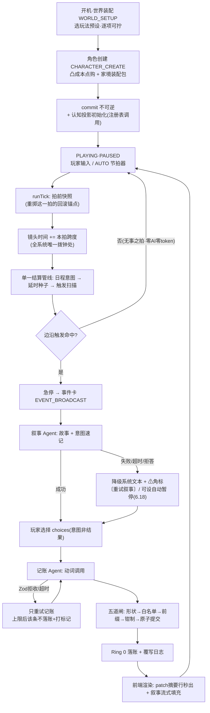

# 「AI 文游人生模拟器」V4.1 全架构蓝图：顶层设计 · 分模块详解 · 沙盒推演范例

<aside>
🧭

**本页性质**：V4.1 重构后的**全架构静态蓝图**（截至最新转正 6.37 · 印象条目化迁认知档案与涟漪引擎），逐条参照 `schema_new.js`（V3.1 实装）、[「AI 文游人生模拟器」V4重构整合清单：组织实体 / 地图 / 战斗与战争 / 秘密](https://app.notion.com/p/AI-V4-ce1c4870165e482790c29ca25c19b017?pvs=21)、[「AI 文游人生模拟器」V4.1 修订决议](https://app.notion.com/p/AI-V4-1-a9d51518f9f747a29d9880bcf1d902df?pvs=21) 与 [旧变量系统全量细查报告（V4.1 对照）](https://app.notion.com/p/V4-1-0870136aadec4002bb6d0d8509babb03?pvs=21) 综合而成。

**结构**：第一部分 = 顶层架构与全局数据流；第二部分 = 17 个模块逐一详解（框架 → 机制 → 变量 → 范例 → 联动）；第三部分 = 最通用的完整游玩沙盒推演范例；第四部分 = 重构后**全量变量结构总表**（V3.1 → V4.1 逐键对照·含简要提示）。

每个复杂概念都附「通俗解释」。后续转正轮次若修改决议，本页需同步更新。

</aside>

# 第一部分 · 顶层架构

## 1.0 一句话总纲

> **一个确定性数值引擎驱动的人生/世界沙盒：引擎管账，LLM 讲故事，玩法预设定题材。**
> 

通俗解释：把它想成「P 社游戏的数值底盘 + AI 小说家的嘴」。底盘（时间、经济、战争、关系、秘密）全部由不调用 AI 的纯代码推演，保证数值永远自洽、永远不卡死；AI 只负责把底盘算出来的事实讲成好看的故事。题材（古代宫斗 / 现代都市 / 修真 / 科幻）不靠改代码，靠换一套「世界玩法预设」参数。

## 1.1 设计第一性原理（为什么永远跑得通）

1. **单写者铁律**：全游戏只有引擎（Ring 0）一支笔能改存档。AI、前端、玩家的一切操作都只是「提案」，最终由引擎校验后落账。通俗：公司里只有财务部能动账本，其他人只能提交报销单。
2. **LLM 非阻塞**：任何 AI 调用失败/超时/拒答，最多让画面少一段文字，绝不让流程卡住——因为推进时间和改状态的权力根本不在 AI 手里。极端测试：让所有 AI 调用全部失败，游戏仍能从出生玩到死亡。
3. **能派生的不存储**：年龄、季节、家境等级、关系图、势力值……凡是能从别的变量算出来的，一律现算不存。通俗：不在两个本子上抄同一笔账——抄两遍迟早对不上（双写漂移）。
4. **能开放串的不枚举**：技能类别、资产类别、部队姿态、约定形式等用自由字符串，不用写死的选项列表——修真功法、星际公约这类新题材才装得进来。
5. **真相与认知分层**：引擎里存「真实世界」，玩家和 NPC 各自只看到「自己以为的世界」（认知档案 + 秘密知情过滤）。误判、中计、被蒙在鼓里由此涌现。
6. **接口冻结、字段演化**：P0 冻结的是接口契约（时间整型、单写者、动词表形状、前缀权限、状态机拓扑），不是字段全集；字段靠 `migration_version` + 派生化随时演化。

## 1.2 三环模型（谁干什么）

| 环 | 职责 | 调 LLM？ | 改状态？ | 通俗比喻 |
| --- | --- | --- | --- | --- |
| **Ring 0 引擎** | 时间泵 `tick()`、结算管线、触发扫描、检定、Patch 落账 | 否 | **是（唯一写者）** | 财务部 + 裁判 |
| **Ring 1 交互状态机** | 玩家面对的模态：事件卡、日程、RP、战斗、设置 | 否（只发起调用） | 否 | 前台接待 |
| **Ring 2 LLM 服务** | 叙事 Agent、记账 Agent、注册表专项调用，全部无状态 | 是 | 否（产出提案交 Ring 0） | 外包文案与速记员 |

## 1.3 数据分层（变量住在哪）

| 层 | 谁可见 / 谁可写 | 住什么 | 通俗比喻 |
| --- | --- | --- | --- |
| 无前缀层 | AI 可见；经五道闸可提案写 | 世界、角色、NPC、组织、地图、账户……一切「桌面上的事实」 | 明牌 |
| `_` 层 | AI 只读；引擎/前端/玩家可写 | `_tick`、`_本拍跨度`、`_粒度模板`、`_叙事设置{叙事风格, 人称, 写实度, 事件倾向{流派:权重}}`、`_触发扫描器` | 桌面上的规则牌 |
| `$` 层 | AI 永不可见；引擎专用 | `$运气`、`$谜底`、忠诚`$真实值`、`$隐藏记忆库`、`$战斗暂存`、`$流速`、`$玩家偏好`、`$预算控制台` | 扣着的底牌 |
| `$meta` 层 | 跨周目存档层 | 周目谱系（存档树）、峰值记录、继承包 | 赌场会员档案 |
| 世界玩法预设 | 配置层，不进存档 | 历法、种族模板、粒度、难度系数组、母题配额、战术包、制式库…… | 不同赌场的桌规 |
| 前端缓存 | 纯渲染，不进 stat_data | `$pos` 坐标、地形栅格、贴图、LOD | 桌子的装修 |

## 1.4 一拍的生命周期（核心数据流）



**先说清楚什么是「一拍」**：拍（tick）是世界推进的最小步子——即时档一拍 = 一回合，日常档 = 一天，发展档 = 一月，世代档 = 一年。**每一拍的作用 = 让世界整体「老」一格**：所有挂在时间上的量（利息、发育、情绪消退、秘密暴露度、NPC 幕后进度、伏笔倒计时、各类衰减）在这一格里各自按「速率 × 本拍跨度」结一次账。通俗：拍是世界这台钟的「咔哒」声——咔哒一响，所有账本同时翻一页；没有咔哒，世界纹丝不动。

**循环之前的开机段（S0→S2，整局只走一次）**：世界装配（选玩法预设，逐项可拧）→ 角色创建（凸成本点购 + 家境装配包）→ commit（不可逆）→ 引擎自动跑「认知投影初始化」生成「你以为的自己」面板 → 落入 PLAYING 的 PAUSED 子态，等第一声咔哒。这两个开机态在 PLAYING 枢纽之外，此时无游戏时间、无拍；commit 后一次性进入，永不返回。此后整局都在下面的循环里转，直到清栈终态（继承换代 / 人生总结）。

逐步通俗解说（对应上图每个框）：

1. **谁来踩油门（A）**：暂停时世界完全静止。玩家点「下一拍」、或开 AUTO 自动连拍（×1/×2/×3 只是现实里播放快慢，纯前端流速，不改任何数值），引擎才收到一声「咔哒」指令。
2. **拍前快照（B）**：动手前先给整个存档拍一张字节级备份。作用：这一拍内发生的一切都能整拍回滚（「重掷这一拍」就是回到这里重跑）。注意这是技术快照，玩家看的「人生快照」是另一回事（模块 16）。
3. **拨钟（C）**：镜头时间 += 本拍跨度。这是全系统唯一动时间的一行代码——AI、前端、玩家都没有拨钟的权力（墙钟三铁律）。
4. **结三类账，固定顺序（D）**：
    1. **玩家排的日程意图**：刷题/打工/拜访逐条过检定，结算收益与消耗；
    2. **到期种子**：三个月前埋的「开业口碑」「扩张收益」今天成熟，开箱结算；
    3. **触发扫描**：所有阈值穿线（民心跌破了吗）、绝对日期到期、概率掷骰（按跨度折算，防快进狂掉）、离散状态翻转，机械扫一遍。
    
    为什么固定顺序 + 串行：后一项读得到前一项的结果，杜绝「反水和战果同拍互踩」的竞态。
    
5. **岔路口（E）**：这一拍什么都没命中 → 直接回到第 1 步继续咔哒。**这就是快进便宜的原因：无事之拍 = 纯数学，零 AI 调用、零等待、零 token。**
6. **有事才叫 AI（F→G）**：命中触发 → 急停、弹事件卡 → 叙事 Agent 把引擎给的「事实包」写成故事和选项。AI 失败/超时/拒答？事件卡降级成系统文本照样弹出，数值结算一分不少（LLM 非阻塞）。
7. **玩家表态（H）**：选项是「意图」不是「结果」——选「贿赂考官」只代表想贿赂，成不成要过检定。
8. **翻译与落账（I→J→K）**：记账 Agent 把这段剧情翻译成结构化动词（修改/创建/追加/埋种子）→ 五道闸逐条验（形状 → 白名单 → 前缀 → 钳制 → 原子）→ 引擎落账并写覆写日志。被拒的只丢那一条，绝不污染存档。
9. **画面（L）**：前端先秒出记账摘要行（「账户 −2000 · 埋种子 ×1」），叙事文字再异步流式补上——体感零等待。然后回到第 1 步，等下一声咔哒。

**重 roll 两档挂在图上哪里**：「换个讲法」挂 G/G2 之后——数值已落账，只重调叙事，免费、不回滚、游戏时间零移动；「重掷这一拍」回滚到 B 的拍前快照重跑整拍——拍计数不前进，种子成熟日锚游戏绝对时间，所以预期召回时间不变；天命种子锚定拍号（重掷换叙事不换命运，命运重掷走限量券）。

**LLM 失败的前端兑现（6.18）**：任何 AI 失败/超时/拒答 → 事件卡照常弹出（系统文本兑底，数值一分不少），带 ⚠ 角标 + 〔重试叙事〕按钮；AUTO 快进可勾「失败卡自动暂停」（`$流速.自动暂停触发[]` 枚举项，落拍边界）。

## 1.5 模块总表

| # | 模块 | 一句话职责 | 核心真相源变量 |
| --- | --- | --- | --- |
| 1 | 时间系统 | 唯一整型时间轴 + 粒度变焦 + 双时钟 + 历法皮肤 | `世界.纪元分钟`、`_本拍跨度`、粒度栈 |
| 2 | 状态机与运行管线 | Hub-and-Spoke 交互拓扑 + 触发扫描器 + 单一结算管线 | 状态机对象、模态栈、`_触发扫描器` |
| 3 | Agent 拓扑 | 叙事/记账双常驻 + 调用注册表 + 三层动词表 + 五道闸 | 动词表、调用类型注册表、`全局.覆写日志` |
| 4 | 焦点角色与角色组件 | 主角 = 组件齐全的 NPC 特例 + 镜头焦点指针 | `镜头焦点角色`、属性、性格五轴、特质、情绪栈 |
| 5 | NPC 与 LOD | 三档细节分级 + 作息纯函数 + 幕后演化 | `NPC{}`、作息模板、履历、登场契约 |
| 6 | 认知档案 | 「你以为的世界」：迷雾、误差、自我认知、谄媚度 | `认知档案[观察者][目标]` |
| 7 | 秘密与忠诚 | 顶层秘密池 + 暴露引擎 + 谜底隔离 + 忠诚双层 | `全局.秘密库`、`$谜底`、忠诚`$真实值` |
| 8 | 组织实体 | 万物皆组织：公司/政权/宗门同一套壳，可递归嵌套 | `组织实体{}`、派系登记、进展树、`全局.约定库` |
| 9 | 地图与空间 | 语义节点树归 AI、坐标归前端、渲染三镜头 | `地图.地点{}`（节点树）、空间ID、seed |
| 10 | 战斗与战争 | 三尺度五档抽象结算 + 可替换战斗接口 + 战线压力榜 | `战争状态{}`、压力榜、`$战斗暂存`、部队姿态 |
| 11 | 经济金融 | 单一账户 + 开放资产对象 + 市场派生定价 | `货币系统.账户`、资产[]、市场状态 |
| 12 | 记忆系统 | 工作记忆 / 长期蒸馏 / 隐藏伏笔种子 / 触景生情 | 工作记忆、长期归档、`$隐藏记忆库` |
| 13 | 事件系统 | choices 契约 + 事件包 + 母题配额 + 来源权重 | 事件包 manifest、`系统.事件来源权重`、母题滚动窗口 |
| 14 | 继承·死亡·周目 | 复活闸 → 任意 NPC 接管 → 周目谱系树 | 继承候选、继承包、`$meta.周目谱系` |
| 15 | 世界玩法预设与 mod | 题材 = 参数组合；mod = 数据不是代码 | 玩法预设容器、mod manifest |
| 16 | 玩家辅助与元层 | 内心层调用族、人生快照、作弊三档、覆写通道、预算控制台 | META_OVERLAY、`全局.作弊标记`、`$预算控制台` |
| 17 | 前端渲染层 | 单一游戏界面 + 延迟掩盖 + 地图三镜头 | `$pos`、时间线、渲染器注册表 |

## 1.6 模块间相互作用（大图）

- **时间 → 一切**：所有衰减、到期、利息、发育、暴露度增长都乘 `_本拍跨度`。时间是全系统的公共分母。
- **事件 ↔ 记忆**：事件结算的延时后果以「种子」存进隐藏记忆库；种子到期又变回事件。这是「伏笔 → 回收」的闭环。
- **秘密 ↔ 认知**：秘密库管「事件型隐瞒」的生命周期，认知档案管「状态型误解」；统一读取接口 `知道吗(观察者, 信息)` 内部分发两库；declassify（揭穿）时秘密回写认知。
- **性格 → 认知/谄媚/演化**（6.16）：五轴数值喂三个公式——人生事件改性格、观察者投影带偏差、NPC 顶嘴还是奉承由公式决定。
- **组织 ↔ 经济 ↔ 地图**：组织的网点开在地图节点上，营收按区域物价结算回账户；战争翻转地图控制方又改组织控制区。
- **战争 ↔ 组织 ↔ 秘密**：armyPower 由组织军事字段算出；政变阴谋（秘密）declassify 后直接砸组织治理数值，可能点燃战争状态。
- **玩法预设 → 各模块参数**：历法喂时间、种族模板喂寿命发育、难度系数喂检定、母题配额喂事件、战术包喂战斗、制式库喂学业职业。
- **NPC LOD ↔ 预算**：不在场 = 零 token；离场只跑统计学演化；这是 token 成本可控的根基。

## 1.7 主要能实现的游戏 / 推演功能

- **人生模拟**：出生 → 学业 → 职业 → 婚恋 → 子嗣 → 衰老 → 死亡 → 继承换代，全程数值自洽。
- **经营推演**：开店/办厂/集团化（组织嵌套），营收 = f(规模, 区域物价, 行业景气)，市场风波、泡沫、破产链。
- **政治权谋**：派系、政变（秘密 + 进展树）、政体和平演变 / 暴力变更、权力递归（庙小神大）。
- **战争推演**：多方混战、移动战线（压力榜）、反水跳反、部队姿态与战术 mod、补给与士气。
- **谍战 / 宫斗**：双向秘密牵制（恐怖平衡）、内鬼伪装、线索收敛、知情圈分层、猜忌阻尼。
- **情感叙事**：关系边、情绪栈、触景生情闪回、彩蛋记忆浮现、认知误差带来的误会戏。
- **跨题材**：同一引擎跑现代 / 古代 / 修真 / 科幻 / 末世，靠玩法预设不靠改代码。
- **多周目**：存档树 fork、带记忆回溯、穿越进 NPC（继承皮肤）。
- **多人与 AI 同席（6.11/6.22，P2+）**：异步回合制——服务器端引擎单写者，全员（人类或 AI 席位）提交意图后统一结算一拍；AI 同席 = 给席位绑「NPC 扮演调用」，喂其认知投影与目标，产出意图照常过检定五道闸，与人类玩家权力完全对等。
- **玩家可制作玩法预设（6.23，P2+）**：「玩法预设」即原「皮肤包」正式更名——它打包的是母题词汇表、实体模板、数值参数、事件包、战术包等整套玩法内容，更名以免误解为前端美化功能。玩家可把世界装配向导里调好的参数组合「另存为预设」打包分享；P0 只冻结包格式，制作器与社区分享后置。
- **导出即 mod（6.24，钩子）**：一键导出整树存档即天然 mod；分模块导出（只导 NPC 库 / 组织实体 / 事件包等）= 顶层键切片 + 套 mod manifest，与导入管线完全对称；导出默认剥离 `$` 层防泄底；P0 仅预埋 manifest 字段。多人封存礼包（6.24 追加）：房主封存/解散房间时可一键把档导出分发给全体玩家（人手一份，各自可单机续玩），并给每个席位角色（含 AI 席位）自动发一张人生快照谢幕卡（复用 6.17 调用，落拍边界执行）。
- **规则补丁（6.28）**：玩家 mod 侧的第五种包形态——纯数据的机制约束覆盖（「绝对禁止伴侣出轨」「属下永不谋反」「年龄无限」），引擎闸口机械执行、AI 提案同样被拒；开局装 = 桌规，中途装走便利层。详见模块 15。

## 1.8 前端渲染出的游戏效果

- **单一游戏主界面**（非聊天楼层）：时间控制台（暂停/×1/×2/快进 + 粒度档）+ 状态栏 + 地图常驻；事件以卡片流弹出。
- **延迟掩盖**：提交 → 时间推进动画立刻播 → 引擎瞬时结算 → 事件卡标题 + 记账摘要行（如「账户 −50万 · 埋种子×1」）先出 → 叙事文字异步流式填充。体感零等待。
- **地图**：疆域 Voronoi 着色、战线推进箭头、网点营收热力、阴谋热点标记、点击下钻态势卡。
- **RP 对话模态**：变焦进对话子界面，退出折叠为时间线节点。
- **人生轨迹时间线**：与分享快照页一物两用，L2 蒸馏摘要控制体积。
- **认知面板**：「你以为的自己」「你以为的他」——照镜子不照真值。
- **母题分布图**：本周目题材占比可视，玩家可用偏好反压。

## 1.9 玩法预设 × 游戏类型矩阵（题材 = 参数空间的一个点）

| 参数 | 现代都市生活 | 古代宫斗 | 策略战争 | 修真奇幻 | 科幻星际 |
| --- | --- | --- | --- | --- | --- |
| 历法皮肤 | 公历恒等 | 年号表（康熙三十年） | 公历/自定义 | 第三纪元·灵月 | 星历 47631.2 |
| 默认粒度 | 日常（天） | 日常（天） | 发展/世代（月/年） | 世代（年，闭关百年） | 发展（月） |
| 行动点上限 | 紧额（日程是核心资源） | 紧额 | ∞（日程容量无限） | 中 | 中 |
| 母题配额 | 日常高、战争低 | 阴谋高、恋爱中 | 战争高、日常低 | 奇遇高 | 探索高 |
| 事件来源权重（包:AI） | 40:60 | 60:40 | 80:20（正史铁轨） | 50:50 | 50:50 |
| 媒体渠道表 | 社交媒体/新闻 | 朝堂奏报/市井流言 | 战报/外交照会 | 仙门传讯 | 星际广播 |
| 种族模板 | 人类 | 人类 | 人类 | 人/妖/仙（长寿种） | 人类/机械/外星 |
| 学业制式/职级体系 | 义务教育+公司职级 | 科举+官品 | 军衔 | 境界阶梯 | 学院+舰队衔 |
| 战术包 | 无 | 宫变战术 | 经典战术包（维基编入） | 法阵战术 | 舰队战术 |

通俗解释：**不存在「游戏类型」这个枚举**——任何预设都只是上表参数的一种出厂组合，全部逐项可改、可导出 manifest 分享、可用自然语言让 AI 生成（AI 只产数据不产规则，过 Zod 校验才能导入）。

## 1.10 游戏大流程沙盒推进范例（鸟瞰版 · 策略向）

> 场景：明末走私商人（详细的通用生活向范例见第三部分）。
> 
1. **世界装配**：选「明末」玩法预设（年号历法 + 紧额行动点 + 阴谋配额高）→ 角色创建：属性凸成本点购，财富走家境装配包 → commit，引擎自动跑「认知投影初始化」生成「你以为的自己」面板。
2. **AUTO 快进**（发展档·月拍）：引擎逐拍跑经济月结、阴谋暴露度、NPC 幕后演化，全程零 AI 调用。第 3 拍「合伙人信誉」**穿越阈值**（边沿触发）→ 急停弹事件卡「合伙人提议扩张」。
3. **变焦深谈**：玩家点「进入对话」→ RP_FOCUS（1小时档），**世界时钟冻结**，逐句谈判每轮过检定。谈崩拔刀 → 战斗（五档判「惨胜」，AI 拒写也只降级为系统文本，HP 照扣）。
4. **退出变焦**：引擎按流逝的半天对世界**一次性补结** → 回事件卡选「接受扩张」→ 记账：`修改(账户, −50万)` + `埋种子(扩张收益, +6游戏月, 中)`。
5. **半年后**种子成熟，与「瘟疫」触发同拍 → 进单一结算管线按固定序串行结算。瘟疫致死 → 复活闸不过 → 清栈进继承模式 → 选长子接管 → 新周目继续。

---

# 第二部分 · 分模块详解

<aside>
📐

每模块五段式：**大框架 → 核心运行机制 → 变量架构 → 应用范例（附变量同步变化）→ 跨模块联动**。变量架构以 V3.1 实装为底、按细查报告处置改写后的目标形态呈现。

</aside>

## 模块 1 · 时间系统

**大框架**：时间拆成四个互不混淆的概念——①**纪元分钟**（唯一整型真相，全部数学在它上面跑）②**粒度**（一拍代表多少游戏时间：即时/日常/发展/世代四模板 × 任意跨度）③**流速**（现实里播多快，纯前端，绝不碰数值）④**历法皮肤**（怎么显示：公历/年号/星历）。

通俗解释：纪元分钟是**手表机芯**，粒度是**你看表的频率**，流速是**录像的倍速播放**，历法是**表盘的刻字**。机芯只有一个，其他全是外观。

**核心运行机制**：

- 双时钟（防卡死关键）：`RP_FOCUS` 显微镜档期间**世界时钟冻结**，只有镜头时钟走；退出时引擎按 elapsed 一次性惰性补结（配衰减累积器，结果与逐拍推进完全一致）。
- 衰减/到期全部锚游戏绝对时间：每个可衰减量挂「速率/游戏月」，结算 = 速率 × `_本拍跨度`。快进一年（1 拍）与逐日过一年（365 拍）数值**完全一致**。
- 墙钟三铁律：游戏时间只由拍计数推进；AI 唤醒按游戏时间配额；`Date.now()` 禁止出现在 Ring 0（CI 静态检查）。

**变量架构**：

```jsx
世界: {
  纪元分钟: 整数,              // ★唯一真相，年月日时全派生
  历法: { 纪年法, 纪元锚点, 年号表[], 月制, 显示模板 },   // 玩法预设注入
  当前日期(显示串): 派生渲染,   季节: 派生 f(月, 气候带),
  当前粒度(模板键), 粒度栈[],   周期数: 只读统计,
  _本拍跨度: 只读,             _粒度模板: { 即时/日常/发展/世代 }
}
$流速: { 模式[自动/回合制], 速度档, 自动暂停触发[] }   // 前端层
```

**应用范例**（变量同步变化）：

> 修真皮肤下玩家「闭关三年」（世代档 1 拍）：
> 

```jsx
纪元分钟 += 3年                    // 一拍走完
主角.技能[吐纳].熟练 += 速率×36月    // 衰减累积器一次套用
情绪栈: 过期条目全部清退            // 到期=绝对时间比较
NPC[师妹].履历[] += "下山历练归来"   // 幕后演化照常跑
```

**联动**：一切模块的分母；粒度模板带行动点上限/精力激活/HP 模型三资源换义（回合=血条、日常=体力、世代=寿元）。

## 模块 2 · 状态机与运行管线

**大框架**：交互层是 **Hub-and-Spoke（轮毂辐条）拓扑**——`PLAYING` 是唯一枢纽，事件卡/日程/RP/战斗/继承全是辐条，每条辐条都有无条件回家的边。开机段 `WORLD_SETUP → CHARACTER_CREATE` 在枢纽之外（无游戏时间、无拍），commit 后一次性进入 `PLAYING`，永不返回。运行层是**一条时间流 + 触发扫描器 + 单一结算管线**，没有预生成事件队列。

通俗解释：像地铁环线只有一个换乘大站，去任何支线都得回大站再走，所以**永远不存在把玩家困死的回路**。「预生成队列」被删是因为它等于先把明天的报纸印好——玩家今天的行为一变，明天的报纸全成废纸（因果塌陷）。

**核心运行机制**：

- 触发扫描器（每拍跑，纯机械）扫四类：阈值穿线（边沿触发 + 冷却去抖）、绝对日期到期、概率掷骰（`1−(1−月几率)^跨度月` 防快进狂掉）、离散状态翻转。
- 单一结算管线固定序：日程意图 → 延时种子 → 触发，串行、后项读前项结果（防三源竞态）。
- 叠加结算：事件拆「即时分量 + 延时分量」，每分量独立已结算标记——一笔可拆多次结，每分量只结一次。
- 栈纪律：模态栈深 ≤ 4；META_OVERLAY 不入栈；死亡/总结是清栈转移（统一清 `$战斗暂存`、粒度栈）。
- 六不变量在引擎启动与每次转移时断言，CI 用「全 LLM 调用必失败」故障注入证明可通关。

**变量架构**：

```jsx
StateMachine: { 当前态(WORLD_SETUP→CHARACTER_CREATE→PLAYING→清栈终态), 模态栈[](≤4), timeMode[PAUSED/TURN/AUTO], 双时钟 }
_触发扫描器(纯函数): 阈值/到期/概率/状态 → 命中急停
延时种子: { 载荷, 成熟日(绝对), 重要等级, 已结算标记 }
系统: { tick_log(轮转封顶), migration_version, 功能开关表 }
```

**应用范例**：

> 嵌套栈完整走一遭：AUTO 快进 → 事件卡(push) → 进对话 RP(push) → 遭遇战(push, 栈深4) → 战死 → **flush 清栈** → 继承模式。全程无残留临时态。
> 

```jsx
模态栈: [PLAYING] → [P,EVENT] → [P,EVENT,RP] → [P,EVENT,RP,COMBAT] → flush → [PLAYING(新主角)]
$战斗暂存: {...} → 清空     粒度栈: [发展,即时] → [发展]
```

**联动**：自动暂停触发列表由玩家在 `$流速` 勾选（遇敌/没钱/秘密暴露/抵达/HP 阈值）；看门狗超时 → 降级系统文本强制 pop。

## 模块 3 · Agent 拓扑与记账五道闸

**大框架**：常驻 AI 角色只有两个——**叙事 Agent**（讲故事，零变量规则）和**记账 Agent**（翻译成动词，每次全新上下文）。其余能力（谜底校准/播报批量/玩法预设生成/认知投影初始化）都是**调用类型注册表**的条目：新增能力 = 注册表加一行，永不加 agent。

通俗解释：不养一屋子员工，养两个正式工 + 一摞外包工单模板。NPC 各配一个 AI、多 AI 互聊都明确不做——那是 token 黑洞 + 幻觉互相放大。

**核心运行机制**：

- 三层动词表：通用动词 ×4（创建实体/修改/追加/埋种子，约 80% 流量）+ 语义动词 ×约15（战果档、线索浮现、declassify、阵营变更、切换作息模式…）+ 兜底动词 ×1（自由写入，高频模式遥测自动提名晋升新动词）。
- 记账五道闸（每条动词依次过）：① Zod 形状校验 → ② 路径白名单（从实体 schema 自动派生）→ ③ 前缀权限（`$` 层管制）→ ④ 数值钳制（按重要等级设单次 Δ 上限）→ ⑤ 原子提交 + 覆写日志。任一道拒绝只丢该条；只重试记账不重生成叙事。
- 召回路由：感性记忆（关联/触景生情/彩蛋）全部流向叙事侧；变量切片（在场 NPC + 地点 + 战争 + 秘密，经知情过滤）流向记账侧；谜底校准走第三路隔离调用。
- 模型容错：拒答检测 → 供应商回退链；叙事被拒 ≠ 卡死（记账独立结算，降级系统文本播报）。

**变量架构**：

```jsx
调用类型注册表: { [类型]: { 模型档位, 温度, 上下文组装器, 输出schema, 超时重试策略 } }
$模型画像: { [provider]: { 风格补正提示词, 采样参数 } }   // 玩家/社区填，引擎只拼接
全局.覆写日志[]: { 时间, 授权源, 级别, 目标, 理由, 是否作弊 }
```

**应用范例**：

> 叙事「你重金贿赂了考官」→ 意图速记「贿赂考官 −2000两，留下把柄」→ 记账 Agent 产出：
> 

```jsx
修改(账户.持有, −2000, "贿赂")          // 过五道闸 ✅
创建实体(秘密, {类型:罪行, 涉事方:[主角,考官]})  // ✅ 自动开知情圈
修改(主角.智慧, +30, "开窍")            // ❌ 第④闸钳制到+5，patch摘要标注
```

**联动**：五道闸的白名单与 mod 导入校验、继承生成共用同一派生源（ATTR_WHITELIST 退役）；母题遥测挂在动词流量上。

## 模块 4 · 焦点角色与角色组件

**大框架**：「主角」不再是特权容器——**主角 = 组件齐全的 NPC 特例 + `镜头焦点角色` 指针**。换角/穿越/多人，只是把镜头指针指向另一个人。角色由可插拔组件构成：属性、性格五轴、特质、情绪栈、状态标签、技能、物品、信念、学业、职业、体征、目标、居留身份、头衔。

通俗解释：摄制组不围着某个演员造摄影棚，而是摄影机对谁谁就是主角。

**核心运行机制**：

- **属性五轴（6.26 冻结）**：体质（身）/ 智慧（思）/ 感知（察）/ 魅力（言）/ 心理（志）——能力慢变量，进检定公式（属性/2）。**检定配方表**（主属性 + 副属性×权重，数据进玩法预设）在消费点做多轴联动，轴间禁止直接互喂；智慧钳制单次 Δ=0（特殊语义动词通道由预设开），体质允许年龄曲线衰减；幸运不设轴（`$运气` 暗层已有）；轴表预设化，战斗向预设可扩力量/敏捷。感知=雷达（看见），心理=装甲（扛住），与神经质（怎么反应）三者互不重叠。
- **性格五轴（6.16 冻结）**：唯一真相源 = OCEAN 五条 0–100 数轴。三个下游公式：性格演化（事件给轴打增量，引擎机械）、认知投影（投影 = 真值 + 偏差项）、谄媚度公式（喂反谄媚机械闸）。MBTI 降为阈值映射的派生叙事标签；单向派生纪律：数值 → 标签可以，标签 → 数值禁止。
- 特质 = 结构化修饰通道 `{属性修正, 成长率/上限修正, 检定修正, 事件钩子}`，引擎可执行（自由字符串「社交−15」改为结构化条目）。
- 情绪 = 栈：多条情绪带剩余时效共存叠加，「情绪基调」只是栈顶的派生显示。
- 状态标签半结构化 `{效果: 修饰通道引用}`：被俘/中毒/醉酒都是标签实例，约束 = 标签的一种。
- 声誉归并 `声誉{人望, 知名度, 极性, 标签}`；财富踢出属性走账户；年龄/人生阶段/家境全派生。

**变量架构**：

```jsx
NPC[焦点角色]: {
  属性{体质,智慧,感知,魅力,心理}(轴表预设化·6.26), 派生{HP,精力,颜值}(检定配方表),
  性格五轴{开放,尽责,外向,宜人,神经质}(0-100),   // ★6.16 唯一真相源
  性格标签: 派生显示,  特质{}, 情绪栈[], 状态标签{}, 技能{}(类别开放串),
  物品{}(可携意象[]·6.29统一制式), 衣物, 信念{}, 学业(制式库已迁玩法预设), 职业.任职[], 体征,
  目标{长期,短期[]}, 居留身份[](国籍=政权组织键), 头衔[], 声誉{}
}
镜头焦点角色: NPC键指针        主角位置/轨迹 → 挂焦点角色
```

**应用范例**（战争创伤，变量同步变化）：

```jsx
性格五轴.神经质: 55 → 60 (+5)      // 事件结算增量，AI只产意图
性格五轴.开放性: 70 → 68
情绪栈.push({恐惧, 强度高, 时效+3月})
状态标签 += { 战争创伤: {检定修正: 社交−10, 事件钩子: 夜惊} }
性格标签(派生): "开朗" → "沉郁警觉"   // 越阈值自然翻转，无人手写
```

**联动**：五轴喂模块 6 谄媚度与投影；情绪栈喂触景生情召回；状态标签接战斗/秘密（被俘=标签）；体征发育读种族模板（玩法预设）。

## 模块 5 · NPC 与 LOD 分级

**大框架**：NPC 按镜头距离分三档细节度（LOD）：**L0 在场**（进叙事上下文）、**L1 重要离场**（纯引擎统计演化，零 token）、**L2 其余**（冻结，入镜惰性实例化）。镜头外永不做个体级模拟。

通俗解释：电影只给镜头里的人打光；远处群演是纸板，但纸板上记着他的简历，镜头扫过去时立刻能演。

**核心运行机制**：

- 作息 = 按需采样的纯函数 `f(模板, 当前纪元分钟, 种子) → 此刻在干嘛`，不随拍推进、与粒度零耦合、同一时刻查询结果恒一致。采样结果作为硬事实喂叙事（「将领熟睡，哨兵×2」），检定同步吃修正（熟睡 → 暗杀 DC 大降）；作息可被侦察检定写进已知情报。
- 幕后演化：`f(目标, 权力, 关系边, 种子) → 进度`，跨阈值才产幕后种子；同拍成熟批量打包一次调用产短播报；播报卡带「介入」按钮可升格为正式事件。
- 履历[]：滚动 N 条短句，引擎在幕后结算时追加；入场切片带上 → 离场经历反映在言行。
- 登场契约：日期/条件/地点，入场前零 token。
- **创建实体统一纪律（6.33）**：提及即占位（轻量占位条目 `{名称, 实体类型, 硬约束, 来源拍号, 模板引用?}`，零 token）→ 登场契约 → 入镜实例化，三段式对 NPC/组织/地点通用；物品/秘密/事件豁免；幽灵节点（6.30）= 血缘侧特例。

**变量架构**：

```jsx
NPC{}: { 重要等级(路人/次要/重要/核心), 召回权重, 种族(开放串),
  性格五轴(惰性实例化), 关系[]{对象键,类型开放串,强度,极性},
  目标{长期, 短期[]}(开放串·与主角同构; 叙事惯称「野心」·6.20), 作息{模式键:{时段:{状态:概率}}}, 当前作息模式,
  履历[](滚动), 登场契约, 能力档(惰性), 所属组织[], 忠诚{}, 秘密索引(派生), 意象[](6.29统一制式·公共印象) }
全局.家族树: 全体NPC共用双亲边DAG(+领养/过继边) · 名义边明面 · 生物真值=秘密库「身世」条目 (6.27)
已故NPC归档: L2冻结层
```

**应用范例**（离场密谋者）：

> 玩家在外地经商 6 个月（AUTO 快进），政敌李大人 L1 演化：
> 

```jsx
NPC[李].幕后进度(结党): 40 → 75    // 纯引擎，零token
跨阈值70 → 产幕后种子{李结成同盟, 成熟+1月, 重要:高}
种子成熟 → 批量播报卡: "听闻李大人近来宾客盈门" [介入]
NPC[李].履历[] += "与吏部侍郎结盟"
```

**联动**：作息喂战斗偷袭检定；履历喂叙事切片；幕后种子复用模块 12 延时种子结构；五轴惰性实例化接模块 4。

## 模块 6 · 认知档案系统

**大框架**：`认知档案[观察者][目标] = {了解度, 误差表{字段:认知值}, 时效}` 稀疏双向——每个人（包括主角自己）看到的世界都是「真值 + 自己的误差」。UI 与叙事只展示**主角的认知投影**，决策 AI 读**各自的投影**。

通俗解释：游戏里没有上帝视角的玩家面板，只有一面**哈哈镜**；镜子多正取决于你跟对方多熟、情报投入多少、对方伪装多深。

**核心运行机制**：

- 统一读取面：`知道吗(观察者, 信息)` 单接口内部分发秘密库（事件型隐瞒）与认知档案（状态型误解），切片过滤、UI 渲染、播报触达、检定修正全走它。
- 自我认知（三条件版）：`认知档案[主角][主角]` 同一结构——自恋者误差表 `{自身能力: 夸大}`；误差来源 = 性格轴 + 环境谄媚度 + 媒体回音室；开局由「认知投影初始化」调用按出身性格生成（不随机），渲染「你以为的自己」面板。
- 环境谄媚度 = f(周围关系边按权力差×依附度加权, 信息渠道回音室程度)——帝王朝堂与「爹妈夸朋友捧」同一公式不同数值；破产后谄媚源消失 → 自我认知被现实修正，本身就是剧情。
- 认知迷雾总开关进 `系统.功能开关表`：关 = 上帝视角游玩（便利层免标记）；谜底隔离不随开关旁路（防剧透底线）。
- 决策输入认知化：NPC/组织的反制决策读自己的投影而非真值——误判、中计、将错就错由此涌现。
- **印象条目与涟漪引擎（6.37）**：`认知档案[观察者][目标].印象[]{标签, 极性, 强度, 来源, 获知时间, 衰减速率}`——原 `NPC.印象标签[]` 废除「隐含对主角」的扁平语义迁入此处，条目制式对齐 6.29 意象。涟漪 = 纯机械管线（零 token）：事件结算产印象事件 → 一手在场目击写满强度；二手沿 `NPC.关系[]` 边逐跳传播（强度×关系系数×每跳衰减，低于阈值停传，一般两跳即止）；广域走媒体渠道表落区域级印象（带渠道偏色 = 假新闻通道）。`$涟漪候选` 为暂存缓冲。covert 行动不产印象事件，秘密暴露后才补发涟漪（事发多年名声才臭）。`声誉{}` = 全体印象的聚合派生（公共层），印象条目 = 个体观察者层——张三恨你、全城敬你两层各自成立。

**应用范例**（独裁者误判，变量同步变化）：

```jsx
组织[王朝].治理.民心(真值): 32         // 引擎真相
认知档案[皇帝][王朝].误差表{民心: +45} // 谄媚朝堂喂出来的
→ 皇帝决策读 32+45=77 → 加税          // 决策输入认知化
→ 民心真值 32→24 → 起义触发器边沿命中
→ 起义爆发后 误差表{民心} 被现实修正 +45→+10  // "如梦初醒"
```

**联动**：谄媚度公式吃模块 4 五轴；假新闻（模块 17 渠道）= 往认知档案写错误条目；战术欺骗（模块 10 认知差族）全靠它；穿越换角的「玩家知道但新主角不知道」信息分割靠它。

## 模块 7 · 秘密系统与忠诚双层

**大框架**：秘密升**顶层池** `全局.秘密库`，实体侧只留派生索引。每条秘密 = 涉事方 + 进展 + 暴露度 + 已暴露线索 + 知情名单（受众选择器）+ `$谜底`（AI 平时物理不可见）。忠诚拆双层：`$真实值`（AI/玩家都看不见）+ 伪装度 → 面板只显示模糊化的「观感忠诚」。

通俗解释：秘密像**保险柜**——柜里的真相（谜底）连叙事 AI 都打不开，只有暴露度爬过阈值时，引擎才开柜让一个「即焚」专线调用照着真相写一条新线索，写完立刻锁柜。所以线索永远朝真相收敛，不会越编越偏。

**核心运行机制**：

- 暴露引擎：引擎确定性推涨暴露度（×本拍跨度）；跨阈值才点燃谜底校准调用（JSON 锁死、用完即焚）；多条秘密可打包一次调用。
- 线索知情 = 派生：知情程度 ≥ 线索暴露程度 → 自动掌握（不给每条线索存名单，防组合爆炸）。
- 猜忌阻尼：NPC 反应按知情分档 0 无知 / 1 隐约不安 / 2 怀疑 / 3 确信；单条线索最多推到档 2；升档需多线索或调查检定；怀疑随时间衰减。
- 双向牵制：互握对方秘密 → 引擎派生牵制态（单向压制 / 双向僵持 / 可同归于尽）；一方 declassify → 触发对方反制。
- declassify 按类型回写下游：暗杀 → 战斗结算、政变 → 治理、窃密 → 进展树、构陷 → 受制于。
- 防作弊三道墙：伪装层（数字是假的）、情报迷雾（越不熟越糊）、不上架（不知情连条目都看不见）。

**变量架构**：

```jsx
全局.秘密库{ [键]: { 母题(开放串), 涉事方[]{实体键,角色}, 进展, 严重度,
  暴露度(0-100), $谜底, 已暴露线索[]{线索,暴露程度,状态,关联地点键},
  知情名单[]{ 对象:受众选择器(实体/派系/关系/标签), 知情程度, 立场, 掩护基调 } } }
NPC.忠诚{ [对象]: { $真实值(派生·不可见), 伪装度 } }  // 观感=模糊化(真值,伪装,了解度,噪声)
受制于: 双向图派生
```

**应用范例**（配偶外遇，变量同步变化）：

```jsx
秘密库[外遇X]: 知情名单=[配偶,情人]  // 主角不在 → 面板连"忠诚"异常都不显示
每拍: 暴露度 += 严重度系数×本拍跨度   // 18→31→47...
跨阈值45 → 谜底校准(即焚) → 线索[]: +{陌生香水味, 暴露40}
主角知情程度0 → 未掌握; 起疑投入调查 → 知情程度0→50 → 掌握线索①
暴露度≥90 → declassify → 婚姻[].状态→破裂事件, 认知档案[主角][配偶]误差清零
```

**联动**：知情过滤接模块 3 切片（未知秘密代码级不进上下文）；covert 行动（玩家隐蔽行动）自动开秘密条目；泡沫 = 秘密的金融皮（模块 11）。

## 模块 8 · 组织实体

**大框架**：**万物皆组织**——公司、店铺、政权、军队、宗门、教派、黑客组织同一套壳；`父组织` 指针支持递归嵌套（集团>子公司>部门、国>省>县、宗门>分舵）。组织间显性承诺进 `全局.约定库`（与秘密库对称：秘密 = 隐性把柄，约定 = 显性承诺）。**个人项目容器（6.34）**：写书/科研/拍电影等个人项目 = 微型组织实体——进展树管研发、财务管投入回报、传播管影响力、用工管雇佣；成品 = 开放资产对象 + 可携意象条目（6.29）；轻重两档，轻档只挂一条进展树。**占位形态（6.33）**：任何被提及的组织先以占位条目登记，首次实际交互才完整实例化——这是 6.33 在 schema 上的唯一实改点。

**核心运行机制**：

- 五大子系统：财务（营收回主角账户明细）、治理（掌控度/合法性/民心/控制区）、军事（兵力/战力/装备/补给/兵种/主将/士气）、信念（官方体系/强制度/思潮派系）、进展树（制度/科技/信仰/文化/学派 DAG + 当前节点指针）。
- 政体 = 进展树「制度」领域当前节点 + 治理皮肤：和平演变 = 条件 + 斡旋检定平滑切节点；暴力变更 = 强跳节点 + 合法性骤降。
- 派系精简：`{诉求(开放串), 领袖, 成员(受众选择器), 势力(派生=f(成员财富+人数+军权)), 激进度(派生)}`。
- 权力递归：`实际影响力 = 叶节点局部权力值 × Π(路径上各节点势力份额)`——通俗：帮派二把手在帮里一呼百应（局部 90），但帮派在朝廷只占 10% 势力，所以他指挥不动国家机器（全局 9）。「庙小神大 / 庙大神小」张力由此保住。
- 网点[] 为主存储（地点侧 `据点设施` 只是派生镜像），传播 = `{区域: 渗透度}` 软影响力热力。

**变量架构**：

```jsx
组织实体{ [键]: { 父组织?, 类型, 状态, 用工, 财务,
  治理{掌控度,合法性,民心,凝聚力,控制区[]},
  军事{兵力,战力档,装备,补给,兵种,主将,驻地,士气},
  信念{官方体系,强制度,异端容忍,思潮派系},
  进展树{领域: DAG + 当前节点指针},
  派系登记[]{诉求,领袖,成员选择器},  // 势力/激进度=派生
  网点[]{地点键,营收,规模,生产方式(开放串)}, 传播{区域:渗透度} } }
全局.约定库{ [键]: { 缔约方[], 形式(开放串), 条款[], 约束力, 维系手段, 状态 } }
```

**应用范例**（开分店 → 政变两连，变量同步变化）：

```jsx
// 经营线
组织[商号].网点[] += {地点:C城, 状态:筹建}    // 地点[C城].据点设施=派生镜像
月结: 营收 = f(规模, 区域物价[C城], 行业景气) → 账户.本期收入.明细[网点id] += 8000
// 政治线
秘密库[政变]: 进展40→100, declassify
→ 组织[王朝].治理{合法性 70→35, 掌控度 60→30}
→ 进展树.制度: 绝对君主 →(强跳)→ 军政府, 凝聚力崩 → 内战(战争状态)
```

**联动**：网点营收喂模块 11 账户与地图热力；军事字段喂模块 10 armyPower；派系做秘密知情圈；约定违约触发战争或信誉崩塌。

## 模块 9 · 地图与空间

**大框架**：三层分工——**语义层**（stat_data 节点树，AI 只碰这层拓扑）/ **空间层**（前端 `$pos{x,y,z}` 坐标，AI 永不碰）/ **渲染层**（世界/区域/局部三镜头）。`空间ID` 开放串支持现实、赛博、任意新造平面，跨空间用「门户」相对方位连接。

通俗解释：AI 是**说书人**只讲「苏州在杭州北边、城里有座赌坊」；**制图员**（前端）负责把这话画成带坐标的地图。说书人永远不用记经纬度。

**核心运行机制**：

- 节点键 = 稳定 id 永不改；树由 `父节点 + 相对方位` 表达拓扑；`seed` 程序生成节点内地形栅格（hash 可现算）。
- 探索度统一管「去过没/摸多熟」（吞并是否已解锁）；**意象条目化（6.29 统一制式）**：`意象[]{标签, 情绪色彩, 强度, 来源, 衰减速率}`——标签与色彩绑定成对、可多条叠加；固有意象不衰减，事件烙印按衰减铁律随时间回落；实体只存公共意象，私人情感联结住记忆侧；NPC / 物品共用同一制式，喂触景生情多条目加权召回。
- 产出三层：L1 产业氛围（叙事）/ L2 可获取物产（互动）/ L3 战略资源（战争）。产出等一切地图字段对主角的显示走认知投影（6.12）——面板显示的是认知档案里的旧情报（带时效），真值变动不自动刷新，到场实地观察才强制对账。
- 区域物价单源存地图侧，市场状态只留引用。

**变量架构**：

```jsx
地图.地点{ [稳定节点键]: { 空间ID(开放串), 父节点, 相对方位, 地形, 控制方(组织键),
  探索度, 危险度, 可达性, 社交开放度, 意象[]{标签,情绪色彩,强度,来源,衰减速率}(6.29),
  产出{L1,L2,L3}, 据点设施[](派生镜像), 控制度, 情报度, 人口规模, seed } }
地图.区域物价{ [区域]: {品类:{基准价,供需}} }
[前端] $pos{x,y,z} / Voronoi疆域 / 地形栅格 / LOD
```

**应用范例**（探索，变量同步变化）：

```jsx
主角位置: 杭州 → 苏州·废宅(新节点, 探索度0)
探索检定成功 → 探索度 0→35, 发现 产出L2[古玩]
意象[]: [{荒凉,哀,来源:固有}, {旧宅,怀旧,来源:固有}] × 主角.情绪栈[思乡]  // 多条目加权(6.29)
→ 触景生情召回: 长期归档中"祖宅大火"闪回 → 叙事Agent收到素材
```

> 认知投影覆盖产出（地图情报时效范例）：主角三年前听闻「古墓产出玉衣」，决意去摸金：
> 

```jsx
认知档案[主角][古墓].误差表{产出L2: 玉衣} (时效:3年前)  // 面板与叙事显示的是这个
幕后: 摸金校尉乙先到一步 → 真值 产出L2 −玉衣 → 主角认知不自动刷新
主角到场 → 实地观察强制对账 → 误差清除 → "空棺"落空事件 + 新线索{盗洞是新的 → 追凶}
```

**联动**：控制方接战争翻转；据点设施镜像组织网点；危险度喂概率触发；意象×情绪栈喂模块 12 召回；秘密线索的关联地点键上情报图层。

## 模块 10 · 战斗与战争

**大框架**：**三尺度同构**（个人/团队/军团共用检定壳）+ **可替换战斗接口** `CombatResolver.resolve(我方, 敌方, 环境) → {五档结果, 伤害, 状态变更[]}`——五档抽象结算是默认实现，未来完整战旗规则（距离/AoE/掩体）是另一个实现，引擎其余部分零感知。战争层：`战争状态` 顶层容器 + 参战方[]（多方混战）+ 每争夺区域**压力榜**（移动战线）。

通俗解释：战斗结果先问「裁判」（检定公式），AI 只负责把裁判的判词写成武侠场面。战线像拔河——每个阵营在每块争夺地上各有一列压力分，谁的分爬过线谁插旗。

**核心运行机制**：

- `armyPower = 规模 × 质量 × 补给 × 士气 × 将领`；战果档 → 战线增量（大胜+25 / 胜+12 / 惨胜+3 / 败−12 / 溃−25），只加自家列、对手列衰减；越阈值翻转控制方 + 治理.控制区转移。
- 部队姿态（开放串，6.15）：强攻/死守/阻滞/佯攻/伏击…由意图动词切换进拍级结算。
- 战术库 = 数据不是代码：`{名称, 前置(地形/兵种/情报), 修正包, 风险, 母题标签}` 随玩法预设/mod 扩展；四机制族——修正包族（工事强攻）、认知差族（一切欺骗 = 认知档案+covert）、拓扑时序族（包围咽喉点 = 图结构）、粒度下沉族（单兵演练折算训练度）。
- 反水 = 阵营变更事务：向背（派生）触底 → 改阵营键 + 压力整列迁移 + 信誉惩罚。
- 裁定壳覆写三级（数值/结果/终结）接「奇招」与天命事件。

**应用范例**（会战，变量同步变化）：

```jsx
我方姿态:佯攻 + 战术[诱敌深入](前置:地形=山谷✓, 敌情报度<40✓)
→ 认知差族: 敌决策读其投影(中计) → 检定修正+15
CombatResolver → 五档:大胜
压力榜[争夺区域:潼关]: 我+25, 敌列衰减 → 我方62>阈值60
→ 当前控制方: 敌→我; 组织[敌国].治理.控制区 −潼关
敌军事: 兵力−1.2万, 士气55→38; 战争状态._战线(派生)刷新 → 前端推进箭头
```

**联动**：军事数值来自组织；欺骗战术读认知档案；被俘 = 状态标签；战死触发模块 14 复活闸；`$战斗暂存` 退场即清（栈纪律）。

## 模块 11 · 经济金融

**大框架**：钱只有一个家——`货币系统.账户`（持有/储蓄/收支明细/负债/被动收入/资产）。资产是**开放对象**（类别开放串 + 杠杆/保证金/到期日可选字段），股票期货地契灵石同一结构。市场给骨架定价：`成交价 = 基准价 × (1+通胀) × 供需系数 × 风波修正`；贸易流是派生（区域价差现算，不存变量）。

通俗解释：旧版「持仓只有七种类型」像银行只准你买七种理财；新版改成自由开户——只要写得出「类别 + 数量 + 成本价」就能持有，强平爆仓由引擎查保证金现算。泡沫不单做系统，**泡沫 = 一条「庄家局」秘密**：知情扩散（暴露度）就是崩盘倒计时。

**核心运行机制**：利率/通胀年化（×本拍跨度折算）；币种 `时代适用` 用 era 锚定不绑公历；AI 财富映射表（寒门→豪庶阈值）降为玩法预设参数，「家境等级」由净资产现算；经济依附记录「谁养着谁」。欠债两档（6.25）：`账户.持有` 允许为负（透支档，负值跨阈值挂追债触发，边沿 + 冷却去抖）；大额借贷 = 约定库条目（债主/本金/利率/期限/抵押），到期日程锚定触发，违约 → 抵押执行 / 声誉受损 / 债主开秘密库把柄；分界阈值与利息周期进玩法预设。金钱永远是资源消耗不是骰子修正。**赌局与迷你游戏 Resolver（6.31）**：赌局 = 检定配方表按赌种配置（麻将=智慧主+感知副 / 梭哈=心理主+感知副 / 老虎机=纯掷骰）+ `$运气` 暗层 + 账户转移；`赌局Resolver.resolve(参与者[], 赌注, 玩法)` 与 CombatResolver 同构可替换，对弈/钓鱼/斗蛐蛐等迷你游戏共用同一接口；赌场=组织网点（抽水=营收）、出千=covert+秘密、赌瘾=状态标签、赌债接 6.25 两档。

**应用范例**（变量同步变化）：

```jsx
买空头期货: 资产[] += {标的:米价, 类别:期货空单, 杠杆5, 保证金2万, 到期+3月}
秘密库[米市庄家局].暴露度 60→85 → 线索流出 → 市场恐慌
市场状态.供需[米]: 1.4→0.6 → 成交价暴跌
到期结算: 账户.持有 +9万; 庄家declassify → 时代风波[米市崩盘] → 行业景气↓
```

> 赌局范例（6.31）：玩家进赌坊打麻将，押注 2000：
> 

```jsx
赌局Resolver(参与者:[主角,赌客×3], 赌注:2000, 玩法:麻将)
→ 检定(智慧主+感知副×0.5) + $运气暗层 → 档:胜 → 账户.持有 +3400 (抽水600→赌坊网点营收)
对手出千(covert) → 秘密库[千术]开条目; 主角感知检定成功 → 掌握线索 → 可选对质事件
连输线: 状态标签 += {赌瘾(轻): 事件钩子-路过赌坊过心理检定}; 欠注 → 账户透支档追债(6.25)
```

**联动**：网点营收（模块 8）入账户明细；区域物价住地图侧；财富分档喂叙事描述；负债触发讨债事件（归零 = 状态转换）。

## 模块 12 · 记忆系统

**大框架**：三大记忆体——**工作记忆**（滚动窗口，近期剧情）、**长期归档 L2**（蒸馏摘要，永不删但压缩）、**`$隐藏记忆库`**（AI 不可见：延时种子 = 伏笔，彩蛋池 = 可浮现的旧回忆）。

通俗解释：工作记忆是**桌面便签**，L2 是**装订成册的日记摘要**，隐藏记忆库是**埋进土里的时间胶囊**——到日子自己破土（种子成熟），或被场景钩出来（触景生情、彩蛋）。

**核心运行机制**：

- 延时种子 `{载荷, 成熟日(绝对), 重要等级, 已结算标记, 幂等锚点, 冲突组, 冷却键, 因果深度}`：一切「后果发酵」的载体，事件/幕后/彩蛋三方共用。
- 触景生情四维：实体公共意象[]（地点/物品/NPC 统一制式 6.29）多条目加权 × 主角情绪栈 × 私人记忆模糊钥匙 × 关联 NPC → 闪回素材路由给叙事 Agent。
- 防爆：重要等级门槛（小事不留种子）、同源折叠（同对象同母题合并）、L2 轮转 + 两段式蒸馏。

**应用范例**：

```jsx
童年: 彩蛋池 += {摘要:"与青梅在槐树下埋酒", 模糊钥匙:[槐树,酒], 关联NPC:青梅, 可浮现}
二十年后路过故里: 地点.意象[槐树] × 情绪栈[怀旧] 命中模糊钥匙
→ 彩蛋浮现 → 叙事闪回 + 已浮现=true, 上次浮现时间记录(冷却)
```

**联动**：种子是模块 2 结算管线第二级输入；召回权重排序播报；记忆摘要随继承包跨周目（模块 14）。

## 模块 13 · 事件系统

**大框架**：事件 = **当下生成、绝不预写未来**。两个来源：事件包（mod 数据，触发契约四类：日期锚定/条件/概率/手动）与 AI 自发；`系统.事件来源权重` 是配比总闸（策略皮肤 80:20 正史铁轨，生活皮肤 40:60）。

**核心运行机制**：

- choices[] 四条契约：选项 = 意图不是结果（必过检定）；每选项带结构化意图标签；「自定义」= 一条 RP 输入走同一管线；恒含安全默认项（挂机/看门狗兜底）。
- 抗偏置三层：`$模型画像` 软补正（提示词）→ 母题遥测可视 + `$玩家偏好{母题权重}` 反压 → **母题配额硬闸**（6.14：滚动游戏时间窗口统计分布，超配额母题触发降权 + 新种子打折；只约束 AI 自发事件，玩家主动行为永久豁免）。
- 播报合并：重要度门槛 + 同源合并 + 摘要折叠，防刷屏。
- **赛事结构模板（6.35）**：科举/锦标赛/选秀/海选共用一张数据模板 `{参与者选择器, 赛制(淘汰/积分/循环), 轮次, 检定配方引用, 排名表, 奖励钩子}`，住玩法预设/事件包侧，引擎只跑赛制结算。

**应用范例**：

```jsx
近6游戏月母题分布: 战争38%(配额20%) → 超额
→ 触发扫描器: 战争类候选事件权重×0.4; 新埋战争种子权重×0.5
→ 玩家主动"御驾亲征" → 豁免，照常结算
$玩家偏好{恋爱:1.5} 与配额相乘作用 → 恋爱事件概率上调
```

**联动**：触发契约即触发扫描器的 mod 化暴露；母题配额数值住玩法预设；事件结算产种子（模块 12）。

## 模块 14 · 继承 · 死亡 · 周目

**大框架**：死亡判定前先走**复活闸**（复活点 + 死亡豁免 + 天命重掷券软救济）；闸不过 → **继承模式**：候选泛化到任意 NPC（子嗣只是「白名单 = 全权限」的特例），按候选类型限定可抓取变量（门徒可继承职位组织、不可继承私产；路人只带自身背景）。

通俗解释：换角不是读档重来，是**摄影机换人**——比尔博把戒指（和镜头）交给弗罗多，原主角降级为普通 NPC 留在世界里继续演化，还能换回来。

**核心运行机制**：玩家在候选面板按白名单勾选抓取 → AI 据「抓取 + 候选已有变量」重填新视角背景 → 无缝接管。确认换角后、镜头转移前，自动附带生成旧角色的「人生快照」谢幕卡（6.17，复用元层同一调用，红线同款）——换角瞬间正是玩家最想回望的时刻。`$meta.周目谱系` = 带 parent 指针的存档树：人生分支 / 带记忆回溯 = 从历史拍级快照 fork 新档（记忆摘要 + 已知秘密注入）。穿越进 NPC = 继承机制的皮肤。**家族树双层血缘（6.27）**：`全局.家族树` = 全体 NPC 共用的双亲边 DAG（+领养/过继边，边类型开放串），世代树前端 = 派生视图；明面只存**名义边**，生物真值藏秘密库「身世」条目（验亲 = 调查检定推暴露度 → declassify，揭穿后名义边改不改是社会选择）；继承候选默认读名义血缘 + 边类型权限，预设可调；NPC 世袭/诛九族选择器/遗传通道（子女初始值 = f(父母值, 种族遗传参数, 噪声)）/跨代血仇全部复用现成零件；L2 路人不预生成谱系，入镜惰性补双亲。**谱系填写机制（6.30）**：出生 = 唯一强制即时写边（`创建实体(NPC)` 时引擎自动写双亲边）；包导入可声明亲缘边；其余一律惰性——家族树的边可指向「幽灵节点」占位条目 `{称谓, 姓氏, 生卒约束, 模板引用}`（不进 NPC 库、零 token），剧情需要登场时才升格为完整 NPC（登场契约 + 占位约束喂生成防穿帮），已故祖先可永驻占位形态；第④闸新增世代一致性校验（父母须早于子女至少种族最小生育年龄）。**怀孕管线（6.32）**：怀孕 = 状态标签（时效=孕期）+ 出生种子，成熟 → 创建实体 + 写边 + 遗传通道结算，全复用现成零件。

**应用范例**（变量同步变化）：

```jsx
HP=0 → 复活闸: 复活点0, 豁免掷骰失败 → flush栈 → INHERIT_DECISION
继承候选(现场派生): [长子(全权限), 大掌柜(仅商权+共事记忆)]
选长子, 抓取: 遗产{现金80%, 资产, 债务}, 商号组织, 人脉, 记忆摘要
→ 镜头焦点角色: 父→子; 父转入 已故NPC归档(L2)
→ $meta.周目谱系 += {节点:第2代, parent:第1代}
→ 认知档案[新主角]: 按其了解度重建(父亲的秘密他未必知道)
```

**联动**：清栈钩子（模块 2）；认知分割（模块 6）；继承包扩技能/特质/回忆/遗产；[继承][重开]保留天赋接开局装配。

## 模块 15 · 世界玩法预设与 mod 体系

**大框架**：玩法预设 = **不进存档的配置容器**：历法、种族模板（寿命/发育表）、粒度模板覆盖、难度系数组、行动点上限、母题配额、媒体渠道表、战术包、学业制式库、职级体系库、财富分档。mod 三规矩：①只准声明式配置 + 静态资源、禁止可执行 JS；②manifest 第一天起版本化自描述（依赖[]/冲突[]）；③版权条款先行。

通俗解释：引擎是**游戏机**，玩法预设是**卡带**。卡带里只有数据（数值表、名词表、事件卡、立绘），没有电路——所以坏卡带最多不好玩，永远烧不坏机器。（命名说明：「玩法预设」即原「皮肤包」，6.23 正式更名——卡带装的是整套玩法内容而非界面美化，旧名易让玩家误以为是前端美术功能。）

**核心运行机制**：NPC 包 / 事件包 / 战术包共用同一导入管线（Zod 校验 → schema 派生白名单过滤 → 命名空间隔离 → 落库）；自然语言 → LLM 生成玩法预设 JSON → 校验导入（AI 只产数据不产规则）；预设全部逐项可拧、可导出分享。玩家可把调好的装配项「另存为预设」打包分享（6.23，P0 只冻结包格式，制作器与社区分享 P2+）；「导出即 mod」（6.24）：整树存档一键导出即天然 mod，分模块导出 = 顶层键切片 + mod manifest，与导入管线完全对称，导出默认剥离 `$` 层防泄底。**规则补丁包（6.28，mod 的第五种形态）**：玩家 mod 侧除内容包（前端美化/NPC 包/事件包/战术包/玩法预设）外还可装「规则补丁」——纯数据的机制约束覆盖（秘密类型黑名单 / 触发器条目禁用 / 钳制表覆盖 / 母题配额置 0 / 种族模板覆盖），如「绝对禁止伴侣出轨」「属下永不谋反」「年龄无限」；闸口由引擎机械执行，AI 提案同样被拒，比修改器更硬；仍无可执行 JS，走同一 manifest 管线；开局装 = 桌规免标记，中途加装走便利层；玩家豁免位本身也是补丁参数。**预设内容待办提示（6.32）**：法律/通缉线（通缉 = 状态标签 + 官府组织目标 + 悬赏事件包，承接罪行秘密 declassify 后的官府反应）与赌坊内容包（事件包 + 检定配方 + 场所模板）均为纯内容包、零新机制，后置到对应题材预设。**六类包的加载链路（第十三轮口径）**：总装配序 = 引擎核心 → 玩法预设（WORLD_SETUP 时装载、世界生成前注册、规则补丁打参数面，**不可整包热换**）→ mod 按声明顺序叠加（后载覆盖先载，manifest 依赖/冲突拦截）→ 存档分模块装配（顶层命名空间分块 + migration_version，缺块按默认值初始化；导出对称 = 导出即 mod）→ 前端皮肤（渲染器注册表热插拔、单向只读不进存档）。玩家事件包可增量热加载（注册进事件池，不回溯已结算历史）；NPC 包以占位/模板形态进注册表（6.33），命中登场契约才实例化过五道闸；机制 mod 两档 = 规则补丁（白名单参数面）+ Resolver 替换（确定性纯函数、签名锁死）。

**世界域与穿越契约（6.36）**：中途穿越异世界 ≠ 热换预设，而是把第二个玩法预设装进新「世界域」命名空间（开局单域零感知）；三种穿越形态——肉身迁移 / 转生（复用 6.3 继承皮肤）/ 双向往返（多域时钟）——全复用现成零件；唯一新零件 = 穿越契约 `{属性映射, 货币处理, 技能等价表, 携带白名单, 时间比率, 随附规则补丁?}`，金手指 = 随穿越事件加载的规则补丁（6.28）；原世界 = 封存的分模块存档，随时解封补结。

**应用范例**：

> 玩家描述「赛博修仙：修真者在数据空间斗法」→ 生成向导产出：历法 = 灵网纪元、种族 = 数据修士（寿命 800 年）、空间ID 含「灵网」平面、战术包 = 法阵+黑客双修、职级 = 境界阶梯、母题配额奇遇高 → Zod 校验 → 开局。
> 

**联动**：每个模块的参数旋钮几乎都住在这里；事件来源权重、难度系数、母题配额与玩法预设同进同出。

## 模块 16 · 玩家辅助与元层（META_OVERLAY）

**大框架**：一切「不属于游戏世界内」的操作住在悬浮层（不入栈、不推时间、不写剧情记忆）：内心层调用族（聆听心声/日记/自由聊天）、人生快照、设置、作弊面板、预算控制台。

**核心运行机制**：

- **内心层调用族（6.21，聆听心声泛化）**：此刻内心独白 / 角色日记 / 近期牢骚感想 / 问 TA 对某事怎么想 / 自由聊天，全部 = **同一上下文组装器**（情绪栈 + 信念 + 性格五轴 + 已知秘密 + 近期记忆切片）**× 不同提示词模板**（注册表各加一行）。模板开玩家自定槽（过注入清洗），可独立窗口呈现。**NPC 也可用**：组装器换成该 NPC 的认知投影 + 知情过滤切片，默认档以「该 NPC 已知信息」为限（防免费读心）；无限制畅聊归沙盒档或上帝视角局。**不可旁路红线**：对未成熟伏笔只给**模糊预感**——「照见此刻的心，照不见还没发生的命」。
- **人生快照（6.17）**：随时给焦点角色「活到现在的人生」做一次叙事总结，与聆听心声并列为元层第二个只读调用。素材全部现成：L2 蒸馏摘要 + 峰值记录（`$meta`）+ 关系网现状 + 声誉/头衔/成就 + 性格五轴「开局 → 现在」轨迹对比 + 认知档案「你以为的自己 vs 真实的你」对照。双触发口、同一调用：①换视角时自动附带（旧角色「谢幕卡」，见模块 14）；②META_OVERLAY 随时手动拍。红线同款：未成熟伏笔不剧透、只消费已结算历史、`$隐藏记忆库` 不进上下文——「照见走过的路，照不见还没发生的命」。产物可选存 `$meta`（随周目谱系积成「家族列传」，分享快照页升级「人生册页」）或看完即焚。LIFE_SUMMARY（死亡人生总结）= 它的终态特例：复用同一上下文组装器，只换盖棺定论语气 + 清栈转移，不做两套。
- **作弊三档**：纯净 / 助手（白名单内免标记：纠错层重 roll·回滚·改称呼，表现层人称·立绘，便利层流速·难度）/ 沙盒（任意改 → `全局.作弊标记` 本周目不可逆 → 成就锁 + 轨迹水印）。
- **覆写通道**：三级（L1 大额数值 / L2 改判定档 / L3 归零·秒杀·凭空生成）× 授权源三类（天命事件过轻检定 = 正史；玩家元指令绕检定 = 打标记；世界规则 = 开局设定合理）。「我冲进金库抢一亿」是角色行动必过检定；「系统：给主角 +100 万」是元指令直接落账但标记。归零永远是状态转换不是报错（HP=0 → 死亡闸，民心=0 → 政权崩溃）。
- **预算控制台**：叙事密度档（每游戏月配额，超额降级系统文本，结算照走不降智）、快进前 token 预告、软/硬上限、分调用类型选模型档位、用量计量表。
- **重 roll 两档**：「换个讲法」（免费，数值不动）/「重掷这一拍」（回滚快照，天命种子锚定拍号——重 roll 换叙事不换命运，命运重掷走限量券）。

**应用范例**：

```jsx
聆听心声("我对这门婚事到底怎么想?")
→ 读: 情绪栈[抗拒+愧疚], 信念[家族至上], 已知秘密[对方家道中落]
→ 独白输出; $隐藏记忆库[婚后横祸种子] → 只给"心头莫名一紧"模糊预感
→ 不写任何变量, 不进对话历史, 时间未动
```

**联动**：白名单与五道闸共享校验；预算控制台与模块 13 播报合并双闸正交（密度档管次数、预算表管单次体积）。

## 模块 17 · 前端渲染层

**大框架**：调试前端随引擎同步写（状态树查看器 + 按钮面板）；美术级正式前端（地图/站位/皮肤）放引擎稳定后。渲染器走注册表，mod 可携带渠道样式（报纸排版 / 手机壳 UI）。

**核心运行机制**：单一游戏界面（1.8 节）；地图三镜头（世界 Voronoi 疆域 → 区域下钻态势卡 → 局部战斗站位 `$战斗暂存` 网格 token）；播报渠道标签决定渲染形式（朝堂奏报卷轴 vs 社交媒体信息流）；人生轨迹时间线 = 分享快照页。

**联动**：`$pos` 由相对方位推导缓存；渲染层只读不碰 stat_data；酒馆宿主模式下退化为文本渲染（`core/` 编译打包回灌）。

---

# 第三部分 · 最通用玩家沙盒推演范例

<aside>
🎮

**场景**：「现代都市·普通人的一生」——公历恒等皮肤、人类模板、日常粒度默认、紧额行动点、事件来源 40:60、母题配额均衡。这是参数最「素」的一局，所有机制都以原味出场。每一幕标注 `[变量同步变化]`。

</aside>

### 第 0 幕 · 开局装配

玩家在向导里选「现代都市」预设（没改任何参数）→ 角色创建：属性凸成本点购（体质 60 / 智慧 70 / 感知 55 / 魅力 50 / 心理 55，高段越买越贵防 minmax）；家境选「小康」装配包（不是属性，是开局资源）；commit 后引擎自动跑「认知投影初始化」。

```jsx
世界.纪元分钟 = 锚定(2000-03-01); 历法=公历恒等
性格五轴: {开放62, 尽责48, 外向55, 宜人70, 神经质58}   // 点购+问卷派生
账户: {持有 1.2万, 储蓄 5万}; 家境等级(派生)=小康       // 装配包注入
认知档案[主角][主角].误差表: {自身能力:+8, 颜值:+5}      // 宜人高+父母夸 → 轻度自我美化
→ 前端渲染"你以为的自己"面板（显示的是 78 分的智商观感，真值 70）
```

### 第 1 幕 · 童年快进（世代档 · 年拍）

玩家拉到世代粒度 ×快进。引擎逐拍跑发育、学业、家庭经济，零 AI 调用；只有两次边沿触发急停。

```jsx
每拍: 体征.身高 += 发育速率×12月(种族模板发育表); 学业._累计 更新
第7拍 边沿触发[转学事件] → 事件卡: choices[适应/反抗/讨好]
玩家选"讨好" → 检定(魅力)成功 → NPC[小芸]创建(路人,惰性), 关系[]+={小芸,玩伴,+40}
彩蛋池 += {摘要:"和小芸在槐树下埋了汽水瓶", 模糊钥匙:[槐树,汽水], 关联NPC:小芸}
```

### 第 2 幕 · 高中（日常档 · 周拍）：日程与检定

粒度自动落到日常档（紧额行动点 = 每周 4 格日程容量）。玩家暂停排日程：刷题×2、社团×1、打工×1 → 提交意图列。

```jsx
日程意图列: [刷题,刷题,社团,打工] → 逐条结算
刷题: 检定(智慧+尽责修正)→ 学业.各科最近分 数学72→81; 精力 −80
打工: 账户.持有 +600; 状态标签 += {疲惫(轻): 检定−3, 时效2周}
模考触发(日期锚定·事件包) → 检定惨败 → 情绪栈.push({沮丧,中,+3周})
性格五轴.尽责性 48→50  // "挫折后发奋"事件结算给轴打增量
```

通俗解读：行动点在生活皮肤里就是「一周只有这么多格子」的平衡资源；考试是日期锚定的包事件（正史铁轨），考几分是检定（你的数值说话）。

### 第 3 幕 · RP 变焦：表白（即时档 · 双时钟）

模考后小芸来安慰，玩家点「进入对话」→ RP_FOCUS push，粒度栈进 1 小时档，**世界时钟冻结**。逐句对话不扣行动点（微行为由精力约束），每个实质行动过检定。

```jsx
玩家: "其实我一直喜欢你" → 检定(魅力+关系强度修正40) → 档:成功(非大成功)
谄媚闸: 小芸 宜人65/利害低 → 引擎注入"允许保留态度" → 答应交往但提出"先专注高考"
NPC[小芸].关系[主角]: {玩伴→恋人, 强度40→65}; 重要等级: 路人→重要(升档,五轴实例化)
退出RP → pop, 世界补结(elapsed 2小时); $RP暂存聚合: 本日行动="与小芸长谈" 向日程层记1笔
```

通俗解读：双时钟保证「显微镜下聊一下午」不会让全世界跟着空转；谄媚闸保证 NPC 不会无脑顺着玩家。

### 第 4 幕 · 大学与入职（发展档 · 月拍）

快进四年。毕业事件 → 职业系统接管。

```jsx
学业.学历档案 += {本科·计算机}; 职业.任职[] += {公司A, 程序员, 性质:主业}
月结: 账户.本期收入.明细[工资] +9000; 被动收入[余额宝] +120(年化×本拍跨度)
组织实体[公司A]: 主角所属 → 享L0切片待遇; 职级体系库(玩法预设)挂晋升模式:考核制
```

### 第 5 幕 · 创业（组织 + 种子 + 市场）

第 5 年玩家辞职开奶茶店——意图动词 `创建实体(组织实体)`。

```jsx
组织实体[茶语] = {类型:餐饮, 投入本金:储蓄−15万, 网点[]:{地点:大学城, 筹建}}
埋种子{载荷:开业口碑发酵, 成熟+3游戏月, 重要:中, 已结算标记:本金已扣}
3月后种子成熟 → 检定(经营+地段) 档:胜 → 网点.营收=2.1万/月 → 账户明细入账
市场状态.时代风波[奶茶内卷] 触发(概率类) → 行业景气 1.1→0.85 → 营收派生下修
```

### 第 6 幕 · 婚姻、子嗣与一条秘密

与小芸结婚（约定库登记婚约 → 婚姻[] 追加）；生子（子嗣 = NPC 特例直接入库）。同年，合伙人阿强开始在账上动手脚——**一条秘密在玩家看不见的地方诞生了**。

```jsx
家庭.婚姻[] += {配偶:小芸, 状态:存续, 缔结:纪元分钟}
NPC[儿子] 创建{种族:人类, 白名单:全权限}; 全局.家族树 += 双亲边{主角,小芸}→儿子  // 子嗣=NPC特例·引擎写边(6.27)
秘密库[挪用公款] = {涉事方:[阿强(主谋),茶语(目标)], 严重度60, 暴露度5,
  知情名单:[阿强], $谜底:"每月虚报原料采购套现"}
忠诚[阿强→主角]: {$真实值:35(不可见), 伪装度:80} → 面板观感:"可靠"
```

### 第 7 幕 · 线索、怀疑与揭穿（秘密管线全流程）

两年快进中暴露度悄悄爬升；玩家某天看月报觉得不对（阈值触发事件卡）。

```jsx
每拍: 暴露度 += 0.6×本拍跨度 → 5→38→52(跨阈值)
→ 谜底校准(即焚调用): 已暴露线索[] += {账目与流水差额, 暴露45}
事件卡[月报异常] → 玩家选"暗中查账"(covert) → 自动开反侦察秘密条目
调查检定成功×2 → 主角知情程度 0→55 → 掌握线索①②; 认知档案[主角][阿强].了解度 30→60
→ 观感忠诚 "可靠"→"存疑"(真值开始透出来)
暴露度≥90 → declassify → 对质事件: 阿强 宜人35+被抓现行 → 猜忌阻尼解除(档3确信)
结算: 组织[茶语].账面追回+7万; NPC[阿强] 关系[主角]:{合伙人→死敌,−80}; 阿强离场→L1演化(野心:报复)
```

通俗解读：玩家全程没看过任何「忠诚真值」数字——是线索一条条浮出来、观感一点点偏移，玩法就是这个**发现过程**本身。

### 第 8 幕 · 中年：自我认知被现实修正

奶茶店扩张失败 + 行业寒冬 → 净资产缩水 → 谄媚源（吹捧的供应商、奉承的店长）随生意萎缩消失。

```jsx
环境谄媚度(派生): 38→12   // 关系边权力差×依附度加权骤降
认知档案[主角][主角].误差表{经营才能}: +20 → +4   // 现实修正
→ "你以为的自己"面板悄悄变化; 聆听心声基调从自信转自省
性格五轴: 神经质58→63, 开放性62→59   // 中年挫折事件链增量
母题配额: 近6月"破产"母题超额 → 同类AI自发事件降权(不许引擎落井下石刷惨)
```

### 第 9 幕 · 暮年、死亡与换代

世代档快进。寿元 HP 模型接管（衰老速率 × 本拍跨度）；82 岁那年触发死亡判定。

```jsx
年龄(派生)=82; $寿命预期=84±掷骰 → 死亡触发 → 复活闸: 复活点0, 豁免未中
→ flush栈 → INHERIT_DECISION
继承候选: [儿子(全权限), 儿媳(部分私产+家族), 老店长(仅商号经营权)]
玩家选儿子, 抓取: 遗产{房产,储蓄,茶语股份,债务}, 人脉, 记忆摘要
→ 镜头焦点角色 → 儿子; 原主角入已故NPC归档; 家族树.世代数+1
→ $meta.周目谱系 += {第2代, parent:第1代, 里程碑快照}
→ 第2代开局: 认知档案按儿子的了解度重建——父亲当年那条"埋汽水瓶"的彩蛋,
   儿子不知情, 但若某天他带孙辈路过那棵槐树… 彩蛋池仍在, 故事还能破土。
```

<aside>
✅

**这一局用到了全部 17 个模块，而 AI 调用只发生在**：事件卡叙事、RP 对话、记账翻译、两次谜底校准、一次认知初始化——其余几十年的快进全是免费的引擎机械。这正是顶层架构的兑现：**引擎管账，LLM 讲故事，玩法预设定题材；AI 可以写得不好，但世界永远算得对。**

</aside>

# 第四部分 · V4.1 重构后全量变量结构（V3.1 → V4.1 逐键对照）

<aside>
🗂️

**生成基线**：旧侧 = `schema_new.js`（V3.1 实装 Zod schema，1481 行）逐键重读；处置依据 = 细查报告 §一～§四、整合清单附录 A–H、修订决议 6.1–6.36。**图例**：✅保留｜🟡重构｜🔴新增｜🧮派生（不再存储）｜🗑️已删除。本部分即「会写进下一版 schema 的全部变量」总表；通用纪律：所有计时一律游戏绝对时间、能派生的不存、能开放串的不枚举、`$` 层 AI 永不可见。

</aside>

## 4.0 顶层键一览（新档案骨架）

- **系统层**：`_系统版本`✅ · `_tick`🟡 · `系统`🟡 · `_叙事设置`✅ · `状态机`🟡（取代 `流程状态`）
- **世界层**：`世界`🟡 · `世界域{}`🔴（6.36，开局单域）
- **角色层**：`镜头焦点角色`🔴（指针）· `NPC{}`🟡（主角 = 组件齐全特例）· `已故NPC归档`✅ · `认知档案`🔴（6.12）
- **组织层**：`组织实体{}`🟡 · `组织关系网`🟡
- **地图战争层**：`地图`🟡（地点/战役/区域物价）· `战争状态{}`🔴
- **经济层**：`货币系统`🟡
- **记忆调度层**：`工作记忆`✅ · `长期归档`✅ · `日程`🟡 · `行动卡库`🟡 · `仲裁器`🟡 · `mod注册表`🟡（原事件库注册表）
- **全局层**：`全局{ 继承包✅, 家族树🟡, 秘密库🔴, 约定库🔴, 覆写日志🔴, 作弊标记🔴 }`
- **`$` 层**：`$运气` `$寿命预期` `$聆听心声触发` `$浮现记忆ID` `$涟漪候选` `$RP暂存`🟡 `$隐藏记忆库`🟡 `$流速`🔴 `$战斗暂存`🔴 `$玩家偏好`🔴 `$会话状态`🔴 `$预算控制台`🔴 `$模型画像`🔴 `$沉浸模式`🔴 · **`$meta`**🟡
- **🗑️ 整键删除**：`主角`（拆解入 NPC）· `家庭`（婚姻[] 迁角色侧，其余派生）· `关系网`（迁 `NPC.关系[]`）· `约束状态`（并入状态标签）· `待结算事件[]` · `事件队列指针` · `记忆库`（废容器）· `行动卡片池`（双轨）· `主角位置`/`主角轨迹`（挂焦点角色）· `流程状态`

## 4.1 系统与元数据层

```jsx
_系统版本: '4.1'
_tick: { id, 拍计数, 难度系数组指纹 }        // 🟡 period→拍计数; difficulty枚举→系数组快照(6.10)
系统: {
  schema_version, migration_version, last_migration(绝对时间),
  tick_log[](轮转封顶): { tick_id, 拍计数, 结果摘要, 系数组指纹 },     // 🟡 T2-16
  已结算标记{ [事件id]: { 即时分量, 延时分量{种子id:0/1} } },          // 🟡 分量级·防双重计账(附录B′)
  功能开关表{ 认知迷雾, 上帝视角, … },                                // 🔴 6.1
  事件来源权重{ 事件包:AI自发 }                                       // 🔴 6.6 总闸
}
_叙事设置: { 叙事风格(自由串), 人称, 写实度, 事件倾向{流派:权重} }     // ✅ 收编旧 $玩家偏好语义(双轨②·最终归属层待拍板)
状态机: { 当前态, 模态栈[](≤4), timeMode[PAUSED/TURN/AUTO], 双时钟{世界钟,镜头钟} }
// 🗑️ 流程状态.游戏模式六态 / RP暂停点 / 当前地点(双轨①) / 难度枚举 / 旧叙事风格·事件倾向枚举(双轨②) / 空日程兜底
```

## 4.2 时间与世界层

```jsx
世界: {
  纪元分钟: 整数,                       // 🟡 T0-1 唯一真相·当前日期字符串退役
  历法{ 纪年法, 纪元锚点, 年号表[], 月制, 显示模板 },   // 🔴 附录C·玩法预设注入
  当前日期(显示串): 派生渲染,  季节: 派生 f(月, 气候带),  // 🧮 天气细化=P1可选(未拍板)
  年代背景, 气候带,
  当前粒度(模板键), 粒度栈[], 周期数(只读统计),
  _本拍跨度(只读), _粒度模板{ 即时/日常/发展/世代: {现实档,行动点上限,精力激活,HP模型,自动结算[]} }
}
世界域{ [域ID]: { 玩法预设引用, 域时钟(纪元分钟), 封存状态 } }   // 🔴 6.36·开局单域·实体键预埋域ID前缀(与mod命名空间同机制)
// 🗑️ 世界.国家地区/城市(沿节点树回溯派生·出生地改存节点键) / 气候补充手写串
```

## 4.3 角色层（主角 = 组件齐全的 NPC 特例）

```jsx
镜头焦点角色: NPC键指针                  // 🟡 6.11·§三-4 主角容器拆解(工作量最大一条)
NPC{ [键]: {
  // —— 身份骨架 ——
  姓名/称呼, 性别, 种族(开放串·默认人类), 角色ID, 世代,
  出生日期(绝对时间), 出生地(节点键), 外貌, 背景, 备注,
  存活状态, 死亡时间(绝对), 死因,
  位置(节点键), 轨迹[], 虚拟位置?(赛博化身),        // 🟡 原顶层键挂角色
  // —— 数值面 ——
  属性{ 体质, 智慧, 感知, 魅力, 心理 },              // 🟡 6.26 默认五轴·轴表预设化·消费点走检定配方表·轴间禁互喂
  派生{ HP, HP上限, 精力, 精力上限, 颜值 },          // 🧮 智商不再单独存储(并入智慧轴口径·智慧钳制单次Δ=0)
  行动点{ 当前, 上限(读粒度模板) },
  性格五轴{ 开放, 尽责, 外向, 宜人, 神经质 }(0-100),  // ✅ 6.16 唯一真相源·NPC惰性实例化
  性格标签: 派生显示,                                // 🧮 MBTI=阈值映射·标签→数值禁止
  特质{ [名]: { 类别, 来源, 强度, 稀有度, 已觉醒,
    效果{ 属性修正{}, 成长率或上限修正{通道,op,强度}, 检定修正{通道,op,强度}, 事件钩子 } } },  // 🟡 §三-8 字符串效果全结构化
  情绪栈[]{ 情绪名, 极性, 数值, 影响[], 到期(绝对), 来源, 可叠加 },   // 🟡 双轨③ 情绪基调=栈顶派生
  状态标签{ [名]: { 效果: 修饰通道引用[], 到期(绝对), 来源 } },       // 🟡 6.1 半结构化·约束/被俘/中毒/怀孕(6.32)/通缉 全是标签实例
  技能{ [名]: { 熟练度, 等级, 类别(开放串·§三-16), 来源,
    施放{ 精力消耗, 检定属性, 成本, 冷却(游戏时长), 失败后果[] } } },
  疾病{}, 体征{ 身高, 体重, _BMI, 体型标签, 体型效果[] },   // 发育阶段=派生(种族模板发育表·三套阶段枚举全退役)
  // —— 资产与社会面 ——
  物品{ [名]: { 数量, 重要级别, 类别, 效果(修饰通道), 到期(绝对), 遗失保护,
    可携意象[]{ 标签, 情绪色彩, 强度, 来源, 衰减速率 } } },   // 🟡 6.29 统一制式
  衣物{槽位}, 爱好{},
  信念{ [体系]: { 类型, 虔诚或认同, 核心主张[], 戒律[], 立场轴, 动摇度 } },
  学业{ 学籍, 在修科目, 考试记录, 升学记录, 学历档案, 资质证书,
        学业概况(可写派生项全改引擎只读) },              // 🟡 _制式库迁玩法预设(§三-14)·计时全重标定
  职业{ 任职[]{ 体系ID, 级序, 职位, 雇主(组织键), 性质, 工时档, 在职状态, 报酬, 绩效 },
        职业履历{} },                                    // 🟡 _职级体系库迁预设·当前职业=派生(双轨⑥)
  目标{ 长期[], 短期[] }(开放串·全员同构·叙事惯称「野心」6.20),   // 🗑️ 心愿单剖除(双轨⑤)
  居留身份[]{ 国籍(政权组织实体键), 签证类型, 到期(绝对) },
  头衔[], 称号, 成就{}, 里程碑{}, 业力,
  声誉{ 人望, 知名度, 极性, 标签 },                    // 🟡 五散件归并·面板值派生
  婚姻[]{ 配偶, 状态, 缔结/终止(绝对) },               // ✅ 好件迁入·婚姻状态/配偶姓名/家族树.配偶=派生(双轨⑦)
  // —— 关系与组织 ——
  关系[]{ 对象键, 类型(开放串), 强度, 极性, 信任, 深度 },  // 🟡 §三-9 顶层关系网迁入·跨门槛稀疏存
  所属组织[]{ 组织键, 职务, 派系 },                    // 对组织立场→派生
  职务[]{ 组织节点键, 职务名, 局部权力值 },             // 🔴 G5 实际影响力=局部值×Π势力份额
  忠诚{ [对象]: { $真实值(派生·AI不可见), 伪装度 } },   // 🟡 F3 向背退役(§三-11)
  受制于: 双向图派生视图,  秘密索引: 派生(filter 全局.秘密库),
  // —— LOD 与生成 ——
  重要等级, 召回权重, 意象[](公共印象·6.29),
  作息{ [模式]: 时段表 }, 当前作息模式,                 // 🔴 6.5 纯函数采样
  履历[](滚动短句), 登场契约{ 日期/条件/地点 },          // 🔴 6.5 / 6.33 三段式
  记忆[](MemoryEntry·计时重标定), 上次互动(绝对),
  // —— 焦点/子嗣型扩展位 ——
  复活点, 死亡豁免前置,                                 // 🔴 附录D
  养育{}, 亲子{}, 继承预案{}                            // 🟡 双轨⑩ 子嗣容器剖除→NPC特例扩展字段(白名单=全权限)
}}
已故NPC归档: ✅ L2冻结层(可入幽灵节点形态永驻)
认知档案[观察者][目标]: { 了解度, 误差表{字段:认知值},
  印象[]{ 标签(开放串), 极性, 强度0-100, 来源(事件id/听闻自/媒体渠道), 获知时间, 衰减速率 },  // 🟡 6.37 原NPC.印象标签[]迁入·涟漪引擎沿关系边传播·声誉=聚合派生
  时效 }   // 🔴 6.12 稀疏双向·含自我认知[主角][主角]
// 🗑️ 主角容器/子嗣{}/心愿单/旧四天赋字段(双轨④)/性格三重存储(6.16)/心理.情绪基调/向背/本轮同步行动/
//    年龄·人生阶段·身份阶段(派生)/家境等级·描述(净资产映射)/是否有家庭账户/声望散件/属性.财富·声望/当前职业/能力档(并入五轴惰性)/印象标签[](迁认知档案·6.37)
```

## 4.4 组织与约定层

```jsx
组织实体{ [键]: {
  父组织?(递归嵌套), 类型(开放串), 行业, 状态, 占股, 经营范围[], 风险, 币种,
  财务{ 投入本金, 估值, 本期营收/成本/净利, 累计盈亏 },   // 营收回账户.明细[网点id]
  用工{ 员工数, 岗位{}, 人力成本, 产能系数, 士气, 关键员工[] },
  治理{ 掌控度, 合法性, 民心, 凝聚力, 追随者规模, 控制区[], 关联职级体系ID },
  军事{ 兵力, 战力档, 装备, 补给🔴, 兵种🔴, 主将(NPC键)🔴, 驻地, 士气,
        部队[]{ 编制, 姿态(开放串·6.15), 战术引用(战术库mod条目) } },
  信念{ 官方体系, 强制度, 异端容忍, 思潮派系 },
  进展树{ [领域]: 节点DAG{前置,进度,投入,解锁效果} + 当前节点指针🔴 },   // 政体=制度领域当前节点(G4)
  派系登记[]{ 诉求(开放串), 领袖, 成员(受众选择器) },     // 🟡 G3 势力/激进度=派生
  网点[]{ 地点键, 营收, 规模, 风险, 状态, 生产方式(开放串) },  // 🔴 主存储·地点侧据点设施=派生镜像
  传播{ [区域]: 渗透度 },                                 // 🔴 软影响力热力
  项目档?{ 进展树, 财务, 传播, 用工 },                     // 🔴 6.34 个人项目=微型组织·轻重两档
  占位形态?{ 名称, 实体类型, 硬约束[], 来源拍号, 模板引用? }  // 🔴 6.33 提及即占位(唯一实改点)
}}
组织关系网{ [边]: { A组织, B组织, 关系, 关系值, 约定引用键 } }   // 🟡 条约自由串→约定库引用(E5)
```

## 4.5 秘密·约定·家族·全局层

```jsx
全局: {
  秘密库{ [键]: {                                        // 🟡 E2 顶层池·实体侧=派生索引·组织级阴谋挂主谋NPC
    母题(开放串·原9类枚举开放化), 涉事方[]{实体键, 角色[主谋/共犯/受害者/目标/见证]},
    进展, 严重度, 暴露度(0-100)🔴,                       // F1 引擎确定性推涨·跨阈值才点燃谜底校准(即焚)
    $谜底(AI平时物理不可见),
    已暴露线索[]{ 线索, 暴露程度, 状态, 关联地点键🔴, 发现者?(跳级特例) },
    知情名单[]{ 对象:受众选择器(实体/派系/关系/标签), 知情程度, 立场, 掩护基调 } } },
  约定库{ [键]: { 缔约方[]{实体键,角色}, 形式(开放串), 条款[]{内容,标的?,履行状态},
    约束力, 维系手段, 期限?, 状态 } },                    // 🔴 E5 含大额借贷(6.25)/婚约/盟约/条约
  继承包{}: 通用接管载荷(候选泛化·白名单按候选类型·附录D),
  家族树: 双亲边DAG{ [角色ID]: { 双亲边[]{边类型:开放串·血亲/领养/过继…}, 生卒, 总评, 关键成就, 传家宝 } }
    + 幽灵节点{ 称谓, 姓氏, 生卒约束, 模板引用 },          // 🟡 6.27/6.30 名义边明面·生物真值=秘密库「身世」·配偶/子女=派生
  覆写日志[]{ 时间, 授权源, 级别, 目标, 理由, 是否作弊 },  // 🔴 附录H
  作弊标记                                                // 🔴 本周目不可逆
}
```

## 4.6 地图与战争层

```jsx
地图.地点{ [稳定节点键·永不改]: {
  名称, 类别, 空间ID(开放串), 父节点, 相对方位, 地形, 大小, 结构, 状态,
  控制方(组织键), 社交开放度, 危险度, 可达性,
  探索度(吞并是否已解锁), 意象[]{标签,情绪色彩,强度,来源,衰减速率}(6.29),
  产出{ L1产业氛围[], L2可获取物产[], L3战略资源[] }(对主角显示走认知投影·到场强制对账),
  据点设施[](派生镜像), 控制度, 情报度, 人口规模, seed🔴
}}   // 🗑️ 坐标(→前端$pos) / 是否已解锁 / 意象标签·情绪色彩分立; 相邻[]去留待拍板(拓扑可由父节点+方位+门户表达)
地图.战役{ [键]: { 交战方[], 所属战争键🔴, 态势, 起拍,
  争夺区域[]{ 区域id, 当前控制方🔴, 压力榜[]{阵营键,压力值}🔴 } } }   // 🟡 G1 压力榜取代单一战线值·2阵营退化兼容
地图.区域物价{ [区域]: {品类:{基准价,供需}} }     // ✅ 单源(双轨⑧)·市场状态只留引用
战争状态{ [战争键]: { 战争名, 参战方[]{ 实体键, 阵营键, 战争姿态[主攻/助攻/防守/观望/调停], 参战目标(开放串) },
  战争目标, 状态[交战/停战/和谈/结束], _战线(派生·压力榜汇总) } }   // 🔴 E3/G2·向背=派生·反水=阵营变更事务
赛事实例{ [赛事键]: { 模板引用(6.35), 当前轮次, 排名表, 状态 } }      // 🔴 模板住预设/事件包·实例进存档
```

## 4.7 经济层

```jsx
货币系统: {
  币种定义{ [币种]: { 名称, 类型, 量词, 单位, 符号, 时代适用(era锚定·§三-15), 地域适用[], 对基准汇率 } },
  基准币种, 汇率{ [币种]: 对基准 }(受政策/事件冲击), 换汇登记[],
  经济依附{ 状态, 对象, 每期模式 },
  账户: {
    持有{}(允许为负=透支档·负值跨阈值挂追债触发·6.25), 储蓄{},
    本期收入/支出{ 总额, 明细{ [网点id/来源]: 金额 } },
    负债{ [债]: 约定库引用 }(大额借贷=约定条目: 债主/本金/年化利率/期限/抵押·6.25),
    被动收入来源{},
    资产[]{ 标的, 类别(开放串), 数量, 成本价, 现价, 杠杆?, 保证金?, 到期日?, 衍生品参数? }  // 🟡 E1 取代持仓七枚举·强平=引擎派生
  },
  市场状态{ 激活, 大盘景气, 通胀率(年化), 基准利率(年化), 行业景气{}, 时代风波, 区域物价: 引用地图侧 }
}
// 🗑️ 账户.经营实体兼容槽(双轨⑨) / AI财富映射表(→预设「财富分档参数」) / 本期储蓄建议(派生) / 利率·通胀按拍计
// 泡沫不另设变量 = 秘密库「庄家局」条目; 赌局/迷你游戏 = 赌局Resolver(6.31·与CombatResolver同构)
```

## 4.8 记忆·事件·调度层

```jsx
工作记忆 / 长期归档: ✅ 触景生情四维已齐(关联地点/物品/意象/NPC)·计时全重标定为绝对时间
$隐藏记忆库: {
  延时种子{ [id]: { 载荷, 类型, 成熟日(绝对)🟡, 权重, 重要等级, 已结算标记🔴,
    幂等锚点, 冲突组, 冷却键, 可合并标签, 后果层级, era锚定(原possible_years), 因果链id, 因果深度,
    来源{ 命名空间, 包id, 事件id, 模块 } } },          // 「延后」队列语义收敛·到期=触发扫描器到期源
  彩蛋池{ [id]: { 摘要, 模糊钥匙, 关联地点/物品/意象/NPC, 情绪基调, 冷却(绝对), 可浮现, 已浮现 } }  // ✅
}
仲裁器{ 冷却表(窗口=游戏时长), 本轮种子包 }            // 🗑️ 延后队列(附录B′)
日程{ [槽]: 意图列[]{ 行动, 地点, 同行NPC[], 行动点消耗, 指令类型, 关联实体/资产,
  调度对象[], 目标, 使用物品/技能, 指令参数{} } }      // ✅ 指挥台好件·🗑️ 顿号拼接兼容字段
行动卡库: 单源 + 派生筛选视图                          // 🗑️ 行动卡片池(双轨)
播报条目: { …, 渠道标签?(可空·6.9) }
mod注册表{ [pack]: { pack_id, 版本, 启用, 优先级, 依赖[]🔴, 冲突[]🔴, 命名空间, 作者 } }  // 🟡 6.6·ATTR_WHITELIST退役(白名单从schema自动派生)
// 🗑️ 待结算事件[] / 事件队列指针 / check_profile / 因果链(→埋种子动词入参) / 记忆库废容器
```

## 4.9 `$` 层与 `$meta` 层（AI 永不可见）

```jsx
$运气(开局走注册表调用写入·此后前缀闸零特例 §三-17), $寿命预期, $聆听心声触发, $浮现记忆ID, $涟漪候选(涟漪引擎暂存缓冲·6.37),
$RP暂存: 微行为聚合缓冲(暂停点索引/影响草稿随旧RP机制退役),
$流速{ 模式[自动/回合制], 速度档, 自动暂停触发[] },
$战斗暂存{ 局部网格, 单位[]{q,r,朝向,临时HP}, 回合order }(schema版本化·预留terrain/cover/zoc·退场即清),
$玩家偏好{ 母题权重 }(与_叙事设置.事件倾向收编为同一物·归属层待拍板),
$会话状态, $预算控制台, $模型画像, $沉浸模式
$meta: { 总回合数, 上帝之手次数, 聆听心声次数, 历代角色数,
  周目谱系(parent指针存档树)🔴, 峰值记录(迁入)🟡 }
```

## 4.10 玩法预设 / 引擎配置层（不进存档）

```jsx
玩法预设: {
  历法皮肤, 种族模板{ 寿命基准, 衰老系数, 发育阶段表, 遗传参数, 最小生育年龄(6.30世代钳制) },
  粒度模板覆盖, 难度系数组, 行动点上限, 属性轴表 + 检定配方表(6.26·主属性+副属性×权重),
  母题配额(6.14), 媒体渠道表, 战术包, 学业制式库(§三-14迁入), 职级体系库(迁入), 财富分档参数,
  欠债分界阈值与利息周期(6.25), 事件来源权重出厂值,
  赛事结构模板{ 参与者选择器, 赛制, 轮次, 检定配方引用, 排名表, 奖励钩子 }(6.35),
  穿越契约{ 属性映射, 货币处理, 技能等价表, 携带白名单, 时间比率, 随附规则补丁? }(6.36),
  规则补丁(6.28·白名单参数面)
}
前端缓存(不进stat_data): $pos{x,y,z}, 节点内地形栅格(hash节点键/seed), Voronoi疆域, LOD, 贴图($art_id)
```

## 4.11 修订文件随附的简要提示（备忘汇总）

- **制作合成 = 检定配方表数据**（6.35 提示一）：炼丹/锻造/烹饪不另立系统，配方 = 数据条目。
- **不做清单**（6.35 提示二）：实时操作类（音游/格斗帧判定）不做统一抽象，一律折为检定/Resolver；Roguelike 已被周目谱系 + seed + 继承包天然覆盖，无需新增。
- **怀孕 = 状态标签 + 出生种子**；**法律/通缉 = 状态标签 + 官府组织目标 + 悬赏事件包**（承接罪行秘密 declassify），均为纯内容包后置对应题材预设（6.32）。
- **组织补占位形态 = 6.33 唯一 schema 实改点**，其余生成纪律为流程约定；幽灵父母在「子女入镜 / 玩家查家世 / 剧情需要」三时机由 AI 惰性补边（6.30）。
- **天气**：季节/气候带派生细化为 P1 可选，未拍板。
- **多人钩子守则**（6.11，入 schema 注释）：受众/认知/播报一律以观察者为键，禁全局单例。
- **待拍板残项**：`地图.相邻[]` 去留；`$玩家偏好` 与 `_叙事设置.事件倾向` 的归属层；细查报告 §二/§三 未勾选项随后续轮次收口。
- **migration 优先级**（细查报告结论）：十对双轨收口 > 主角指针化（§三-4）> 计时重标定（§三-3），其余按 §五落地顺序。