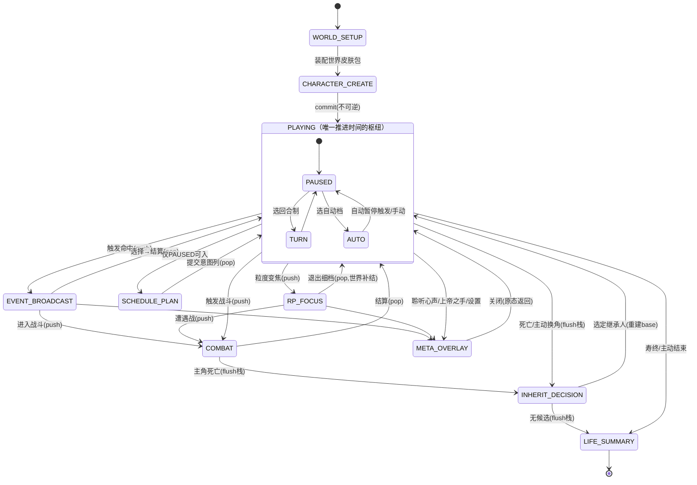

# 「AI 文游人生模拟器」V4.1 修订决议

<aside>
🧭

本页是 [「AI 文游人生模拟器」V4重构整合清单：组织实体 / 地图 / 战斗与战争 / 秘密](https://app.notion.com/p/AI-V4-ce1c4870165e482790c29ca25c19b017?pvs=21) 的增量修订决议，依据 [「AI 文游人生模拟器」V4 重构后全景框架 + 五项审计报告](https://app.notion.com/p/AI-V4-c29703ca7bd540f0a58c7ea42a82d078?pvs=21) 与 2026-06-11 讨论定稿。**已决议**条目为规格冻结内容；**讨论中**条目待拍板后补入。

</aside>

# 〇、三处理解修正（正式表述·已决议）

1. **RP = 粒度变焦，不是暂停**。RP 模式即时间流跑在极细粒度 × 极慢流速（如 1小时 × 0.1）档位上；玩家每条自定义输入都是正史行动，照常过检定、照常进事件结算管线。微观行为产生真实涟漪；粒度越细，结算周期越短、反馈越快。原「实时暂停扮演取代预生成队列」表述废止。
2. **日程安排 = 玩家预提交意图列，非预生成叙事队列**。暂停时玩家自安排日程，点击「安排」后生成事件列逐条抛给 LLM 结算，由 AI 决定本期结算或留到后期（埋种子）。意图列不预写结果，不复活旧队列的因果塌陷。天然适配养成 / GAL / 乙游玩法。
3. **事件结算/召回 = 三大记忆模块驱动的 P 社式播报**。事件抛给 AI → 现场判断：能定的即时结；可能有后续波动的写伏笔进隐藏记忆库 → 周期到期触发回来 → AI 结算并播报给主角。支持**即时 + 后结算叠加**（见 §2.2 分量记账）。

# 一、致命 Bug 改写清单（按死法分级·已决议）

## T0 · 坏档 / 世界观崩坏级（引擎第一版必须自带）

| # | 问题 | 死法 | 改写要点 |
| --- | --- | --- | --- |
| 1 | 浮点时间 | 0.1×小时档产生小数小时，到期/衰减/历法全面错乱，坏档不可逆 | **时间轴整型化**：底层唯一整数（纪元分钟数），年/月/日/时全派生渲染 |
| 2 | 双时钟缺位 | RP 显微镜档拖全世界按 0.1 小时拍跑 → 卡死或语义荒谬 | **主角镜头时钟 / 世界时钟分离**：镜头进细档时世界宏观系统冻结，退出时按各自最粗档惰性补结 |
| 3 | 三源事件竞态 | 日程列 × 种子到期 × 触发扫描同拍互踩；反水与战果同拍写同一压力榜 | **单一本拍结算管线**，固定序：日程项(计划时刻) → 种子(成熟日→重要等级) → 触发(优先级)，串行执行、后项读前项结果 |
| 4 | 叠加结算重复计账 | 即时分量到期时被再施加一遍 → 经济/数值崩 | **分量级已结算标记**；种子载荷引用即时结果（"在已发生 X 的前提下结算 Y"） |
| 5 | 派生量循环依赖 | 派系势力↔实际影响力互为输入 → 数值爆炸或死循环 | 固定求值序 + **上一拍快照做输入**，写成引擎铁律 |

## T1 · 卡死 / 管线中断级

| # | 问题 | 改写要点 |
| --- | --- | --- |
| 6 | 急停风暴（阈值电平触发） | 边沿触发（穿越阈值那一拍才触发）+ 已播报冷却/去抖标记 |
| 7 | 播报调用失败半步悬空 | 急停前落幂等「待播报」标记；重试 N 次失败降级为系统文本播报，结算照走 |
| 8 | 粒度栈泄漏 / `$战斗暂存` 残留 | 继承/异常/任意模式切换统一执行「栈复位 + 临时态清空」钩子 |
| 9 | 拍内中断 | 暂停只允许落在拍边界，拍原子不可分 |

## T2 · 数值 / 体验侵蚀级

| # | 问题 | 改写要点 |
| --- | --- | --- |
| 10 | 微观涟漪爆炸 | 重要等级门槛（低于阈值只改即时变量不留种子）+ 同源种子折叠（同对象同母题合并、权重叠加） |
| 11 | 极小衰减浮点误差 | 衰减改累积器：积累原始时长，到粗粒度检查点一次性套用 |
| 12 | 链式 declassify 无界递归 | 级联深度 ≤ 2；同拍只允许一层反制，其余转延时种子下拍引爆 |
| 13 | 网点/据点设施双写漂移 | `地点.据点设施` 改派生查询（filter 组织实体.网点 by 地点键），镜像删除 |
| 14 | 旧档迁移不完整 | 一次性 migration：所有按拍/周期存的历史量重标定为绝对日期/现实时长；`系统.migration_version` 承载 |
| 15 | 重 roll 刷天命 | 天命 RNG 种子锚定拍号（重 roll 换叙事不换命运），做成可选开关 |
| 16 | 日志/归档无限膨胀 | tick_log/覆写日志/已暴露线索/L2 归档轮转：保留最近 N 条 + 两段式蒸馏摘要 |

# 二、已决议的具体改造

## 2.1 时间系统（对应 T0-1/2）

- 底层时间 = 单一整数「纪元分钟数」；`绝对时间{年,月,日,时}` 全部降为派生显示，历法皮肤照常工作。
- 双时钟：`$流速` 旁新增「镜头档/世界档」分离；RP 细档期间世界系统冻结，退出时引擎按 elapsed 时间一次性补结（衰减累积器配合）。

## 2.2 结算管线（对应 T0-3/4 + 修正2/3）

- 本拍统一管线：日程意图列 → 延时种子 → 触发扫描，串行固定序。
- 叠加结算标准形态：事件效果拆「即时分量 + 延时分量」，每分量独立 `已结算标记`；「一笔可拆多次结，每个分量只结一次」是对 V4「一笔只结一次」铁律的精确化。

## 2.3 属性点 / 行动点平衡

- **财富踢出属性**，改为开局「家境装配包」资源；声望按审计二派生化。属性保留 体质/智慧/魅力/心理 等影响检定的内在量。
- 点购用**凸成本曲线**（高段成本递增），压制极端 build。
- **天赋汇率表**：统一「点数 ↔ 检定修正」兑换率，防止天赋商店成为新 minmax 入口。
- **行动点分层计费**：仅日常/发展粒度扣行动点（语义=日程容量）；即时/RP 档微行为不扣点，由精力/HP 约束；引擎把微行为聚合成拍级行动后向上层记账（聚合缓冲区复用 `$RP本场暂存`）。
- 行动点上限进粒度模板，世界皮肤包可覆盖；`_tick.difficulty` 挂钩开局点数预算。

## 2.4 作弊三档 + 非作弊白名单

| 档位 | 权限 | 代价 |
| --- | --- | --- |
| 纯净 | 无任何修改 | 无 |
| 助手 | 白名单内修改 | 无作弊标记，成就照常 |
| 沙盒 | 任意改全局变量（上帝之手全开） | `全局.作弊标记` 置位（本周目不可逆）→ 里程碑/称号/成就锁；轨迹照记但打「沙盒」水印 |

白名单原则：**纠错层、表现层、便利层免费；判定输入不可改**。

- 纠错层（免标记）：重 roll、回滚上一拍快照、编辑叙事文本、纠正 NPC 称呼；「报告错误」按钮 = 引擎 diff 上一拍快照给修复 patch 一键确认（AI 写坏变量是系统责任）。
- 表现层：人称、写实程度、立绘、UI 皮肤、资源条显示名。
- 便利层：流速/粒度/自动暂停、难度（只影响后续不追溯）。
- 软救济：复活点 + **天命重掷券**（每周目有限张数、免标记的命运重掷）。
- 不入白名单：直改属性/账户/忠诚/检定结果 → 走沙盒档。

## 2.5 变量瘦身清单（审计二全单通过）

据点设施派生化 / 声誉四件套归并 `声誉{人望,知名度,极性,标签}` / 性格只存大五轴 / 情绪统一为栈 / 峰值记录移 `$meta` / 学业彻底皮肤化 / 五类模板统一「世界皮肤包」/ 主角=组件齐全的 NPC 特例 / 家境开局后并入账户。预计省 15–20% AI 可见字段。

## 2.6 mod 三规矩（通过）

1. 皮肤包/美化包只准声明式配置 + 静态资源，**禁止携带可执行 JS**；自定义组件走沙箱 iframe + postMessage。
2. mod manifest 从第一天版本化、自描述（格式版本/依赖模块/资源清单/作者/授权协议），为网页社区与 Steam Workshop 双端同源铺路。
3. 版权条款先行：AI 生成立绘权属声明、二创素材授权、商用政策白纸黑字（幕间塌房教训）。

## 2.7 模型容错与提示词注入（已决议方向）

应对部分高安全模型触发拒答（如涉犯罪情节直接不回复）的网页能力，三件套：

1. **系统提示词注入槽**：prompt 组装层留用户可编辑的 `system_prefix` / 越狱槽位（玩家自填、随存档走），引擎只负责拼接，**不内置任何内容**。
2. **拒答检测 + 供应商回退链**：调用后检测 refusal（空回 / 安全模板 / finish_reason）→ 按用户配置的 provider 优先级自动回退（拒答 → 落更宽容 provider / 本地模型）。
3. **双 agent 护城河**：叙事 agent 撞安全墙时，记账 agent 仍独立结算数值（只读结构化意图）→ 退化为系统文本播报、数值照走，**叙事被拒 ≠ 游戏卡死**。

合规：成年门控、各 provider ToS 自负、海外免费版与路线图合规层对齐；具体越狱话术由玩家 / 社区自填，不内置。

# 三、讨论中：双 Agent + 三层动词表

<aside>
⚠️

大方向已认可（双 agent 由玩家方提出 + 动词表收敛操作形状），**细节未定稿**，本节为当前提案版，不作为冻结规格。

</aside>

## 3.1 双 Agent 分工

|  | 叙事 Agent | 记账 Agent |
| --- | --- | --- |
| 上下文 | 剧情记忆 + 感性召回 + 写实程度/叙事风格，**0 变量规则** | 叙事输出 + 意图速记 + 状态切片 + 动词表，**每次全新上下文** |
| 输出 | 纯叙事 + 文末 3–5 条意图/后果速记（P5 思维剥离正则现成先例，隐藏不发玩家） | 动词调用 / JSON patch，structured output 锁死 |
| 模型 | 主力大模型 | 可用便宜小模型 |
| 失败重试 | 不需要 | 只重试记账，叙事不重生成 |
- 酒馆端：TavernHelper 静默 generate（谜底校准已验证通路）；低配模式退化为单模型双段输出（叙事段 + DSL 段）。
- 记账结果前端渲染一行 patch 摘要（如「账户 −50万 · 埋种子×1」），玩家一眼校验，配合纠错白名单免费修正。

## 3.2 三层动词表（操作形状封闭，内容值开放）

- 通用动词 ×4（覆盖约 80% 流量）：`创建实体(实体类型, 字段对象)` / `修改(实体引用, 字段, 新值或Δ, 理由)` / `追加(列表引用, 条目对象)` / `埋种子(载荷自由文本, 成熟时长, 重要等级)`——字段对象由 Zod 按实体类型校验，值全开放串。
- 语义动词 ×约15（引擎有特殊展开逻辑）：战果档 / 线索浮现 / declassify 请求 / 关系变化 / 阵营变更 / 转移控制权 等。
- 兜底动词 ×1：`自由写入(路径, 值, 理由)`，过 ATTR_WHITELIST + Zod 校验 + 进覆写日志；引擎统计兜底使用模式，**高频模式自动提名晋升为新动词**（动词表靠遥测生长，不靠预先穷举）。

## 3.3 召回路由表（含触景生情修正）

| 召回系统 | 触发键 | 路由去向 |
| --- | --- | --- |
| 记忆关联召回 | 语义/关键词匹配 | 叙事 Agent |
| 触景生情召回 | 地点.意象标签 × 情绪色彩 × 主角情绪栈 | 叙事 Agent（情感性闪回素材；V4「意象标签合并情绪色彩」即为此服务） |
| 彩蛋记忆浮现 | 延时种子成熟 / 彩蛋池 | 叙事 Agent（播报） |
| 变量切片召回（新增） | 在场 NPC + 当前地点 + 活跃战争 + 相关秘密 | 记账 Agent |
| 谜底校准 | 暴露度跨阈值 | 第三路隔离调用（JSON 锁死·即焚） |

感性记忆全部流向叙事侧、零成本于记账侧；叙事 Agent 的上下文预算全部留给剧情与感性召回。

## 3.4 待定细节

- [ ]  语义动词的最终名单（约15个）
- [ ]  意图速记的格式规范（标签 or 文末 bullet）
- [ ]  酒馆低配模式（单模型双段）与双调用模式的切换条件
- [ ]  模块激活位（由引擎/前端写入，AI 不写）的模块切分粒度

# 四、功能模块复查补遗（2026-06-11 全卡复查）

已对照旧卡 23 条世界书 / 37 条正则 / 5 个脚本逐项核对，补遗如下：

1. **触景生情召回**：见 §3.3 路由表，归叙事 Agent，感性层不可省。
2. **聆听心声 = 玩家 Meta 行为（修正·归 META_OVERLAY 层）**：对象是玩家当前操控的**主角自己**（非 NPC），完全不计入剧情记忆、不推进时间、不写持久变量、不进对话历史。输入 = 玩家想问的话 → 输出 = 主角此刻内心独白，源 = f(主角.情绪栈, 信念, 性格轴, 已知秘密索引, 当前压力)。**红线**：可读主角当下心理/已知信息，但对 `$隐藏记忆库` 未成熟的延时种子/伏笔只给**模糊预感**（模糊预兆，不剧透具体内容与时点）。
3. **NPC 录入框架废弃 → 自定义 / 导入 NPC 变量库（修正）**：旧 NPC录入与休眠 NPC库脚本（7284字）退役。新能力 = 玩家可自定义并导入自己的 NPC 变量库，并入 mod manifest 体系：NPC 包 = NPC schema 子集 JSON + 立绘资源 + manifest；导入管线 Zod 校验 → ATTR_WHITELIST 过滤 → 命名空间隔离（包名前缀防键冲突）→ 落 `NPC库`；入场按变量切片召回，不在场零 token 成本；与继承候选生成、事件包共用同一校验器。
4. **世界背景生成器 → 开局世界装配向导**：前端状态机补「世界生成」态：选世界观 → 装配世界皮肤包（历法/种族/职级/学业制式/粒度模板）→ LLM 生成背景 → 进角色创建。
5. **`$` 层暗变量归属**：`$运气/$寿命预期` 接天命掷骰与重掷券（引擎读，AI 永不见）；`$RP本场暂存` 复用为 RP 微行为聚合器缓冲区（§2.3）。
6. 写实程度与叙事风格（叙事 Agent 风格层）、各界面正则（前端组件化）、P5 思维剥离（意图速记先例）已在既有方案覆盖，无新增问题。

# 五、落地顺序（已决议）

1. **规格冻结**：V4 整合清单 + 本页决议合并为 V4.1 最终规格（动词表定稿后补入）。
2. **TS 引擎先行**：`core/` 包 = Zod schema（现 57.8KB 改造）+ 引擎纯函数（现 19.9KB 为底）+ fixture 回归测试（旧卡酒馆行为为基准），单一真相源。
3. **回灌酒馆**：`core/` 编译打包成 tavern_helper 脚本 + card-generator 重建世界书；酒馆 = 引擎的一个宿主。每完成一个引擎模块回灌测卡一次，不攒到最后。
4. **调试前端随引擎同步写**（状态树查看器 + 按钮面板）；美术级正式前端（地图/站位/皮肤）放引擎稳定 + 内容回归之后。
5. **世界书最后重写**：内容取决于引擎接口与动词表，定稿后从同一模板源生成。

## 先纠正/收口（#1 #3 #4）

**#1 聆听心声——我之前彻底搞反了，重新定位：** 它是**玩家 Meta 行为**，对象是**玩家当前操控的角色（主角）自己**，不是 NPC，且**完全不计入剧情记忆**。所以它根本不碰 NPC 的 `$真实值`，我上一轮那条"信息泄露风险"作废。正确规格：

- 归 `META_OVERLAY` 层（见下）：不推进时间、不入栈、不写任何持久变量、不进对话历史；
- 输入 = 玩家想问的话 → 输出 = 主角此刻的内心独白，源 = f(主角.情绪栈, 信念, 性格轴, 已知秘密索引, 当前压力)；
- **唯一要设的红线**：可以读主角自己的当前心理/已知信息，但**不能泄露 `$隐藏记忆库` 里尚未成熟的延时种子/伏笔**——否则玩家用它剧透自己的未来事件。即"照见此刻的心，照不见还没发生的命"。

**#3 NPC 录入框架废弃 → 改为「可自定义 + 导入 NPC 变量库」。** 这条直接并入已决议的 mod manifest 体系，是它的一个实例：

- NPC 包 = 符合 NPC schema 子集的 JSON + 立绘资源 + manifest；
- 导入管线：Zod 校验 → ATTR_WHITELIST 过滤 → **命名空间隔离**（包名前缀防键冲突，如 `pack_战国/织田信长`）→ 落 `NPC库`；
- 入场时按需召回（变量切片召回），不在场的导入 NPC 对 AI 等于不存在，零 token 成本；
- 与继承候选生成、事件包共用同一导入校验器。旧 NPC库脚本（7284字 disabled）不复活，直接退役。

**#4 高安全模型拒答 → 提示词注入/容错路由（架构层，我给设计不给越狱文本）。** 这是 BYO-key 自带模型的网页应用的合理能力，SillyTavern 早有先例。我能给你**架构**，但具体越狱话术得你自己/社区填——我不产出绕过模型安全策略的具体提示词。架构三件套：

1. **系统提示词注入槽**：prompt 组装层留一个用户可编辑的 `system_prefix` / `jailbreak` 槽位（每个玩家自填、随存档走），引擎只负责把它拼到最前，不内置任何内容；
2. **拒答检测 + 供应商回退链**：记账/叙事调用后做 refusal 检测（空回/安全模板/特定 finish_reason）→ 自动按用户配置的 provider 优先级回退（如 GPT 拒答 → 落到更宽容的 provider/本地模型）；
3. **双 agent 的天然护城河**：叙事 agent 撞安全墙时，**记账 agent 仍可独立结算数值**（它只读结构化意图、不写露骨叙事），所以"叙事被拒"不等于"游戏卡死"——退化为系统文本播报，数值照走。
    - 合规提示：成年门控、各 provider ToS 自负、海外免费版与你路线图里的合规层对齐。

---

# #2 游戏机状态机——核心架构（反复自检过，无死结）

## 设计第一性原理（这一条决定了"为什么不会跑不通"）

> **只有确定性引擎（Ring 0，纯 JS、不调 LLM）能推进时间和改写状态；LLM 永远只做"装饰"（叙事/重述），任何 LLM 调用对状态机的推进都是非阻塞的。**
> 

把这条钉死，"模型拒答/超时/抽风"就永远只会让画面少一段文字，绝不会让流程卡住——因为状态转移的权力根本不在 LLM 手里。这是整个安全性的地基。

## 三环模型

| 环 | 职责 | 是否调 LLM | 是否改状态 |
| --- | --- | --- | --- |
| **Ring 0 引擎** | 时间泵 `tick()`、结算管线、触发扫描、检定、Patch 应用 | 否 | **是（唯一写者）** |
| **Ring 1 交互状态机** | 玩家面对的模态（事件卡/日程/RP/战斗…），UI 驱动 | 否（只发起调用） | 否 |
| **Ring 2 LLM 服务** | 叙事 agent / 记账 agent / 谜底校准，全部无状态 | 是 | 否（产出建议，交 Ring 0 落账） |

## 状态集（Hub-and-Spoke 拓扑——这是无死结的关键）



拓扑性质（肉眼可验证）：

- **`PLAYING` 是唯一枢纽**，所有交互态都是它的辐条；**每条辐条都有一条无条件返回 `PLAYING` 的边**（玩家永远能"取消/完成/退出"）。
- 因此状态图里**唯一的环就是 `PLAYING ⇄ 辐条 ⇄ PLAYING`**，不存在能把玩家困住的环。
- **正交分解**：把"时间模式"（PAUSED/TURN/AUTO）做成 `PLAYING` 的内部子态，而不是顶层枚举——避免了"模式 × 模态"的组合爆炸（这正是很多状态机跑不通的根因）。

## 栈纪律（防止 T1-8 粒度栈泄漏）

辐条态用**有界下推栈**（深度 ≤ 4），因为存在嵌套：`PLAYING → EVENT_BROADCAST → COMBAT`。规则：

- **普通模态 push/pop**；
- **`META_OVERLAY` 不入栈**（它是悬浮在一切之上的覆盖层，关闭即回原态，不影响时间与栈）；
- **`INHERIT_DECISION` / `LIFE_SUMMARY` 是"清栈转移"**：触发即执行统一的 `栈复位 + 临时态清空` 钩子（清掉 `$战斗暂存`、粒度栈、未 pop 的模态），把栈重置到 base。死亡发生在战斗里也能干净退出——直接解决了你担心的泄漏。

## 双时钟在状态机里的落位（T0-2）

- `RP_FOCUS` 入场：**世界时钟冻结**，只有主角镜头时钟按微粒度（如 1h×0.1）推进，跑主角局部事件；
- `RP_FOCUS` 退场：引擎对世界宏观系统（经济月结、战争、组织营收）按 elapsed 游戏时间**一次性惰性补结**（配合衰减累积器，数值与逐拍推进完全一致）；
- 这样"显微镜下演一整天"不会拖着全世界按 0.1 小时空转——既不卡死也不烧性能。

## 关于"P 社事件流"和那条已删的预生成队列的区别（防止你再被我误导）

- 触发命中后，同一拍若有多个事件：**确定性的当场由引擎结算**，只有需要叙事的才转成事件卡；多张事件卡进一个**播报队列**——但请注意：**这是"已成定局事实的播报积压"，不是"AI 预生成的未来叙事"**。前者只是排队讲已经发生的事，无因果倒置；后者才是被删掉的旧 bug 源。两者本质不同。

## 状态切换流程（带守卫条件）

| 当前态 | 事件 | 守卫 | 动作 | 目标态 |
| --- | --- | --- | --- | --- |
| [PLAYING.AUTO](http://PLAYING.AUTO) | 引擎 `tick()` | 触发器边沿命中且过冷却 | 保存 TimeMode；结算确定项 | EVENT_BROADCAST(push) |
| PLAYING.TURN | 玩家行动 | — | 行动入意图列=1拍；`tick()` | （命中则同上，否则留 PLAYING） |
| EVENT_BROADCAST | 玩家选择 | 选项恒含安全默认项 | 记账 agent 落账→pop | PLAYING（恢复原 TimeMode） |
| EVENT_BROADCAST | 选项触发战斗 | — | push | COMBAT |
| RP_FOCUS | 玩家退出 | 恒可退出 | 世界补结→pop | PLAYING |
| COMBAT | 引擎判定五档 | 结果为 Ring0 产出 | 回写HP/缴获；LLM仅叙事 | PLAYING / INHERIT(若死) |
| 任意 LLM 等待态 | **看门狗超时** | 超 T 秒 | 降级系统文本，结算照走 | 强制 pop 回 PLAYING |
| 任意态 | 主角 HP 归零 | 复活闸不过 | flush 栈 | INHERIT_DECISION |

## 沙盒推演范例（一条完整轨迹，标注栈深 / 双时钟 / 风险规避）

场景：明末走私商人。`[栈]` 标当前栈，`[镜/世]` 标镜头时钟/世界时钟。

1. `WORLD_SETUP`：选"明末·公历皮肤·人类模板"，装配世界皮肤包 → `CHARACTER_CREATE`：财富走"家境装配包"（**不是属性点**，规避 minmax）→ commit。`[栈: PLAYING]` `[镜/世: 1620-01-01 同步]`
2. `PLAYING.AUTO` ×2 档快进。引擎逐拍 `tick()`，世界月结跑经济。第 3 拍**边沿触发**"合伙人提议扩张"（穿越信誉阈值那一拍，非电平，**规避 T1-6 急停风暴**）→ 保存 AUTO → `EVENT_BROADCAST(push)`。`[栈: PLAYING→EVENT]`
3. 事件卡给 `choices[]`：接受/拒绝/拖延。玩家想细谈 → 点"进入对话" → `RP_FOCUS(push)`，粒度栈 push 到 1h×0.1。**世界时钟冻结**。`[栈: PLAYING→EVENT→RP]` `[镜: 走; 世: 冻结于此刻]`
4. RP 中谈崩，对方拔刀 → `COMBAT(push)`。引擎 `_统一检定` 五档判"惨胜"（**Ring0 确定性产出**），LLM 只负责把"惨胜"写成画面；**此时若 GPT 因暴力拒答→看门狗超时→系统文本"你险胜，左臂中刀"，HP 照扣**（规避 #4 拒答卡死）。pop 回 RP。`[栈: …→EVENT→RP]`
5. 玩家退出 RP → pop。引擎按镜头时钟 elapsed（半天）对世界做**一次性补结**（规避 T0-2）。回到 `EVENT_BROADCAST`，玩家选"接受扩张"→ 记账 agent 落账：`修改(账户,-50万)` + `埋种子(扩张收益, +6月, 中)`，**即时分量与延时分量各带已结算标记**（规避 T0-4 重复计账）→ pop。`[栈: PLAYING]` 恢复 AUTO。
6. 继续 AUTO。半年后种子成熟，**与一张"瘟疫"触发卡同拍**：进**单一结算管线**，固定序 日程→种子(收益)→触发(瘟疫)，串行、后读前（规避 T0-3 竞态）。
7. 瘟疫致死，复活闸不过 → **flush 栈** → `INHERIT_DECISION`（候选由 Ring0 派生：长子全权限/掌柜仅商权）。玩家选长子 → 重建 base → `PLAYING`。**全程无残留临时态**（规避 T1-8）。

## 实现思路 / 逻辑 / 方式

- **引擎主循环（伪码）**：

```
while state == PLAYING:
  switch(timeMode):
    PAUSED: await uiCommand   // 开模态/换模式/退出，绝不自己推进
    TURN:   act = await playerAction; runTick([act])
    AUTO:   await (interval/speed); ints = runTick([]);
            if ints.nonEmpty: pushModal(EVENT_BROADCAST, ints.byPriority); break

runTick(acts):              // Ring0 纯函数·原子·可快照
  snapshot()                // 拍前快照(供重 roll/回滚/上一拍输入)
  camera += _本拍跨度
  settle(日程→种子→触发)     // 固定序·单写者
  return collectInterrupts(edge+cooldown)
```

- **暂停只落拍边界**（拍原子，规避 T1-9）；**每个 LLM 等待态挂看门狗**（超时→降级边）；**继承/总结挂清栈钩子**。
- 网页端用一个显式 `StateMachine` 对象（当前态 + 模态栈 + timeMode + 双时钟），所有转移走 `dispatch(event)` 单入口，便于做转移合法性断言和回归测试。

## 如何"严格无误"——六条可机械验证的不变量

我不是口头保证，而是把它做成**引擎启动时和每次转移时断言、CI 里跑遍历测试**的硬约束：

1. **可达性**：从任意态存在到 `PLAYING` 或终态的路径（图遍历可证；hub-spoke 拓扑天然满足）。
2. **无捕获环**：唯一环是 `PLAYING ⇄ 辐条`，且每条 pop 边无条件可走（每个模态恒有"取消/完成"出口 + 兜底默认项）。
3. **栈有界**：push 深度 ≤ 4，终态转移强制 flush（断言栈深，越界即报错而非默默泄漏）。
4. **拍原子**：时间只在 `runTick` 内变；模态态断言"未持有时间推进权"；暂停断言落在拍边界。
5. **单写者**：仅 `settle()` 写状态、固定序、串行；并发写在测试里被探测。
6. **LLM 非阻塞**：每个调用点都有超时+降级边，CI 用"全调用必失败"的故障注入跑一遍，断言游戏仍能从头玩到尾。

第 6 条是对你最担心那点的正面回答：**我专门用"让所有 LLM 调用都失败"的极端测试来证明状态机仍然通畅**——能在零 LLM 的情况下跑完一生，就证明 LLM 永远卡不死它。

---

这套状态机你先审。确认无误后我把 #1/#3/#4 的修正 + 这套状态机（架构/转移表/不变量/沙盒范例）补进 V4.1 决议页。还有一个需要你定的小口子：**聆听心声要不要对主角自己尚未成熟的伏笔种子也保密**（我倾向保密，否则等于剧透）。

**这套 Hub-and-Spoke 状态机（唯一枢纽 PLAYING + 有界栈 + LLM 非阻塞 + 六不变量）接受吗？**: 其他：太复杂了，你先用最直白的话配合上通俗易懂的例子跟我讲解解释一遍

**聆听心声是否对主角自己未成熟的伏笔种子也保密？**: 模糊预感（只给模糊预兆）

**是否现在把 #1/#3/#4 修正 + 状态机补进 V4.1 决议页？**: 其他：1，3，4写进去，状态机先别写，有待核查

---

# 六、V4.1 增补决议（2026-06-11 第二轮拍板）

## 6.1 新增变量（已决议）

| 变量 | 层 | 说明 |
| --- | --- | --- |
| `NPC.关系[]: {对象键, 类型(开放串), 强度, 极性}` | 无前缀 | NPC↔NPC 情感边（挚友/恋人/死敌/恩人…）。稀疏存储，仅存跨重要等级门槛的边（同 T2-10 防爆原则）。补齐现有六类功能边（忠诚/受制于/约定/派系/知情/家族）缺失的情感维度 |
| `NPC.野心/目标(开放串)` | 无前缀 | 驱动幕后演化与离场自主事件；组织侧复用 `派系登记[].诉求`，不另立字段 |
| `$玩家偏好{母题权重}` | `$` | 事件倾向自定义（如 恋爱×1.5 / 战争×0.5），挂进 `_触发扫描器` 概率权重。引擎侧实现，不靠求 LLM「少写战争」 |
| `$meta.周目谱系` | `$meta` | 存档树（带 parent 指针）。人生分支 / 带记忆回溯 = 从历史拍级快照 fork 新档（记忆摘要+已知秘密索引注入新档）。配里程碑快照 + 滚动窗口保留策略（防 T2-16 式膨胀）。存档层功能，不碰 stat_data |
| `$会话状态` | `$` | 最后交互时间戳 / 未读播报数 / 崩溃恢复指针。配前端检测：visibilitychange / 失焦 / idle → AUTO 自动转 PAUSED（落拍边界）；每拍边界自动 localStorage 快照 |
| `系统.功能开关表` | 系统 | 旁观事件流开关、自动暂停规则、模拟深度档位（重要 NPC 数量上限）、叙事密度档——离场模拟与 token 成本由玩家选档 |
| 实体级 `立绘引用?`（可空） | 无前缀 | 生图/贴图接口位，复用 mod manifest 立绘资源槽；生图 provider 配置与 LLM key 同一配置层。P2 前不实现任何生图逻辑；TTS 连字段都不留（输入即叙事文本） |
| `状态标签{效果: 修饰通道引用}` 半结构化 | — | 落地审计三建议。「被俘/被绑架/被胁迫」= 状态标签实例，接 armyPower/士气/检定派生 → 人质·绑架·擒贼先擒王玩法零新系统（要挟=秘密库把柄，勒索条款=约定库标的，已有） |

## 6.2 新增接口契约（已决议·P0 冻结对象）

1. **CombatResolver 可替换接口**：`resolve(我方单位[], 敌方单位[], 环境) → {五档结果, 伤害, 状态变更[]}`。五档抽象结算 = 默认实现；后期完整战旗规则（距离/AoE/掩体/借机）= 另一个实现，Ring 0 其余部分零感知。
2. **`$战斗暂存` schema 版本化**：预留可空字段 `terrain? / cover? / zoc?`，不实现。`$` 层零 token 成本。
3. **事件卡 `choices[]` 规格**：① 选项 = 意图不是结果（结果必过检定）；② 每选项带结构化意图标签 `{意图动词, 目标实体, 参数}` 供记账 Agent 直读；③ D 自定义 = 一条 RP 输入，走完全相同管线，无特殊代码路径；④ 恒含安全默认项（看门狗/挂机兜底）。
4. **关系图 = 派生视图**：引擎查询时从 忠诚/受制于/约定/派系/知情/家族树/关系[] 七源聚合拓扑图喂前端渲染。**禁止建统一关系边大表**（T2-13 双写漂移翻版）。
5. **时间推进以拍计数为唯一单位**：墙钟只控播放节奏，绝不参与游戏时间累积（后台标签页 setTimeout 节流免疫）。

## 6.3 交互 / UI 决议

- **单一游戏界面，不采用酒馆式聊天楼层**：主界面常驻（时间控制台+状态栏+地图）+ 事件卡流；`RP_FOCUS` 弹对话子界面（模态），退出折叠为时间线节点。历史记录 = 人生轨迹时间线（与分享快照页一物两用）+ L2 蒸馏摘要控制体积。
- **延迟掩盖管线**：提交 → 时间推进动画立刻播 → 引擎瞬时结算 → 事件卡立即弹出（标题+记账摘要行先出）→ 叙事文字异步流式填充。禁止为无感而预生成未来叙事（因果塌陷红线）；「已成定局事实的播报排队」允许。
- **重 roll 两档按钮**：「换个讲法」（同快照同意图只重调叙事，数值不动，纠错白名单免费）/「重掷这一拍」（回滚快照重跑结算，天命种子锚定拍号，命运重掷走天命重掷券）。
- **穿越进 NPC = 继承机制的皮肤**：候选不限亲缘 + 勾选抓取「全部记忆」，走 INHERIT_DECISION 现有流程，零新架构。
- **播报队列合并策略**：旁观事件按 重要度门槛 + 同源合并 + 摘要折叠 入队（T2-10 种子折叠原则推广到播报层），防刷屏。

## 6.4 明确不做清单（已决议）

- 统一关系边大表（用派生视图）
- 预生成未来叙事（任何形式）
- 楼层式聊天 UI
- 镜头外 NPC 个体级细粒度模拟（只跑统计学演化，见 §七）
- 生图 / 语音的任何实现（只留引用位）
- 「万无一失一次定终身」的字段全集冻结——P0 冻结的是**接口契约**（时间整型/单写者/动词表形状/前缀权限/状态机拓扑+六不变量），字段演化靠 `migration_version` + 开放串 + 派生化保障

## 6.5 NPC 作息与离场自主行为（已决议）

- **作息模板半结构化**：`NPC.作息{模式键: {时段: {状态: 概率}}}` + `NPC.当前作息模式(开放串)`。模式键开放（常态/战时/逃亡/监禁/守孝…），由事件结算副作用切换（宣战→全军主将切「战时」；状态标签「被俘」→「监禁」），记账 Agent 可调语义动词 `切换作息模式`。
- **作息 = 按需采样的纯函数，不随拍推进**：`f(模板, 当前纪元分钟数, 种子锚定拍号) → 当下状态`。与玩家流速/粒度零耦合：粗粒度拍根本不查作息；只有镜头级接触、事件结算、检定需要「此人此刻在干嘛」时才采样。同一时刻无论从哪个粒度查询，结果恒一致（种子锚定拍号，重 roll 不变）。
- **事实约束注入**：采样结果作为硬事实喂叙事 Agent（「将领熟睡，哨兵×2」），LLM 只能在事实内写戏；检定同步吃状态修正（熟睡→暗杀 DC 大降）。拟合行为（敌将未卜先知候着主角）物理杜绝。
- **作息可侦察**：玩家侦察检定成功 → 作息写进已知情报，否则只能赌——情报玩法免费赠送。
- **LOD 三档**：L0 在场（叙事上下文内，0 增量）/ L1 重要离场（纯引擎统计演化，0 token；跨阈值才产幕后种子）/ L2 其余（冻结，入镜惰性实例化）。镜头外永不做个体级模拟。
- **组织**：`重要等级` = 派生（关系距离 × 规模 × 是否主角所属），不手填；**不设每拍 LLM 行为条目**（组织已有数值演化，再写一遍自然语言 = token 黑洞 + T2-13 翻版）；数值跨拐点（掌控度骤降/宣战/政变）才产播报种子。主角所属/所在地组织享 L0 待遇（切片常驻）。
- **幕后事件管线**：演化 `f(野心/派系诉求, 权力, 关系边, 种子) → 进度`；跨阈值产幕后种子 → 同拍成熟的种子**批量打包一次调用**产 N 条短播报；播报卡带「介入」按钮，点击升格为正式事件进结算管线。
- **记忆系统联动**：幕后种子复用 `$隐藏记忆库.延时种子[]` 同款结构（载荷/成熟日/重要等级/已结算标记）；播报后进 L2 归档、可被记忆关联召回。新增 `NPC/组织.履历[]`（滚动 N 条短句，引擎在幕后事件结算时追加），入场变量切片召回时带上 → 离场经历反映在言行。

## 6.6 事件包 / NPC 包 schema v2（已决议）

- **事件条目触发契约**：`触发{类型: 日期锚定|条件|概率|手动, 参数}` + `命中率(0–100|certain)` + `唯一性(once|repeatable)` + `前置[]`。本质 = 把 `_触发扫描器` 已有四类触发器 mod 化暴露，无新机制。`certain`+日期锚定 = 正史铁轨（历史事件百分百命中）。
- **`系统.事件来源权重{包事件:AI生成}`**：策略/正史皮肤默认 80:20，生活模式 40:60。包事件 = 确定性锚点，AI 只填空隙——同时是抗模型过拟合总闸。
- **NPC 包 schema 对齐完整子集**：旧四件套（键名/称呼/别名/标签）扩为 野心/作息模板/关系边（包内命名空间互引）/职务/忠诚伪装度 + **登场契约**（日期/条件/地点，入场前零 token）。
- **ATTR_WHITELIST 退役**：合法路径集从实体 Zod schema 自动派生，导入校验/动词校验/继承生成三处共用，杜绝三份白名单各自腐烂。旧管理器架构（导入/命名空间/启停/随档导出）保留，校验层替换。
- **manifest 加 `依赖[]/冲突[]`**（历史 NPC 包依赖对应事件包，启用时校验）。

## 6.7 `$预算控制台`（已决议·玩家对预算有最大控制权）

- **叙事密度档**（低/中/高/无限）：每游戏月叙事调用配额；拍内播报种子按重要度排序，配额外降级为一行系统文本——**结算照走（引擎免费），只省叙事**，游戏不降智。
- **快进前预告**：AUTO 快进前引擎干跑触发扫描器（确定性；概率类用期望估算）→ 弹「预计唤醒 LLM ~N 次 / ~M tokens，继续？」确认。
- **软/硬上限**：软上限警告，硬上限自动暂停（落拍边界）。
- **调用队列串行可中断**：快进期 LLM 调用排队执行，随时暂停 → 队列剩余全部降级系统文本；绝不并发爆发。
- **小模型降级开关在控制台内**（默认值待定，玩家可改）：旁观播报模型 / 记账模型 / 叙事模型分别可选 provider 与档位。
- **token 计量表**：累计/本会话用量与估算费用可视。
- 全部项放 META_OVERLAY 设置，随时可改（便利层免标记，只影响后续）。
- ✅ **已冻结（第四轮审计通过）**：叙事密度配额按**游戏时间**定义（每游戏月 N 条），不做墙钟定时唤醒；墙钟三铁律见 §6.10。

## 6.8 模型偏置抑制（部分已决议）

- **已决议**：`$模型画像{provider: {风格补正提示词, 采样参数}}`——Claude 档默认附「提高戏剧张力/允许重大转折」，GPT 档附「本世界存在真实恶意与损失」基调；内容由玩家/社区填，引擎只拼接（同 §2.7），可随 mod 流通。温度按调用类型分档：记账低温（结构稳）、叙事高温（平淡解药）。
- **已决议**：全动词母题分布遥测（兜底动词遥测推广）→ 前端「本周目母题分布图」，偏置可视、玩家可用 `$玩家偏好` 反压。
- **已决议**：引擎天命/触发器强制掷出的负面事件模型无法拒写（事实先行）；事件来源权重 = 总闸。
- **已决议**：动词母题配额（硬闸）见 6.14——数值进世界皮肤包、引擎带兜底默认、玩家主动行为豁免。

## 6.9 第三轮转正（2026-06-11·已决议）

- **世界皮肤包三层自定义**（确认）：① 预设（策略/养成/宫斗…）只是出厂参数组合，**全部逐项可改**——任何「游戏类型」= 参数空间里的一个点，不枚举类型；② 拧好的配置可导出 manifest 分享（版本化，走 §2.6 mod 三规矩）；③ 开局向导支持自然语言描述 → LLM 生成皮肤包 JSON → Zod 校验导入（LLM 只产数据不产规则）。
- **行动点皮肤化**（确认）：行动点不删除，上限由世界皮肤包决定；策略预设 = ∞（语义转「日程容量无限」，日程随时安排+自动播报结算照常），养成/生活预设 = 紧额（日程容量 = 核心平衡资源）。零新机制（§2.3 已铺）。
- **主动换角细则**：INHERIT_DECISION 现有「死亡/主动换角」双入口不变；主动换角（比尔博→弗罗多型）时**原主角降级为普通 NPC**——档案原封保留、照常进 L1/L2 演化、留在候选池可再换回。「玩家知道但新主角不知道」的信息分割依赖认知档案（6.12 已定稿）。
- **主角隐蔽行动 covert 通道 + 召回知情过滤**：
    - 玩家对系统**明牌**输入真实意图（AI = 地下司令部参谋，瞒的是 NPC 不是 AI；伪装输入会打断记账与因果，禁止作为设计路径）。
    - 行动带 `covert` 标记 → 记账照常落账 + 自动开秘密库条目（知情名单 = [主角+同伙]，复用受众选择器）。
    - 每次 covert 行动过暴露检定 → 暴露度爬升 → 线索浮现 → declassify 跨阈值才允许 NPC 反制（全部现成机制）。
    - **新契约（P0 冻结）**：变量切片召回按知情名单过滤——喂给叙事 Agent 的每个 NPC 切片附「该 NPC 已知信息白名单」，未知秘密**代码级不进上下文**（谜底隔离从 `$谜底` 推广到全部秘密）。
    - **猜忌阻尼（防「一条线索无限猜忌」）**：NPC 对秘密的反应按知情程度分档——0 无知 / 1 隐约不安（只许氛围描写，禁点名怀疑）/ 2 怀疑（只许试探/调查动作，禁指控与反制）/ 3 确信（declassify 后才许反制）。**单条线索最多推到档 2**；升档需多线索累积或调查检定成功；怀疑无新线索按衰减铁律随时间回落；同一 NPC 的试探动作带冷却去抖（复用 T1-6）。
- **媒体渠道层（接口 P0 冻结，实现后置）**：
    - 播报条目加可空 `渠道标签?` 字段（朝堂奏报/市井流言/报纸/社交媒体…）——这是 P0 的全部工作量。
    - 世界皮肤包带 `媒体渠道表{渠道: 触达(受众选择器), 可信度, 时代有效期(日期锚定), 渲染样式}`；渠道随历史/世界观启停 = 日期锚定触发，零新机制。
    - 低可信渠道内容可携带认知误差（假新闻 = 往主角认知档案写错误条目，认知档案已定稿（6.12），P1 接线）。
    - 主角「公开声明/舆论攻势」= 意图动词走现有结算管线 → 声誉.极性/组织.传播/派系激进度/向背；NPC 发帖 = 其拐点播报的渲染形式。
    - 渲染组件（报纸排版/手机壳 UI）P1–P2 做，走审计四渲染器注册表，mod 可携带渠道样式。

## 6.10 第四轮转正（2026-06-11·已决议）

- **墙钟三铁律（冻结）**：① 游戏时间只由拍计数推进（`runTick` 内 camera += 本拍跨度），墙钟流逝永不折算游戏时间（后台节流只让播放变慢，零数值损伤）；② LLM 唤醒/叙事密度按游戏时间配额定义，永不做现实间隔定时唤醒；③ 现实时长语义全面废除（T2-14 迁移覆盖）。墙钟合法出场点仅三处（全在 Ring 1）：AUTO 播放节拍器、UI 动画、`$会话状态.最后交互时间戳`。**CI 静态检查：`Date.now()` 禁止出现在 Ring 0 任何函数**（与六不变量同级）。AUTO 挂机体验不变：定时器触发的动作是「跑一拍」而非「折算时间」。
- **难度系数化**：难度从枚举档改为一组可调系数（检定 DC 偏移/资源增益倍率/暴露检定频率/敌对主动性/死亡惩罚/开局点数预算…）；预设 = 出厂系数组合，逐项可拧，进世界皮肤包随包流通；中途修改走便利层（免标记、只影响后续，§2.4 不变）。
- **每轮上下文组装预算表（框架冻结，具体定额随引擎调参）**：持久状态全量住引擎/存档（0 token）；LLM 每轮只收现场组装切片：系统提示+动词表（固定可缓存）/ 工作记忆滚动窗口（溢出蒸馏 L2）/ 召回 top-k 封顶 / 在场 L0 NPC 切片（认知投影+知情名单双裁剪）/ 本拍结构化事实 / 相关秘密（知情过滤）。记账 Agent 每次全新上下文无累积。防爆四原则：不在场=零字节；历史只进摘要不进原文；引擎计算不占 token；密度档管次数 × 预算表管单次体积（正交双闸）。

## 6.11 多人接口钩子（已决议·P0 零成本守则）

- 「主角」一律写成 `镜头焦点角色` 指针，不硬编码；受众选择器/认知档案/播报队列/秘密知情名单一律以**观察者为键**；RNG 锚定拍号保持确定性重放；Ring 0 不设全局单例假设（可服务器化）。
- 后期多人 = **异步回合制**：服务器端 Ring 0 单写者，全员提交意图后结算一拍；同拍意图冲突按先攻序入单一结算管线（T0-3 固定序的拍级推广）。实时同步 MMO 式多人与双时钟/拍原子冲突，明确不做。

## 6.12 认知档案系统（2026-06-11·第六轮转正·已决议）

- **主结构**：`认知档案[观察者][目标]={了解度, 误差表{字段:认知值}, 时效}` 稀疏双向 + UI/叙事只见主角认知投影；适用范围 = 「观察他者」的一切字段（NPC/地图/战争/经济情报），主角私有量不走迷雾
- **与秘密库集成：存储分家、读取面统一**——秘密库管事件型隐瞒的生命周期，认知档案管状态型认知；`知道吗(观察者,信息)` 单查询接口内部分发两库，所有消费方（切片过滤器/UI 渲染/播报触达/检定修正）只走此接口；转化边：declassify 回写认知档案，被刻意经营的认知误差升格为秘密条目
- **认知迷雾总开关**：进 `系统.功能开关表`——关 = 全知模式/上帝视角游玩（认知层旁路、UI/切片直读真值）；走便利层（免标记、只改显示与切片不改账本，随时可开关）；秘密库谜底隔离不随开关旁路（防剧透底线保留）
- **自我认知档案（三条件版）**：`认知档案[主角][主角]` 复用同一结构——高度自恋独裁者 = 误差表{自身能力:夸大, 民心:高估}；影响 UI 预期显示、聆听心声基调与检定预期显示（不改检定真值）；误差来源 = 性格轴/环境谄媚度/媒体回音室；随认知迷雾总开关启停
    - **开局自动生成**：角色创建 commit 后引擎自动发起「认知投影初始化」调用（注册表条目，低温 structured output）——派生自性格轴/出身/家境/开局环境，**不随机**；生成后直接渲染「你以为的自己」面板给玩家
    - **最大泛化**：`环境谄媚度 = f(周围关系边 权力差×依附度 加权, 信息渠道回音室程度)` 为派生量——帝王朝堂与普通人「爹妈夸朋友捧」同一公式不同数值；误差随环境动态漂移（破产后谄媚源消失 → 自我认知被现实修正，本身即剧情）
- **决策输入认知化**：NPC/组织幕后演化与反制决策读**各自的认知投影**而非真值——误判/中计/将错就错由此涌现；组织了解度派生自网点覆盖与情报投入

## 6.13 Agent 拓扑与五道闸（2026-06-11·已决议）

- **双常驻 + 调用类型注册表**：常驻角色仅 叙事/记账 两个；其余能力均为注册表条目 `{模型档位, 温度, 上下文组装器, 输出schema, 超时重试策略}`——谜底校准/旁观播报批量/皮肤包生成向导/认知投影初始化…；**新增能力 = 注册表加一行，永不加 agent**；所有调用无状态、互不对话，产出一律交 Ring 0 落账（写者永远只有一个）。明确不做：每 NPC 一个 agent、多 agent 互聊（token 黑洞 + 幻觉互放大）
- **记账五道闸**（每条动词调用依次过）：① Zod 形状校验 → ② 路径白名单（从实体 schema 自动派生，承接 6.6 ATTR_WHITELIST 退役）→ ③ 前缀权限（`$` 层管制，真值只许语义动词走特殊通道）→ ④ 数值钳制（按重要等级设单次 Δ 上限；钳制入日志并在 patch 摘要行标注，纠错白名单免费修正）→ ⑤ 原子提交 + 覆写日志（拍前快照供回滚/重 roll）
- **失败处理**：任一道拒绝只丢该条、其余照过；只重试记账不重生成叙事；N 次失败降级丢弃 + 日志，游戏不卡（LLM 非阻塞不变量）

## 6.14 母题配额·硬闸（2026-06-11·已决议）

- **机制**：每个结算事件带母题标签 → 滚动窗口（按游戏时间，如近 6 游戏月）统计分布 → 超配额母题：触发扫描器对其候选事件降权 + 新埋同母题种子权重打折，分布自然回落且遥测图全程可见
- **归属**：配额数值进**世界皮肤包**（题材分布即 genre 定义：宫斗阴谋配额高、种田战争配额低），引擎带兜底默认——与难度系数化同哲学
- **两条铁律**：① 只约束 AI 自发事件，**玩家主动行为永久豁免**；② 与 `$玩家偏好` 相乘作用、不互斥
- 与 6.8 软层（母题遥测可视 + 玩家偏好反压）构成软硬三层抗偏置体系

## 6.15 部队姿态与战术库 mod 化（2026-06-11·已决议）

- 新增 `部队.姿态(开放串)`：强攻/死守/阻滞/佯攻/战斗撤退/伏击…，由玩家/AI 意图动词切换，进战争层拍级结算
- **战术库 = 数据不是代码**：战术条目 `{名称, 前置(地形/兵种/情报条件), 修正包, 风险(暴露/反制), 母题标签}`，随世界皮肤包/mod 扩展，导入走既有 Zod 校验管线（与事件包/NPC 包共用）；维基军事战术列表可编为「经典战术包」首发 mod
- **四机制族判定在案**：修正包族（工事/强攻/巡逻 = 检定修正组合，terrain/cover 字段已预留）/ 认知差族（全部欺骗战术 = 认知档案+covert+暴露检定+决策输入认知化）/ 拓扑时序族（包围/咽喉点/阻滞 = 地图图结构通行宽度 + 拍级行动序列）/ 粒度下沉族（单兵演练抽象档折算训练度修正，细模拟等战旗 CombatResolver 实现，ZoC/掩体字段已预留）

## 6.16 性格系统：大五轴唯一真相源（2026-06-11·第七轮转正·已决议）

- **唯一机制真相源 = 大五轴（OCEAN，0–100 连续数轴）**：开放性/尽责性/外向性/宜人性/神经质。MBTI 降级为**派生叙事标签**（由阈值映射现场生成，或保留单一标签字段），性格描述/补充合一为一个自由串。**单向派生纪律**：数值 → 标签允许，标签 → 数值禁止；AI 永不直写轴值，只通过事件结算产生增量（同 6.13 单写者）。
- **三个下游公式消费方**（五轴必须可计算的原因）：① **性格演化** = 事件结算给轴打小增量（战争创伤→神经质+5），引擎机械结算，量变越阈值叙事标签自然翻转；② **认知投影**（6.12）= 投影五轴 = 真实五轴 + 偏差项 f(关系深度, 知情程度, 伪装度)，自我认知同构；③ **谄媚度公式** = f(宜人性, 神经质, 权力差, 忠诚.伪装度, 利害关系)，喂反谄媚机械闸（低宜人低利害 NPC 强制反驳/拒绝）。
- **NPC 补五轴**：路人级**惰性实例化**（首次需要算投影/谄媚度时才生成），防全员膨胀；脚本中读 MBTI 做判断的逻辑全部改读轴值阈值。
- **V3.1 迁移**：`主角.性格类型`、`NPC.性格(MBTI)`/`性格补充` 随同一支 migration 收口（细查报告 §二「性格三重存储」条目即此决议）。

## 6.17 人生快照：换角谢幕卡 + 随时回望（2026-06-11·第七轮转正·已决议）

- **定位**：区别于 LIFE_SUMMARY（人生总结，清栈终态）的轻量只读调用——给焦点角色「活到现在的人生」拍一张叙事总结，拍完继续玩。**实现 = 调用类型注册表加一行**（符合 6.13「新增能力 = 注册表加条目，永不加 agent」纪律）：纯只读单次调用，不入栈、不推时间、不写剧情记忆，吃 `$预算控制台` 配额，引擎零侵入。
- **输入素材全部现成**：L2 蒸馏摘要 + 峰值记录（`$meta`）+ 关系网当前态 + 声誉/头衔/成就 + 性格五轴「开局 → 现在」轨迹对比（6.16 副产品）+ 认知档案「你以为的自己 vs 真实的你」对照。
- **双触发口，同一调用**：① 换视角时自动附带——挂 INHERIT_DECISION / 主动换角流程，确认换角后、镜头转移前生成，作为旧角色的「谢幕卡」；② 随时手动拍——放 META_OVERLAY，与聆听心声并列为元层第二个只读调用。
- **红线同款**（同聆听心声 §四-2）：只消费**已结算历史**；`$隐藏记忆库` 不进上下文，未成熟伏笔不剧透——「照见走过的路，照不见还没发生的命」。
- **产物去向**：可选存 `$meta`（随周目谱系留档，积成「家族列传」；分享快照页升级「人生册页」）或仅前端展示即焚。
- **与 LIFE_SUMMARY 的关系**：LIFE_SUMMARY = 人生快照的**终态特例**（清栈版 + 盖棺定论语气），复用同一上下文组装器，只差语气参数与后续转移——不做两套。与引擎「拍前快照」（字节级技术备份）无任何关系。

## 6.18 LLM 失败的前端兑现：提示 + 重试 + 自动暂停（2026-06-11·第八轮转正·已决议）

- 任何叙事调用失败/超时/拒答：事件卡照常弹出（系统文本兑底，数值结算一分不少），卡面带「⚠ 叙事生成失败」角标 + 〔重试叙事〕按钮。
- 重试叙事 = 「换个讲法」档：数值已落账，不回滚、不推时间、游戏时间零移动——种子成熟日锚游戏绝对时间，预期召回时间不变（墙钟三铁律保障）。
- `$流速.自动暂停触发[]` 新增枚举项「叙事生成失败」：AUTO 快进中失败卡可自动暂停（落拍边界），由玩家决定重试或接受系统文本。零新机制。

## 6.19 `_叙事设置` 字段扩展（已决议·已被 6.38 取代）

> ⚠️ 历史存档：`_叙事设置` 最终定稿见 6.38——事件倾向 / 写实度 / 叙事风格 均已退役，收口为 `{人称, 叙事偏好}`。
> 
- 定稿为 `_叙事设置{叙事风格, 人称, 写实度, 事件倾向{流派:权重}}`；事件倾向保持开放 record（流派名可自定）。
- 人称/写实度归作弊白名单**表现层**（免标记、随时改、只影响后续叙事）。
- 四字段全部只进叙事 Agent 上下文（风格指导层），不进记账 Agent、不参与任何检定。

## 6.20 NPC 目标字段定名（已决议）

- 正式定名 `NPC.目标{长期, 短期[]}`（开放串），与主角同构——「主角 = NPC 特例」的对称性要求字段同名；「野心」仅为策略题材叙事中的惯称，不是字段。
- 消费方不变：幕后演化 f(目标, 权力, 关系边, 种子)；组织侧复用 `派系登记[].诉求`，不另立字段。6.1 表内「野心/目标」条目以本条为准。

## 6.21 内心层调用族：聆听心声泛化（已决议）

- 聆听心声升格为「内心层调用族」：此刻内心独白 / 角色日记 / 近期牢骚感想 / 问 TA 对某事怎么想 / 自由聊天……= **同一上下文组装器**（情绪栈 + 信念 + 性格五轴 + 已知秘密 + 近期记忆切片）**× 不同提示词模板**；注册表各加一行（6.13 纪律），全部 META_OVERLAY 只读：不入栈、不推时间、不写剧情记忆，吃预算配额。
- 提示词模板开**玩家自定槽**（过注入清洗），可自由定制访谈形式，独立窗口呈现。
- **NPC 也可用**：组装器换成该 NPC 的认知投影 + 知情过滤切片；默认档访谈以「该 NPC 已知信息」为限（防免费读心）；无限制畅聊 → 沙盒档（打标记）或认知迷雾总开关关闭的上帝视角局，由档位合法承接。
- **不可旁路红线**：未成熟伏笔模糊化（同谜底隔离）——任何内心层调用都「照不见还没发生的命」。

## 6.22 多人 AI 同席（已决议·挂 6.11 多人钩子）

- 多人模式可绑 **AI agent 席位**：扮演重要 NPC 作为另一个「主角」存在，每回合提交行动意图，实现单个 NPC 的精细化模拟。
- 实现 = 注册表加「NPC 扮演调用」条目：每轮喂该 NPC 的**认知投影切片**（非真值，它也会被骗）+ 性格五轴 + 目标 + 可用行动 → 产出意图，照常过检定与五道闸——**与人类玩家权力完全对等**，单写者/认知分层零破坏。
- 与「每 NPC 一个 agent 互聊」（6.13 明确不做）的边界：仅多人局显式开启、只绑少数重要席位、按回合调用不常驻、吃 `$预算控制台` 配额（成本 ≈ 每拍每席位一次中档调用）。
- 排程：挂 6.11 异步回合制框架，P2+ 实现；P0 仅靠「镜头焦点指针 + 观察者为键」保持零成本兼容。

## 6.23 「皮肤包」更名「玩法预设」+ 玩家可制作（2026-06-11·第九轮转正·已决议）

- **正式更名**：全局术语「皮肤包」→「玩法预设」。更名理由：它打包的是母题词汇表、实体模板、数值参数、事件包、战术包等整套玩法内容，「皮肤」易被误解为前端美化功能。蓝图页已全文同步；本页历史条目保留旧称作为存档，以本条为准（与 6.20 同款纪律）。
- **玩家可制作玩法预设**：把世界装配向导里调好的参数组合「另存为预设」打包导出（manifest 版本化，走 §2.6 mod 三规矩与既有导入管线），可分享、可二改。P0 只冻结包格式；制作器 UI 与社区分享 P2+ 实装。
- 推理 / 狼人杀等专题玩法 = 未来的官方/社区玩法预设实例，打包细则未拍板（挂 §七），不在本条范围。

## 6.24 导出即 mod（已决议·钩子）

- **一键导出整树存档 = 天然 mod**（`$meta` 周目谱系随档）；**分模块导出**（只导 NPC 库 / 组织实体 / 事件包 / 战术包 / 玩法预设）= 顶层键切片 + 套 mod manifest，与导入管线完全对称（同一 Zod 校验器、同一命名空间规则）。
- P0 工作量 = 仅在 manifest 预埋「来源存档 / 切片键集」字段；导出 UI 后置。
- **隐私红线**：导出切片默认剥离 `$` 层（谜底 / 忠诚真实值 / 隐藏记忆库），防止 mod 流通泄底；「含底牌完整导出」仅作个人备份选项。
- **多人封存礼包（2026-06-11·第十轮追加·已决议）**：房主封存/解散房间时，可一键把权威存档导出分发给全体玩家（人手一份完整档，各自可单机续玩或留档，导出同样默认剥离 `$` 层），并给每个席位角色自动生成一张人生快照（6.17 注册表调用复用，谢幕卡语气）；AI 席位同样发快照（该 NPC 的「列传」）。落拍边界执行，吃 `$预算控制台` 配额。

## 6.25 欠债两档：透支 + 约定库债务（2026-06-11·第十轮转正·已决议）

- **透支档**：`货币系统.账户.持有` 为开放数值、允许为负（小额赊欠/临时周转）；负值跨阈值挂 `_触发扫描器` 追债事件（边沿触发 + 冷却去抖，复用 T1-6 防风暴）。
- **正式债务档**：大额借贷 = **约定库条目**（债主、本金、利率、期限、抵押标的）——勒索条款先例直接复用；到期 = 日程锚定触发；违约 → 抵押执行 / `声誉.极性` 受损 / 债主开秘密库把柄；破产事件清谄媚源 → 自我认知被现实修正（6.12 联动）。
- 两档分界阈值与利息结算周期（挂经济月结）为可调数值，进玩法预设；财富检定语义不回潮：金钱永远是资源消耗，不是骰子修正（§2.3 不变）。

## 6.26 属性系统终版：默认五轴 + 检定配方表（2026-06-11·第十一轮转正·已决议）

- **默认五轴（身-思-察-言-志）**：体质 / 智慧 / 感知 / 魅力 / 心理。感知 = 信息获取（侦察/线索/读人/暴露对抗），心理 = 信息承受（意志/抗压/被操纵抵抗）——雷达与装甲分工，互不重叠；魅力 vs 心理 = 社交攻防，感知 vs 伪装度 = 谍战攻防。§2.3 原四轴名单以本条为准。
- **检定配方表（数据，进玩法预设）**：每类检定声明 主属性 + 副属性×权重（谈判 = 魅力主 + 感知×0.5；暗杀 = 体质主 + 感知×0.5）；派生量同为配方（HP=f(体质)、精力恢复=f(体质,心理)）。**轴间禁止直接互喂**（防 T0-5 循环依赖），联动只发生在消费点。
- **幸运不设轴**：`$运气` 暗层 + 天命重掷券已覆盖；可点购幸运 = minmax 磁铁 + 双轨病，不做。
- **属性表/配方表预设化**：轴名单、点购凸成本、钓制规则全是数据；引擎只认「检定时按引用给一个数」。战斗向预设可自扩力量/敏捷轴，零改代码。
- **智慧钓制**：钓制表 智慧单次 Δ=0（常规事件永远改不动）；仅极少数语义动词特殊通道（头部重伤/痴呆/奇幻开窍），开闭与幅度由题材预设决定；后天成长走技能熟练（梯子），属性是天花板。体质反向：钓制表允许年龄曲线衰减。
- **三层纪律**：属性 = 能力（进检定），性格五轴 = 倾向（进演化/投影/谄媚），技能 = 后天（熟练）——心理（扛多少）与神经质（怎么反应）不重叠。

## 6.27 血缘泛化：全局家族树 + 双层血缘（2026-06-11·第十一轮转正·已决议）

- **子嗣并入 NPC**：`主角.子嗣{}` 退役；出生 = `创建实体(NPC)` + 引擎写家族树边。主角=NPC 特例的对称性贯彻到血缘。
- **`全局.家族树` = 全体 NPC 共用 DAG**：每人至多两条父母边 + 领养/过继/继养边（边类型开放串）；世代树前端 = 派生视图（6.2 七源关系图之一），不另存世代字段。
- **双层血缘**：明面只存**名义边**（社会公认）；生物真值 = 秘密库「身世」条目（类型:身世、`$谜底`=生父、知情圈）——「主角以为孩子是自己的」由 `知道吗()` 知情过滤天然兑现，零新机制；验亲（滴血/DNA，手段由预设给）= 调查检定推暴露度 → declassify；揭穿后名义边改不改是社会选择（名实分离继续产剧情）。
- **泛化功能（全部复用现成零件）**：NPC 世袭/夺嫑（职级制式沿家族树找继承人，与主角继承同一候选生成器）；宗族政治（受众选择器加「血缘距离≤N」谓词：诛九族/联姻/连坐）；遗传通道（子女初始属性/五轴 = f(父母值, 种族模板遗传参数, 噪声)，数据驱动）；跨代血仇（NPC.目标指向家族树事件）；跨代彩蛋。
- **成本纪律**：边稀疏存储；L2 路人不预生成谱系，入镜惰性补双亲（同五轴惰性实例化）。
- 继承候选默认读 名义血缘 + 边类型权限（宗法看名分）；declassify 后是否触发继承权危机、是否改读生物边，进玩法预设。

## 6.28 规则补丁包：mod 的第五种形态（2026-06-11·第十一轮转正·已决议）

- 玩家 mod 侧除内容包（NPC 包/事件包/战术包/玩法预设）外，可装「**规则补丁**」——**纯数据的机制约束覆盖**：秘密类型黑名单 / 触发器条目禁用 / 钓制表覆盖（忠诚下限、衰老速率 0）/ 母题配额覆盖（置 0）/ 种族模板覆盖（寿命∞）。范例：「绝对禁止伴侣出轨」「属下永不谋反」「年龄无限」。
- **比修改器更硬**：闸口由五道闸/触发扫描器机械执行，AI 提案同样在第②闸被拒——不是求模型别写，是引擎写不进。
- mod 三规矩不破：仍是声明式数据、无可执行 JS，走同一 manifest/导入管线。
- **合法性分档**：开局装 = 桌规（免标记，同选预设）；中途加装走便利层（免标记、只影响后续，同难度系数先例）。
- 玩家主动行为豁免位（6.14）本身也是补丁参数——「连玩家侧一起锁」的铁律包可选。

## 6.29 意象条目化：NPC / 物品 / 地图统一制式（第十二轮转正）

- **统一制式**：`意象[]: {标签, 情绪色彩, 强度, 来源, 衰减速率}`——标签与情绪色彩绑定成对、条目可多条叠加；**地图地点 / NPC / 物品三类实体共用同一制式**（原地图侧 `意象标签{标签[],情绪色彩}` 退役）。
- **按来源分衰减**：`来源=固有`（地貌荒凉、遗物材质、长相气质）不衰减；`来源=事件烙印`（血战旧址、定情信物、救命之恩）由事件结算追加，强度按衰减铁律 × 本拍跨度回落；重大烙印可设速率 0 = 永久地标记忆。
- **公共/私人分家**：实体上只存公共意象（人人可感的氛围/印象）；个人情感联结住记忆侧（彩蛋池模糊钥匙 + L2 归档），不写进实体——防止路人路过也莫名伤感。
- **触景生情升级**：召回 = 主角情绪栈 × 实体公共意象[] 多条目加权 × 私人记忆模糊钥匙；原单条匹配公式退役。

## 6.30 谱系填写机制：出生写边 + 幽灵节点 + 世代钳制（第十二轮转正）

- **写入时机三类**：①出生 = 唯一强制即时写入——`创建实体(NPC)` 时引擎自动写双亲边；②包导入/开局装配可在命名空间内声明亲缘边；③其余一律惰性：路人默认无谱系，不填 = 不存在，零成本。
- **幽灵节点**：家族树的边允许指向「未实例化占位条目」`{称谓, 姓氏, 生卒约束, 模板引用}`——不是完整 NPC、不进 NPC 库、零 token；剧情需要登场时才惰性实例化升格为完整 NPC（走登场契约），占位条目的既有约束喂给生成调用防穿帮；已故祖先可永驻占位形态，不必复活成完整 NPC。
- **生成入口两个**：①引擎消费方（继承候选生成器/宗族选择器）查到缺边 → 调用类型注册表「补谱系」低温调用（注册表加一行，符合 6.13 纪律）；②叙事需要 → 记账 Agent `创建实体` + 追加边，照常过五道闸。
- **世代一致性校验**（第④闸新增）：父母出生须早于子女至少「种族最小生育年龄」（读种族模板），防 AI 把孙子填成爷爷。

## 6.31 赌局与迷你游戏 Resolver（第十二轮转正）

- **抽象档（P0 默认，零新机制）**：一把赌局 = 意图动词 → 检定，**检定配方表按赌种配置**（麻将=智慧主+感知副 / 梭哈=心理主+感知副，读人不露怯 / 老虎机=纯掷骰），`$运气` 暗层参与 → 账户转移结算。周边零件全现成：赌场 = 组织网点（营收=抽水）；出千 = covert + 秘密条目（被抓 = declassify → 把柄/仇家）；赌瘾 = 特质/状态标签（事件钩子：路过赌坊过心理检定）；赌债直接接 6.25 欠债两档。
- **可替换接口**：`赌局Resolver.resolve(参与者[], 赌注, 玩法) → {胜负, 转移, 事件钩子}`，与 CombatResolver 同构；默认实现 = 抽象检定，未来可视化麻将/牌局是另一实现，引擎零感知；对弈/钓鱼/斗蛐蛐等迷你游戏共用同一接口。
- 赌坊内容包（事件包 + 检定配方 + 场所模板）= 典型玩法预设内容，后置。

## 6.32 怀孕管线明文化 + 法律/通缉预设提示（第十二轮转正·轻量词条）

- **怀孕 = 状态标签**（时效 = 孕期，读种族模板）+ 日程锚定出生种子；种子成熟 = 出生事件 → `创建实体(NPC)` + 引擎写双亲边（6.30）+ 遗传通道结算（6.27）。全部复用现成零件，本条仅作明文词条，补上「子嗣并入 NPC」的入口表述。
- **法律/通缉 = 预设内容提示**：罪行秘密 declassify 后的官府反应（通缉 = 状态标签 + 官府组织目标 + 悬赏事件包）零件全齐，不立新系统；作为题材预设内容后置，蓝图模块 15 已写待办提示。

## 第十三轮转正（2026-06-11）

### 6.33 创建实体统一纪律：「提及即占位 → 登场契约 → 入镜实例化」三段式

- 适用范围：**NPC / 组织 / 地点** 三类重实体；**物品 / 秘密 / 事件豁免**（物品即用即建、秘密创建即活需后台演化、事件绝不预写）。
- 占位条目制式：`{名称, 实体类型, 硬约束若干(称谓/规模档/区域/生卒约束等), 来源拍号, 模板引用?}`——不进各自实体库、零 token 维护，仅可被引用。
- 叙事中**任何被提及的专有名词**（「苏州神医」「漠北马贼团」）即时挂占位条目；交互/入镜时才实例化升格，过五道闸，占位约束喂给生成调用防穿帮。
- 谱系幽灵节点（6.30）为本纪律在血缘维度上的特例；组织补占位形态为本轮唯一实改点。

### 6.34 个人项目容器：个人项目 = 微型组织实体

- 写书 / 科研 / 拍电影 / 写歌等跨拍项目复用组织五大子系统：**进展树**=研究里程碑与创作进度（物理研究=「学派」领域 DAG）、**财务**=投入回报、**传播{区域:渗透度}**=作品影响力、**用工**=剧组/实验室/课题组成员。
- 成品落地为**开放资产对象**（类别开放串：书稿/歌曲/电影版权），版税=被动收入；成品可携**意象条目（6.29）**——他人接触作品可触景生情。
- 轻重两档：随手小诗等轻量创作不开组织，直接物品 + 彩蛋池。

### 6.35 赛事结构模板（事件包零件）+ 两条预设内容提示

- 赛事模板：`{参与者选择器, 赛制(淘汰/积分/循环), 轮次, 检定配方引用, 排名表, 奖励钩子}`——科举殿试 / 武林大会 / 体育联赛 / 选秀共用一个形状，进事件包零件库。
- 提示一（制作/合成）：炼丹 / 锻造 / 料理 = 配方表数据（材料物品 → 检定 → 产物物品），与检定配方表（6.26）同哲学，作为玩法预设内容声明，不立新系统。
- 提示二（不做清单补明文）：实时操作 / 反应类玩法（FPS/ACT/FTG/RAC/MSC/STG 等）不做，统一抽象为检定或迷你游戏 Resolver（6.31）；Roguelike（永久死亡+随机生成+周目传承）已被周目谱系 + seed + 继承包天然覆盖，无需新增。

### 6.36 世界域与穿越契约：中途异世界 = 多预设并存，不热换

- **世界域**：存档顶层升级为 `世界域{域ID: {玩法预设引用, 地图, 组织实体, NPC库, 经济, 战争, 域时钟}}`；开局 = 单域（绝大多数局零感知）。穿越 = `创建世界域` 语义动词：把第二个玩法预设装配进新命名空间（复用 mod 命名空间隔离 + 分模块存档域级切片），原世界整域封存或降为低频演化；原预设不卸载，两套规则各管各域。
- **目标域两种来路**：①开局声明「本局含异世界」预装第二预设（穿越文题材包标配）；②中途临时起意 → 走 WORLD_SETUP 子流程（自然语言→向导生成新预设，6.9 ③现成）。
- **三种穿越形态（全复用现成零件）**：肉身穿越 = 角色档案整体迁移、关系边留原域变跨域牵挂（焦点指针 6.11）；转生/夺舍 = 新域创建新身体 + 勾「全部记忆」（6.3 穿越进 NPC 皮肤原封不动）；双向往返 = 两域都活跃，镜头切换 = 焦点指针切域，离镜域冻结或粗粒度补结（双时钟推广为多域时钟）。
- **唯一新零件 = 穿越契约（纯数据，进预设）**：`穿越契约{属性映射, 货币处理(汇率/清零/变废纸), 技能等价表, 携带白名单, 时间比率(异界一年=原界一日?), 随附规则补丁?}`；**金手指 = 随穿越事件加载的规则补丁（6.28）**。
- **各系统自动正确**：每域独立纪元分钟数（T0-1 整型铁律按域生效）；记忆库主角私有跟人走；认知档案以观察者为键、原域条目保留、新域迷雾全开；意象条目（6.29）跟物品走；家族树（6.30）原域双亲变跨域边；原域 = 封存分模块存档，随时解封补结。
- **P0 成本**：仅预埋「域 ID」进实体键前缀（与 mod 命名空间同一机制）+ 存档分块按域切；实现后置，与 6.11 多人钩子同款哲学。

### 6.37 印象条目化迁认知档案 + 涟漪引擎：态度是观察者的私产

- **印象迁移**：`NPC.印象标签[]` 废除「隐含对主角」的主角特权语义，迁入 `认知档案[观察者][目标].印象[]`。条目制式对齐 6.29 意象条目：`{标签(开放串), 极性, 强度0-100, 来源(事件id/听闻自某NPC/媒体渠道), 获知时间, 衰减速率}`——意象是地点/物品给人的感觉，印象是人给人的感觉，同一套衰减铁律、同一套多条目加权。
- **涟漪引擎（纯机械管线，零 token）**：事件结算产「印象事件」`{目标, 标签, 极性, 强度, 可见性}` → ①一手：在场目击者直接写满强度；②二手：沿 `NPC.关系[]` 边逐跳传播，强度 × 关系强度系数 × 每跳衰减，低于阈值停传（天然防爆，一般两跳即止），来源标「听闻自某某」；③广域：知名度或事件级别够大 → 走媒体渠道表广播，落区域级粗粒度印象，带渠道偏色（假新闻 = 往认知档案写错误印象，模块 6 机制复用）。`$涟漪候选` 即此管线的暂存缓冲。
- **秘密过滤**：covert 行动不产印象事件；秘密暴露度爬升后才补发涟漪——「事发多年后名声才臭」由此自然涌现。
- **与声誉分工**：`声誉{人望, 知名度, 极性, 标签}` = 全体印象的**聚合派生**（公共层）；印象条目 = **个体观察者层**。张三恨你、全城敬你，两层各自成立。
- **多人安全**：观察者键制式天然满足 6.11「禁全局单例」守则。

## 第十四轮转正（2026-06-11）

### 6.38 偏好双轨制定稿：$玩家偏好 收编三字段，_叙事设置 收口

- **暗轨（`$` 层·AI 永不可见·引擎专用）**：`$玩家偏好{ 母题权重: Record<流派(开放串), 权重>, 写实程度: 0–1(默认0.5) }`——归属层拍板为 `$` 层，6.1 表内条目升格定稿。
    - `母题权重`：开放键，事件包可携带新母题（克苏鲁等题材即装即用）；挂 `_触发扫描器` 概率权重，与母题配额（6.14）相乘作用。
    - `写实程度`：全局残酷度/难度总拨盘——检定 DC 偏置、结果严酷度、涟漪负面度统一受其调制；前端「难度档位」（简单0.3 / 普通0.5 / 困难0.8）只是它的映射皮，玩家可随时拧、下一拍生效。
- **明轨（`_` 层·AI 只读进 prompt）**：`_叙事设置` 收口定稿为 `{ 人称, 叙事偏好(自由串·玩家自然语言·进 prompt 组装) }`。
- **三字段退役**：`事件倾向{流派:权重}` 并入 `$玩家偏好.母题权重`（蓝图 4.1/4.9 早已标注「同一物」）；`写实度` 并入 `$玩家偏好.写实程度`（AI 侧文风基调由 prompt 组装层按系数派生注入，P0-8 落地）；`叙事风格` 与 `叙事偏好` 同为 AI 可见自由文本、语义重叠，合并为 `叙事偏好` 单字段。**6.19 以本条为准**。
- **难度三件套分工（不双写）**：`玩法预设.难度系数组`（出厂分系统细旋钮·6.10）× `$玩家偏好.写实程度`（玩家总拨盘）= 消费点现算合成、不存合成结果；`_tick.难度系数组指纹` 照旧做快照记账，中途改难度可检测可审计。
- **防回归断言**：schema 测试对每个退役字段加 `'字段' in NarrativeSettingSchema.shape === false` 断言（P0-1.2 / P0-1.3 落地）。

### 6.39 地图拍板：相邻[] 保留 + 两个纯展示字段

- `地点.相邻[]{ 目标节点键, 方式?, 距离? }`（默认 []）= **大地图连通的唯一权威**；门户仅用于建筑/室内与跨空间连接，二者不重叠。
- `地点.显示坐标?{x,y}` 与 `地点.边界?{x,y}[]`（闭合多边形）= 纯展示字段，引擎逻辑不依赖；政治疆域染色 = 组织归属 × 边界；河流/地形等 = P1 美术素材，不进存档。
- 渲染器（节点路线图 / 疆域染色）按「绝不提前建设」纪律归 P1；schema 字段本轮先行落地（P0-1.1 / P0-1.2 已提交）。

### 6.40 播报时机门规 + 打断级别三档（第十五轮转正）

- **背景**：延时后果（种子成熟 / 幕后种子 / 涟漪）结算完进播报队列后，何时、以何种强度推给玩家需明文化——尤其防止在战斗等关键模态被记账式弹框打断沉浸。
- **出队门规（复用模态栈，零新机制）**：播报队列只在「安全接缝」出队——即 `状态机.模态栈` 栈顶 ∈ 安全模态集（PLAYING 枢纽及白名单模态）时才检查并播报；`COMBAT` 等非白名单模态期间队列冻结（待在 Spoke 里时 Hub 播报循环自然停摆）；模态 pop 回安全态时触发一次集中清算，积压播报在该接缝按渠道演出（战后情绪坡度天然承接）。
- **打断级别（播报条目新增可空字段·默认「挂起」）**：`播报条目.打断级别 ∈ {挂起, 闪念, 硬闯}`——挂起（默认·约99%）= 非安全模态冻结、回安全态出队；闪念 = 允许作为一句内心独白 / 氛围描写融进当前叙事，不打断节奏；硬闯（极罕见·需显式标记）= 作为新触发事件交状态机正式入场（援军杀到 / 盟友倒戈），**仍绝不以系统弹框形式出现**。
- **送达渠道复用既有**：用 6.9 已定的 `渠道标签?`（当面 / 远程 / 环境 / 传闻 / 媒体…）决定播报的呈现形式，不另立字段。
- **轻重分级承接 6.3**：重大后果开新场景郑重演出 / 次要后果攒着随下次相关交互自然流露 / 背景后果并进环境描述——与 6.3 播报合并策略（重要度门槛 + 同源合并 + 摘要折叠）同族。
- **成本与排期**：纯复用模态栈（P0-4）+ 触发系统（P0-7）+ 注册表（P0-8），唯一新增 = 播报条目两个带默认值的可空字段（`打断级别?` 枚举 + `最迟期限?`·零 migration·同 6.9 渠道标签口径）；行为实现归 P1 表现层，P0 仅在 schema 预埋字段。
- **玩家主动行为不受限**：本门规只管引擎自发的延时后果播报；玩家当前操作产生的即时反馈照常即时呈现。
- **打断级别判定权三层**：①默认值 = 数据——事件包条目/埋种子时写死，幕后种子一律默认挂起，不做现场判断；②提案 = 记账 Agent——`埋种子` 动词可带打断级别参数，仅为提案；③终裁 = 引擎第④钳制闸——「硬闯」是受管制值，重要等级不足或不在硬闯白名单的提案一律钳回挂起并记日志。与「选项 = 意图不是结果」同构：AI 无权自行升级打断级别。
- **叙事语境分权 + 最迟期限**：机械语境（在不在战斗 / NPC 在不在场 / 重要度）由引擎查表判定，零 AI；叙事语境（气氛合不合适）权力切两半——「播不播、最迟何时播」归引擎：播报条目带可空 `最迟期限?`（本接缝必出 / N 拍内必出）；「怎么织入」归叙事 Agent（成熟素材连同当前场景喂给它，可选现在插一句或场景收尾带出）；超期未织入或调用失败 → 引擎降级一行系统文本强制出队（衔接 6.18 回退链）。AI 可以让播报更漂亮，无权让播报丢失或无限延宕。
- **重 roll 安全性**：结算在前、叙事在后 + 种子化 RNG（同存档同拍同通道结果恒等）→ 重 roll 只换说法、不换结果，延时与即时播报一视同仁；实现要求（P1 表现层验收项）——「已送达」标记必须绑定玩家最终采纳的那条叙事，重 roll 时同批已出队播报素材原样重新喂给 AI，播报不得因重 roll 被吞。

# 七、设计律则（Principles / 律·已决议）

## 律庚：迁移 = 换底片不换照片；全树形状迁移

Migration 的作用对象是**整棵谱系树的形状**（字段重命名/移位/合并/拆分），不是重放历史事件以重建当前状态。旧档加载后应与全新建档在新 schema 下**结构等价**。

实施要求：

- `migrate.ts` 只做结构变换（改键名/迁字段/填默认值/丢弃派生量），不得重跑事件日志。
- 「换底片」= schema 形状升级；「照片」= 玩家已有的存档快照数据，换版本不得改写已定格的历史数据。
- 迁移后所有 migration 测试以「输出结构合法且与新档等价」为验收标准，不以「事件复现结果一致」为标准。

后续施工约束：任何 `migration/` 实现若包含 `runTick` / `replayTick` 调用，视为违反本律。

## 律辛：已结算归历史；未结算归未来；结算线非版本线

结算分界（`已结算标记` 写入时刻）与 schema 版本分界（`migration_version` 升级时刻）**严格两分**，不得混用。

实施要求：

- 跨 schema 版本升级时：**已结算项**按历史形态归档保留（含原字段快照）；**未结算项**（延时种子/分量/约定库条目等）按新 schema 继续结算。
- 不得以「schema 升级」为借口将结算线归零、清除历史账目或重置已结算标记。
- `migration_version` 升级仅表示存档结构已迁移，与「本轮目周目账本结算进度」无因果关系。

与律庚协同：migration 换底片（结构）不动照片（已结算历史数据）；律辛进一步锁定——即便底片换了，旧照片上的「已结算」印记也不随版本重置。

# 八、讨论中（未冻结·待用户审计）

- 推理 / 狼人杀/….等专题玩法预设的打包细则（线索公平性配额 / 凶手视角 UI / 轮流发言制复用 6.11）——后期做
- 「旧变量系统全量细查报告」产出的新讨论项将挂入本节